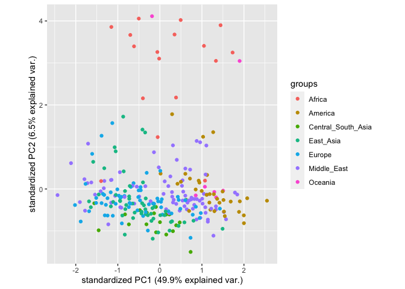
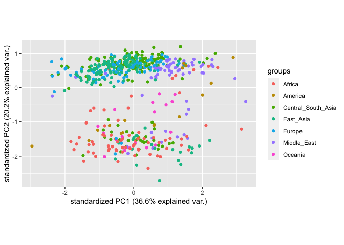

PCA - Abundance comparison of all HGDP samples
================

# Unbiased Population Variation of Human Transposable Elements - Script 8

This is the 8/8 scripts describing the creation and analysis of the
dataset of human TE abundance. This script works with the version of the
HGDP dataset created in Script 2. Additionally, we perform all analyses
separately for males and females, as we established there are
differences between the sexes in Script 5.

``` r
library(tidyverse)
```

    ## ── Attaching packages ─────────────────────────────────────── tidyverse 1.3.2 ──
    ## ✔ ggplot2 3.3.6      ✔ purrr   0.3.4 
    ## ✔ tibble  3.1.8      ✔ dplyr   1.0.10
    ## ✔ tidyr   1.2.1      ✔ stringr 1.4.1 
    ## ✔ readr   2.1.2      ✔ forcats 0.5.2 
    ## ── Conflicts ────────────────────────────────────────── tidyverse_conflicts() ──
    ## ✖ dplyr::filter() masks stats::filter()
    ## ✖ dplyr::lag()    masks stats::lag()

``` r
HGDPcutoff<-read_delim("/Users/rpianezza/TE/summary-HGDP/USEME_HGDP_complete_reflib6.2_mq10_batchinfo_cutoff0.01.txt",comment="#")
```

    ## Rows: 1394352 Columns: 10
    ## ── Column specification ────────────────────────────────────────────────────────
    ## Delimiter: ","
    ## chr (7): ID, Pop, sex, Country, type, familyname, batch
    ## dbl (3): length, reads, copynumber
    ## 
    ## ℹ Use `spec()` to retrieve the full column specification for this data.
    ## ℹ Specify the column types or set `show_col_types = FALSE` to quiet this message.

``` r
names(HGDPcutoff)<-c("ID","Pop","sex","Country","type","familyname","length","reads","copynumber","batch")
```

``` r
library(ggfortify)
ftecutoff<-subset(HGDPcutoff, sex=="female" & type=="te")
mtecutoff<-subset(HGDPcutoff, sex=="male" & type=="te")
```

The idea of this code is to create a principal component analysis (PCA)
to detect potentially meaningful patterns underlying the copy number
estimation data.

We perform the PCA independently for males and females.

\###Females

This part creates vectors containing the values of TE copy number in a
dataframe in the correct format to be able to be used as input for the
PCA.

``` r
ftecutoffmatrix<-matrix(as.vector(ftecutoff$copynumber),nrow=275,ncol=965,byrow=T)
ftecutofffram<-data.frame(ftecutoffmatrix)
names(ftecutofffram)<-unique(ftecutoff$familyname)
ftecutoffmatrixcont<-matrix(as.vector(ftecutoff$Country),nrow=275,ncol=965,byrow=T)
ftecutoffframcont<-data.frame(ftecutoffmatrixcont)
contcol<-c(ftecutoffframcont$X1)
```

Now we create the PCA. I would recommend to look up online guides on how
to create a PCA with ggplot/tidyverse. For example:
<https://clauswilke.com/blog/2020/09/07/pca-tidyverse-style/>

``` r
fHGDP.pca <- prcomp(ftecutofffram, center = TRUE, scale = TRUE)
#summary(HGDP.pca)
```

``` r
str(fHGDP.pca)
```

    ## List of 5
    ##  $ sdev    : num [1:275] 21.94 7.94 4.42 3.5 3.06 ...
    ##  $ rotation: num [1:965, 1:275] -0.036 -0.0388 -0.0389 -0.037 -0.0339 ...
    ##   ..- attr(*, "dimnames")=List of 2
    ##   .. ..$ : chr [1:965] "LTR65" "HERVK3I" "HERV9" "L1PA12_5" ...
    ##   .. ..$ : chr [1:275] "PC1" "PC2" "PC3" "PC4" ...
    ##  $ center  : Named num [1:965] 7.03 20.94 134.77 86.93 16.53 ...
    ##   ..- attr(*, "names")= chr [1:965] "LTR65" "HERVK3I" "HERV9" "L1PA12_5" ...
    ##  $ scale   : Named num [1:965] 0.337 0.826 4.735 3.028 0.607 ...
    ##   ..- attr(*, "names")= chr [1:965] "LTR65" "HERVK3I" "HERV9" "L1PA12_5" ...
    ##  $ x       : num [1:275, 1:275] -31.94 8.53 -2.06 -3.04 3.34 ...
    ##   ..- attr(*, "dimnames")=List of 2
    ##   .. ..$ : NULL
    ##   .. ..$ : chr [1:275] "PC1" "PC2" "PC3" "PC4" ...
    ##  - attr(*, "class")= chr "prcomp"

``` r
library(devtools)
```

    ## Loading required package: usethis

``` r
library(ggbiplot)
```

    ## Loading required package: plyr

    ## ------------------------------------------------------------------------------

    ## You have loaded plyr after dplyr - this is likely to cause problems.
    ## If you need functions from both plyr and dplyr, please load plyr first, then dplyr:
    ## library(plyr); library(dplyr)

    ## ------------------------------------------------------------------------------

    ## 
    ## Attaching package: 'plyr'

    ## The following objects are masked from 'package:dplyr':
    ## 
    ##     arrange, count, desc, failwith, id, mutate, rename, summarise,
    ##     summarize

    ## The following object is masked from 'package:purrr':
    ## 
    ##     compact

    ## Loading required package: scales

    ## 
    ## Attaching package: 'scales'

    ## The following object is masked from 'package:purrr':
    ## 
    ##     discard

    ## The following object is masked from 'package:readr':
    ## 
    ##     col_factor

    ## Loading required package: grid

    ## 
    ## Attaching package: 'ggbiplot'

    ## The following object is masked from 'package:ggfortify':
    ## 
    ##     ggbiplot

``` r
ggbiplot(fHGDP.pca, var.axes=FALSE, groups = contcol)
```

<!-- -->

\###Males

``` r
mtecutoffmatrix<-matrix(as.vector(mtecutoff$copynumber),nrow=553,ncol=965,byrow=T)
mtecutofffram<-data.frame(mtecutoffmatrix)
names(mtecutofffram)<-unique(mtecutoff$familyname)
rownames(mtecutofffram)<-unique(mtecutoff$X1)
```

    ## Warning: Unknown or uninitialised column: `X1`.

``` r
mtecutoffmatrixcont<-matrix(as.vector(mtecutoff$Country),nrow=553,ncol=965,byrow=T)
mtecutoffframcont<-data.frame(mtecutoffmatrixcont)

mtecutoffmatrixcont<-matrix(as.vector(mtecutoff$Country),nrow=553,ncol=965,byrow=T)
mtecutoffframcont<-data.frame(mtecutoffmatrixcont)
contcol<-c(mtecutoffframcont$X1)

mHGDP.pca <- prcomp(mtecutofffram, center = TRUE, scale = TRUE)
#summary(mHGDP.pca)
#str(mHGDP.pca)
ggbiplot(mHGDP.pca, var.axes=FALSE, groups = contcol)
```

<!-- -->

Overall, we see some interesting things in these plots. The clear
separation between Africa and the rest in the female plot is especially
noteworthy. Note that you can see such a trend for specific TEs, mainly
L1ME5, in the MinMax-Differences plots from Script 7.

Also, The absence of such a clear separation in the male version of the
plot is quite exciting. A possible explanation that I thought of is a
reduced level of divergence of the Y-chromosome. This is a phenomenon
that I have heard of quite a few times, though I did struggle a bit to
find suitable literature. I did find this paper though that mentions
such an effect for a specific population:
<https://www.ncbi.nlm.nih.gov/pmc/articles/PMC6436108/>

The idea of this concept is that for human population history, during
migratory events, military campains etc, men have dispersed,
i.e. migrated, more than females, and the evolutionary history of the
Y-chromosome does reflect this by a reduced level of variation compared
to autosomes. However, if this is actually the correct explanation, or
if another effect can explain the observed patterns, e.g. the higher
amount of both samples and represented populations for males compared to
females remains to be tested.
