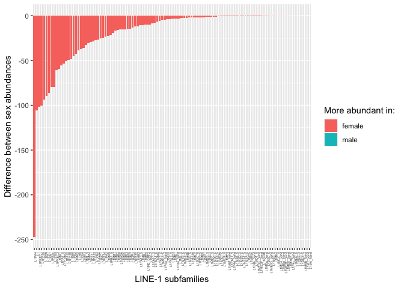
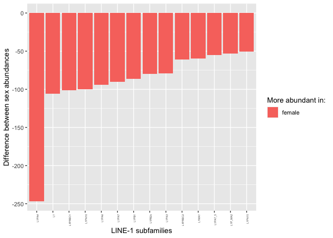

Comparing the mean TE copy numbers in males and females
================

In this script I re-wrote Florian’s script 5 and added some new
analysis. The topic is the comparison of TE abundances between the two
sexes.

``` r
library(tidyverse)
```

    ## ── Attaching packages ─────────────────────────────────────── tidyverse 1.3.2 ──
    ## ✔ ggplot2 3.4.0      ✔ purrr   0.3.4 
    ## ✔ tibble  3.1.8      ✔ dplyr   1.0.10
    ## ✔ tidyr   1.2.1      ✔ stringr 1.4.1 
    ## ✔ readr   2.1.2      ✔ forcats 0.5.2 
    ## ── Conflicts ────────────────────────────────────────── tidyverse_conflicts() ──
    ## ✖ dplyr::filter() masks stats::filter()
    ## ✖ dplyr::lag()    masks stats::lag()

``` r
library(dplyr)
library(ggpubr)
HGDPcutoff<-read_delim("/Users/rpianezza/TE/summary-HGDP/USEME_HGDP_complete_reflib6.2_mq10_batchinfo_cutoff0.01.txt",comment="#")
```

    ## Rows: 1394352 Columns: 10
    ## ── Column specification ────────────────────────────────────────────────────────
    ## Delimiter: ","
    ## chr (7): ID, Pop, sex, Country, type, familyname, batch
    ## dbl (3): length, reads, copynumber
    ## 
    ## ℹ Use `spec()` to retrieve the full column specification for this data.
    ## ℹ Specify the column types or set `show_col_types = FALSE` to quiet this message.

``` r
names(HGDPcutoff)<-c("ID","Pop","sex","Country","type","familyname","length","reads","copynumber","batch")
```

## Calculating mean abundance for males and females

This chuck creates the dataset used for all the subsequent analyses.
Starting from the
*USEME_HGDP_complete_reflib6.2_mq10_batchinfo_cutoff0.01.txt* file, the
final dataset is composed by `965` rows, one for each TE family in the
dataset. For each TE family, we have:

- The **mean copynumber** among all the **females** in the dataset
  (`f_mean`), as well as in **males** (`m_mean`).
- The **log** of the two means (`f_mean_log`, `m_mean_log`).
- The **difference** between the copynumber in males and females
  (`diff`) and the absolute difference (`abs_diff`).
- The **ratio** between the copynumbers in the two sexes (`ratio`),
  calculated with the more abundant sex always at the numerator.
- Last, `more_in` indicates in which sex the TE is more abundant.

``` r
(data <- filter(HGDPcutoff, type=="te") %>% group_by(familyname, sex) %>% summarise(sd=sd(copynumber), mean=mean(copynumber)))
```

    ## `summarise()` has grouped output by 'familyname'. You can override using the
    ## `.groups` argument.

    ## # A tibble: 1,930 × 4
    ## # Groups:   familyname [965]
    ##    familyname sex           sd      mean
    ##    <chr>      <chr>      <dbl>     <dbl>
    ##  1 6kbHsap    female   40.6      300.   
    ##  2 6kbHsap    male     40.5      308.   
    ##  3 ALINE      female    0.0231     0.134
    ##  4 ALINE      male      0.0240     0.134
    ##  5 ALR        female 3924.     31699.   
    ##  6 ALR        male   4367.     32338.   
    ##  7 ALR_       female 6899.     77504.   
    ##  8 ALR_       male   7269.     78165.   
    ##  9 ALR1       female 6945.     71186.   
    ## 10 ALR1       male   7572.     72857.   
    ## # … with 1,920 more rows

``` r
f<-filter(data, sex=="female") %>% rename(f_mean = mean, f_sd = sd)
m<-filter(data, sex=="male") %>% rename(m_mean = mean, m_sd = sd)

(final_data <- inner_join(f, m, by = "familyname") %>% select(familyname, f_mean, m_mean, f_sd, m_sd) %>% mutate(f_mean_log=log(f_mean), m_mean_log=log(m_mean), diff=m_mean-f_mean, abs_diff=abs(diff), ratio=case_when(diff>=0 ~ m_mean/f_mean, diff<0 ~ f_mean/m_mean), more_in=case_when(diff>=0 ~ "male", diff<0 ~ "female")) %>% arrange(desc(ratio)) %>% mutate(familyname=fct_reorder(familyname,ratio)))
```

    ## # A tibble: 965 × 11
    ## # Groups:   familyname [965]
    ##    familyname    f_mean  m_mean    f_sd    m_sd f_mea…¹ m_mea…²     diff abs_d…³
    ##    <fct>          <dbl>   <dbl>   <dbl>   <dbl>   <dbl>   <dbl>    <dbl>   <dbl>
    ##  1 HSATI        3.34e+2 2.00e+3 1.82e+2 5.26e+2   5.81    7.60   1.67e+3 1.67e+3
    ##  2 X17_DNA      7.08e-1 3.68e-1 1.15e-1 7.77e-2  -0.346  -1.00  -3.40e-1 3.40e-1
    ##  3 UCON64       7.75e-1 4.08e-1 1.29e-1 9.40e-2  -0.255  -0.897 -3.67e-1 3.67e-1
    ##  4 Tigger16b    2.06e-1 1.09e-1 4.67e-2 3.12e-2  -1.58   -2.22  -9.74e-2 9.74e-2
    ##  5 X3_LINE      3.56e-1 1.88e-1 7.43e-2 4.87e-2  -1.03   -1.67  -1.68e-1 1.68e-1
    ##  6 UCON106      3.68e-1 1.97e-1 8.24e-2 6.14e-2  -1.00   -1.62  -1.71e-1 1.71e-1
    ##  7 X15_DNA      9.94e-4 5.47e-4 3.90e-3 2.10e-3  -6.91   -7.51  -4.47e-4 4.47e-4
    ##  8 UCON55       2.61e-4 1.45e-4 1.43e-3 1.16e-3  -8.25   -8.84  -1.17e-4 1.17e-4
    ##  9 UCON79       3.87e-4 6.95e-4 2.31e-3 3.29e-3  -7.86   -7.27   3.08e-4 3.08e-4
    ## 10 CHARLIE4     7.18e-1 4.08e-1 8.02e-2 5.20e-2  -0.331  -0.897 -3.11e-1 3.11e-1
    ## # … with 955 more rows, 2 more variables: ratio <dbl>, more_in <chr>, and
    ## #   abbreviated variable names ¹​f_mean_log, ²​m_mean_log, ³​abs_diff

## Comparing mean abundance between males and females

We want to create a plot that shows a pairwise comparison of the mean
copy number estimates of males and females for each of the 965 TE
sequences. Additionally, we include a linear regression line (in grey)
as well as a dashed line representing the null expectation for the
regression, i.e. that males and females have the same mean abundance
values and the regression should thus have a slope of 1. The regression
line having a slope slightly lower than one is thus an indication
(though not a proof) that TEs in females (x-axis) might be on average
slightly more abundant than TEs in males (y-axis).

``` r
(all <- ggplot(final_data, aes(x=f_mean, y=m_mean, color=more_in))+ labs(color = "More abundant in:") +
  geom_point(size=1)+
  geom_smooth(method="lm",color="grey", se=F)+ 
  ylab("Male mean")+ xlab("Female mean")+geom_abline(slope=1,linetype='dashed')+theme_bw())
```

    ## `geom_smooth()` using formula = 'y ~ x'

<!-- -->

``` r
noALU <- final_data_noALU <- filter(final_data, !(familyname=="ALU"))#, !(familyname=="ALR1"), !(familyname=="HSATI"))
(ggplot(final_data_noALU, aes(x=f_mean, y=m_mean, color=more_in))+ labs(color = "More abundant in:") +
  geom_point(size=1)+
  geom_smooth(method="lm",color="grey", se=F)+ ylab("Male mean")+ xlab("Female mean")+geom_abline(slope=1,linetype='dashed')+theme_bw())
```

    ## `geom_smooth()` using formula = 'y ~ x'

<!-- -->

``` r
(log <- ggplot(final_data, aes(f_mean_log, m_mean_log, color=more_in))+ labs(color = "More abundant in:") +
  geom_point(size=0.8)+
  geom_smooth(method="lm",color="grey",se=F)+theme_bw()+ ylab("Male mean (log)")+ xlab("Female mean (log)"))
```

    ## `geom_smooth()` using formula = 'y ~ x'

<!-- -->

## Relative and absolute mean differences between the sexes

### Absolute differences

The following plots shows, respectively:

- The differences between sex abundances of all the 965 TEs.
- A subset of the first plot, with only TEs with `diff > 75`.

``` r
abs_subset <- filter(final_data, abs_diff>75) # This number is arbitrary, feel free to look at more/less TEs in the plot

(abs <- ggplot(abs_subset, aes(reorder(familyname, -abs(diff)), abs_diff, fill=more_in)) + labs(fill = "More abundant in:") +
  geom_bar(stat="identity") + ylab("Difference between sex abundances") + xlab("Repetitive sequence families") +
  theme(axis.text.x = element_text(angle = 90, hjust = 1)))
```

<!-- -->

### Relative differences

The following plots shows, respectively:

- The ratio between sex abundances of all the 965 TEs.
- A subset of the first plot, with only TEs with `ratio > 1.25`.

``` r
rel_all <- ggplot(final_data, aes(reorder(familyname, -ratio), ratio, fill=more_in)) + labs(fill = "More abundant in:")+geom_bar(stat="identity") + ylab("Ratio between sex abundances") + xlab("Repetitive sequence families") + theme(axis.text.x=element_blank())

rel_subset<- filter(final_data, ratio>1.25) # This number is arbitrary, feel free to look at more/less TEs in the plot

(rel <- ggplot(rel_subset, aes(reorder(familyname, -ratio), ratio, fill=more_in)) + labs(fill = "More abundant in:") +
  geom_bar(stat="identity") + ylab("Ratio between sex abundances") + xlab("Repetitive sequence families") +
  theme(axis.text.x = element_text(angle = 90, hjust = 1)))
```

<!-- -->

## L1 family differences between the two sexes

One of the most interesting TE groups found so far in the dataset are
for sure the `LINE-1` (**L1**) retrotransposon subfamilies. Here, I show
that almost every L1 is more abundant in the `females`. Only 2/113 L1
subfamilies are more abundant in `males`, and their ratio is very close
to 1. On the other hand, we have lot of L1 subfamilies with higher
copynumber in females, and for some of them the difference is very
consistent.

``` r
L1<-final_data %>% filter(str_detect(familyname, "^L1"))
(L1plot <- ggplot(L1, aes(reorder(familyname, -abs(diff)), abs_diff, fill=more_in)) + labs(fill = "More abundant in:") +
  geom_bar(stat="identity") + ylab("Difference between sex abundances") + xlab("LINE-1 subfamilies") +
  theme(axis.text.x = element_text(angle = 90, hjust = 1, size=4)))
```

<!-- -->

``` r
L1_50<-final_data %>% filter(str_detect(familyname, "^L1"), abs_diff>50)
(L1_50plot <- ggplot(L1_50, aes(reorder(familyname, -abs(diff)), abs_diff, fill=more_in)) + labs(fill = "More abundant in:") +
  geom_bar(stat="identity") + ylab("Difference between sex abundances") + xlab("LINE-1 subfamilies") +
  theme(axis.text.x = element_text(angle = 90, hjust = 1, size=4)))
```

<!-- -->

``` r
(L1_male <- filter(L1, more_in == "male"))
```

    ## # A tibble: 2 × 11
    ## # Groups:   familyname [2]
    ##   familyname f_mean m_mean   f_sd   m_sd f_mean_…¹ m_mea…²    diff abs_d…³ ratio
    ##   <fct>       <dbl>  <dbl>  <dbl>  <dbl>     <dbl>   <dbl>   <dbl>   <dbl> <dbl>
    ## 1 L1M2A_5    22.6   22.9   0.815  0.847       3.12    3.13 0.313   0.313    1.01
    ## 2 L1M6B_5end  0.127  0.129 0.0250 0.0282     -2.06   -2.05 0.00151 0.00151  1.01
    ## # … with 1 more variable: more_in <chr>, and abbreviated variable names
    ## #   ¹​f_mean_log, ²​m_mean_log, ³​abs_diff

``` r
nrow(L1_male)
```

    ## [1] 2

``` r
nrow(L1)
```

    ## [1] 113

This plot suggests that the LINE-1s are in general more abundant on the
**X chromosome** than on the **Y**.

``` r
L1_rel <- filter(L1, ratio>1.08)

ggplot(L1_rel, aes(reorder(familyname, -abs(ratio)), ratio, fill=more_in)) + labs(fill = "More abundant in:") +
  geom_bar(stat="identity") + ylab("Difference between sex abundances") + xlab("Repetitive sequence families")
```

<!-- -->

If we filter for the L1’s with the highest `ratio` between the two sexes
copynumber abundances, we find that the most relevant TE is again
`L1ME5`.
