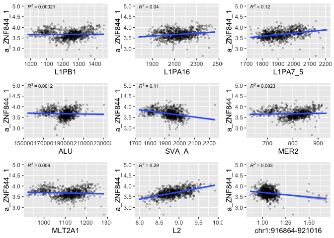

HGDP - KRAB-ZNF
================

``` r
library(tidyverse)
```

    ## ── Attaching packages ─────────────────────────────────────── tidyverse 1.3.2 ──
    ## ✔ ggplot2 3.3.6      ✔ purrr   0.3.4 
    ## ✔ tibble  3.1.8      ✔ dplyr   1.0.10
    ## ✔ tidyr   1.2.1      ✔ stringr 1.4.1 
    ## ✔ readr   2.1.2      ✔ forcats 0.5.2 
    ## ── Conflicts ────────────────────────────────────────── tidyverse_conflicts() ──
    ## ✖ dplyr::filter() masks stats::filter()
    ## ✖ dplyr::lag()    masks stats::lag()

``` r
library(ggpubr)

HGDPcutoff<-read_delim("/Users/rpianezza/TE/summary-HGDP/USEME_HGDP_complete_reflib6.2_mq10_batchinfo_cutoff0.01.txt",comment="#")
```

    ## Rows: 1394352 Columns: 10
    ## ── Column specification ────────────────────────────────────────────────────────
    ## Delimiter: ","
    ## chr (7): ID, Pop, sex, Country, type, familyname, batch
    ## dbl (3): length, reads, copynumber
    ## 
    ## ℹ Use `spec()` to retrieve the full column specification for this data.
    ## ℹ Specify the column types or set `show_col_types = FALSE` to quiet this message.

``` r
names(HGDPcutoff)<-c("ID","pop","sex","Country","type","familyname","length","reads","copynumber","batch")
```

``` r
KRAB_ZNF <- filter(HGDPcutoff, type == "krab") %>% group_by(familyname) %>% summarise(min = min(copynumber), mean = mean(copynumber), max = max(copynumber))

var_KRAB_names <- mutate(KRAB_ZNF, diff = max-min) %>% filter(diff>1 & diff<Inf)

KRAB_outliers <- filter(HGDPcutoff, familyname %in% var_KRAB_names$familyname, type == "krab")
KRAB_outliers <- KRAB_outliers[order(KRAB_outliers$copynumber,decreasing=T),]
KRAB_outliers$familyname<-factor(KRAB_outliers$familyname,levels=unique(KRAB_outliers$familyname))

ggplot(KRAB_outliers, aes(x=familyname, y=copynumber)) + geom_boxplot(notch=F) +
  theme(axis.text.x = element_text(angle = 90, hjust = 1)) 
```

<!-- -->

``` r
plotTEfamily <- function(data, famname, binwidht, x_title, y_title, x_numbers, y_numbers){
filtered <- filter(data, familyname==famname)
ggplot(data = filtered, mapping = aes(x = copynumber, fill = Country)) +
  geom_histogram(binwidth = binwidht) + 
  ggtitle(famname) + theme(plot.title = element_text(size = 8, hjust = 0.5)) +
  {if(x_title=='n'){
  theme(axis.title.x=element_blank())}} +
  {if(y_title=='n'){
  theme(axis.title.y=element_blank())}} +
  {if(x_numbers=='n'){
  theme(axis.text.x=element_blank(), axis.ticks.x=element_blank())}} +
{if(y_numbers=='n'){
  theme(axis.text.y=element_blank(), axis.ticks.y=element_blank())}}
}
```

``` r
(a_ZNF138_5_plot<-plotTEfamily(KRAB_outliers, 'a_ZNF138_5', 0.3, 'y', 'y', 'y', 'y'))
```

<!-- -->

``` r
(a_ZNF138_5_plot<-plotTEfamily(KRAB_outliers, 'a_ZNF718_1', 0.3, 'y', 'y', 'y', 'y'))
```

<!-- -->

``` r
(a_ZNF138_5_plot<-plotTEfamily(KRAB_outliers, 'a_ZNF844_1', 0.3, 'y', 'y', 'y', 'y'))
```

<!-- -->

``` r
(a_ZNF138_5_plot<-plotTEfamily(KRAB_outliers, 'a_ZNF658_2', 0.3, 'y', 'y', 'y', 'y'))
```

<!-- -->

``` r
coordinates <- read_tsv("/Users/rpianezza/TE/summary-HGDP/HGDP_populationcoordinates.txt", col_names = c("pop", "region", "latitude", "longitude"))
```

    ## Rows: 54 Columns: 4
    ## ── Column specification ────────────────────────────────────────────────────────
    ## Delimiter: "\t"
    ## chr (2): pop, region
    ## dbl (2): latitude, longitude
    ## 
    ## ℹ Use `spec()` to retrieve the full column specification for this data.
    ## ℹ Specify the column types or set `show_col_types = FALSE` to quiet this message.

``` r
coord <- select(coordinates, pop, latitude, longitude)

by_pop <- group_by(HGDPcutoff, pop, familyname, sex) %>% summarise(copynumber = mean(copynumber), count=n())
```

    ## `summarise()` has grouped output by 'pop', 'familyname'. You can override using
    ## the `.groups` argument.

``` r
data <- inner_join(x = coord, y = by_pop, by = "pop")
```

``` r
plot_map <- function(data, famname){
TE <- filter(data, familyname == famname)
world_map = map_data("world")

ggplot() +
  geom_map(
    data = world_map, map = world_map,
    aes(long, lat, map_id = region),
    color = "white", fill = "lightgray", size = 0) +
  geom_point(
    data = TE, aes(longitude, latitude, color = copynumber, size = count)
  ) + scale_colour_gradient(low = "green", high = "red") + theme(legend.position="top") + theme(plot.title = element_text(hjust = 0.5)) +
  ggtitle(famname)}
```

``` r
plot_map(data, "a_ZNF138_5")
```

    ## Warning: Ignoring unknown aesthetics: x, y

<!-- -->

``` r
plot_map(data, "a_ZNF718_1")
```

    ## Warning: Ignoring unknown aesthetics: x, y

<!-- -->

``` r
plot_map(data, "a_ZNF844_1")
```

    ## Warning: Ignoring unknown aesthetics: x, y

<!-- -->

``` r
KRAB_TE_regression <- function(data, TE, KRAB, r){
  TE_data <- data %>% filter(familyname==TE) %>% select(ID, copynumber, Country)
  KRAB_data <- data %>% filter(familyname==KRAB) %>% select(ID, copynumber, Country)
  
  KRAB_TE_data <- left_join(TE_data, KRAB_data, by = c("ID", "Country")) %>% rename(TE=copynumber.x, KRAB=copynumber.y) %>% relocate(Country, .before = TE)
  
  ggplot(KRAB_TE_data, aes(TE, KRAB)) + 
    geom_point(alpha=0.2, size=0.8) +
    geom_smooth(method='lm') +
    stat_regline_equation(label.y = r, aes(label = ..rr.label..), size=2.5) +
    xlab(TE) + ylab(KRAB)
  }
```

``` r
L1PB_138 <- KRAB_TE_regression(HGDPcutoff, "L1PB1", "a_ZNF138_5", 15)
L1PA16_138 <- KRAB_TE_regression(HGDPcutoff, "L1PA16", "a_ZNF138_5", 15)
L1PA_138 <- KRAB_TE_regression(HGDPcutoff, "L1PA7_5", "a_ZNF138_5", 15)
ALU_138 <- KRAB_TE_regression(HGDPcutoff, "ALU", "a_ZNF138_5", 15)
SVA_138 <- KRAB_TE_regression(HGDPcutoff, "SVA_A", "a_ZNF138_5", 15)
MER_138 <- KRAB_TE_regression(HGDPcutoff, "MER2", "a_ZNF138_5", 15)
MLT_138 <- KRAB_TE_regression(HGDPcutoff, "MLT2A1", "a_ZNF138_5", 15)
L2_138 <- KRAB_TE_regression(HGDPcutoff, "L2", "a_ZNF138_5", 15)
scg_138 <- KRAB_TE_regression(HGDPcutoff, "chr1:916864-921016", "a_ZNF138_5", 15)

(ZNF138_5 <- ggarrange(L1PB_138, L1PA16_138, L1PA_138, ALU_138, SVA_138, MER_138, MLT_138, L2_138, scg_138, ncol = 3, nrow = 3))
```

    ## `geom_smooth()` using formula 'y ~ x'
    ## `geom_smooth()` using formula 'y ~ x'
    ## `geom_smooth()` using formula 'y ~ x'
    ## `geom_smooth()` using formula 'y ~ x'
    ## `geom_smooth()` using formula 'y ~ x'
    ## `geom_smooth()` using formula 'y ~ x'
    ## `geom_smooth()` using formula 'y ~ x'
    ## `geom_smooth()` using formula 'y ~ x'
    ## `geom_smooth()` using formula 'y ~ x'

<!-- -->

``` r
L1PB_718 <- KRAB_TE_regression(HGDPcutoff, "L1PB1", "a_ZNF718_1", 9)
L1PA16_718 <- KRAB_TE_regression(HGDPcutoff, "L1PA16", "a_ZNF718_1", 9)
L1PA_718 <- KRAB_TE_regression(HGDPcutoff, "L1PA7_5", "a_ZNF718_1", 9)
ALU_718 <- KRAB_TE_regression(HGDPcutoff, "ALU", "a_ZNF718_1", 9)
SVA_718 <- KRAB_TE_regression(HGDPcutoff, "SVA_A", "a_ZNF718_1", 9)
MER_718 <- KRAB_TE_regression(HGDPcutoff, "MER2", "a_ZNF718_1", 9)
MLT_718 <- KRAB_TE_regression(HGDPcutoff, "MLT2A1", "a_ZNF718_1", 9)
L2_718 <- KRAB_TE_regression(HGDPcutoff, "L2", "a_ZNF718_1", 9)
scg_718 <- KRAB_TE_regression(HGDPcutoff, "chr1:916864-921016", "a_ZNF718_1", 9)

(ZNF718_1 <- ggarrange(L1PB_718,  L1PA16_718, L1PA_718, ALU_718, SVA_718, MER_718, MLT_718, L2_718, scg_718, ncol = 3, nrow = 3))
```

    ## `geom_smooth()` using formula 'y ~ x'
    ## `geom_smooth()` using formula 'y ~ x'
    ## `geom_smooth()` using formula 'y ~ x'
    ## `geom_smooth()` using formula 'y ~ x'
    ## `geom_smooth()` using formula 'y ~ x'
    ## `geom_smooth()` using formula 'y ~ x'
    ## `geom_smooth()` using formula 'y ~ x'
    ## `geom_smooth()` using formula 'y ~ x'
    ## `geom_smooth()` using formula 'y ~ x'

<!-- -->

``` r
L1PB_844 <- KRAB_TE_regression(HGDPcutoff, "L1PB1", "a_ZNF844_1", 5)
L1PA16_844 <- KRAB_TE_regression(HGDPcutoff, "L1PA16", "a_ZNF844_1", 5)
L1PA_844 <- KRAB_TE_regression(HGDPcutoff, "L1PA7_5", "a_ZNF844_1", 5)
ALU_844 <- KRAB_TE_regression(HGDPcutoff, "ALU", "a_ZNF844_1", 5)
SVA_844 <- KRAB_TE_regression(HGDPcutoff, "SVA_A", "a_ZNF844_1", 5)
MER_844 <- KRAB_TE_regression(HGDPcutoff, "MER2", "a_ZNF844_1", 5)
MLT_844 <- KRAB_TE_regression(HGDPcutoff, "MLT2A1", "a_ZNF844_1", 5)
L2_844 <- KRAB_TE_regression(HGDPcutoff, "L2", "a_ZNF844_1", 5)
scg_844 <- KRAB_TE_regression(HGDPcutoff, "chr1:916864-921016", "a_ZNF844_1", 5)

(ZNF844_1 <- ggarrange(L1PB_844,L1PA16_844, L1PA_844, ALU_844, SVA_844, MER_844, MLT_844, L2_844, scg_844, ncol = 3, nrow = 3))
```

    ## `geom_smooth()` using formula 'y ~ x'
    ## `geom_smooth()` using formula 'y ~ x'
    ## `geom_smooth()` using formula 'y ~ x'
    ## `geom_smooth()` using formula 'y ~ x'
    ## `geom_smooth()` using formula 'y ~ x'
    ## `geom_smooth()` using formula 'y ~ x'
    ## `geom_smooth()` using formula 'y ~ x'
    ## `geom_smooth()` using formula 'y ~ x'
    ## `geom_smooth()` using formula 'y ~ x'

<!-- -->
