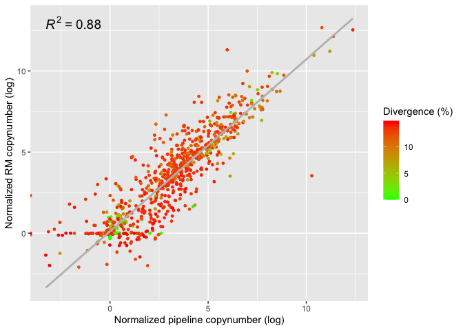
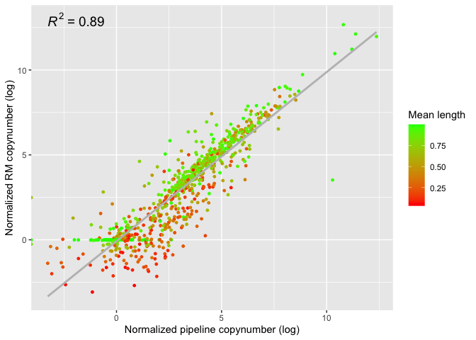
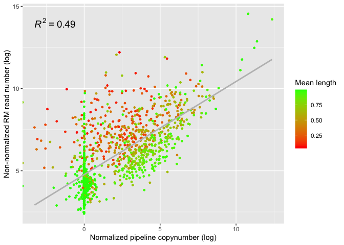

Telomer-to-telomer (T2T) Repeat Masker output analysis
================

Idea: run RepeatMasker (RM) on the T2T human genome assembly published
in 2022, then create artificial short reads from the same genome and
compare the TE copynumbers obtained with the two methods.

First, with this command I run RM, using our customized RepBase
reference library as `- lib`.

    RepeatMasker -gccalc -s -cutoff 200 -no_is -nolow -norna -gff -u -pa 20 -lib /Volumes/Temp2/human_TEs/human-te-dynamics-svn/refg/reflibrary_humans_v6.2.fasta /Volumes/Temp2/riccardo/T2T/genome_assemblies_genome_fasta/ncbi-genomes-2022-11-18/GCF_009914755.1_T2T-CHM13v2.0_genomic.fna

    # RepeatMasker version open-4.0.7
    # Search Engine: NCBI/RMBLAST [ 2.2.27+ ]

Explanation of the RepeatMasker output file:

- `SWscore` = Smith-Waterman score of the match, usually complexity
  adjusted
- `perc_div` = % substitutions in matching region compared to the
  consensus
- `perc_del` = % of bases opposite a gap in the query sequence (deleted
  bp)
- `perc_ins` = % of bases opposite a gap in the repeat consensus
  (inserted bp)
- `query_sequence` = name of query sequence
- `position_in_query_begin` = starting position of match in query
  sequence
- `position_in_query_end` = ending position of match in query sequence
- `position_in_query_left` = no. of bases in query sequence past the
  ending position of match
- `C` = match is with the Complement of the consensus sequence in the
  database
- `matching_repeat` = name of the matching interspersed repeat
- `repeat_class/family` = the class of the repeat
- `position_in_repeat_begin` = starting position of match in database
  sequence (using top-strand numbering)
- `position_in_repeat_end` = ending position of match in database
  sequence
- `position_in_repeat_left` = no. of bases in the repeat consensus
  sequence prior to beginning of the match (so 0 means that the match
  extended all the way to the end of the repeat consensus sequence)
- `ID` = estimated unique transposon (es. two segments of the same
  transposon could be separated by another insertion, thus these two
  sequences have the same ID)
- An asterisk (\*) in the final column indicates that there is a
  higher-scoring match whose domain partly (\<80%) includes the domain
  of this match.

Command to remove multiple spaces from the RM output and make it
readable in R:

    less path/rm.out | sed 's/  */ /g' | cut -c2- | > output

``` r
library(tidyverse)
```

    ## ── Attaching packages ─────────────────────────────────────── tidyverse 1.3.2 ──
    ## ✔ ggplot2 3.3.6      ✔ purrr   0.3.4 
    ## ✔ tibble  3.1.8      ✔ dplyr   1.0.10
    ## ✔ tidyr   1.2.1      ✔ stringr 1.4.1 
    ## ✔ readr   2.1.2      ✔ forcats 0.5.2 
    ## ── Conflicts ────────────────────────────────────────── tidyverse_conflicts() ──
    ## ✖ dplyr::filter() masks stats::filter()
    ## ✖ dplyr::lag()    masks stats::lag()

``` r
library(ggpubr)

(RM <- read_delim("/Users/rpianezza/TE/T2T/RM_complete/GCF_009914755.1_T2T-CHM13v2.0_genomic_mod.fna.out", delim = " ",skip = 3, col_names = c("SWscore", "perc_div", "perc_del", "perc_ins", "query_sequence", "position_in_query_begin", "position_in_query_end", "position_in_query_left",  "+/c", "matching_repeat", "repeat_class/family", "position_in_repeat_left", "position_in_repeat_begin", "position_in_repeat_end", "ID", "other_match")))
```

    ## Rows: 8353919 Columns: 16
    ## ── Column specification ────────────────────────────────────────────────────────
    ## Delimiter: " "
    ## chr (9): SWscore, query_sequence, position_in_query_left, +/c, matching_repe...
    ## dbl (7): perc_div, perc_del, perc_ins, position_in_query_begin, position_in_...
    ## 
    ## ℹ Use `spec()` to retrieve the full column specification for this data.
    ## ℹ Specify the column types or set `show_col_types = FALSE` to quiet this message.

    ## # A tibble: 8,353,919 × 16
    ##    SWscore perc_…¹ perc_…² perc_…³ query…⁴ posit…⁵ posit…⁶ posit…⁷ `+/c` match…⁸
    ##    <chr>     <dbl>   <dbl>   <dbl> <chr>     <dbl>   <dbl> <chr>   <chr> <chr>  
    ##  1 234         4.8     0       0   NC_060…    1885    1926 (24838… C     TAR1_te
    ##  2 250         2.4     0       2.4 NC_060…    1897    1939 (24838… C     TAR1_te
    ##  3 5109       11.7     1.1     0.8 NC_060…    2710    3803 (24838… C     TAR1_te
    ##  4 1236       20.6     2.2     3.1 NC_060…    3484    3843 (24838… C     TAR1_te
    ##  5 964        25.2     4.3     2.1 NC_060…    3542    3910 (24838… C     TAR1_te
    ##  6 902        25.5     4.4     2.7 NC_060…    3602    3968 (24838… C     TAR1_te
    ##  7 3879       13.6     5.3     2.2 NC_060…    3663    4398 (24838… C     TAR1_te
    ##  8 990        26.2    12.4     1   NC_060…    4083    4533 (24838… C     LTR60B…
    ##  9 552        18       5.7     0   NC_060…    4534    4655 (24838… C     LTR60_…
    ## 10 1013       24.2     5       1.1 NC_060…    4718    5139 (24838… +     L1ME_O…
    ## # … with 8,353,909 more rows, 6 more variables: `repeat_class/family` <chr>,
    ## #   position_in_repeat_left <chr>, position_in_repeat_begin <dbl>,
    ## #   position_in_repeat_end <chr>, ID <dbl>, other_match <chr>, and abbreviated
    ## #   variable names ¹​perc_div, ²​perc_del, ³​perc_ins, ⁴​query_sequence,
    ## #   ⁵​position_in_query_begin, ⁶​position_in_query_end, ⁷​position_in_query_left,
    ## #   ⁸​matching_repeat

Here I filter the RM output putting a threshold on the maximum
**divergence** percentage (`15`) among the query and the reference, as
well as a minimum **length** (`150`, = read length) for the match. I
also remove the brackets present in some data to indicate that the
sequence aligned to the complement of the reference, which create some
problems with the data type and which are not interesting for this
analysis.

As output of this chunk, I create a .csv file to analyze in Python using
the script *from_RM_to_copynumber*, which estimates the copynumber of
each sequence from the ref library found in the RM run. This is done by
the script by simply adding the length of each match of a sequence and
then dividing by the sequence length.

``` r
RM_cutoff <- filter(RM, perc_div < 15, position_in_query_end-position_in_query_begin>150) %>% replace_na(list(other_match = "-")) %>% filter(other_match == "-") %>% mutate(position_in_repeat_begin = str_replace(position_in_repeat_begin, "\\(", "")) %>% mutate(position_in_repeat_begin = str_replace(position_in_repeat_begin, "\\)", "")) %>% mutate(position_in_repeat_left = str_replace(position_in_repeat_left, "\\(", "")) %>% mutate(position_in_repeat_left = str_replace(position_in_repeat_left, "\\)", "")) %>% mutate(position_in_query_left = str_replace(position_in_query_left, "\\(", "")) %>% mutate(position_in_query_left = str_replace(position_in_query_left, "\\)", "")) %>% mutate(position_in_repeat_end = str_replace(position_in_repeat_end, "\\(", "")) %>% mutate(position_in_repeat_end = str_replace(position_in_repeat_end, "\\)", "")) %>% mutate(position_in_query_begin = str_replace(position_in_query_begin, "\\(", "")) %>% mutate(position_in_query_begin = str_replace(position_in_query_begin, "\\)", "")) %>% mutate(position_in_query_end = str_replace(position_in_query_end, "\\(", "")) %>% mutate(position_in_query_end = str_replace(position_in_query_end, "\\)", "")) %>% arrange(matching_repeat)

write_csv(RM_cutoff, "/Users/rpianezza/TE/T2T/RM_cutoff.csv")
```

Here I read the output of the Python script.

``` r
RM_copynumbers <- read_csv("/Users/rpianezza/TE/T2T/RM_complete/copynumber_RM.csv", col_names = c("sequence", "copynumber"))
```

    ## Rows: 1467 Columns: 2
    ## ── Column specification ────────────────────────────────────────────────────────
    ## Delimiter: ","
    ## chr (1): sequence
    ## dbl (1): copynumber
    ## 
    ## ℹ Use `spec()` to retrieve the full column specification for this data.
    ## ℹ Specify the column types or set `show_col_types = FALSE` to quiet this message.

Here I select only the TE, removing KRAB and SCG from the RM dataset.
The resulting CSV file can be used for other analyses.

``` r
RM_cutoff_te <- filter(RM_cutoff, str_detect(matching_repeat, ".te")) %>% mutate(position_in_query_begin = as.integer(position_in_query_begin)) %>% arrange(matching_repeat, position_in_query_begin)

write_csv(RM_cutoff, "/Users/rpianezza/TE/T2T/RM_cutoff_te.csv")
```

Using this command and the Python2 script *create-reads-for-human.py*
(can be found in *human_te_dynamics.svn/scripts/*), I create artificial
short reads from the T2T genome.

    python /Users/rpianezza/TE/human-te-dynamics-svn/scripts/create-reads-for-human.py --fasta /Users/rpianezza/TE/T2T/genome_assemblies_genome_fasta/ncbi-genomes-2022-11-22/GCF_009914755.1_T2T-CHM13v2.0_genomic.fna --coverage 30 --read-length 150 --output /Users/rpianezza/TE/T2T/T2T-artificial-reads/reads.fastq.gz --method uniform

The artificial reads are then processed into the pipeline to estimate
copynumbers (**normalization**). Here I read the main output file and I
create a comparison between the two methods copynumber estimates:
RepeatMasker (`RM`) and the pipeline run on artificial short reads
(`pipeline`). The color of the points depends on the mean
`divergence percentage` of the RM hits on the respective reference
sequence. We expect higly divergent sequences to be more prone to
produce outliers across the two methods, thus less reliable.

``` r
artificial <- read_delim("/Users/rpianezza/TE/T2T/T2T-artificial-reads/T2T_artificial_reads.mq10.mapstat", delim = "\t", skip = 8, col_names = c("type", "familyname", "length", "reads", "copynumber"))
```

    ## Rows: 1703 Columns: 5
    ## ── Column specification ────────────────────────────────────────────────────────
    ## Delimiter: "\t"
    ## chr (2): type, familyname
    ## dbl (3): length, reads, copynumber
    ## 
    ## ℹ Use `spec()` to retrieve the full column specification for this data.
    ## ℹ Specify the column types or set `show_col_types = FALSE` to quiet this message.

``` r
art_subset <- select(artificial, familyname, copynumber) %>% arrange(familyname)

RM_subset <- RM_copynumbers %>% mutate(sequence = str_replace(sequence, "_te", "")) %>% mutate(sequence = str_replace(sequence, "_krab", "")) %>% mutate(sequence = str_replace(sequence, "_scg", "")) %>% mutate(sequence = str_replace(sequence, "_scgx", "")) %>% rename(familyname = sequence)

divergence <- group_by(RM_cutoff, matching_repeat) %>% summarise(mean_div = mean(perc_div)) %>% mutate(matching_repeat = str_replace(matching_repeat, "_te", "")) %>% mutate(matching_repeat = str_replace(matching_repeat, "_krab", "")) %>% mutate(matching_repeat = str_replace(matching_repeat, "_scg", "")) %>% mutate(matching_repeat = str_replace(matching_repeat, "_scgx", "")) %>% rename(familyname = matching_repeat)

cn_comparison <- inner_join(art_subset, RM_subset, by = "familyname") %>% rename(pipeline_copynumber = copynumber.x) %>% rename(RM_copynumber = copynumber.y)

(cn_comparison_final <- inner_join(cn_comparison, divergence, by = "familyname"))
```

    ## # A tibble: 1,443 × 4
    ##    familyname     pipeline_copynumber RM_copynumber mean_div
    ##    <chr>                        <dbl>         <dbl>    <dbl>
    ##  1 6kbHsap                    285.          130.        5.50
    ##  2 a_AC067968.1_2               1.29          0.999     0.2 
    ##  3 a_AC092835.1_5               1.17          0.999     0   
    ##  4 a_CDK8_20                    1.99          4.93      5.17
    ##  5 a_CHD3_3                     1.06          0.999     0   
    ##  6 a_CLTC_6                     0.992         0.999     0   
    ##  7 a_DCT_12                     0.994         1.00      0   
    ##  8 a_DNAJA2_11                  0.993         0.999     0   
    ##  9 a_E2F1_2                     0.993         0.999     0   
    ## 10 a_EGR1_4                     1.24          0.999     0   
    ## # … with 1,433 more rows

``` r
ggplot(cn_comparison_final, aes(x=log(pipeline_copynumber), y=log(RM_copynumber), color=mean_div)) +
  geom_point(size=1) + scale_color_gradient(low = "green", high = "red") + labs(color = "Divergence (%)") +
  geom_smooth(method="lm",color="grey", se=F) +
  ylab("Normalized RM copynumber (log)") + xlab("Normalized pipeline copynumber (log)") +
  stat_regline_equation(label.y = 13, aes(label = ..rr.label..), size=5)
```

    ## `geom_smooth()` using formula 'y ~ x'

    ## Warning: Removed 3 rows containing non-finite values (stat_smooth).

    ## Warning: Removed 3 rows containing non-finite values (stat_regline_equation).

<!-- -->

Here I check if there is a correlation between the copynumbers estimated
by the pipeline (normalized) and the number of hits of RM for each
sequence in the reference library.

``` r
RM_reads <- group_by(RM, matching_repeat) %>% count() %>% mutate(matching_repeat = str_replace(matching_repeat, "_te", "")) %>% mutate(matching_repeat = str_replace(matching_repeat, "_krab", "")) %>% mutate(matching_repeat = str_replace(matching_repeat, "_scg", "")) %>% mutate(matching_repeat = str_replace(matching_repeat, "_scgx", "")) %>% rename(familyname = matching_repeat)

pipeline_reads <- select(artificial, familyname, copynumber) %>% arrange(familyname)

reads_comparison <- inner_join(pipeline_reads, RM_reads, by = "familyname") %>% rename(pipeline_copynumber = copynumber, RM_reads = n) %>% inner_join(divergence, bz = "familyname")
```

    ## Joining, by = "familyname"

``` r
ggplot(reads_comparison, aes(x=log(pipeline_copynumber), y=log(RM_reads), color=mean_div)) +
  geom_point(size=1) + scale_color_gradient(low = "green", high = "red") + labs(color = "Divergence (%)") +
  geom_smooth(method="lm",color="grey", se=F) +
  ylab("Non-normalized RM read number (log)") + xlab("Normalized pipeline copynumber (log)") +
  stat_regline_equation(label.y = 14, aes(label = ..rr.label..), size=5)
```

    ## `geom_smooth()` using formula 'y ~ x'

    ## Warning: Removed 3 rows containing non-finite values (stat_smooth).

    ## Warning: Removed 3 rows containing non-finite values (stat_regline_equation).

<!-- -->

Here I calculate the mean copynumber for each `familyname` among all the
HGDP samples and I look for a correlation between these values and the
copynumbers estimated by the pipeline in the T2T genome (artificial
reads), to see if the values are in line with the previous analysis.

``` r
HGDPcutoff<-read_delim("/Users/rpianezza/TE/summary-HGDP/USEME_HGDP_complete_reflib6.2_mq10_batchinfo_cutoff0.01.txt",comment="#")
```

    ## Rows: 1394352 Columns: 10
    ## ── Column specification ────────────────────────────────────────────────────────
    ## Delimiter: ","
    ## chr (7): ID, Pop, sex, Country, type, familyname, batch
    ## dbl (3): length, reads, copynumber
    ## 
    ## ℹ Use `spec()` to retrieve the full column specification for this data.
    ## ℹ Specify the column types or set `show_col_types = FALSE` to quiet this message.

``` r
names(HGDPcutoff)<-c("ID","pop","sex","country","type","familyname","length","reads","copynumber","batch")

mean_cn <- group_by(HGDPcutoff, familyname) %>% summarise(min = min(copynumber), mean = mean(copynumber), max = max(copynumber))

T2T_HGDP <- inner_join(mean_cn, art_subset, by="familyname") %>% rename(T2T = copynumber) %>% inner_join(divergence, by = "familyname")

ggplot(T2T_HGDP, aes(x=log(mean), y=log(T2T), color=mean_div)) +
  geom_point(size=1) + scale_color_gradient(low = "green", high = "red") + labs(color = " Divergence (%)") +
  geom_smooth(method="lm",color="grey")+
  ylab("HGDP mean copynumber (log)") + xlab("T2T copynumber (log)") +
  stat_regline_equation(label.y = 13, aes(label = ..rr.label..), size=5)
```

    ## `geom_smooth()` using formula 'y ~ x'

    ## Warning: Removed 2 rows containing non-finite values (stat_smooth).

    ## Warning: Removed 2 rows containing non-finite values (stat_regline_equation).

<!-- -->
