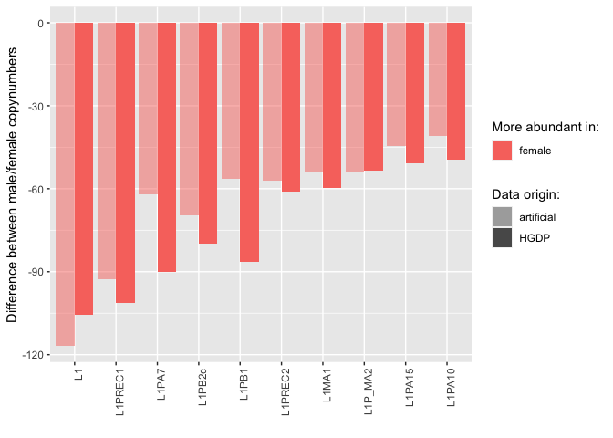

Telomer-to-telomer (T2T) - Validation
================

Idea: run RepeatMasker (RM) on the T2T human genome assembly published
in 2022, then create artificial short reads from the same genome and
compare the TE copynumbers obtained with the two methods.

First, with this command I run RM, using our customized RepBase
reference library as `- lib`.

    RepeatMasker -gccalc -s -cutoff 200 -no_is -nolow -norna -gff -u -pa 20 -lib /Volumes/Temp2/human_TEs/human-te-dynamics-svn/refg/reflibrary_humans_v6.2.fasta /Volumes/Temp2/riccardo/T2T/genome_assemblies_genome_fasta/ncbi-genomes-2022-11-18/GCF_009914755.1_T2T-CHM13v2.0_genomic.fna

    # RepeatMasker version open-4.0.7
    # Search Engine: NCBI/RMBLAST [ 2.2.27+ ]

Explanation of the RepeatMasker output file:

- `SWscore` = Smith-Waterman score of the match, usually complexity
  adjusted
- `perc_div` = % substitutions in matching region compared to the
  consensus
- `perc_del` = % of bases opposite a gap in the query sequence (deleted
  bp)
- `perc_ins` = % of bases opposite a gap in the repeat consensus
  (inserted bp)
- `query_sequence` = name of query sequence
- `position_in_query_begin` = starting position of match in query
  sequence
- `position_in_query_end` = ending position of match in query sequence
- `position_in_query_left` = no. of bases in query sequence past the
  ending position of match
- `C` = match is with the Complement of the consensus sequence in the
  database
- `matching_repeat` = name of the matching interspersed repeat
- `repeat_class/family` = the class of the repeat
- `position_in_repeat_begin` = starting position of match in database
  sequence (using top-strand numbering)
- `position_in_repeat_end` = ending position of match in database
  sequence
- `position_in_repeat_left` = no. of bases in the repeat consensus
  sequence prior to beginning of the match (so 0 means that the match
  extended all the way to the end of the repeat consensus sequence)
- `ID` = estimated unique transposon (es. two segments of the same
  transposon could be separated by another insertion, thus these two
  sequences have the same ID)
- An asterisk (\*) in the final column indicates that there is a
  higher-scoring match whose domain partly (\<80%) includes the domain
  of this match.

Note that the three column indicating the **position in repeat** are
arranged differently for insertions in the two strands:

- For `C` strand: `left`, `end`, `begin`
- For `+` strand: `begin`, `end`, `left`

For simplicity, we kept the order of the `+` strand for all the RM hits
and we dealt with this difference in the next analysis calculating
`fragment length` and `segment length` differently for the two strands.

Command to remove multiple spaces from the RM output and make it
readable in R:

    less path/rm.out | sed 's/  */ /g' | cut -c2- | > output

``` r
library(tidyverse)
```

    ## ── Attaching packages ─────────────────────────────────────── tidyverse 1.3.2 ──
    ## ✔ ggplot2 3.4.0      ✔ purrr   0.3.4 
    ## ✔ tibble  3.1.8      ✔ dplyr   1.0.10
    ## ✔ tidyr   1.2.1      ✔ stringr 1.4.1 
    ## ✔ readr   2.1.2      ✔ forcats 0.5.2 
    ## ── Conflicts ────────────────────────────────────────── tidyverse_conflicts() ──
    ## ✖ dplyr::filter() masks stats::filter()
    ## ✖ dplyr::lag()    masks stats::lag()

``` r
library(ggpubr)

(RM <- read_delim("/Users/rpianezza/TE/T2T/RM_complete/GCF_009914755.1_T2T-CHM13v2.0_genomic_mod.fna.out", delim = " ",skip = 3, col_names = c("SWscore", "perc_div", "perc_del", "perc_ins", "query_sequence", "position_in_query_begin", "position_in_query_end", "position_in_query_left",  "strand", "matching_repeat", "repeat_class/family", "position_in_repeat_begin", "position_in_repeat_end", "position_in_repeat_left", "ID", "other_match")))
```

    ## Rows: 8353919 Columns: 16
    ## ── Column specification ────────────────────────────────────────────────────────
    ## Delimiter: " "
    ## chr (9): SWscore, query_sequence, position_in_query_left, strand, matching_r...
    ## dbl (7): perc_div, perc_del, perc_ins, position_in_query_begin, position_in_...
    ## 
    ## ℹ Use `spec()` to retrieve the full column specification for this data.
    ## ℹ Specify the column types or set `show_col_types = FALSE` to quiet this message.

    ## # A tibble: 8,353,919 × 16
    ##    SWscore perc_div perc_del perc_ins query_seq…¹ posit…² posit…³ posit…⁴ strand
    ##    <chr>      <dbl>    <dbl>    <dbl> <chr>         <dbl>   <dbl> <chr>   <chr> 
    ##  1 234          4.8      0        0   NC_060925.1    1885    1926 (24838… C     
    ##  2 250          2.4      0        2.4 NC_060925.1    1897    1939 (24838… C     
    ##  3 5109        11.7      1.1      0.8 NC_060925.1    2710    3803 (24838… C     
    ##  4 1236        20.6      2.2      3.1 NC_060925.1    3484    3843 (24838… C     
    ##  5 964         25.2      4.3      2.1 NC_060925.1    3542    3910 (24838… C     
    ##  6 902         25.5      4.4      2.7 NC_060925.1    3602    3968 (24838… C     
    ##  7 3879        13.6      5.3      2.2 NC_060925.1    3663    4398 (24838… C     
    ##  8 990         26.2     12.4      1   NC_060925.1    4083    4533 (24838… C     
    ##  9 552         18        5.7      0   NC_060925.1    4534    4655 (24838… C     
    ## 10 1013        24.2      5        1.1 NC_060925.1    4718    5139 (24838… +     
    ## # … with 8,353,909 more rows, 7 more variables: matching_repeat <chr>,
    ## #   `repeat_class/family` <chr>, position_in_repeat_begin <chr>,
    ## #   position_in_repeat_end <dbl>, position_in_repeat_left <chr>, ID <dbl>,
    ## #   other_match <chr>, and abbreviated variable names ¹​query_sequence,
    ## #   ²​position_in_query_begin, ³​position_in_query_end, ⁴​position_in_query_left

Here I filter the RM output putting a threshold on the maximum
**divergence** percentage (`15`) among the query and the reference, as
well as a minimum **length** (`150`, = read length) for the match. I
also remove the brackets present in some data to indicate that the
sequence aligned to the complement of the reference, which create some
problems with the data type and which are not interesting for this
analysis.

As output of this chunk, I create a .csv file to analyze in Python using
the script *from_RM_to_copynumber*, which estimates the copynumber of
each sequence from the ref library found in the RM run. This is done by
the script by simply adding the length of each match of a sequence and
then dividing by the sequence length.

``` r
RM_cutoff <- filter(RM, perc_div < 15, position_in_query_end-position_in_query_begin>150) %>% replace_na(list(other_match = "-")) %>% filter(other_match == "-") %>% mutate(position_in_repeat_begin = str_replace(position_in_repeat_begin, "\\(", "")) %>% mutate(position_in_repeat_begin = str_replace(position_in_repeat_begin, "\\)", "")) %>% mutate(position_in_repeat_left = str_replace(position_in_repeat_left, "\\(", "")) %>% mutate(position_in_repeat_left = str_replace(position_in_repeat_left, "\\)", "")) %>% mutate(position_in_query_left = str_replace(position_in_query_left, "\\(", "")) %>% mutate(position_in_query_left = str_replace(position_in_query_left, "\\)", "")) %>% mutate(position_in_repeat_end = str_replace(position_in_repeat_end, "\\(", "")) %>% mutate(position_in_repeat_end = str_replace(position_in_repeat_end, "\\)", "")) %>% mutate(position_in_query_begin = str_replace(position_in_query_begin, "\\(", "")) %>% mutate(position_in_query_begin = str_replace(position_in_query_begin, "\\)", "")) %>% mutate(position_in_query_end = str_replace(position_in_query_end, "\\(", "")) %>% mutate(position_in_query_end = str_replace(position_in_query_end, "\\)", "")) %>% arrange(matching_repeat)

write_csv(RM_cutoff, "/Users/rpianezza/TE/T2T/RM_cutoff.csv")
```

Here I read the output of the Python script, a dictionary with every
`sequence` associated with its estimated normalized `copynumber`.

``` r
RM_copynumbers <- read_csv("/Users/rpianezza/TE/T2T/RM_complete/copynumber_RM.csv", col_names = c("sequence", "copynumber"))
```

    ## Rows: 1468 Columns: 2
    ## ── Column specification ────────────────────────────────────────────────────────
    ## Delimiter: ","
    ## chr (1): sequence
    ## dbl (1): copynumber
    ## 
    ## ℹ Use `spec()` to retrieve the full column specification for this data.
    ## ℹ Specify the column types or set `show_col_types = FALSE` to quiet this message.

Using this command and the Python2 script *create-reads-for-human.py*
(can be found in *human_te_dynamics.svn/scripts/*), I create artificial
short reads from the T2T genome.

    python /Users/rpianezza/TE/human-te-dynamics-svn/scripts/create-reads-for-human.py --fasta /Users/rpianezza/TE/T2T/genome_assemblies_genome_fasta/ncbi-genomes-2022-11-22/GCF_009914755.1_T2T-CHM13v2.0_genomic.fna --coverage 30 --read-length 150 --output /Users/rpianezza/TE/T2T/T2T-artificial-reads/reads.fastq.gz --method uniform

The artificial reads are then processed into the pipeline to estimate
copynumbers (**normalization**). Note that the main script is slightly
modified in order to skip the first step (conversion from cram to
FASTQ). Here I read the main output file and I create a comparison
between the two methods copynumber estimates: RepeatMasker (`RM`) and
the pipeline run on artificial short reads (`pipeline`). The color of
the points depends on the `mean length` of the RM hits of a particular
sequence calculated as follows:

$$\sum_{n=1}^{n} fragment.length/(sequence.length*n)$$

We expect highly fragmented sequences to be more prone to produce
outliers across the two methods, thus less reliable. A `mean length`
close to 1 means that the sequences in the genome are close to be
complete, while a value close to 0 indicates a highly fragmented
sequence.

``` r
artificial <- read_delim("/Users/rpianezza/TE/T2T/T2T-artificial-reads/T2T_artificial_reads.mq10.mapstat", delim = "\t", skip = 8, col_names = c("type", "familyname", "length", "reads", "copynumber"))
```

    ## Rows: 1703 Columns: 5
    ## ── Column specification ────────────────────────────────────────────────────────
    ## Delimiter: "\t"
    ## chr (2): type, familyname
    ## dbl (3): length, reads, copynumber
    ## 
    ## ℹ Use `spec()` to retrieve the full column specification for this data.
    ## ℹ Specify the column types or set `show_col_types = FALSE` to quiet this message.

``` r
art_subset <- select(artificial, familyname, copynumber) %>% arrange(familyname)

RM_subset <- RM_copynumbers %>% mutate(sequence = str_replace(sequence, "_te", "")) %>% mutate(sequence = str_replace(sequence, "_krab", "")) %>% mutate(sequence = str_replace(sequence, "_scg", "")) %>% mutate(sequence = str_replace(sequence, "_scgx", "")) %>% dplyr::rename(familyname = sequence)

RM_mod <- RM_cutoff %>% type_convert() %>% mutate(fragment_len = if_else(strand=="+", abs(position_in_repeat_begin-position_in_repeat_end), abs(position_in_repeat_left-position_in_repeat_end))) %>% mutate(sequence_len = if_else(strand=="+", fragment_len+position_in_repeat_begin+position_in_repeat_left, fragment_len+position_in_repeat_left+position_in_repeat_begin)) %>% arrange(matching_repeat, strand)
```

    ## 
    ## ── Column specification ────────────────────────────────────────────────────────
    ## cols(
    ##   SWscore = col_character(),
    ##   query_sequence = col_character(),
    ##   position_in_query_begin = col_double(),
    ##   position_in_query_end = col_double(),
    ##   position_in_query_left = col_double(),
    ##   strand = col_character(),
    ##   matching_repeat = col_character(),
    ##   `repeat_class/family` = col_character(),
    ##   position_in_repeat_begin = col_double(),
    ##   position_in_repeat_end = col_double(),
    ##   position_in_repeat_left = col_double(),
    ##   other_match = col_character()
    ## )

Here I select only the TE, removing KRAB and SCG from the RM dataset.
The resulting CSV file can be used for other analyses.

``` r
(RM_cutoff_te <- filter(RM_mod, str_detect(matching_repeat, ".te")))
```

    ## # A tibble: 1,168,220 × 18
    ##    SWscore perc_div perc_del perc_ins query_seq…¹ posit…² posit…³ posit…⁴ strand
    ##    <chr>      <dbl>    <dbl>    <dbl> <chr>         <dbl>   <dbl>   <dbl> <chr> 
    ##  1 4251         1.9      0        0.2 NC_060925.1  1.28e8  1.28e8  1.21e8 +     
    ##  2 201         11.3      6.3      5.6 NC_060925.1  2.09e8  2.09e8  3.95e7 +     
    ##  3 2985         6.8      1.2      0   NC_060926.1  1.33e8  1.33e8  1.10e8 +     
    ##  4 3406         7.4      1        0.4 NC_060926.1  1.33e8  1.33e8  1.10e8 +     
    ##  5 2922        10.5      3.6      3   NC_060926.1  1.33e8  1.33e8  1.10e8 +     
    ##  6 6574         2.4      0.2      0.1 NC_060927.1  9.58e7  9.58e7  1.05e8 +     
    ##  7 2956         3.7      0.3      0.1 NC_060927.1  9.58e7  9.58e7  1.05e8 +     
    ##  8 3129         3.6      0.2      0.1 NC_060927.1  9.58e7  9.58e7  1.05e8 +     
    ##  9 3093         4.2      0.4      0.5 NC_060927.1  9.58e7  9.58e7  1.05e8 +     
    ## 10 2920         3.8      0.3      0.1 NC_060927.1  9.58e7  9.58e7  1.05e8 +     
    ## # … with 1,168,210 more rows, 9 more variables: matching_repeat <chr>,
    ## #   `repeat_class/family` <chr>, position_in_repeat_begin <dbl>,
    ## #   position_in_repeat_end <dbl>, position_in_repeat_left <dbl>, ID <dbl>,
    ## #   other_match <chr>, fragment_len <dbl>, sequence_len <dbl>, and abbreviated
    ## #   variable names ¹​query_sequence, ²​position_in_query_begin,
    ## #   ³​position_in_query_end, ⁴​position_in_query_left

``` r
write_csv(RM_cutoff_te, "/Users/rpianezza/TE/T2T/RM_cutoff_te.csv")
```

``` r
divergence <- group_by(RM_mod, matching_repeat) %>% dplyr::summarise(mean_div = mean(perc_div), mean_length = (sum(fragment_len))/(sequence_len*n())) %>% distinct() %>% mutate(matching_repeat = str_replace(matching_repeat, "_te", "")) %>% mutate(matching_repeat = str_replace(matching_repeat, "_krab", "")) %>% mutate(matching_repeat = str_replace(matching_repeat, "_scg", "")) %>% mutate(matching_repeat = str_replace(matching_repeat, "_scgx", "")) %>% dplyr::rename(familyname = matching_repeat)
```

    ## `summarise()` has grouped output by 'matching_repeat'. You can override using
    ## the `.groups` argument.

``` r
cn_comparison <- inner_join(art_subset, RM_subset, by = "familyname") %>% dplyr::rename(pipeline_copynumber = copynumber.x) %>% dplyr::rename(RM_copynumber = copynumber.y)

cn_comparison_final <- inner_join(cn_comparison, divergence, by = "familyname")

ggplot(cn_comparison_final, aes(x=log(pipeline_copynumber), y=log(RM_copynumber), color=mean_length)) +
  geom_point(size=1) + scale_color_gradient(low = "red", high = "green") + labs(color = "Mean length") +
  geom_smooth(method="lm",color="grey", se=F) +
  ylab("Normalized RM copynumber (log)") + xlab("Normalized pipeline copynumber (log)") +
  stat_regline_equation(label.y = 13, aes(label = ..rr.label..), size=5)
```

    ## Warning: The dot-dot notation (`..rr.label..`) was deprecated in ggplot2 3.4.0.
    ## ℹ Please use `after_stat(rr.label)` instead.

    ## `geom_smooth()` using formula = 'y ~ x'

    ## Warning: Removed 3 rows containing non-finite values (`stat_smooth()`).

    ## Warning: Removed 3 rows containing non-finite values
    ## (`stat_regline_equation()`).

    ## Warning: The following aesthetics were dropped during statistical transformation: colour
    ## ℹ This can happen when ggplot fails to infer the correct grouping structure in
    ##   the data.
    ## ℹ Did you forget to specify a `group` aesthetic or to convert a numerical
    ##   variable into a factor?

<!-- -->

Here I check if there is a correlation between the copynumbers estimated
by the pipeline (normalized) and the number of hits of RM for each
sequence in the reference library.

``` r
RM_reads <- group_by(RM, matching_repeat) %>% count() %>% mutate(matching_repeat = str_replace(matching_repeat, "_te", "")) %>% mutate(matching_repeat = str_replace(matching_repeat, "_krab", "")) %>% mutate(matching_repeat = str_replace(matching_repeat, "_scg", "")) %>% mutate(matching_repeat = str_replace(matching_repeat, "_scgx", "")) %>% dplyr::rename(familyname = matching_repeat)

pipeline_reads <- select(artificial, familyname, copynumber) %>% arrange(familyname)

reads_comparison <- inner_join(pipeline_reads, RM_reads, by = "familyname") %>% dplyr::rename(pipeline_copynumber = copynumber, RM_reads = n) %>% inner_join(divergence, bz = "familyname")
```

    ## Joining, by = "familyname"

``` r
ggplot(reads_comparison, aes(x=log(pipeline_copynumber), y=log(RM_reads), color=mean_length)) +
  geom_point(size=1) + scale_color_gradient(low = "red", high = "green") + labs(color = "Mean length") +
  geom_smooth(method="lm",color="grey", se=F) +
  ylab("Non-normalized RM read number (log)") + xlab("Normalized pipeline copynumber (log)") +
  stat_regline_equation(label.y = 14, aes(label = ..rr.label..), size=5)
```

    ## `geom_smooth()` using formula = 'y ~ x'

    ## Warning: Removed 3 rows containing non-finite values (`stat_smooth()`).

    ## Warning: Removed 3 rows containing non-finite values
    ## (`stat_regline_equation()`).

    ## Warning: The following aesthetics were dropped during statistical transformation: colour
    ## ℹ This can happen when ggplot fails to infer the correct grouping structure in
    ##   the data.
    ## ℹ Did you forget to specify a `group` aesthetic or to convert a numerical
    ##   variable into a factor?

<!-- -->

Here I calculate the mean copynumber for each `familyname` among all the
HGDP samples and I look for a correlation between these values and the
copynumbers estimated by the pipeline in the T2T genome (artificial
reads), to see if the values are in line with the previous analysis.

``` r
HGDPcutoff<-read_delim("/Users/rpianezza/TE/summary-HGDP/USEME_HGDP_complete_reflib6.2_mq10_batchinfo_cutoff0.01.txt",comment="#")
```

    ## Rows: 1394352 Columns: 10
    ## ── Column specification ────────────────────────────────────────────────────────
    ## Delimiter: ","
    ## chr (7): ID, Pop, sex, Country, type, familyname, batch
    ## dbl (3): length, reads, copynumber
    ## 
    ## ℹ Use `spec()` to retrieve the full column specification for this data.
    ## ℹ Specify the column types or set `show_col_types = FALSE` to quiet this message.

``` r
names(HGDPcutoff)<-c("ID","pop","sex","country","type","familyname","length","reads","copynumber","batch")

mean_cn <- group_by(HGDPcutoff, familyname) %>% summarise(min = min(copynumber), mean = mean(copynumber), max = max(copynumber))

T2T_HGDP <- inner_join(mean_cn, art_subset, by="familyname") %>% dplyr::rename(T2T = copynumber) %>% inner_join(divergence, by = "familyname")

ggplot(T2T_HGDP, aes(x=log(mean), y=log(T2T), color=mean_length)) +
  geom_point(size=1) + scale_color_gradient(low = "red", high = "green") + labs(color = " Mean length") +
  geom_smooth(method="lm",color="grey")+
  ylab("HGDP mean copynumber (log)") + xlab("Normalized pipeline copynumber (log)") +
  stat_regline_equation(label.y = 13, aes(label = ..rr.label..), size=5)
```

    ## `geom_smooth()` using formula = 'y ~ x'

    ## Warning: Removed 2 rows containing non-finite values (`stat_smooth()`).

    ## Warning: Removed 2 rows containing non-finite values
    ## (`stat_regline_equation()`).

    ## Warning: The following aesthetics were dropped during statistical transformation: colour
    ## ℹ This can happen when ggplot fails to infer the correct grouping structure in
    ##   the data.
    ## ℹ Did you forget to specify a `group` aesthetic or to convert a numerical
    ##   variable into a factor?

<!-- -->

## Artificial male and female

To further investigate the relationship between the T2T genome and the
results of our pipeline on short reads, we created artificial reads from
the T2T genome in order to recreate an artificial male and an artificial
female.

The ratio is to make reads only for autosomes + X for the female and
autosomes + 1/2 X + 1/2 Y for the male, to mimic the real chromosome
number.

With this UNIX command I create the autosomes + X (`female`) file. I
start from the T2T assembly file and I remove the `Y chromosome` using
`sed` and `grep`.

    less /Users/rpianezza/TE/T2T/genome_assemblies_genome_fasta/ncbi-genomes-2022-11-22/GCF_009914755.1_T2T-CHM13v2.0_genomic.fna | sed '/NA24385/q' | grep -v 'NA24385' | > /Users/rpianezza/TE/T2T/sexes/female

Then, I remove also the `X chromosome` to create a file containing only
the `autosomes` sequences.

    less /Users/rpianezza/TE/T2T/genome_assemblies_genome_fasta/ncbi-genomes-2022-11-22/GCF_009914755.1_T2T-CHM13v2.0_genomic.fna | sed '/60946/q' | grep -v '60946' | > /Users/rpianezza/TE/T2T/sexes/autosomes

Here I create a separate file containing only the `Y chromosome`.

    less /Users/rpianezza/TE/T2T/genome_assemblies_genome_fasta/ncbi-genomes-2022-11-22/GCF_009914755.1_T2T-CHM13v2.0_genomic.fna | sed -n '/60948/,$p' | > /Users/rpianezza/TE/T2T/sexes/Y

I then combine the `autosomes` with the `Y` to create the autosomes+Y
file.

    cat /Users/rpianezza/TE/T2T/sexes/autosomes /Users/rpianezza/TE/T2T/sexes/y > /Users/rpianezza/TE/T2T/sexes/autosomes_y

I create artificial reads (30x coverage) from the autosomes+X file,
creating the `artificial female`. Then I create the `artificial male` by
generating artificial reads (15x coverage) on autotomes+X and
autosomes+Y and combining the resulting files (`males-x` and `male-y`)
together.

    python /Users/rpianezza/TE/human-te-dynamics-svn/scripts/create-reads-for-human.py --fasta /Users/rpianezza/TE/T2T/sexes/autosomes_x --coverage 30 --read-length 150 --output /Users/rpianezza/TE/T2T/sexes/female.fastq.gz --method uniform

    python /Users/rpianezza/TE/human-te-dynamics-svn/scripts/create-reads-for-human.py --fasta /Users/rpianezza/TE/T2T/sexes/autosomes_x --coverage 15 --read-length 150 --output /Users/rpianezza/TE/T2T/sexes/male-x.fastq.gz --method uniform

    python /Users/rpianezza/TE/human-te-dynamics-svn/scripts/create-reads-for-human.py --fasta /Volumes/Temp1/rpianezza/sexes/autosomes_y --coverage 15 --read-length 150 --output /Volumes/Temp1/rpianezza/sexes/male-y.fastq.gz --method uniform

    cat /Volumes/Temp2/riccardo/T2T/T2T-sexes/male-x.fastq /Volumes/Temp2/riccardo/T2T/T2T-sexes/male-y.fastq > /Volumes/Temp2/riccardo/T2T/T2T-sexes/male.fastq

Then I processed the two artificial genomes into the pipeline, here are
the copynumber estimates:

### Artificial female

``` r
art_female <- read_tsv("/Volumes/Temp1/rpianezza/TE/T2T/sexes/female.mq10.mapstat", skip=8, col_names = c("type", "familyname", "length", "reads", "copynumber"))
```

    ## Rows: 1703 Columns: 5
    ## ── Column specification ────────────────────────────────────────────────────────
    ## Delimiter: "\t"
    ## chr (2): type, familyname
    ## dbl (3): length, reads, copynumber
    ## 
    ## ℹ Use `spec()` to retrieve the full column specification for this data.
    ## ℹ Specify the column types or set `show_col_types = FALSE` to quiet this message.

``` r
mean_female <- filter(HGDPcutoff, sex=="female") %>% group_by(familyname) %>% summarise(min = min(copynumber), mean = mean(copynumber), max = max(copynumber))

(art_female_HGDP <- inner_join(mean_female, art_female, by="familyname") %>% dplyr::rename(T2T_female = copynumber) %>% inner_join(divergence, by = "familyname"))
```

    ## # A tibble: 1,443 × 10
    ##    familyname     min    mean    max type  length  reads T2T_f…¹ mean_…² mean_…³
    ##    <chr>        <dbl>   <dbl>  <dbl> <chr>  <dbl>  <dbl>   <dbl>   <dbl>   <dbl>
    ##  1 6kbHsap    178.    300.    429.   te      6018 3.43e5 284.       5.50   0.597
    ##  2 a_AC06796…   0.953   1.30    1.63 krab    1209 3.12e2   1.29     0.2    0.999
    ##  3 a_AC09283…   0.982   1.21    1.51 krab    1264 2.96e2   1.17     0      0.999
    ##  4 a_CDK8_20    1.65    2.06    2.47 krab    1222 4.87e2   1.99     5.17   0.634
    ##  5 a_CHD3_3     0.605   1.01    1.32 krab    1090 2.32e2   1.06     0      0.999
    ##  6 a_CLTC_6     0.769   1.06    1.40 krab    1384 2.76e2   0.993    0      0.999
    ##  7 a_DCT_12     0.800   0.983   1.61 krab    2487 4.96e2   0.994    0      1.00 
    ##  8 a_DNAJA2_…   0.815   1.06    1.30 krab    1594 3.18e2   0.994    0      0.999
    ##  9 a_E2F1_2     0.812   1.02    1.23 krab    1502 2.99e2   0.993    0      0.999
    ## 10 a_EGR1_4     1.02    1.25    1.54 krab    1321 3.29e2   1.24     0      0.999
    ## # … with 1,433 more rows, and abbreviated variable names ¹​T2T_female,
    ## #   ²​mean_div, ³​mean_length

``` r
ggplot(art_female_HGDP, aes(x=log(mean), y=log(T2T_female), color=mean_length)) +
  geom_point(size=1) + scale_color_gradient(low = "red", high = "green") + labs(color = " Mean length") +
  geom_smooth(method="lm",color="grey")+
  ylab("HGDP mean female copynumber (log)") + xlab("Normalized pipeline copynumber for artificial female (log)") +
  stat_regline_equation(label.y = 13, aes(label = ..rr.label..), size=5)
```

    ## `geom_smooth()` using formula = 'y ~ x'

    ## Warning: Removed 2 rows containing non-finite values (`stat_smooth()`).

    ## Warning: Removed 2 rows containing non-finite values
    ## (`stat_regline_equation()`).

    ## Warning: The following aesthetics were dropped during statistical transformation: colour
    ## ℹ This can happen when ggplot fails to infer the correct grouping structure in
    ##   the data.
    ## ℹ Did you forget to specify a `group` aesthetic or to convert a numerical
    ##   variable into a factor?

<!-- -->

### Artificial male

``` r
art_male <- read_tsv("/Volumes/Temp1/rpianezza/TE/T2T/sexes/male.mq10.mapstat", skip=8, col_names = c("type", "familyname", "length", "reads", "copynumber"))
```

    ## Rows: 1703 Columns: 5
    ## ── Column specification ────────────────────────────────────────────────────────
    ## Delimiter: "\t"
    ## chr (2): type, familyname
    ## dbl (3): length, reads, copynumber
    ## 
    ## ℹ Use `spec()` to retrieve the full column specification for this data.
    ## ℹ Specify the column types or set `show_col_types = FALSE` to quiet this message.

``` r
mean_male <- filter(HGDPcutoff, sex=="male") %>% group_by(familyname) %>% summarise(min = min(copynumber), mean = mean(copynumber), max = max(copynumber))

(art_male_HGDP <- inner_join(mean_male, art_male, by="familyname") %>% dplyr::rename(T2T_male = copynumber) %>% inner_join(divergence, by = "familyname"))
```

    ## # A tibble: 1,443 × 10
    ##    familyname     min    mean    max type  length  reads T2T_m…¹ mean_…² mean_…³
    ##    <chr>        <dbl>   <dbl>  <dbl> <chr>  <dbl>  <dbl>   <dbl>   <dbl>   <dbl>
    ##  1 6kbHsap    214.    308.    434.   te      6018 2.93e5  245.      5.50   0.597
    ##  2 a_AC06796…   1.07    1.32    1.62 krab    1209 3.13e2    1.30    0.2    0.999
    ##  3 a_AC09283…   0.941   1.23    1.48 krab    1264 3.00e2    1.20    0      0.999
    ##  4 a_CDK8_20    1.63    2.07    2.59 krab    1222 4.87e2    2.01    5.17   0.634
    ##  5 a_CHD3_3     0.729   1.03    1.39 krab    1090 2.32e2    1.07    0      0.999
    ##  6 a_CLTC_6     0.736   1.05    1.34 krab    1384 2.76e2    1.00    0      0.999
    ##  7 a_DCT_12     0.789   0.985   1.22 krab    2487 4.96e2    1.01    0      1.00 
    ##  8 a_DNAJA2_…   0.774   1.05    1.42 krab    1594 3.18e2    1.00    0      0.999
    ##  9 a_E2F1_2     0.820   1.02    1.25 krab    1502 3.00e2    1.00    0      0.999
    ## 10 a_EGR1_4     0.967   1.26    1.57 krab    1321 3.29e2    1.25    0      0.999
    ## # … with 1,433 more rows, and abbreviated variable names ¹​T2T_male, ²​mean_div,
    ## #   ³​mean_length

``` r
ggplot(art_male_HGDP, aes(x=log(mean), y=log(T2T_male), color=mean_length)) +
  geom_point(size=1) + scale_color_gradient(low = "red", high = "green") + labs(color = " Mean length") +
  geom_smooth(method="lm",color="grey")+
  ylab("HGDP mean male copynumber (log)") + xlab("Normalized pipeline copynumber for artificial male (log)") +
  stat_regline_equation(label.y = 13, aes(label = ..rr.label..), size=5)
```

    ## `geom_smooth()` using formula = 'y ~ x'

    ## Warning: Removed 2 rows containing non-finite values (`stat_smooth()`).

    ## Warning: Removed 2 rows containing non-finite values
    ## (`stat_regline_equation()`).

    ## Warning: The following aesthetics were dropped during statistical transformation: colour
    ## ℹ This can happen when ggplot fails to infer the correct grouping structure in
    ##   the data.
    ## ℹ Did you forget to specify a `group` aesthetic or to convert a numerical
    ##   variable into a factor?

<!-- -->

### Testing the most different TEs across sexes

To further investigate the relationship between the T2T genome and the
HGDP dataset, I checked if the TE which were more different in terms of
copynumber between the two sexes in the HGDP (as shown in script 7) are
represented also in the T2T genome. I thus selected some TEs which
showed skewed distribution across sexes.

More abundant in **males**:

- ALR1
- HSATI
- ALR\_
- ALR
- ALRb

More abundant in **females**:

- ALU
- L1PA4
- THE1B
- L1PA16
- L1

``` r
data_mf <- filter(HGDPcutoff, type=="te") %>% group_by(familyname, sex) %>% dplyr::summarise(mean=mean(copynumber))
```

    ## `summarise()` has grouped output by 'familyname'. You can override using the
    ## `.groups` argument.

``` r
f<-filter(data_mf, sex=="female") %>% rename(f_mean = mean)
m<-filter(data_mf, sex=="male") %>% rename(m_mean = mean)

HGDP_mf <- inner_join(f, m, by = "familyname") %>% select(familyname, f_mean, m_mean) %>% mutate(f_mean_log=log(f_mean), m_mean_log=log(m_mean), diff=m_mean-f_mean, abs_diff=abs(diff), ratio=case_when(diff>=0 ~ m_mean/f_mean, diff<0 ~ f_mean/m_mean), more_in=case_when(diff>=0 ~ "male", diff<0 ~ "female")) %>% arrange(desc(ratio)) %>% mutate(familyname=fct_reorder(familyname,ratio), origin="HGDP")

art_f <- mutate(art_female, sex="female") %>% filter(type=="te", copynumber > 0.001) %>% select(familyname, copynumber) %>% dplyr::rename(f_mean=copynumber) 
art_m <- mutate(art_male, sex="male") %>% filter(type=="te", copynumber > 0.001) %>% select(familyname, copynumber) %>% dplyr::rename(m_mean=copynumber)
art_mf <- full_join(art_f, art_m, by="familyname") %>% mutate(f_mean_log=log(f_mean), m_mean_log=log(m_mean), diff=m_mean-f_mean, abs_diff=abs(diff), ratio=case_when(diff>=0 ~ m_mean/f_mean, diff<0 ~ f_mean/m_mean), more_in=case_when(diff>=0 ~ "male", diff<0 ~ "female")) %>% arrange(desc(ratio)) %>% mutate(familyname=fct_reorder(familyname,ratio), origin="artificial")

final_data <- full_join(HGDP_mf, art_mf)
```

    ## Joining, by = c("familyname", "f_mean", "m_mean", "f_mean_log", "m_mean_log",
    ## "diff", "abs_diff", "ratio", "more_in", "origin")

``` r
(subset_TE <- filter(final_data, familyname %in% c("ALR1", "HSATI", "ALR_", "ALR", "ALRb", "ALU", "L1PA4", "THE1B", "L1PA16", "L1")) %>% arrange(familyname))
```

    ## # A tibble: 20 × 10
    ## # Groups:   familyname [10]
    ##    familyname f_mean m_mean f_mea…¹ m_mea…²    diff abs_d…³ ratio more_in origin
    ##    <fct>       <dbl>  <dbl>   <dbl>   <dbl>   <dbl>   <dbl> <dbl> <chr>   <chr> 
    ##  1 ALR        3.17e4 3.23e4   10.4    10.4    638.    638.   1.02 male    HGDP  
    ##  2 ALR        3.26e4 3.29e4   10.4    10.4    333.    333.   1.01 male    artif…
    ##  3 ALR_       7.75e4 7.82e4   11.3    11.3    661.    661.   1.01 male    HGDP  
    ##  4 ALR_       8.71e4 8.22e4   11.4    11.3  -4881.   4881.   1.06 female  artif…
    ##  5 ALR1       7.12e4 7.29e4   11.2    11.2   1671.   1671.   1.02 male    HGDP  
    ##  6 ALR1       7.32e4 7.36e4   11.2    11.2    463.    463.   1.01 male    artif…
    ##  7 ALRb       2.87e4 2.92e4   10.3    10.3    481.    481.   1.02 male    HGDP  
    ##  8 ALRb       2.92e4 2.94e4   10.3    10.3    198.    198.   1.01 male    artif…
    ##  9 ALU        1.95e5 1.88e5   12.2    12.1  -7412.   7412.   1.04 female  HGDP  
    ## 10 ALU        2.35e5 2.30e5   12.4    12.3  -4990.   4990.   1.02 female  artif…
    ## 11 HSATI      3.34e2 2.00e3    5.81    7.60  1666.   1666.   5.99 male    HGDP  
    ## 12 HSATI      4.53e2 3.07e3    6.12    8.03  2618.   2618.   6.78 male    artif…
    ## 13 L1         3.67e3 3.56e3    8.21    8.18  -106.    106.   1.03 female  HGDP  
    ## 14 L1         3.74e3 3.62e3    8.23    8.19  -117.    117.   1.03 female  artif…
    ## 15 L1PA16     2.20e3 2.10e3    7.70    7.65  -100.    100.   1.05 female  HGDP  
    ## 16 L1PA16     2.38e3 2.29e3    7.77    7.74   -80.9    80.9  1.04 female  artif…
    ## 17 L1PA4      4.33e3 4.08e3    8.37    8.31  -247.    247.   1.06 female  HGDP  
    ## 18 L1PA4      4.99e3 4.83e3    8.52    8.48  -164.    164.   1.03 female  artif…
    ## 19 THE1B      6.29e3 6.16e3    8.75    8.73  -138.    138.   1.02 female  HGDP  
    ## 20 THE1B      6.98e3 6.82e3    8.85    8.83  -151.    151.   1.02 female  artif…
    ## # … with abbreviated variable names ¹​f_mean_log, ²​m_mean_log, ³​abs_diff

``` r
ggplot(subset_TE, aes(reorder(familyname, -abs(diff)), abs_diff, fill=more_in, alpha=origin)) + labs(fill = "More abundant in:", alpha = "Data origin:") +
  geom_bar(position="dodge", stat="identity") + ylab("Difference between male/female copynumbers")+ xlab("") +
  theme(axis.text.x = element_text(angle = 90, hjust = 1)) +
  scale_alpha_discrete(range = c(0.5, 1))
```

    ## Warning: Using alpha for a discrete variable is not advised.

<!-- -->

The plot above shows the **difference between male and female
copynumber** for the 10 selected TEs, both in the HGDP (the mean value
of all the samples) and in the artificial male and female created from
the T2T genome and processed into our pipeline to estimate TE
copynumber.

The difference shown is absolute, so to distinguish between TE more
abundant in males or in females, I filled the basr with different
colours. To distinguish between the HGDP and the artificial genomes, I
changed the transparency of the bars.

For 9/10 TEs shown in the plot, both the bars show the same colour,
meaning that the TE is more abundant in the same sex in the HGDP and in
the artificial genomes.

In one case, `ALR_`, the bars show different colours, indicating a
difference between the two datasets in terms of sex abundance. This
sequence may be prone to produce outliers, or the T2T maybe itself an
outlier (es. with lot of insertions on the X chromosome) compared to the
mean HGDP.

In general, I think that this plot shows a good sign of robustness for
our pipeline.

``` r
(subset_L1 <- filter(final_data, familyname %in% c("L1PB2c", "L1", "L1PREC1", "L1PA10", "L1PREC2", "L1PA7", "L1PB1", "L1MA1", "L1P_MA2", "L1PA15")) %>% arrange(familyname))
```

    ## # A tibble: 20 × 10
    ## # Groups:   familyname [10]
    ##    familyname f_mean m_mean f_mean…¹ m_mea…²   diff abs_d…³ ratio more_in origin
    ##    <fct>       <dbl>  <dbl>    <dbl>   <dbl>  <dbl>   <dbl> <dbl> <chr>   <chr> 
    ##  1 L1          3667.  3561.     8.21    8.18 -106.    106.   1.03 female  HGDP  
    ##  2 L1          3739.  3622.     8.23    8.19 -117.    117.   1.03 female  artif…
    ##  3 L1MA1        572.   512.     6.35    6.24  -59.8    59.8  1.12 female  HGDP  
    ##  4 L1MA1        619.   565.     6.43    6.34  -53.7    53.7  1.10 female  artif…
    ##  5 L1P_MA2      745.   691.     6.61    6.54  -53.3    53.3  1.08 female  HGDP  
    ##  6 L1P_MA2      814.   760.     6.70    6.63  -54.3    54.3  1.07 female  artif…
    ##  7 L1PA10      1119.  1070.     7.02    6.98  -49.6    49.6  1.05 female  HGDP  
    ##  8 L1PA10      1207.  1166.     7.10    7.06  -40.9    40.9  1.04 female  artif…
    ##  9 L1PA15       879.   828.     6.78    6.72  -50.8    50.8  1.06 female  HGDP  
    ## 10 L1PA15       958.   914.     6.87    6.82  -44.5    44.5  1.05 female  artif…
    ## 11 L1PA7       1800.  1710.     7.50    7.44  -89.9    89.9  1.05 female  HGDP  
    ## 12 L1PA7       1991.  1929.     7.60    7.56  -62.2    62.2  1.03 female  artif…
    ## 13 L1PB1       1295.  1209.     7.17    7.10  -86.3    86.3  1.07 female  HGDP  
    ## 14 L1PB1       1425.  1369.     7.26    7.22  -56.5    56.5  1.04 female  artif…
    ## 15 L1PB2c      1483.  1404.     7.30    7.25  -79.7    79.7  1.06 female  HGDP  
    ## 16 L1PB2c      1578.  1508.     7.36    7.32  -69.6    69.6  1.05 female  artif…
    ## 17 L1PREC1     2215.  2113.     7.70    7.66 -101.    101.   1.05 female  HGDP  
    ## 18 L1PREC1     2324.  2231.     7.75    7.71  -92.7    92.7  1.04 female  artif…
    ## 19 L1PREC2     1006.   945.     6.91    6.85  -61.1    61.1  1.06 female  HGDP  
    ## 20 L1PREC2     1076.  1019.     6.98    6.93  -57.1    57.1  1.06 female  artif…
    ## # … with abbreviated variable names ¹​f_mean_log, ²​m_mean_log, ³​abs_diff

``` r
ggplot(subset_L1, aes(reorder(familyname, -abs(diff)), abs_diff, fill=more_in, alpha=origin)) + labs(fill = "More abundant in:", alpha = "Data origin:") +
  geom_bar(position="dodge", stat="identity") + ylab("Difference between male/female copynumbers")+ xlab("") +
  theme(axis.text.x = element_text(angle = 90, hjust = 1)) +
  scale_alpha_discrete(range = c(0.5, 1))
```

    ## Warning: Using alpha for a discrete variable is not advised.

<!-- -->

If we look at the most variable LINE-1 across the two sexes, the
correlation is even more evident and clean.
