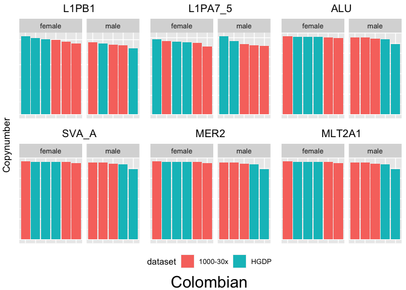
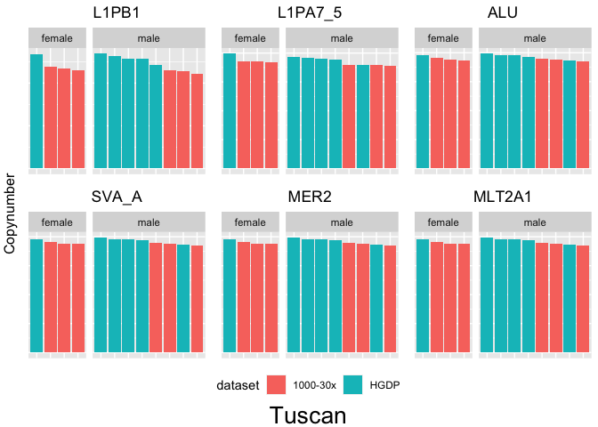
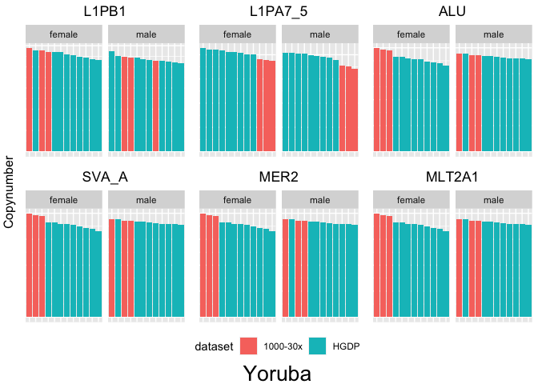

Adding more genomes: increase significance and test robustness
================

I decided to add few more samples to the 828 from the HGDP, to check if
other genomes are in line with the copynumbers estimated in the HGDP.

I choose a dataset from the 1000 Genomes Project, a subset of the
genomes for which a 30x coverage sequencing was performed
(<https://www.internationalgenome.org/data-portal/data-collection/30x-grch38>).
From this data, I downloaded and processed into the pipeline genomes
from 3 populations that were already present in the HGDP, to facilitate
comparisons:

- **Yoruba (Africa)**
- **Tuscan (Europe)**
- **Colombian (America)**

In addition, I also processed all the **Oceania** samples from the
**Simons Genome Diversity Project** (SGDP) as well as the two
**Icelandic** sample from the same dataset.

A complete list of this 28 **additional samples** can be found in
*ric-documentation/other-files/additional_samples.tsv*.

The big code chunk below reads all the 28 *mq10.mapstat* files (pipeline
output), add metadata to every sample (`population`, `country`, `sex`,
`dataset`), merge all in a unique file together with the HGDP samples.

Last, it writes two .csv files:

- *additional_samples_sync.csv* (containing the additional samples data)
- *HGDP-plus.csv* (containing all the HGDP samples plus the additional
  samples data)

``` r
library(tidyverse)
```

    ## ── Attaching packages ─────────────────────────────────────── tidyverse 1.3.2 ──
    ## ✔ ggplot2 3.3.6      ✔ purrr   0.3.4 
    ## ✔ tibble  3.1.8      ✔ dplyr   1.0.10
    ## ✔ tidyr   1.2.1      ✔ stringr 1.4.1 
    ## ✔ readr   2.1.2      ✔ forcats 0.5.2 
    ## ── Conflicts ────────────────────────────────────────── tidyverse_conflicts() ──
    ## ✖ dplyr::filter() masks stats::filter()
    ## ✖ dplyr::lag()    masks stats::lag()

``` r
library(ggpubr)
library(forcats)
library(plyr)
```

    ## ------------------------------------------------------------------------------
    ## You have loaded plyr after dplyr - this is likely to cause problems.
    ## If you need functions from both plyr and dplyr, please load plyr first, then dplyr:
    ## library(plyr); library(dplyr)
    ## ------------------------------------------------------------------------------
    ## 
    ## Attaching package: 'plyr'
    ## 
    ## The following object is masked from 'package:ggpubr':
    ## 
    ##     mutate
    ## 
    ## The following objects are masked from 'package:dplyr':
    ## 
    ##     arrange, count, desc, failwith, id, mutate, rename, summarise,
    ##     summarize
    ## 
    ## The following object is masked from 'package:purrr':
    ## 
    ##     compact

``` r
HGDPcutoff <- read_delim("/Users/rpianezza/TE/summary-HGDP/USEME_HGDP_complete_reflib6.2_mq10_batchinfo_cutoff0.01.txt",comment="#") %>% mutate(dataset="HGDP")
```

    ## Rows: 1394352 Columns: 10
    ## ── Column specification ────────────────────────────────────────────────────────
    ## Delimiter: ","
    ## chr (7): ID, Pop, sex, Country, type, familyname, batch
    ## dbl (3): length, reads, copynumber
    ## 
    ## ℹ Use `spec()` to retrieve the full column specification for this data.
    ## ℹ Specify the column types or set `show_col_types = FALSE` to quiet this message.

``` r
names(HGDPcutoff) <- c("ID","pop","sex","country","type","familyname","length","reads","copynumber","batch","dataset")

(metadata <- read_tsv("/Volumes/Temp1/rpianezza/TE/additional_samples/additional_samples.tsv", col_names=c("ID", "pop", "country", "sex", "link", "dataset", "sample_num")) %>% select(ID, pop, country, sex, dataset))
```

    ## Rows: 28 Columns: 7
    ## ── Column specification ────────────────────────────────────────────────────────
    ## Delimiter: "\t"
    ## chr (7): ID, pop, country, sex, link, dataset, sample_num
    ## 
    ## ℹ Use `spec()` to retrieve the full column specification for this data.
    ## ℹ Specify the column types or set `show_col_types = FALSE` to quiet this message.

    ## # A tibble: 28 × 5
    ##    ID      pop    country sex    dataset 
    ##    <chr>   <chr>  <chr>   <chr>  <chr>   
    ##  1 NA18858 Yoruba Africa  female 1000-30x
    ##  2 NA18853 Yoruba Africa  male   1000-30x
    ##  3 NA18860 Yoruba Africa  male   1000-30x
    ##  4 NA18485 Yoruba Africa  male   1000-30x
    ##  5 NA18505 Yoruba Africa  female 1000-30x
    ##  6 NA18517 Yoruba Africa  female 1000-30x
    ##  7 NA20505 Tuscan Europe  female 1000-30x
    ##  8 NA20512 Tuscan Europe  male   1000-30x
    ##  9 NA20517 Tuscan Europe  female 1000-30x
    ## 10 NA20524 Tuscan Europe  male   1000-30x
    ## # … with 18 more rows

``` r
read_mapstat <- function(path, id){
  read_tsv(path, col_names=c("type", "familyname", "length", "reads", "copynumber"), skip=8) %>% mutate(ID=id)
}

HG01112 <- read_mapstat("/Volumes/Temp1/rpianezza/TE/additional_samples/HG01112.final.mq10.mapstat", "HG01112")
```

    ## Rows: 1703 Columns: 5
    ## ── Column specification ────────────────────────────────────────────────────────
    ## Delimiter: "\t"
    ## chr (2): type, familyname
    ## dbl (3): length, reads, copynumber
    ## 
    ## ℹ Use `spec()` to retrieve the full column specification for this data.
    ## ℹ Specify the column types or set `show_col_types = FALSE` to quiet this message.

``` r
HG01124 <- read_mapstat("/Volumes/Temp1/rpianezza/TE/additional_samples/HG01124.final.mq10.mapstat", "HG01124")
```

    ## Rows: 1703 Columns: 5
    ## ── Column specification ────────────────────────────────────────────────────────
    ## Delimiter: "\t"
    ## chr (2): type, familyname
    ## dbl (3): length, reads, copynumber
    ## 
    ## ℹ Use `spec()` to retrieve the full column specification for this data.
    ## ℹ Specify the column types or set `show_col_types = FALSE` to quiet this message.

``` r
HG01148 <- read_mapstat("/Volumes/Temp1/rpianezza/TE/additional_samples/HG01148.final.mq10.mapstat", "HG01148")
```

    ## Rows: 1703 Columns: 5
    ## ── Column specification ────────────────────────────────────────────────────────
    ## Delimiter: "\t"
    ## chr (2): type, familyname
    ## dbl (3): length, reads, copynumber
    ## 
    ## ℹ Use `spec()` to retrieve the full column specification for this data.
    ## ℹ Specify the column types or set `show_col_types = FALSE` to quiet this message.

``` r
HG01150 <- read_mapstat("/Volumes/Temp1/rpianezza/TE/additional_samples/HG01150.final.mq10.mapstat", "HG01150")
```

    ## Rows: 1703 Columns: 5
    ## ── Column specification ────────────────────────────────────────────────────────
    ## Delimiter: "\t"
    ## chr (2): type, familyname
    ## dbl (3): length, reads, copynumber
    ## 
    ## ℹ Use `spec()` to retrieve the full column specification for this data.
    ## ℹ Specify the column types or set `show_col_types = FALSE` to quiet this message.

``` r
HG01251 <- read_mapstat("/Volumes/Temp1/rpianezza/TE/additional_samples/HG01251.final.mq10.mapstat", "HG01251")
```

    ## Rows: 1703 Columns: 5
    ## ── Column specification ────────────────────────────────────────────────────────
    ## Delimiter: "\t"
    ## chr (2): type, familyname
    ## dbl (3): length, reads, copynumber
    ## 
    ## ℹ Use `spec()` to retrieve the full column specification for this data.
    ## ℹ Specify the column types or set `show_col_types = FALSE` to quiet this message.

``` r
HG01345 <- read_mapstat("/Volumes/Temp1/rpianezza/TE/additional_samples/HG01345.final.mq10.mapstat", "HG01345")
```

    ## Rows: 1703 Columns: 5
    ## ── Column specification ────────────────────────────────────────────────────────
    ## Delimiter: "\t"
    ## chr (2): type, familyname
    ## dbl (3): length, reads, copynumber
    ## 
    ## ℹ Use `spec()` to retrieve the full column specification for this data.
    ## ℹ Specify the column types or set `show_col_types = FALSE` to quiet this message.

``` r
NA18485 <- read_mapstat("/Volumes/Temp1/rpianezza/TE/additional_samples/NA18485.final.mq10.mapstat", "NA18485")
```

    ## Rows: 1703 Columns: 5
    ## ── Column specification ────────────────────────────────────────────────────────
    ## Delimiter: "\t"
    ## chr (2): type, familyname
    ## dbl (3): length, reads, copynumber
    ## 
    ## ℹ Use `spec()` to retrieve the full column specification for this data.
    ## ℹ Specify the column types or set `show_col_types = FALSE` to quiet this message.

``` r
NA18505 <- read_mapstat("/Volumes/Temp1/rpianezza/TE/additional_samples/NA18505.final.mq10.mapstat", "NA18505")
```

    ## Rows: 1703 Columns: 5
    ## ── Column specification ────────────────────────────────────────────────────────
    ## Delimiter: "\t"
    ## chr (2): type, familyname
    ## dbl (3): length, reads, copynumber
    ## 
    ## ℹ Use `spec()` to retrieve the full column specification for this data.
    ## ℹ Specify the column types or set `show_col_types = FALSE` to quiet this message.

``` r
NA18517 <- read_mapstat("/Volumes/Temp1/rpianezza/TE/additional_samples/NA18517.final.mq10.mapstat", "NA18517")
```

    ## Rows: 1703 Columns: 5
    ## ── Column specification ────────────────────────────────────────────────────────
    ## Delimiter: "\t"
    ## chr (2): type, familyname
    ## dbl (3): length, reads, copynumber
    ## 
    ## ℹ Use `spec()` to retrieve the full column specification for this data.
    ## ℹ Specify the column types or set `show_col_types = FALSE` to quiet this message.

``` r
NA18853 <- read_mapstat("/Volumes/Temp1/rpianezza/TE/additional_samples/NA18853.final.mq10.mapstat", "NA18853")
```

    ## Rows: 1703 Columns: 5
    ## ── Column specification ────────────────────────────────────────────────────────
    ## Delimiter: "\t"
    ## chr (2): type, familyname
    ## dbl (3): length, reads, copynumber
    ## 
    ## ℹ Use `spec()` to retrieve the full column specification for this data.
    ## ℹ Specify the column types or set `show_col_types = FALSE` to quiet this message.

``` r
NA18858 <- read_mapstat("/Volumes/Temp1/rpianezza/TE/additional_samples/NA18858.final.mq10.mapstat", "NA18858")
```

    ## Rows: 1703 Columns: 5
    ## ── Column specification ────────────────────────────────────────────────────────
    ## Delimiter: "\t"
    ## chr (2): type, familyname
    ## dbl (3): length, reads, copynumber
    ## 
    ## ℹ Use `spec()` to retrieve the full column specification for this data.
    ## ℹ Specify the column types or set `show_col_types = FALSE` to quiet this message.

``` r
NA18860 <- read_mapstat("/Volumes/Temp1/rpianezza/TE/additional_samples/NA18860.final.mq10.mapstat", "NA18860")
```

    ## Rows: 1703 Columns: 5
    ## ── Column specification ────────────────────────────────────────────────────────
    ## Delimiter: "\t"
    ## chr (2): type, familyname
    ## dbl (3): length, reads, copynumber
    ## 
    ## ℹ Use `spec()` to retrieve the full column specification for this data.
    ## ℹ Specify the column types or set `show_col_types = FALSE` to quiet this message.

``` r
NA20505 <- read_mapstat("/Volumes/Temp1/rpianezza/TE/additional_samples/NA20505.final.mq10.mapstat", "NA20505")
```

    ## Rows: 1703 Columns: 5
    ## ── Column specification ────────────────────────────────────────────────────────
    ## Delimiter: "\t"
    ## chr (2): type, familyname
    ## dbl (3): length, reads, copynumber
    ## 
    ## ℹ Use `spec()` to retrieve the full column specification for this data.
    ## ℹ Specify the column types or set `show_col_types = FALSE` to quiet this message.

``` r
NA20512 <- read_mapstat("/Volumes/Temp1/rpianezza/TE/additional_samples/NA20512.final.mq10.mapstat", "NA20512")
```

    ## Rows: 1703 Columns: 5
    ## ── Column specification ────────────────────────────────────────────────────────
    ## Delimiter: "\t"
    ## chr (2): type, familyname
    ## dbl (3): length, reads, copynumber
    ## 
    ## ℹ Use `spec()` to retrieve the full column specification for this data.
    ## ℹ Specify the column types or set `show_col_types = FALSE` to quiet this message.

``` r
NA20517 <- read_mapstat("/Volumes/Temp1/rpianezza/TE/additional_samples/NA20517.final.mq10.mapstat", "NA20517")
```

    ## Rows: 1703 Columns: 5
    ## ── Column specification ────────────────────────────────────────────────────────
    ## Delimiter: "\t"
    ## chr (2): type, familyname
    ## dbl (3): length, reads, copynumber
    ## 
    ## ℹ Use `spec()` to retrieve the full column specification for this data.
    ## ℹ Specify the column types or set `show_col_types = FALSE` to quiet this message.

``` r
NA20524 <- read_mapstat("/Volumes/Temp1/rpianezza/TE/additional_samples/NA20524.final.mq10.mapstat", "NA20524")
```

    ## Rows: 1703 Columns: 5
    ## ── Column specification ────────────────────────────────────────────────────────
    ## Delimiter: "\t"
    ## chr (2): type, familyname
    ## dbl (3): length, reads, copynumber
    ## 
    ## ℹ Use `spec()` to retrieve the full column specification for this data.
    ## ℹ Specify the column types or set `show_col_types = FALSE` to quiet this message.

``` r
NA20529 <- read_mapstat("/Volumes/Temp1/rpianezza/TE/additional_samples/NA20529.final.mq10.mapstat", "NA20529")
```

    ## Rows: 1703 Columns: 5
    ## ── Column specification ────────────────────────────────────────────────────────
    ## Delimiter: "\t"
    ## chr (2): type, familyname
    ## dbl (3): length, reads, copynumber
    ## 
    ## ℹ Use `spec()` to retrieve the full column specification for this data.
    ## ℹ Specify the column types or set `show_col_types = FALSE` to quiet this message.

``` r
NA20536 <- read_mapstat("/Volumes/Temp1/rpianezza/TE/additional_samples/NA20536.final.mq10.mapstat", "NA20536")
```

    ## Rows: 1703 Columns: 5
    ## ── Column specification ────────────────────────────────────────────────────────
    ## Delimiter: "\t"
    ## chr (2): type, familyname
    ## dbl (3): length, reads, copynumber
    ## 
    ## ℹ Use `spec()` to retrieve the full column specification for this data.
    ## ℹ Specify the column types or set `show_col_types = FALSE` to quiet this message.

``` r
IHW9193 <- read_mapstat("/Volumes/Temp1/rpianezza/TE/additional_samples/SAMEA3302681.alt_bwamem_GRCh38DH.20200922.Australian.simons.mq10.mapstat", "IHW9193")
```

    ## Rows: 1703 Columns: 5
    ## ── Column specification ────────────────────────────────────────────────────────
    ## Delimiter: "\t"
    ## chr (2): type, familyname
    ## dbl (3): length, reads, copynumber
    ## 
    ## ℹ Use `spec()` to retrieve the full column specification for this data.
    ## ℹ Specify the column types or set `show_col_types = FALSE` to quiet this message.

``` r
Dus22 <- read_mapstat("/Volumes/Temp1/rpianezza/TE/additional_samples/SAMEA3302688.alt_bwamem_GRCh38DH.20200922.Dusun.simons.mq10.mapstat", "Dus22")
```

    ## Rows: 1703 Columns: 5
    ## ── Column specification ────────────────────────────────────────────────────────
    ## Delimiter: "\t"
    ## chr (2): type, familyname
    ## dbl (3): length, reads, copynumber
    ## 
    ## ℹ Use `spec()` to retrieve the full column specification for this data.
    ## ℹ Specify the column types or set `show_col_types = FALSE` to quiet this message.

``` r
Igor21 <- read_mapstat("/Volumes/Temp1/rpianezza/TE/additional_samples/SAMEA3302696.alt_bwamem_GRCh38DH.20200922.Igorot.simons.mq10.mapstat", "Igor21")
```

    ## Rows: 1703 Columns: 5
    ## ── Column specification ────────────────────────────────────────────────────────
    ## Delimiter: "\t"
    ## chr (2): type, familyname
    ## dbl (3): length, reads, copynumber
    ## 
    ## ℹ Use `spec()` to retrieve the full column specification for this data.
    ## ℹ Specify the column types or set `show_col_types = FALSE` to quiet this message.

``` r
IHW9118 <- read_mapstat("/Volumes/Temp1/rpianezza/TE/additional_samples/SAMEA3302719.alt_bwamem_GRCh38DH.20200922.Australian.simons.mq10.mapstat", "IHW9118")
```

    ## Rows: 1703 Columns: 5
    ## ── Column specification ────────────────────────────────────────────────────────
    ## Delimiter: "\t"
    ## chr (2): type, familyname
    ## dbl (3): length, reads, copynumber
    ## 
    ## ℹ Use `spec()` to retrieve the full column specification for this data.
    ## ℹ Specify the column types or set `show_col_types = FALSE` to quiet this message.

``` r
Igor20 <- read_mapstat("/Volumes/Temp1/rpianezza/TE/additional_samples/SAMEA3302724.alt_bwamem_GRCh38DH.20200922.Igorot.simons.mq10.mapstat", "Igor20")
```

    ## Rows: 1703 Columns: 5
    ## ── Column specification ────────────────────────────────────────────────────────
    ## Delimiter: "\t"
    ## chr (2): type, familyname
    ## dbl (3): length, reads, copynumber
    ## 
    ## ℹ Use `spec()` to retrieve the full column specification for this data.
    ## ℹ Specify the column types or set `show_col_types = FALSE` to quiet this message.

``` r
Dus16 <- read_mapstat("/Volumes/Temp1/rpianezza/TE/additional_samples/SAMEA3302759.alt_bwamem_GRCh38DH.20200922.Dusun.simons.mq10.mapstat", "Dus16")
```

    ## Rows: 1703 Columns: 5
    ## ── Column specification ────────────────────────────────────────────────────────
    ## Delimiter: "\t"
    ## chr (2): type, familyname
    ## dbl (3): length, reads, copynumber
    ## 
    ## ℹ Use `spec()` to retrieve the full column specification for this data.
    ## ℹ Specify the column types or set `show_col_types = FALSE` to quiet this message.

``` r
NA15761 <- read_mapstat("/Volumes/Temp1/rpianezza/TE/additional_samples/SAMEA3302837.alt_bwamem_GRCh38DH.20200922.Icelandic.simons.mq10.mapstat", "NA15761")
```

    ## Rows: 1703 Columns: 5
    ## ── Column specification ────────────────────────────────────────────────────────
    ## Delimiter: "\t"
    ## chr (2): type, familyname
    ## dbl (3): length, reads, copynumber
    ## 
    ## ℹ Use `spec()` to retrieve the full column specification for this data.
    ## ℹ Specify the column types or set `show_col_types = FALSE` to quiet this message.

``` r
NA15763 <- read_mapstat("/Volumes/Temp1/rpianezza/TE/additional_samples/SAMEA3302859.alt_bwamem_GRCh38DH.20200922.Icelandic.simons.mq10.mapstat", "NA15763")
```

    ## Rows: 1703 Columns: 5
    ## ── Column specification ────────────────────────────────────────────────────────
    ## Delimiter: "\t"
    ## chr (2): type, familyname
    ## dbl (3): length, reads, copynumber
    ## 
    ## ℹ Use `spec()` to retrieve the full column specification for this data.
    ## ℹ Specify the column types or set `show_col_types = FALSE` to quiet this message.

``` r
NA17386 <- read_mapstat("/Volumes/Temp1/rpianezza/TE/additional_samples/SAMEA3302905.alt_bwamem_GRCh38DH.20200922.Maori.simons.mq10.mapstat", "NA17386")
```

    ## Rows: 1703 Columns: 5
    ## ── Column specification ────────────────────────────────────────────────────────
    ## Delimiter: "\t"
    ## chr (2): type, familyname
    ## dbl (3): length, reads, copynumber
    ## 
    ## ℹ Use `spec()` to retrieve the full column specification for this data.
    ## ℹ Specify the column types or set `show_col_types = FALSE` to quiet this message.

``` r
NA17385 <- read_mapstat("/Volumes/Temp1/rpianezza/TE/additional_samples/SAMEA3302908.alt_bwamem_GRCh38DH.20200922.Hawaiian.simons.mq10.mapstat", "NA17385")
```

    ## Rows: 1703 Columns: 5
    ## ── Column specification ────────────────────────────────────────────────────────
    ## Delimiter: "\t"
    ## chr (2): type, familyname
    ## dbl (3): length, reads, copynumber
    ## 
    ## ℹ Use `spec()` to retrieve the full column specification for this data.
    ## ℹ Specify the column types or set `show_col_types = FALSE` to quiet this message.

``` r
additional_samples <- join_all(list(NA18858, NA18853, NA18860, NA18485, NA18505, NA18517, NA20505, NA20512, NA20517, NA20524, NA20529, NA20536, HG01148, HG01150, HG01251, HG01345, HG01112, HG01124, IHW9118, IHW9193, NA17386, NA17385, Dus22, Dus16, Igor21, Igor20, NA15761, NA15763), type='full')
```

    ## Joining by: type, familyname, length, reads, copynumber, ID
    ## Joining by: type, familyname, length, reads, copynumber, ID
    ## Joining by: type, familyname, length, reads, copynumber, ID
    ## Joining by: type, familyname, length, reads, copynumber, ID
    ## Joining by: type, familyname, length, reads, copynumber, ID
    ## Joining by: type, familyname, length, reads, copynumber, ID
    ## Joining by: type, familyname, length, reads, copynumber, ID
    ## Joining by: type, familyname, length, reads, copynumber, ID
    ## Joining by: type, familyname, length, reads, copynumber, ID
    ## Joining by: type, familyname, length, reads, copynumber, ID
    ## Joining by: type, familyname, length, reads, copynumber, ID
    ## Joining by: type, familyname, length, reads, copynumber, ID
    ## Joining by: type, familyname, length, reads, copynumber, ID
    ## Joining by: type, familyname, length, reads, copynumber, ID
    ## Joining by: type, familyname, length, reads, copynumber, ID
    ## Joining by: type, familyname, length, reads, copynumber, ID
    ## Joining by: type, familyname, length, reads, copynumber, ID
    ## Joining by: type, familyname, length, reads, copynumber, ID
    ## Joining by: type, familyname, length, reads, copynumber, ID
    ## Joining by: type, familyname, length, reads, copynumber, ID
    ## Joining by: type, familyname, length, reads, copynumber, ID
    ## Joining by: type, familyname, length, reads, copynumber, ID
    ## Joining by: type, familyname, length, reads, copynumber, ID
    ## Joining by: type, familyname, length, reads, copynumber, ID
    ## Joining by: type, familyname, length, reads, copynumber, ID
    ## Joining by: type, familyname, length, reads, copynumber, ID
    ## Joining by: type, familyname, length, reads, copynumber, ID

``` r
additional_samples_final <- left_join(metadata, additional_samples, by="ID")
write.csv(additional_samples, "/Volumes/Temp1/rpianezza/TE/additional_samples/additional_samples_sync.csv", row.names = FALSE)

HGDP_and_more <- full_join(HGDPcutoff, additional_samples_final) %>% select(!("batch"))
```

    ## Joining, by = c("ID", "pop", "sex", "country", "type", "familyname", "length",
    ## "reads", "copynumber", "dataset")

``` r
write.csv(HGDP_and_more, "/Volumes/Temp1/rpianezza/TE/summary-HGDP/HGDP-plus.csv", row.names = FALSE)
```

Here I try to produce a plot that shows if the **additional samples**
from the 3 control populations are in line with the samples from the
same populations in the HGDP.

``` r
dataset_bias <- function(popu){
  data1 <- filter(HGDP_and_more, familyname == "L1PB1", pop == popu) %>% arrange(sex, desc(copynumber)) %>% mutate(ID = fct_reorder(ID, desc(copynumber)))
 L1PB1 <- ggplot(data1, aes(ID, copynumber, fill=dataset)) +
  geom_histogram(stat = "identity") + facet_grid(~sex, scales = "free", space = "free" ) +
  theme(axis.title.x=element_blank(), axis.text.x=element_blank(), axis.ticks.x=element_blank(), axis.title.y=element_blank(), axis.text.y=element_blank(), axis.ticks.y=element_blank()) + ggtitle("L1PB1") + theme(plot.title = element_text(hjust = 0.5))
 
   data2 <- filter(HGDP_and_more, familyname == "L1PA7_5", pop == popu) %>% arrange(sex, desc(copynumber)) %>% mutate(ID = fct_reorder(ID, desc(copynumber)))
 L1PA7_5 <- ggplot(data2, aes(ID, copynumber, fill=dataset)) +
  geom_histogram(stat = "identity") + facet_grid(~sex, scales = "free", space = "free" ) +
  theme(axis.title.x=element_blank(), axis.text.x=element_blank(), axis.ticks.x=element_blank(), axis.title.y=element_blank(), axis.text.y=element_blank(), axis.ticks.y=element_blank()) + ggtitle("L1PA7_5")+ theme(plot.title = element_text(hjust = 0.5))
 
   data3 <- filter(HGDP_and_more, familyname == "ALU", pop == popu) %>% arrange(sex, desc(copynumber)) %>% mutate(ID = fct_reorder(ID, desc(copynumber)))
 ALU <- ggplot(data3, aes(ID, copynumber, fill=dataset)) +
  geom_histogram(stat = "identity") + facet_grid(~sex, scales = "free", space = "free" ) +
  theme(axis.title.x=element_blank(), axis.text.x=element_blank(), axis.ticks.x=element_blank(), axis.title.y=element_blank(), axis.text.y=element_blank(), axis.ticks.y=element_blank()) + ggtitle("ALU")+ theme(plot.title = element_text(hjust = 0.5))
 
 data4 <- filter(HGDP_and_more, familyname == "SVA_A", pop == popu) %>% arrange(sex, desc(copynumber)) %>% mutate(ID = fct_reorder(ID, desc(copynumber)))
 SVA_A <- ggplot(data3, aes(ID, copynumber, fill=dataset)) +
  geom_histogram(stat = "identity") + facet_grid(~sex, scales = "free", space = "free" ) +
  theme(axis.title.x=element_blank(), axis.text.x=element_blank(), axis.ticks.x=element_blank(), axis.title.y=element_blank(), axis.text.y=element_blank(), axis.ticks.y=element_blank()) + ggtitle("SVA_A")+ theme(plot.title = element_text(hjust = 0.5))
 
 data5 <- filter(HGDP_and_more, familyname == "MER2", pop == popu) %>% arrange(sex, desc(copynumber)) %>% mutate(ID = fct_reorder(ID, desc(copynumber)))
 MER2 <- ggplot(data3, aes(ID, copynumber, fill=dataset)) +
  geom_histogram(stat = "identity") + facet_grid(~sex, scales = "free", space = "free" ) +
  theme(axis.title.x=element_blank(), axis.text.x=element_blank(), axis.ticks.x=element_blank(), axis.title.y=element_blank(), axis.text.y=element_blank(), axis.ticks.y=element_blank()) + ggtitle("MER2")+ theme(plot.title = element_text(hjust = 0.5))
 
 data6 <- filter(HGDP_and_more, familyname == "MLT2A1", pop == popu) %>% arrange(sex, desc(copynumber)) %>% mutate(ID = fct_reorder(ID, desc(copynumber)))
 MLT2A1 <- ggplot(data3, aes(ID, copynumber, fill=dataset)) +
  geom_histogram(stat = "identity") + facet_grid(~sex, scales = "free", space = "free" ) +
  theme(axis.title.x=element_blank(), axis.text.x=element_blank(), axis.ticks.x=element_blank(), axis.title.y=element_blank(), axis.text.y=element_blank(), axis.ticks.y=element_blank()) + ggtitle("MLT2A1")+ theme(plot.title = element_text(hjust = 0.5))
 
 
 figure <- ggarrange(L1PB1, L1PA7_5, ALU, SVA_A, MER2, MLT2A1, ncol = 3, nrow = 2, common.legend = TRUE, legend = "bottom", align = "hv", font.label = list(size = 10, color = "black", face = "bold", family = NULL, position = "top"))
 (final <- annotate_figure(figure, left = text_grob("Copynumber", color = "black", rot = 90), bottom = text_grob(popu, color = "black", size = 20), fig.lab = ""))
}

dataset_bias("Colombian")
```

    ## Warning: Ignoring unknown parameters: binwidth, bins, pad
    ## Ignoring unknown parameters: binwidth, bins, pad
    ## Ignoring unknown parameters: binwidth, bins, pad
    ## Ignoring unknown parameters: binwidth, bins, pad
    ## Ignoring unknown parameters: binwidth, bins, pad
    ## Ignoring unknown parameters: binwidth, bins, pad

<!-- -->

``` r
dataset_bias("Tuscan")
```

    ## Warning: Ignoring unknown parameters: binwidth, bins, pad
    ## Ignoring unknown parameters: binwidth, bins, pad
    ## Ignoring unknown parameters: binwidth, bins, pad
    ## Ignoring unknown parameters: binwidth, bins, pad
    ## Ignoring unknown parameters: binwidth, bins, pad
    ## Ignoring unknown parameters: binwidth, bins, pad

<!-- -->

``` r
dataset_bias("Yoruba")
```

    ## Warning: Ignoring unknown parameters: binwidth, bins, pad
    ## Ignoring unknown parameters: binwidth, bins, pad
    ## Ignoring unknown parameters: binwidth, bins, pad
    ## Ignoring unknown parameters: binwidth, bins, pad
    ## Ignoring unknown parameters: binwidth, bins, pad
    ## Ignoring unknown parameters: binwidth, bins, pad

<!-- -->

For some TE we see that all the samples from the **1000 Genomes
Project** (1000-30x) are at one of the extreme of the plot. In general
we see that the two datasets are overlapping most of the time, but these
extreme cases highlight the importance of having a significant number of
samples to establish a reliable average copynumber for a population.

## Other analysis with the new samples

We then try to recreate some of the previous analyses adding the new
samples to the dataset. Anyway, both for the **geographic details**
(script 4) and **PCA** (script 6), the new populations (Maori,
Icelandic, Hawaiian, Australian, Dusun, Igorot) are often outliers and
just confound the patterns. I guess that this is explainable by the fact
that these populations are only represented by 1/2 individuals. As shown
above, having an adequate number of samples is crucial to avoid
misinterpretation of the data. Also, I did not find any information
regarding the read length of the samples in the SGDP, which can
introduce some biases.
