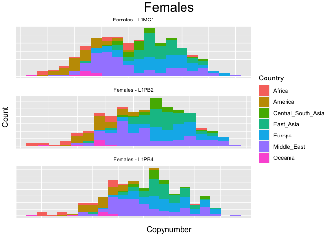
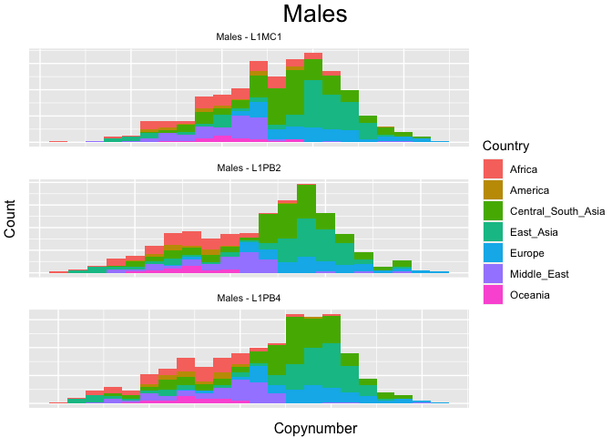
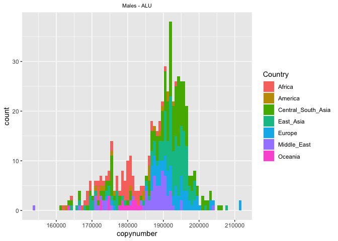
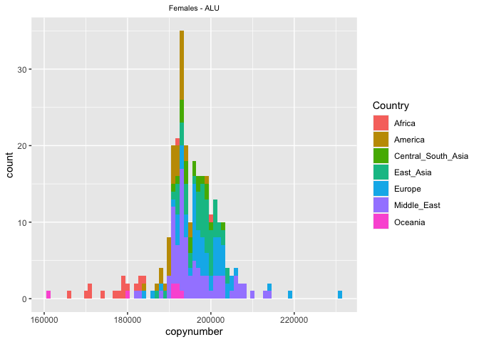
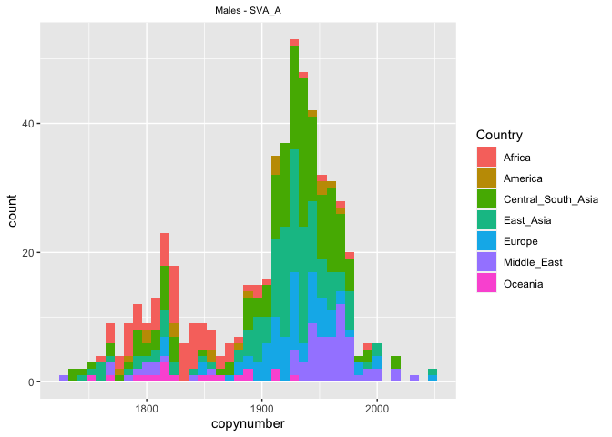
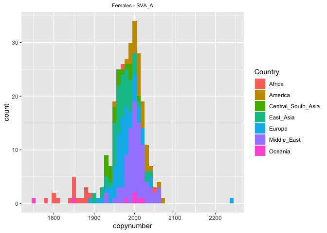
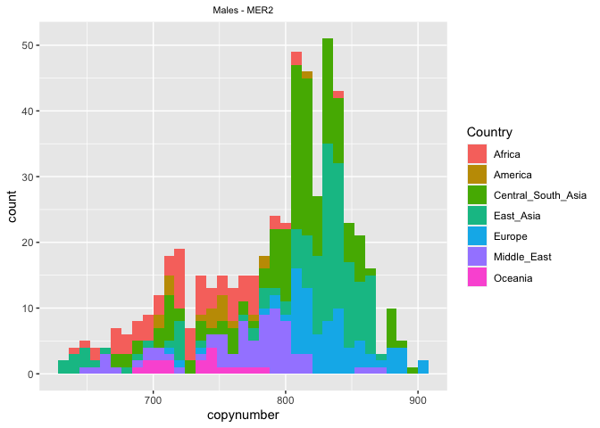

HGDP - Analyzing the TEs with the highest absolute difference between
their minimum and maximum abundance estimate
================

This is the first script written by me, Riccardo. This script works with
the version of the HGDP dataset created in Script 2 by Florian. We
perform all analyses separately for males and females, as we established
that there are significant differences between the sexes in Script 5
from Florian.

``` r
library(tidyverse)
```

    ## ── Attaching packages ─────────────────────────────────────── tidyverse 1.3.2 ──
    ## ✔ ggplot2 3.3.6      ✔ purrr   0.3.4 
    ## ✔ tibble  3.1.8      ✔ dplyr   1.0.10
    ## ✔ tidyr   1.2.1      ✔ stringr 1.4.1 
    ## ✔ readr   2.1.2      ✔ forcats 0.5.2 
    ## ── Conflicts ────────────────────────────────────────── tidyverse_conflicts() ──
    ## ✖ dplyr::filter() masks stats::filter()
    ## ✖ dplyr::lag()    masks stats::lag()

``` r
library("ggpubr")
HGDPcutoff<-read_delim("/Users/rpianezza/TE/summary-HGDP/USEME_HGDP_complete_reflib6.2_mq10_batchinfo_cutoff0.01.txt",comment="#")
```

    ## Rows: 1394352 Columns: 10
    ## ── Column specification ────────────────────────────────────────────────────────
    ## Delimiter: ","
    ## chr (7): ID, Pop, sex, Country, type, familyname, batch
    ## dbl (3): length, reads, copynumber
    ## 
    ## ℹ Use `spec()` to retrieve the full column specification for this data.
    ## ℹ Specify the column types or set `show_col_types = FALSE` to quiet this message.

``` r
names(HGDPcutoff)<-c("ID","Pop","sex","Country","type","familyname","length","reads","copynumber","batch")

fTE<-subset(HGDPcutoff, sex=="female" & type=="te")
mTE<-subset(HGDPcutoff, sex=="male" & type=="te")
```

The idea of the first part of this code is to plot the **general
distribution of TE abundance** estimates in a boxplot. First I will
perform the analysis on the female subset, later on the male subset
using the same settings.

Looking at this plot for all 965 TEs seems excessive (and not
informative), so I created a subset. First, I identify the **minimum**,
**mean** and **maximum** value for each TE sequence. This code chunk
creates a data frame containing respectively the name of the TE and its
minimum, mean and maximum value in the female subset of the data set.
Everything containing minimum, mean and maximum value for each TE is
named from now `MMM`.

``` r
TEnames <- unique(fTE$familyname)
f_MMM<-c()
for (i in TEnames){
  f_MMM<-c(f_MMM,min(fTE$copynumber[fTE$familyname==i]), mean(fTE$copynumber[fTE$familyname==i]), max(fTE$copynumber[fTE$familyname==i]))}
f_MMM_matrix<-matrix(f_MMM,ncol=3,byrow=T)
f_MMM_frame<-data.frame(TEnames,f_MMM_matrix)
names(f_MMM_frame)<-c('tenames','min','mean','max')

m_MMM<-c()
for (i in TEnames){
  m_MMM<-c(m_MMM,min(mTE$copynumber[mTE$familyname==i]), mean(mTE$copynumber[mTE$familyname==i]), max(mTE$copynumber[mTE$familyname==i]))}
m_MMM_matrix<-matrix(m_MMM,ncol=3,byrow=T)
m_MMM_frame<-data.frame(TEnames,m_MMM_matrix)
names(m_MMM_frame)<-c('tenames','min','mean','max')
```

The criteria to select TEs was an **absolute value** of maximum copy
number vs minimum copy number as a threshold. In this way, the idea is
to keep only informative observations in this subset. For this analysis,
I set the threshold at `200`.

In the two sections below I create the two subsets for females and
males, I order the subsets by descent absolute difference and plot them
as boxplots.

## Females

``` r
foutlierTEnames<-f_MMM_frame$tenames[f_MMM_frame$max-f_MMM_frame$min>200 & f_MMM_frame$max-f_MMM_frame$min<Inf]
fTEoutlier<-fTE[fTE$familyname %in% foutlierTEnames,]
fTEoutlier_order<-fTEoutlier[order(fTEoutlier$copynumber,decreasing=T),]
fTEoutlier_order$familyname<-factor(fTEoutlier_order$familyname,levels=unique(fTEoutlier_order$familyname))

ggplot(fTEoutlier_order,aes(x=familyname,y=log(copynumber)))+geom_boxplot(notch=F)+
  theme(axis.text.x = element_text(angle = 90, hjust = 1)) 
```

<!-- -->

## Males

``` r
moutlierTEnames<-m_MMM_frame$tenames[m_MMM_frame$max-m_MMM_frame$min>200 & m_MMM_frame$max-m_MMM_frame$min<Inf]
mTEoutlier<-mTE[mTE$familyname %in% moutlierTEnames,]
mTEoutlier_order<-mTEoutlier[order(mTEoutlier$copynumber,decreasing=T),]
mTEoutlier_order$familyname<-factor(mTEoutlier_order$familyname,levels=unique(mTEoutlier_order$familyname))

ggplot(mTEoutlier_order,aes(x=familyname,y=log(copynumber)))+geom_boxplot(notch=F)+
  theme(axis.text.x = element_text(angle = 90, hjust = 1)) 
```

<!-- -->

## Details for each relevant TE

In this section I go in details analyzing the **copynumber geographical
distribution** for the TE families previously selected in the subsets.

First, I analysed the difference between the two sex-related subsets. I
found that the **females** dataset (`fTEoutlier_order`) has 40 different
`familyname`, while the **males** has 44. While there are no sequence
families present in the females and not in the males, there are 4
sequence families present in the males and not in the females:

- `L1MC1`
- `L1PB2`
- `L1PB4`
- `MER22` (a satellite)

In other words, these sequences have high variance particularly on the
**Y chromosome**. I analysed those separately.

``` r
f_familynames <- fTEoutlier_order$familyname
m_familynames <- mTEoutlier_order$familyname

# TEs present in the female subset and not in the males
length(unique(f_familynames))
```

    ## [1] 40

``` r
setdiff(f_familynames,m_familynames)
```

    ## character(0)

``` r
# TEs present in the male subset and not in the females
length(unique(m_familynames))
```

    ## [1] 44

``` r
setdiff(m_familynames,f_familynames)
```

    ## [1] "L1MC1" "L1PB2" "L1PB4" "MER22"

### L1 family

To analyse all the TE families part of the **L1 superfamily**, I first
create two subsubsets containing the useful data. Only the observation
with `familyname` starting with `L1` were retained.

``` r
fL1<-fTEoutlier_order %>% filter(str_detect(fTEoutlier_order$familyname, "^L1"))
mL1<-mTEoutlier_order %>% filter(str_detect(mTEoutlier_order$familyname, "^L1"))
```

Subsequently, I created the plots for each L1 family contained in the
data. In total, I had 16 L1 families, for a total of 32 plots (16 for
males, 16 for females). Here is the list of the investigated L1
families, representing the most variant families in absolute terms:

- L1PA4
- L1
- L1PREC1
- L1PA16
- L1PA6
- L1PA7_5
- L1HS
- L1PA7
- L1PB2
- L1PB1
- L1PA10
- L1PA8
- L1PREC2
- L1PA3
- L1PA15
- L1P_MA2

``` r
# L1PA4
fL1PA4<-fL1[fL1$familyname=='L1PA4',]
mL1PA4<-mL1[mL1$familyname=='L1PA4',]

mL1PA4_plot<-ggplot(data = mL1PA4, mapping = aes(x = copynumber, fill = Country)) +
  ggtitle("L1PA4") + theme(plot.title = element_text(size = 8, hjust = 0.5)) +
  geom_histogram(binwidth = 10) + theme(axis.title.x=element_blank(), axis.text.x=element_blank(), axis.ticks.x=element_blank(), axis.title.y=element_blank(), axis.ticks.y=element_blank(), axis.text.y=element_blank())

fL1PA4_plot<-ggplot(data = fL1PA4, mapping = aes(x = copynumber, fill = Country)) +
  ggtitle("L1PA4") + theme(plot.title = element_text(size = 8, hjust = 0.5)) +
  geom_histogram(binwidth = 10) + theme(axis.title.x=element_blank(), axis.text.x=element_blank(), axis.ticks.x=element_blank(), axis.title.y=element_blank(), axis.ticks.y=element_blank(), axis.text.y=element_blank())

# L1
fL1_<-fL1[fL1$familyname=='L1',]
mL1_<-mL1[mL1$familyname=='L1',]

mL1_plot<-ggplot(data = mL1_, mapping = aes(x = copynumber, fill = Country)) +
  ggtitle("L1") + theme(plot.title = element_text(size = 8, hjust = 0.5)) +
  geom_histogram(binwidth = 10) + theme(axis.title.x=element_blank(), axis.text.x=element_blank(), axis.ticks.x=element_blank(), axis.title.y=element_blank(), axis.ticks.y=element_blank(), axis.text.y=element_blank())

fL1_plot<-ggplot(data = fL1_, mapping = aes(x = copynumber, fill = Country)) +
  ggtitle("L1") + theme(plot.title = element_text(size = 8, hjust = 0.5)) +
  geom_histogram(binwidth = 10) + theme(axis.title.x=element_blank(), axis.text.x=element_blank(), axis.ticks.x=element_blank(), axis.title.y=element_blank(), axis.ticks.y=element_blank(), axis.text.y=element_blank())

# L1PREC1
fL1PREC1<-fL1[fL1$familyname=='L1PREC1',]
mL1PREC1<-mL1[mL1$familyname=='L1PREC1',]

mL1PREC1_plot<-ggplot(data = mL1PREC1, mapping = aes(x = copynumber, fill = Country)) +
  ggtitle("L1PREC1") + theme(plot.title = element_text(size = 8, hjust = 0.5)) +
  geom_histogram(binwidth = 10) + theme(axis.title.x=element_blank(), axis.text.x=element_blank(), axis.ticks.x=element_blank(), axis.title.y=element_blank(), axis.ticks.y=element_blank(), axis.text.y=element_blank())

fL1PREC1_plot<-ggplot(data = fL1PREC1, mapping = aes(x = copynumber, fill = Country)) +
  ggtitle("L1PREC1") + theme(plot.title = element_text(size = 8, hjust = 0.5)) +
  geom_histogram(binwidth = 10) + theme(axis.title.x=element_blank(), axis.text.x=element_blank(), axis.ticks.x=element_blank(), axis.title.y=element_blank(), axis.ticks.y=element_blank(), axis.text.y=element_blank())

#L1PA16
fL1PA16<-fL1[fL1$familyname=='L1PA16',]
mL1PA16<-mL1[mL1$familyname=='L1PA16',]

mL1PA16_plot<-ggplot(data = mL1PA16, mapping = aes(x = copynumber, fill = Country)) +
  ggtitle("L1PA16") + theme(plot.title = element_text(size = 8, hjust = 0.5)) +
  geom_histogram(binwidth = 10) + theme(axis.title.x=element_blank(), axis.text.x=element_blank(), axis.ticks.x=element_blank(), axis.title.y=element_blank(), axis.ticks.y=element_blank(), axis.text.y=element_blank())

fL1PA16_plot<-ggplot(data = fL1PA16, mapping = aes(x = copynumber, fill = Country)) +
  ggtitle("L1PA16") + theme(plot.title = element_text(size = 8, hjust = 0.5)) +
  geom_histogram(binwidth = 10) + theme(axis.title.x=element_blank(), axis.text.x=element_blank(), axis.ticks.x=element_blank(), axis.title.y=element_blank(), axis.ticks.y=element_blank(), axis.text.y=element_blank())

#L1PA6
fL1PA6<-fL1[fL1$familyname=='L1PA6',]
mL1PA6<-mL1[mL1$familyname=='L1PA6',]

mL1PA6_plot<-ggplot(data = mL1PA6, mapping = aes(x = copynumber, fill = Country)) +
  ggtitle("L1PA6") + theme(plot.title = element_text(size = 8, hjust = 0.5)) +
  geom_histogram(binwidth = 10) + theme(axis.title.x=element_blank(), axis.text.x=element_blank(), axis.ticks.x=element_blank(), axis.title.y=element_blank(), axis.ticks.y=element_blank(), axis.text.y=element_blank())

fL1PA6_plot<-ggplot(data = fL1PA6, mapping = aes(x = copynumber, fill = Country)) +
  ggtitle("L1PA6") + theme(plot.title = element_text(size = 8, hjust = 0.5)) +
  geom_histogram(binwidth = 10) + theme(axis.title.x=element_blank(), axis.text.x=element_blank(), axis.ticks.x=element_blank(), axis.title.y=element_blank(), axis.ticks.y=element_blank(), axis.text.y=element_blank())

# L1PA7_5
fL1PA7_5<-fL1[fL1$familyname=='L1PA7_5',]
mL1PA7_5<-mL1[mL1$familyname=='L1PA7_5',]

mL1PA7_5_plot<-ggplot(data = mL1PA7_5, mapping = aes(x = copynumber, fill = Country)) +
  ggtitle("L1PA7_5") + theme(plot.title = element_text(size = 8, hjust = 0.5)) +
  geom_histogram(binwidth = 10) + theme(axis.title.x=element_blank(), axis.text.x=element_blank(), axis.ticks.x=element_blank(), axis.title.y=element_blank(), axis.ticks.y=element_blank(), axis.text.y=element_blank())

fL1PA7_5_plot<-ggplot(data = fL1PA7_5, mapping = aes(x = copynumber, fill = Country)) +
  ggtitle("L1PA7_5") + theme(plot.title = element_text(size = 8, hjust = 0.5)) +
  geom_histogram(binwidth = 10) + theme(axis.title.x=element_blank(), axis.text.x=element_blank(), axis.ticks.x=element_blank(), axis.title.y=element_blank(), axis.ticks.y=element_blank(), axis.text.y=element_blank())

# L1HS
fL1HS<-fL1[fL1$familyname=='L1HS',]
mL1HS<-mL1[mL1$familyname=='L1HS',]

mL1HS_plot<-ggplot(data = mL1HS, mapping = aes(x = copynumber, fill = Country)) +
  ggtitle("L1HS") + theme(plot.title = element_text(size = 8, hjust = 0.5)) +
  geom_histogram(binwidth = 10) + theme(axis.title.x=element_blank(), axis.text.x=element_blank(), axis.ticks.x=element_blank(), axis.title.y=element_blank(), axis.ticks.y=element_blank(), axis.text.y=element_blank())

fL1HS_plot<-ggplot(data = fL1HS, mapping = aes(x = copynumber, fill = Country)) +
  ggtitle("L1HS") + theme(plot.title = element_text(size = 8, hjust = 0.5)) +
  geom_histogram(binwidth = 10) + theme(axis.title.x=element_blank(), axis.text.x=element_blank(), axis.ticks.x=element_blank(), axis.title.y=element_blank(), axis.ticks.y=element_blank(), axis.text.y=element_blank())

# L1PA7
fL1PA7<-fL1[fL1$familyname=='L1PA7',]
mL1PA7<-mL1[mL1$familyname=='L1PA7',]

mL1PA7_plot<-ggplot(data = mL1PA7, mapping = aes(x = copynumber, fill = Country)) +
  ggtitle("L1PA7") + theme(plot.title = element_text(size = 8, hjust = 0.5)) +
  geom_histogram(binwidth = 10) + theme(axis.title.x=element_blank(), axis.text.x=element_blank(), axis.ticks.x=element_blank(), axis.title.y=element_blank(), axis.ticks.y=element_blank(), axis.text.y=element_blank())

fL1PA7_plot<-ggplot(data = fL1PA7, mapping = aes(x = copynumber, fill = Country)) +
  ggtitle("L1PA7") + theme(plot.title = element_text(size = 8, hjust = 0.5)) +
  geom_histogram(binwidth = 10) + theme(axis.title.x=element_blank(), axis.text.x=element_blank(), axis.ticks.x=element_blank(), axis.title.y=element_blank(), axis.ticks.y=element_blank(), axis.text.y=element_blank())

# L1PB2c
fL1PB2c<-fL1[fL1$familyname=='L1PB2c',]
mL1PB2c<-mL1[mL1$familyname=='L1PB2c',]

mL1PB2c_plot<-ggplot(data = mL1PB2c, mapping = aes(x = copynumber, fill = Country)) +
  ggtitle("L1PB2c") + theme(plot.title = element_text(size = 8, hjust = 0.5)) +
  geom_histogram(binwidth = 10) + theme(axis.title.x=element_blank(), axis.text.x=element_blank(), axis.ticks.x=element_blank(), axis.title.y=element_blank(), axis.ticks.y=element_blank(), axis.text.y=element_blank())

fL1PB2c_plot<-ggplot(data = fL1PB2c, mapping = aes(x = copynumber, fill = Country)) +
  ggtitle("L1PB2c") + theme(plot.title = element_text(size = 8, hjust = 0.5)) +
  geom_histogram(binwidth = 10) + theme(axis.title.x=element_blank(), axis.text.x=element_blank(), axis.ticks.x=element_blank(), axis.title.y=element_blank(), axis.ticks.y=element_blank(), axis.text.y=element_blank())

# L1PB1
fL1PB1<-fL1[fL1$familyname=='L1PB1',]
mL1PB1<-mL1[mL1$familyname=='L1PB1',]

mL1PB1_plot<-ggplot(data = mL1PB1, mapping = aes(x = copynumber, fill = Country)) +
  ggtitle("L1PB1") + theme(plot.title = element_text(size = 8, hjust = 0.5)) +
  geom_histogram(binwidth = 10) + theme(axis.title.x=element_blank(), axis.text.x=element_blank(), axis.ticks.x=element_blank(), axis.title.y=element_blank(), axis.ticks.y=element_blank(), axis.text.y=element_blank())

fL1PB1_plot<-ggplot(data = fL1PB1, mapping = aes(x = copynumber, fill = Country)) +
  ggtitle("L1PB1") + theme(plot.title = element_text(size = 8, hjust = 0.5)) +
  geom_histogram(binwidth = 10) + theme(axis.title.x=element_blank(), axis.text.x=element_blank(), axis.ticks.x=element_blank(), axis.title.y=element_blank(), axis.ticks.y=element_blank(), axis.text.y=element_blank())

# L1PA10
fL1PA10<-fL1[fL1$familyname=='L1PA10',]
mL1PA10<-mL1[mL1$familyname=='L1PA10',]

mL1PA10_plot<-ggplot(data = mL1PA10, mapping = aes(x = copynumber, fill = Country)) +
  ggtitle("L1PA10") + theme(plot.title = element_text(size = 8, hjust = 0.5)) +
  geom_histogram(binwidth = 10) + theme(axis.title.x=element_blank(), axis.text.x=element_blank(), axis.ticks.x=element_blank(), axis.title.y=element_blank(), axis.ticks.y=element_blank(), axis.text.y=element_blank())

fL1PA10_plot<-ggplot(data = fL1PA10, mapping = aes(x = copynumber, fill = Country)) +
  ggtitle("L1PA10") + theme(plot.title = element_text(size = 8, hjust = 0.5)) +
  geom_histogram(binwidth = 10) + theme(axis.title.x=element_blank(), axis.text.x=element_blank(), axis.ticks.x=element_blank(), axis.title.y=element_blank(), axis.ticks.y=element_blank(), axis.text.y=element_blank())

# L1PA8
fL1PA8<-fL1[fL1$familyname=='L1PA8',]
mL1PA8<-mL1[mL1$familyname=='L1PA8',]

mL1PA8_plot<-ggplot(data = mL1PA8, mapping = aes(x = copynumber, fill = Country)) +
  ggtitle("L1PA8") + theme(plot.title = element_text(size = 8, hjust = 0.5)) +
  geom_histogram(binwidth = 10) + theme(axis.title.x=element_blank(), axis.text.x=element_blank(), axis.ticks.x=element_blank(), axis.title.y=element_blank(), axis.ticks.y=element_blank(), axis.text.y=element_blank())

fL1PA8_plot<-ggplot(data = fL1PA8, mapping = aes(x = copynumber, fill = Country)) +
  ggtitle("L1PA8") + theme(plot.title = element_text(size = 8, hjust = 0.5)) +
  geom_histogram(binwidth = 10) + theme(axis.title.x=element_blank(), axis.text.x=element_blank(), axis.ticks.x=element_blank(), axis.title.y=element_blank(), axis.ticks.y=element_blank(), axis.text.y=element_blank())

# L1PREC2
fL1PREC2<-fL1[fL1$familyname=='L1PREC2',]
mL1PREC2<-mL1[mL1$familyname=='L1PREC2',]

mL1PREC2_plot<-ggplot(data = mL1PREC2, mapping = aes(x = copynumber, fill = Country)) +
  ggtitle("L1PREC2") + theme(plot.title = element_text(size = 8, hjust = 0.5)) +
  geom_histogram(binwidth = 10) + theme(axis.title.x=element_blank(), axis.text.x=element_blank(), axis.ticks.x=element_blank(), axis.title.y=element_blank(), axis.ticks.y=element_blank(), axis.text.y=element_blank())

fL1PREC2_plot<-ggplot(data = fL1PREC2, mapping = aes(x = copynumber, fill = Country)) +
  ggtitle("L1PREC2") + theme(plot.title = element_text(size = 8, hjust = 0.5)) +
  geom_histogram(binwidth = 10) + theme(axis.title.x=element_blank(), axis.text.x=element_blank(), axis.ticks.x=element_blank(), axis.title.y=element_blank(), axis.ticks.y=element_blank(), axis.text.y=element_blank())

# L1PA3
fL1PA3<-fL1[fL1$familyname=='L1PA3',]
mL1PA3<-mL1[mL1$familyname=='L1PA3',]

mL1PA3_plot<-ggplot(data = mL1PA3, mapping = aes(x = copynumber, fill = Country)) +
  ggtitle("L1PA3") + theme(plot.title = element_text(size = 8, hjust = 0.5)) +
  geom_histogram(binwidth = 10) + theme(axis.title.x=element_blank(), axis.text.x=element_blank(), axis.ticks.x=element_blank(), axis.title.y=element_blank(), axis.ticks.y=element_blank(), axis.text.y=element_blank())

fL1PA3_plot<-ggplot(data = fL1PA3, mapping = aes(x = copynumber, fill = Country)) +
  ggtitle("L1PA3") + theme(plot.title = element_text(size = 8, hjust = 0.5)) +
  geom_histogram(binwidth = 10) + theme(axis.title.x=element_blank(), axis.text.x=element_blank(), axis.ticks.x=element_blank(), axis.title.y=element_blank(), axis.ticks.y=element_blank(), axis.text.y=element_blank())

#L1PA15
fL1PA15<-fL1[fL1$familyname=='L1PA15',]
mL1PA15<-mL1[mL1$familyname=='L1PA15',]

mL1PA15_plot<-ggplot(data = mL1PA15, mapping = aes(x = copynumber, fill = Country)) +
  ggtitle("L1PA15") + theme(plot.title = element_text(size = 8, hjust = 0.5)) +
  geom_histogram(binwidth = 10) + theme(axis.title.x=element_blank(), axis.text.x=element_blank(), axis.ticks.x=element_blank(), axis.title.y=element_blank(), axis.ticks.y=element_blank(), axis.text.y=element_blank())

fL1PA15_plot<-ggplot(data = fL1PA15, mapping = aes(x = copynumber, fill = Country)) +
  ggtitle("L1PA15") + theme(plot.title = element_text(size = 8, hjust = 0.5)) +
  geom_histogram(binwidth = 10) + theme(axis.title.x=element_blank(), axis.text.x=element_blank(), axis.ticks.x=element_blank(), axis.title.y=element_blank(), axis.ticks.y=element_blank(), axis.text.y=element_blank())

#L1P_MA2
fL1P_MA2<-fL1[fL1$familyname=='L1P_MA2',]
mL1P_MA2<-mL1[mL1$familyname=='L1P_MA2',]

mL1P_MA2_plot<-ggplot(data = mL1P_MA2, mapping = aes(x = copynumber, fill = Country)) +
  ggtitle("L1P_MA2") + theme(plot.title = element_text(size = 8, hjust = 0.5)) +
  geom_histogram(binwidth = 10) + theme(axis.title.x=element_blank(), axis.text.x=element_blank(), axis.ticks.x=element_blank(), axis.title.y=element_blank(), axis.ticks.y=element_blank(), axis.text.y=element_blank())

fL1P_MA2_plot<-ggplot(data = fL1P_MA2, mapping = aes(x = copynumber, fill = Country)) +
  ggtitle("L1P_MA2") + theme(plot.title = element_text(size = 8, hjust = 0.5)) +
  geom_histogram(binwidth = 10) + theme(axis.title.x=element_blank(), axis.text.x=element_blank(), axis.ticks.x=element_blank(), axis.title.y=element_blank(), axis.ticks.y=element_blank(), axis.text.y=element_blank())
```

Eventually, I create the two final figures, one for each sex. They
contain 16 plots each, one for each L1 family present in the analysis.

``` r
m_L1_figure <- ggarrange(mL1PA4_plot, mL1_plot, mL1PREC1_plot, mL1PA16_plot, mL1PA6_plot, mL1PA7_5_plot, mL1HS_plot, mL1PA7_plot, mL1PB2c_plot, mL1PB1_plot, mL1PA10_plot, mL1PA8_plot, mL1PREC2_plot, mL1PA3_plot, mL1PA15_plot, mL1P_MA2_plot, ncol = 4, nrow = 4, common.legend = TRUE, legend = "top", align = "hv", font.label = list(size = 10, color = "black", face = "bold", family = NULL, position = "top"))

m_L1_final <- annotate_figure(m_L1_figure, left = text_grob("Count", color = "black", rot = 90), bottom = text_grob("Copynumber", color = "black"), top = text_grob("Males", color = "black", size = 20), fig.lab = "")


f_L1_figure <- ggarrange(fL1PA4_plot, fL1_plot, fL1PREC1_plot, fL1PA16_plot, fL1PA6_plot, fL1PA7_5_plot, fL1HS_plot, fL1PA7_plot, fL1PB2c_plot, fL1PB1_plot, fL1PA10_plot, fL1PA8_plot, fL1PREC2_plot, fL1PA3_plot, fL1PA15_plot, fL1P_MA2_plot, ncol = 4, nrow = 4, common.legend = TRUE, legend = "top", align = "hv", font.label = list(size = 10, color = "black", face = "bold", family = NULL, position = "top"))

f_L1_final <- annotate_figure(f_L1_figure, left = text_grob("Count", color = "black", rot = 90), bottom = text_grob("Copynumber", color = "black"), top = text_grob("Females", color = "black", size = 20), fig.lab = "")

f_L1_final
```

<!-- -->

``` r
m_L1_final
```

<!-- -->

What do we understand from these plots? I try to summarize my ideas:

- Many L1 distributions (10/16) are closer to a **normal** distribution
  (`L1`, `L1PREC`, `L1PA16`, `L1PA6`, `L1HS`, `L1PB2c`, `L1PA10`,
  `L1PREC2`, `L1PA15`, `L1P_MA2`).
- All the other families (`L1PA4`, `L1PA7_5`, `L1PA7`, `L1PB1`, `L1PA8`,
  `L1PA3`) shows a distribution closer to a **bimodal** (6/16). Some are
  more pronounced, some are less evident. These distributions are more
  evident in the `male` figure (remember that the number of observations
  in the male plot is much higher, and thus more significant).
- In all the bimodal distributed families, the **africans** are strongly
  biased for the first peak. There is a strong exception, which is
  `L1PA7_5`, which shows almost all african observation in the second
  peak (1/6).
- Even in the normal distributed families, we can notice that
  **africans** are almost never in the second part of the distribution,
  with the exceptions of `L1` and `L1HS` (2/10).
- The outliers with high copynumber are almost always **europeans**.

My final interpretation of this figures is that the **bimodal**
distribution of some families can be explained with a **TE invasion**.
The first peak is composed by individual with low copynumber, thus the
TE invasion did not spread into these populations. The second peak
contains individuals with high copynumber, indicating a spread of the TE
in these populations. These invasions are particularly clear for
`L1PA3`, `L1PA7_5`, `L1PB1` and `L1PA7_5`.

The fact that the **africans** are almost always on the left side of the
distributions is in line with my previous observation (see script 1):
this can be explained by the fact that during the OOA bottleneck
multiple TE invasions were triggered. For this reason, I think it can be
interesting to look more into details also the L1 families that shows
different distribution of africans (`L1PA7_5`, `L1`, `L1HS`).

We also see a **sex-specific** pattern, very clear in the L1s with
bimodal distribution: for the females, almost all the low copynumber
individuals are **africans**, while the low copynumber males are more
mixed, despite the african males being all in the low copynumber part of
the distribution. This pattern is present also in the `L1PA7_5`
distribution, but reversed: the africans are in the second peak (high
copynumber).

#### L1 sequences present only in the males subset

There are 3 L1 families which are only present in the male subset:
`L1MC1`, `L1PB2`, `L1PB4`. Thus, they not match the condition of
“absolute difference \> 200” to be included in the female dataset. In
order to compare male and female distributions of these sequences, I
take the female data directly from the main dataset, not filtered.

``` r
# L1MC1
fL1MC1<-fTE[fTE$familyname=='L1MC1',]
mL1MC1<-mL1[mL1$familyname=='L1MC1',]

mL1MC1_plot<-ggplot(data = mL1MC1, mapping = aes(x = copynumber, fill = Country)) +
  ggtitle("L1MC1") + theme(plot.title = element_text(size = 8, hjust = 0.5)) +
  geom_histogram(binwidth = 5) + theme(axis.title.x=element_blank(), axis.title.y=element_blank(), axis.ticks.y=element_blank(), axis.text.y=element_blank())

fL1MC1_plot<-ggplot(data = fL1MC1, mapping = aes(x = copynumber, fill = Country)) +
  ggtitle("L1MC1") + theme(plot.title = element_text(size = 8, hjust = 0.5)) +
  geom_histogram(binwidth = 5) + theme(axis.title.x=element_blank(), axis.title.y=element_blank(), axis.ticks.y=element_blank(), axis.text.y=element_blank())

# L1PB2
fL1PB2<-fTE[fTE$familyname=='L1PB2',]
mL1PB2<-mL1[mL1$familyname=='L1PB2',]

mL1PB2_plot<-ggplot(data = mL1PB2, mapping = aes(x = copynumber, fill = Country)) +
  ggtitle("L1PB2") + theme(plot.title = element_text(size = 8, hjust = 0.5)) +
  geom_histogram(binwidth = 5) + theme(axis.title.x=element_blank(), axis.title.y=element_blank(), axis.ticks.y=element_blank(), axis.text.y=element_blank())

fL1PB2_plot<-ggplot(data = fL1PB2, mapping = aes(x = copynumber, fill = Country)) +
  ggtitle("L1PB2") + theme(plot.title = element_text(size = 8, hjust = 0.5)) +
  geom_histogram(binwidth = 5) + theme(axis.title.x=element_blank(), axis.title.y=element_blank(), axis.ticks.y=element_blank(), axis.text.y=element_blank())

# L1PB4
fL1PB4<-fTE[fTE$familyname=='L1PB4',]
mL1PB4<-mL1[mL1$familyname=='L1PB4',]

mL1PB4_plot<-ggplot(data = mL1PB4, mapping = aes(x = copynumber, fill = Country)) +
  ggtitle("L1PB4") + theme(plot.title = element_text(size = 8, hjust = 0.5)) +
  geom_histogram(binwidth = 5) + theme(axis.title.x=element_blank(), axis.title.y=element_blank(), axis.ticks.y=element_blank(), axis.text.y=element_blank())

fL1PB4_plot<-ggplot(data = fL1PB4, mapping = aes(x = copynumber, fill = Country)) +
  ggtitle("L1PB4") + theme(plot.title = element_text(size = 8, hjust = 0.5)) +
  geom_histogram(binwidth = 5) + theme(axis.title.x=element_blank(), axis.title.y=element_blank(), axis.ticks.y=element_blank(), axis.text.y=element_blank())
```

``` r
m_L1_Y_figure <- ggarrange(mL1MC1_plot, mL1PB2_plot, mL1PB4_plot, ncol = 1, nrow = 3, common.legend = TRUE, legend = "right", align = "hv", font.label = list(size = 10, color = "black", face = "bold", family = NULL, position = "top"))

m_L1_Y_final <- annotate_figure(m_L1_Y_figure, left = text_grob("Count", color = "black", rot = 90), bottom = text_grob("Copynumber", color = "black"), top = text_grob("Males", color = "black", size = 20), fig.lab = "")


f_L1_Y_figure <- ggarrange(fL1MC1_plot, fL1PB2_plot, fL1PB4_plot, ncol = 1, nrow = 3, common.legend = TRUE, legend = "right", align = "hv", font.label = list(size = 10, color = "black", face = "bold", family = NULL, position = "top"))

f_L1_Y_final <- annotate_figure(f_L1_Y_figure, left = text_grob("Count", color = "black", rot = 90), bottom = text_grob("Copynumber", color = "black"), top = text_grob("Females", color = "black", size = 20), fig.lab = "")

f_L1_Y_final
```

<!-- -->

``` r
m_L1_Y_final
```

<!-- -->

- First, I notice that, even if these sequences were not included in the
  female subset, their absolute variance is very close to 200.
- I also notice 3/3 distributions that looks intermediate bewteen a
  **normal** and a **bimodal**.
- The **geographical pattern** is again very clear, with **africans** on
  the left side of the plots and **europeans** that usually represent
  the high copynumber outliers (sometimes with **middle east**
  individuals).

### Non-LTR Retrotransposons

#### ALU

The most variant sequences found in the dataset is, not suprisingly,
`ALU`. This is a SINE TE, the most abundant in the human genome.

``` r
fALU<-fTEoutlier_order[fTEoutlier_order$familyname=='ALU',]
mALU<-mTEoutlier_order[mTEoutlier_order$familyname=='ALU',]

ggplot(data = mALU, mapping = aes(x = copynumber, fill = Country)) +
  ggtitle("ALU - Male") + theme(plot.title = element_text(hjust = 0.5)) +
  geom_histogram(binwidth = 750)
```

<!-- -->

``` r
ggplot(data = fALU, mapping = aes(x = copynumber, fill = Country)) +
  ggtitle("ALU - Female") + theme(plot.title = element_text(hjust = 0.5)) +
  geom_histogram(binwidth = 1000)
```

<!-- -->

Also for `ALU`, we see the same **bimodal** pattern already present in
some L1 families. We also see a **sex-specific** pattern: for the
females, almost all the low copynumber individuals are **africans**,
while the low copynumber males are more mixed, despite the african males
being all in the low copynumber part of the distribution.

#### SVA_A

Only one element of the SVA superfamily appears among the TEs with
highest absolute variance: `SVA_A`.

``` r
fSVA_A<-fTEoutlier_order[fTEoutlier_order$familyname=='SVA_A',]
mSVA_A<-mTEoutlier_order[mTEoutlier_order$familyname=='SVA_A',]

ggplot(data = mSVA_A, mapping = aes(x = copynumber, fill = Country)) +
  ggtitle("SVA_A - Male") + theme(plot.title = element_text(hjust = 0.5)) +
  geom_histogram(binwidth = 10)
```

<!-- -->

``` r
ggplot(data = fSVA_A, mapping = aes(x = copynumber, fill = Country)) +
  ggtitle("SVA_A - Female") + theme(plot.title = element_text(hjust = 0.5)) +
  geom_histogram(binwidth = 10)
```

<!-- -->

Also here we see a **bimodal** distribution with **africans** on the
left side of the distribution. I also notice the same pattern
highlighted in the script 1 for L1ME1: while the **females** with low
copynumber are almost all africans, the **males** with low copynumber
are mixed, but the great part of male africans are still showing low
copynumbers (left side).

### DNA transposon

The only **DNA transposons** present in the dataset are `MER2` and
`TIGGER`.

``` r
fMER2<-fTEoutlier_order[fTEoutlier_order$familyname=='MER2',]
mMER2<-mTEoutlier_order[mTEoutlier_order$familyname=='MER2',]

ggplot(data = mMER2, mapping = aes(x = copynumber, fill = Country)) +
  ggtitle("MER2 - Male") + theme(plot.title = element_text(hjust = 0.5)) +
  geom_histogram(binwidth = 8)
```

<!-- -->

``` r
ggplot(data = fMER2, mapping = aes(x = copynumber, fill = Country)) +
  ggtitle("MER2 - Female") + theme(plot.title = element_text(hjust = 0.5)) +
  geom_histogram(binwidth = 8)
```

<!-- -->

Again, **bimodal** distribution with the same **africans-OOU** and
**males-females** pattern.

``` r
fSVA_A<-fTEoutlier_order[fTEoutlier_order$familyname=='TIGGER1',]
mSVA_A<-mTEoutlier_order[mTEoutlier_order$familyname=='TIGGER1',]

ggplot(data = mSVA_A, mapping = aes(x = copynumber, fill = Country)) +
  ggtitle("TIGGER1 - Male") + theme(plot.title = element_text(hjust = 0.5)) +
  geom_histogram(binwidth = 10)
```

<!-- -->

``` r
ggplot(data = fSVA_A, mapping = aes(x = copynumber, fill = Country)) +
  ggtitle("TIGGER1 - Female") + theme(plot.title = element_text(hjust = 0.5)) +
  geom_histogram(binwidth = 10)
```

<!-- -->

I do not notice anything interesting in this pattern. It makes sense to
me because we expect DNA transposons to be much more stable than
retrotransposon during recent time.

### Endogenous retroviruses

`THE1B`, `THE1_I`, `THE1C`, `MSTA`, `THE1A`, `THE1D`, `MLT2A2`, `MLT1B`,
`MLT2A1` are all **ERV3**.

``` r
# THE1B
fTHE1B<-fTEoutlier_order[fTEoutlier_order$familyname=='THE1B',]
mTHE1B<-mTEoutlier_order[mTEoutlier_order$familyname=='THE1B',]

fTHE1B_plot<-ggplot(data = mTHE1B, mapping = aes(x = copynumber, fill = Country)) +
  ggtitle("THE1B") + theme(plot.title = element_text(size = 8, hjust = 0.5)) +
  geom_histogram(binwidth = 25)+ theme(axis.title.x=element_blank(), axis.text.x=element_blank(), axis.ticks.x=element_blank(), axis.title.y=element_blank(), axis.ticks.y=element_blank(), axis.text.y=element_blank())

mTHE1B_plot<-ggplot(data = fTHE1B, mapping = aes(x = copynumber, fill = Country)) +
  ggtitle("THE1B") + theme(plot.title = element_text(size = 8, hjust = 0.5)) +
  geom_histogram(binwidth = 25)+ theme(axis.title.x=element_blank(), axis.text.x=element_blank(), axis.ticks.x=element_blank(), axis.title.y=element_blank(), axis.ticks.y=element_blank(), axis.text.y=element_blank())

# THE1_I
fTHE1_I<-fTEoutlier_order[fTEoutlier_order$familyname=='THE1_I',]
mTHE1_I<-mTEoutlier_order[mTEoutlier_order$familyname=='THE1_I',]

fTHE1_I_plot<-ggplot(data = mTHE1_I, mapping = aes(x = copynumber, fill = Country)) +
  ggtitle("THE1_I") + theme(plot.title = element_text(size = 8, hjust = 0.5)) +
  geom_histogram(binwidth = 25)+ theme(axis.title.x=element_blank(), axis.text.x=element_blank(), axis.ticks.x=element_blank(), axis.title.y=element_blank(), axis.ticks.y=element_blank(), axis.text.y=element_blank())

mTHE1_I_plot<-ggplot(data = fTHE1_I, mapping = aes(x = copynumber, fill = Country)) +
  ggtitle("THE1_I") + theme(plot.title = element_text(size = 8, hjust = 0.5)) +
  geom_histogram(binwidth = 25)+ theme(axis.title.x=element_blank(), axis.text.x=element_blank(), axis.ticks.x=element_blank(), axis.title.y=element_blank(), axis.ticks.y=element_blank(), axis.text.y=element_blank())

fTHE1C<-fTEoutlier_order[fTEoutlier_order$familyname=='THE1C',]
mTHE1C<-mTEoutlier_order[mTEoutlier_order$familyname=='THE1C',]

# THE1C
fTHE1C_plot<-ggplot(data = mTHE1C, mapping = aes(x = copynumber, fill = Country)) +
  ggtitle("THE1C") + theme(plot.title = element_text(size = 8, hjust = 0.5)) +
  geom_histogram(binwidth = 25)+ theme(axis.title.x=element_blank(), axis.text.x=element_blank(), axis.ticks.x=element_blank(), axis.title.y=element_blank(), axis.ticks.y=element_blank(), axis.text.y=element_blank())

mTHE1C_plot<-ggplot(data = fTHE1C, mapping = aes(x = copynumber, fill = Country)) +
  ggtitle("THE1C") + theme(plot.title = element_text(size = 8, hjust = 0.5)) +
  geom_histogram(binwidth = 25)+ theme(axis.title.x=element_blank(), axis.text.x=element_blank(), axis.ticks.x=element_blank(), axis.title.y=element_blank(), axis.ticks.y=element_blank(), axis.text.y=element_blank())

# MSTA
fMSTA<-fTEoutlier_order[fTEoutlier_order$familyname=='MSTA',]
mMSTA<-mTEoutlier_order[mTEoutlier_order$familyname=='MSTA',]

fMSTA_plot<-ggplot(data = mMSTA, mapping = aes(x = copynumber, fill = Country)) +
  ggtitle("MSTA") + theme(plot.title = element_text(size = 8, hjust = 0.5)) +
  geom_histogram(binwidth = 25)+ theme(axis.title.x=element_blank(), axis.text.x=element_blank(), axis.ticks.x=element_blank(), axis.title.y=element_blank(), axis.ticks.y=element_blank(), axis.text.y=element_blank())

mMSTA_plot<-ggplot(data = fMSTA, mapping = aes(x = copynumber, fill = Country)) +
  ggtitle("MSTA") + theme(plot.title = element_text(size = 8, hjust = 0.5)) +
  geom_histogram(binwidth = 25)+ theme(axis.title.x=element_blank(), axis.text.x=element_blank(), axis.ticks.x=element_blank(), axis.title.y=element_blank(), axis.ticks.y=element_blank(), axis.text.y=element_blank())

# THE1A
fTHE1A<-fTEoutlier_order[fTEoutlier_order$familyname=='THE1A',]
mTHE1A<-mTEoutlier_order[mTEoutlier_order$familyname=='THE1A',]

fTHE1A_plot<-ggplot(data = mTHE1A, mapping = aes(x = copynumber, fill = Country)) +
  ggtitle("THE1A") + theme(plot.title = element_text(size = 8, hjust = 0.5)) +
  geom_histogram(binwidth = 25)+ theme(axis.title.x=element_blank(), axis.text.x=element_blank(), axis.ticks.x=element_blank(), axis.title.y=element_blank(), axis.ticks.y=element_blank(), axis.text.y=element_blank())

mTHE1A_plot<-ggplot(data = fTHE1A, mapping = aes(x = copynumber, fill = Country)) +
  ggtitle("THE1A") + theme(plot.title = element_text(size = 8, hjust = 0.5)) +
  geom_histogram(binwidth = 25)+ theme(axis.title.x=element_blank(), axis.text.x=element_blank(), axis.ticks.x=element_blank(), axis.title.y=element_blank(), axis.ticks.y=element_blank(), axis.text.y=element_blank())

#THE1D
fTHE1D<-fTEoutlier_order[fTEoutlier_order$familyname=='THE1D',]
mTHE1D<-mTEoutlier_order[mTEoutlier_order$familyname=='THE1D',]

fTHE1D_plot<-ggplot(data = mTHE1D, mapping = aes(x = copynumber, fill = Country)) +
  ggtitle("THE1D") + theme(plot.title = element_text(size = 8, hjust = 0.5)) +
  geom_histogram(binwidth = 25)+ theme(axis.title.x=element_blank(), axis.text.x=element_blank(), axis.ticks.x=element_blank(), axis.title.y=element_blank(), axis.ticks.y=element_blank(), axis.text.y=element_blank())

mTHE1D_plot<-ggplot(data = fTHE1D, mapping = aes(x = copynumber, fill = Country)) +
  ggtitle("THE1D") + theme(plot.title = element_text(size = 8, hjust = 0.5)) +
  geom_histogram(binwidth = 25)+ theme(axis.title.x=element_blank(), axis.text.x=element_blank(), axis.ticks.x=element_blank(), axis.title.y=element_blank(), axis.ticks.y=element_blank(), axis.text.y=element_blank())

# MLT2A2
fMLT2A2<-fTEoutlier_order[fTEoutlier_order$familyname=='MLT2A2',]
mMLT2A2<-mTEoutlier_order[mTEoutlier_order$familyname=='MLT2A2',]

fMLT2A2_plot<-ggplot(data = mMLT2A2, mapping = aes(x = copynumber, fill = Country)) +
  ggtitle("MLT2A2") + theme(plot.title = element_text(size = 8, hjust = 0.5)) +
  geom_histogram(binwidth = 10)+ theme(axis.title.x=element_blank(), axis.text.x=element_blank(), axis.ticks.x=element_blank(), axis.title.y=element_blank(), axis.ticks.y=element_blank(), axis.text.y=element_blank())

mMLT2A2_plot<-ggplot(data = fMLT2A2, mapping = aes(x = copynumber, fill = Country)) +
  ggtitle("MLT2A2") + theme(plot.title = element_text(size = 8, hjust = 0.5)) +
  geom_histogram(binwidth = 10)+ theme(axis.title.x=element_blank(), axis.text.x=element_blank(), axis.ticks.x=element_blank(), axis.title.y=element_blank(), axis.ticks.y=element_blank(), axis.text.y=element_blank())

# MLT1B
fMLT1B<-fTEoutlier_order[fTEoutlier_order$familyname=='MLT1B',]
mMLT1B<-mTEoutlier_order[mTEoutlier_order$familyname=='MLT1B',]

fMLT1B_plot<-ggplot(data = mMLT1B, mapping = aes(x = copynumber, fill = Country)) +
  ggtitle("MLT1B") + theme(plot.title = element_text(size = 8, hjust = 0.5)) +
  geom_histogram(binwidth = 10)+ theme(axis.title.x=element_blank(), axis.text.x=element_blank(), axis.ticks.x=element_blank(), axis.title.y=element_blank(), axis.ticks.y=element_blank(), axis.text.y=element_blank())

mMLT1B_plot<-ggplot(data = fMLT1B, mapping = aes(x = copynumber, fill = Country)) +
  ggtitle("MLT1B") + theme(plot.title = element_text(size = 8, hjust = 0.5)) +
  geom_histogram(binwidth = 10)+ theme(axis.title.x=element_blank(), axis.text.x=element_blank(), axis.ticks.x=element_blank(), axis.title.y=element_blank(), axis.ticks.y=element_blank(), axis.text.y=element_blank())

# MLT2A1
fMLT2A1<-fTEoutlier_order[fTEoutlier_order$familyname=='MLT2A1',]
mMLT2A1<-mTEoutlier_order[mTEoutlier_order$familyname=='MLT2A1',]

fMLT2A1_plot<-ggplot(data = fMLT2A1, mapping = aes(x = copynumber, fill = Country)) +
  ggtitle("MLT2A1") + theme(plot.title = element_text(size = 8, hjust = 0.5)) +
  geom_histogram(binwidth = 10)+ theme(axis.title.x=element_blank(), axis.text.x=element_blank(), axis.ticks.x=element_blank(), axis.title.y=element_blank(), axis.ticks.y=element_blank(), axis.text.y=element_blank())

mMLT2A1_plot<-ggplot(data = mMLT2A1, mapping = aes(x = copynumber, fill = Country)) +
  ggtitle("MLT2A1") + theme(plot.title = element_text(size = 8, hjust = 0.5)) +
  geom_histogram(binwidth = 10)+ theme(axis.title.x=element_blank(), axis.text.x=element_blank(), axis.ticks.x=element_blank(), axis.title.y=element_blank(), axis.ticks.y=element_blank(), axis.text.y=element_blank())
```

``` r
m_ERV3_figure <- ggarrange(mTHE1B_plot, mTHE1_I_plot, mTHE1C_plot, mMSTA_plot, mTHE1A_plot, mTHE1D_plot, mMLT2A2_plot, mMLT1B_plot, mMLT2A1_plot, ncol = 3, nrow = 3, common.legend = TRUE, legend = "top", align = "hv", font.label = list(size = 10, color = "black", face = "bold", family = NULL, position = "top"))

m_ERV3_final <- annotate_figure(m_ERV3_figure, left = text_grob("Count", color = "black", rot = 90), bottom = text_grob("Copynumber", color = "black"), top = text_grob("Males", color = "black", size = 20), fig.lab = "")


f_ERV3_figure <- ggarrange(fTHE1B_plot, fTHE1_I_plot, fTHE1C_plot, fMSTA_plot, fTHE1A_plot, fTHE1D_plot, fMLT2A2_plot, fMLT1B_plot, fMLT2A1_plot, ncol = 3, nrow = 3, common.legend = TRUE, legend = "top", align = "hv", font.label = list(size = 10, color = "black", face = "bold", family = NULL, position = "top"))

f_ERV3_final <- annotate_figure(f_ERV3_figure, left = text_grob("Count", color = "black", rot = 90), bottom = text_grob("Copynumber", color = "black"), top = text_grob("Females", color = "black", size = 20), fig.lab = "")

f_ERV3_final
```

<!-- -->

``` r
m_ERV3_final
```

<!-- -->

We see 8/9 distributions close to a **normal**, and 1/9 **bimodal**
(`MLT2A1`). In the `MLT2A1` distribution we do notice the usual pattern
previously described (africans with low copynumber, males with low
copynumber more mixed than the females).

### Satellites

All the sequences present in the dataset with the most variant sequences
that were not analysed yet are **satellites**:`ALR1`, `ALR_`, `HSATII`,
`ALR`, `ALRb`, `HSATI`, `ALR2`, `ALRa_`, `CER`, `LSAU`, `6kbHsap`. I’m
not sure about the significance and importance of this results, but I
performed the analysis anyway.

I also added the only satellite present only in the **male** subset and
not in the female one, which is `MER22`.

``` r
# ALR1
fALR1<-fTEoutlier_order[fTEoutlier_order$familyname=='ALR1',]
mALR1<-mTEoutlier_order[mTEoutlier_order$familyname=='ALR1',]

fALR1_plot<-ggplot(data = fALR1, mapping = aes(x = copynumber, fill = Country)) +
  ggtitle("ALR1") + theme(plot.title = element_text(size = 8, hjust = 0.5)) +
  geom_histogram(binwidth = 1000)+ theme(axis.title.x=element_blank(), axis.text.x=element_blank(), axis.ticks.x=element_blank(), axis.title.y=element_blank(), axis.ticks.y=element_blank(), axis.text.y=element_blank())

mALR1_plot<-ggplot(data = mALR1, mapping = aes(x = copynumber, fill = Country)) +
  ggtitle("ALR1") + theme(plot.title = element_text(size = 8, hjust = 0.5)) +
  geom_histogram(binwidth = 1000)+ theme(axis.title.x=element_blank(), axis.text.x=element_blank(), axis.ticks.x=element_blank(), axis.title.y=element_blank(), axis.ticks.y=element_blank(), axis.text.y=element_blank())

# ALR_
fALR_<-fTEoutlier_order[fTEoutlier_order$familyname=='ALR1_',]
mALR_<-mTEoutlier_order[mTEoutlier_order$familyname=='ALR1_',]

fALR__plot<-ggplot(data = fALR_, mapping = aes(x = copynumber, fill = Country)) +
  ggtitle("ALR_") + theme(plot.title = element_text(size = 8, hjust = 0.5)) +
  geom_histogram(binwidth = 1000)+ theme(axis.title.x=element_blank(), axis.text.x=element_blank(), axis.ticks.x=element_blank(), axis.title.y=element_blank(), axis.ticks.y=element_blank(), axis.text.y=element_blank())

mALR__plot<-ggplot(data = mALR_, mapping = aes(x = copynumber, fill = Country)) +
  ggtitle("ALR_") + theme(plot.title = element_text(size = 8, hjust = 0.5)) +
  geom_histogram(binwidth = 1000)+ theme(axis.title.x=element_blank(), axis.text.x=element_blank(), axis.ticks.x=element_blank(), axis.title.y=element_blank(), axis.ticks.y=element_blank(), axis.text.y=element_blank())

# HSATII
fHSATII<-fTEoutlier_order[fTEoutlier_order$familyname=='HSATII',]
mHSATII<-mTEoutlier_order[mTEoutlier_order$familyname=='HSATII',]

fHSATII_plot<-ggplot(data = fHSATII, mapping = aes(x = copynumber, fill = Country)) +
  ggtitle("HSATII") + theme(plot.title = element_text(size = 8, hjust = 0.5)) +
  geom_histogram(binwidth = 1000)+ theme(axis.title.x=element_blank(), axis.text.x=element_blank(), axis.ticks.x=element_blank(), axis.title.y=element_blank(), axis.ticks.y=element_blank(), axis.text.y=element_blank())

mHSATII_plot<-ggplot(data = mHSATII, mapping = aes(x = copynumber, fill = Country)) +
  ggtitle("HSATII") + theme(plot.title = element_text(size = 8, hjust = 0.5)) +
  geom_histogram(binwidth = 1000)+ theme(axis.title.x=element_blank(), axis.text.x=element_blank(), axis.ticks.x=element_blank(), axis.title.y=element_blank(), axis.ticks.y=element_blank(), axis.text.y=element_blank())

# ALR
fALR<-fTEoutlier_order[fTEoutlier_order$familyname=='ALR',]
mALR<-mTEoutlier_order[mTEoutlier_order$familyname=='ALR',]

fALR_plot<-ggplot(data = fALR, mapping = aes(x = copynumber, fill = Country)) +
  ggtitle("ALR") + theme(plot.title = element_text(size = 8, hjust = 0.5)) +
  geom_histogram(binwidth = 1000)+ theme(axis.title.x=element_blank(), axis.text.x=element_blank(), axis.ticks.x=element_blank(), axis.title.y=element_blank(), axis.ticks.y=element_blank(), axis.text.y=element_blank())

mALR_plot<-ggplot(data = mALR, mapping = aes(x = copynumber, fill = Country)) +
  ggtitle("ALR") + theme(plot.title = element_text(size = 8, hjust = 0.5)) +
  geom_histogram(binwidth = 1000)+ theme(axis.title.x=element_blank(), axis.text.x=element_blank(), axis.ticks.x=element_blank(), axis.title.y=element_blank(), axis.ticks.y=element_blank(), axis.text.y=element_blank())

# ALRb
fALRb<-fTEoutlier_order[fTEoutlier_order$familyname=='ALRb',]
mALRb<-mTEoutlier_order[mTEoutlier_order$familyname=='ALRb',]

fALRb_plot<-ggplot(data = fALRb, mapping = aes(x = copynumber, fill = Country)) +
  ggtitle("ALRb") + theme(plot.title = element_text(size = 8, hjust = 0.5)) +
  geom_histogram(binwidth = 1000)+ theme(axis.title.x=element_blank(), axis.text.x=element_blank(), axis.ticks.x=element_blank(), axis.title.y=element_blank(), axis.ticks.y=element_blank(), axis.text.y=element_blank())

mALRb_plot<-ggplot(data = mALRb, mapping = aes(x = copynumber, fill = Country)) +
  ggtitle("ALRb") + theme(plot.title = element_text(size = 8, hjust = 0.5)) +
  geom_histogram(binwidth = 1000)+ theme(axis.title.x=element_blank(), axis.text.x=element_blank(), axis.ticks.x=element_blank(), axis.title.y=element_blank(), axis.ticks.y=element_blank(), axis.text.y=element_blank())

# HSATI
fHSATI<-fTEoutlier_order[fTEoutlier_order$familyname=='HSATI',]
mHSATI<-mTEoutlier_order[mTEoutlier_order$familyname=='HSATI',]

fHSATI_plot<-ggplot(data = fHSATI, mapping = aes(x = copynumber, fill = Country)) +
  ggtitle("HSATI") + theme(plot.title = element_text(size = 8, hjust = 0.5)) +
  geom_histogram(binwidth = 100)+ theme(axis.title.x=element_blank(), axis.text.x=element_blank(), axis.ticks.x=element_blank(), axis.title.y=element_blank(), axis.ticks.y=element_blank(), axis.text.y=element_blank())

mHSATI_plot<-ggplot(data = mHSATI, mapping = aes(x = copynumber, fill = Country)) +
  ggtitle("HSATI") + theme(plot.title = element_text(size = 8, hjust = 0.5)) +
  geom_histogram(binwidth = 100)+ theme(axis.title.x=element_blank(), axis.text.x=element_blank(), axis.ticks.x=element_blank(), axis.title.y=element_blank(), axis.ticks.y=element_blank(), axis.text.y=element_blank())

# ALR2
fALR2<-fTEoutlier_order[fTEoutlier_order$familyname=='ALR2',]
mALR2<-mTEoutlier_order[mTEoutlier_order$familyname=='ALR2',]

fALR2_plot<-ggplot(data = fALR2, mapping = aes(x = copynumber, fill = Country)) +
  ggtitle("ALR2") + theme(plot.title = element_text(size = 8, hjust = 0.5)) +
  geom_histogram(binwidth = 50)+ theme(axis.title.x=element_blank(), axis.text.x=element_blank(), axis.ticks.x=element_blank(), axis.title.y=element_blank(), axis.ticks.y=element_blank(), axis.text.y=element_blank())

mALR2_plot<-ggplot(data = mALR2, mapping = aes(x = copynumber, fill = Country)) +
  ggtitle("ALR2") + theme(plot.title = element_text(size = 8, hjust = 0.5)) +
  geom_histogram(binwidth = 50)+ theme(axis.title.x=element_blank(), axis.text.x=element_blank(), axis.ticks.x=element_blank(), axis.title.y=element_blank(), axis.ticks.y=element_blank(), axis.text.y=element_blank())

# ALRa_
fALRa_<-fTEoutlier_order[fTEoutlier_order$familyname=='ALRa_',]
mALRa_<-mTEoutlier_order[mTEoutlier_order$familyname=='ALRa_',]

fALRa__plot<-ggplot(data = fALRa_, mapping = aes(x = copynumber, fill = Country)) +
  ggtitle("ALRa_") + theme(plot.title = element_text(size = 8, hjust = 0.5)) +
  geom_histogram(binwidth = 25)+ theme(axis.title.x=element_blank(), axis.text.x=element_blank(), axis.ticks.x=element_blank(), axis.title.y=element_blank(), axis.ticks.y=element_blank(), axis.text.y=element_blank())

mALRa__plot<-ggplot(data = mALRa_, mapping = aes(x = copynumber, fill = Country)) +
  ggtitle("ALRa_") + theme(plot.title = element_text(size = 8, hjust = 0.5)) +
  geom_histogram(binwidth = 25)+ theme(axis.title.x=element_blank(), axis.text.x=element_blank(), axis.ticks.x=element_blank(), axis.title.y=element_blank(), axis.ticks.y=element_blank(), axis.text.y=element_blank())

# CER
fCER<-fTEoutlier_order[fTEoutlier_order$familyname=='CER',]
mCER<-mTEoutlier_order[mTEoutlier_order$familyname=='CER',]

fCER_plot<-ggplot(data = fCER, mapping = aes(x = copynumber, fill = Country)) +
  ggtitle("CER") + theme(plot.title = element_text(size = 8, hjust = 0.5)) +
  geom_histogram(binwidth = 10)+ theme(axis.title.x=element_blank(), axis.text.x=element_blank(), axis.ticks.x=element_blank(), axis.title.y=element_blank(), axis.ticks.y=element_blank(), axis.text.y=element_blank())

mCER_plot<-ggplot(data = mCER, mapping = aes(x = copynumber, fill = Country)) +
  ggtitle("CER") + theme(plot.title = element_text(size = 8, hjust = 0.5)) +
  geom_histogram(binwidth = 10)+ theme(axis.title.x=element_blank(), axis.text.x=element_blank(), axis.ticks.x=element_blank(), axis.title.y=element_blank(), axis.ticks.y=element_blank(), axis.text.y=element_blank())

# LSAU
fLSAU<-fTEoutlier_order[fTEoutlier_order$familyname=='LSAU',]
mLSAU<-mTEoutlier_order[mTEoutlier_order$familyname=='LSAU',]

fLSAU_plot<-ggplot(data = fLSAU, mapping = aes(x = copynumber, fill = Country)) +
  ggtitle("LSAU") + theme(plot.title = element_text(size = 8, hjust = 0.5)) +
  geom_histogram(binwidth = 10)+ theme(axis.title.x=element_blank(), axis.text.x=element_blank(), axis.ticks.x=element_blank(), axis.title.y=element_blank(), axis.ticks.y=element_blank(), axis.text.y=element_blank())

mLSAU_plot<-ggplot(data = mLSAU, mapping = aes(x = copynumber, fill = Country)) +
  ggtitle("LSAU") + theme(plot.title = element_text(size = 8, hjust = 0.5)) +
  geom_histogram(binwidth = 10)+ theme(axis.title.x=element_blank(), axis.text.x=element_blank(), axis.ticks.x=element_blank(), axis.title.y=element_blank(), axis.ticks.y=element_blank(), axis.text.y=element_blank())

# 6kbHsap
f6kbHsap<-fTEoutlier_order[fTEoutlier_order$familyname=='6kbHsap',]
m6kbHsap<-mTEoutlier_order[mTEoutlier_order$familyname=='6kbHsap',]

f6kbHsap_plot<-ggplot(data = f6kbHsap, mapping = aes(x = copynumber, fill = Country)) +
  ggtitle("6kbHsap") + theme(plot.title = element_text(size = 8, hjust = 0.5)) +
  geom_histogram(binwidth = 20)+ theme(axis.title.x=element_blank(), axis.text.x=element_blank(), axis.ticks.x=element_blank(), axis.title.y=element_blank(), axis.ticks.y=element_blank(), axis.text.y=element_blank())

m6kbHsap_plot<-ggplot(data = m6kbHsap, mapping = aes(x = copynumber, fill = Country)) +
  ggtitle("6kbHsap") + theme(plot.title = element_text(size = 8, hjust = 0.5)) +
  geom_histogram(binwidth = 20)+ theme(axis.title.x=element_blank(), axis.text.x=element_blank(), axis.ticks.x=element_blank(), axis.title.y=element_blank(), axis.ticks.y=element_blank(), axis.text.y=element_blank())

# MER22
fMER22<-fTE[fTE$familyname=='MER22',]
mMER22<-mTEoutlier_order[mTEoutlier_order$familyname=='MER22',]

fMER22_plot<-ggplot(data = fMER22, mapping = aes(x = copynumber, fill = Country)) +
  ggtitle("MER22") + theme(plot.title = element_text(size = 8, hjust = 0.5)) +
  geom_histogram(binwidth = 10)+ theme(axis.title.x=element_blank(), axis.text.x=element_blank(), axis.ticks.x=element_blank(), axis.title.y=element_blank(), axis.ticks.y=element_blank(), axis.text.y=element_blank())

mMER22_plot<-ggplot(data = mMER22, mapping = aes(x = copynumber, fill = Country)) +
  ggtitle("MER22") + theme(plot.title = element_text(size = 8, hjust = 0.5)) +
  geom_histogram(binwidth = 10)+ theme(axis.title.x=element_blank(), axis.text.x=element_blank(), axis.ticks.x=element_blank(), axis.title.y=element_blank(), axis.ticks.y=element_blank(), axis.text.y=element_blank())
```

``` r
m_SAT_figure <- ggarrange(mALR1_plot, mALR_plot, mHSATII_plot, mALR_plot, mALRb_plot, mHSATI_plot, mALR2_plot, mALRa__plot, mCER_plot, mLSAU_plot, m6kbHsap_plot, mMER22_plot, ncol = 3, nrow = 4, common.legend = TRUE, legend = "top", align = "hv", font.label = list(size = 10, color = "black", face = "bold", family = NULL, position = "top"))

m_SAT_final <- annotate_figure(m_SAT_figure, left = text_grob("Count", color = "black", rot = 90), bottom = text_grob("Copynumber", color = "black"), top = text_grob("Males", color = "black", size = 20), fig.lab = "")


f_SAT_figure <- ggarrange(fALR1_plot, fALR_plot, fHSATII_plot, fALR_plot, fALRb_plot, fHSATI_plot, fALR2_plot, fALRa__plot, fCER_plot, fLSAU_plot, f6kbHsap_plot, fMER22_plot, ncol = 3, nrow = 4, common.legend = TRUE, legend = "top", align = "hv", font.label = list(size = 10, color = "black", face = "bold", family = NULL, position = "top"))

f_SAT_final <- annotate_figure(f_SAT_figure, left = text_grob("Count", color = "black", rot = 90), bottom = text_grob("Copynumber", color = "black"), top = text_grob("Females", color = "black", size = 20), fig.lab = "")

f_SAT_final
```

<!-- -->

``` r
m_SAT_final
```

<!-- -->

I notice only **normal** distributions. Is there something interesting
here?
