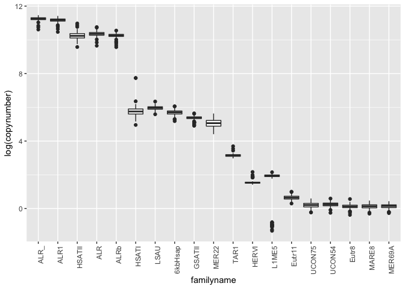
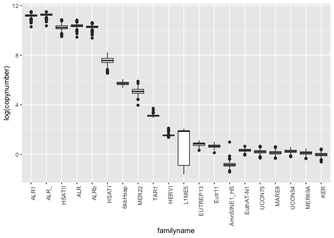
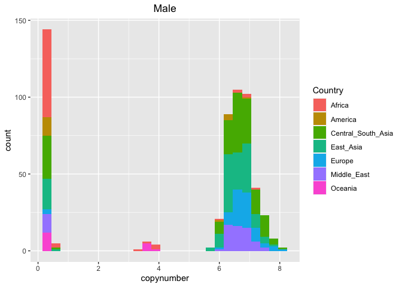
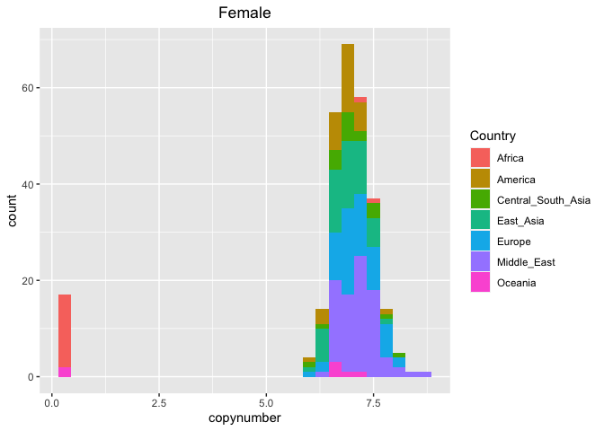
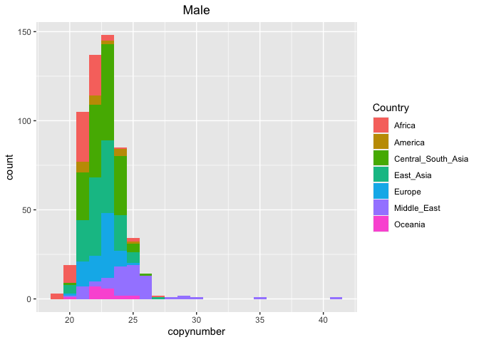
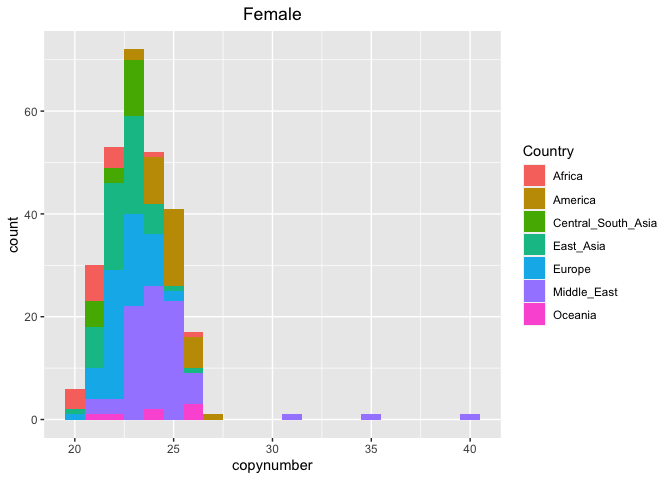
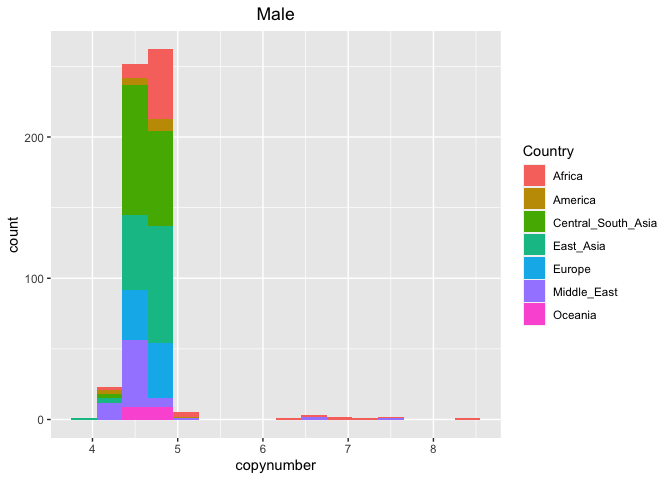
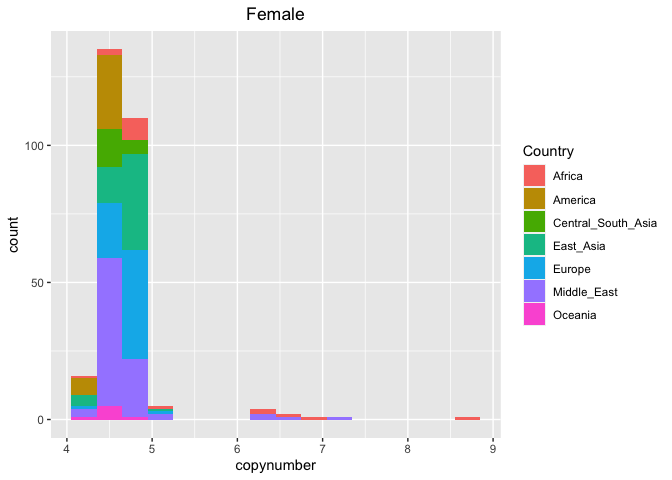

Analyzing the TEs with the highest relative or absolute difference
between their minimum and maximum abundance estimate
================

# Unbiased Population Variation of Human Transposable Elements - Script 1

This is the first script written by me, Riccardo. This script works with
the version of the HGDP dataset created in Script 2 by Florian. We
perform all analyses separately for males and females, as we established
that there are significant differences between the sexes in Script 5
from Florian.

``` r
library(tidyverse)
```

    ## ── Attaching packages ─────────────────────────────────────── tidyverse 1.3.2 ──
    ## ✔ ggplot2 3.3.6      ✔ purrr   0.3.4 
    ## ✔ tibble  3.1.8      ✔ dplyr   1.0.10
    ## ✔ tidyr   1.2.1      ✔ stringr 1.4.1 
    ## ✔ readr   2.1.2      ✔ forcats 0.5.2 
    ## ── Conflicts ────────────────────────────────────────── tidyverse_conflicts() ──
    ## ✖ dplyr::filter() masks stats::filter()
    ## ✖ dplyr::lag()    masks stats::lag()

``` r
#setwd(~/human-data)
HGDPcutoff<-read_delim("/Users/rpianezza/TE/summary-HGDP/USEME_HGDP_complete_reflib6.2_mq10_batchinfo_cutoff0.01.txt",comment="#")
```

    ## Rows: 1394352 Columns: 10
    ## ── Column specification ────────────────────────────────────────────────────────
    ## Delimiter: ","
    ## chr (7): ID, Pop, sex, Country, type, familyname, batch
    ## dbl (3): length, reads, copynumber
    ## 
    ## ℹ Use `spec()` to retrieve the full column specification for this data.
    ## ℹ Specify the column types or set `show_col_types = FALSE` to quiet this message.

``` r
names(HGDPcutoff)<-c("ID","Pop","sex","Country","type","familyname","length","reads","copynumber","batch")

fTE<-subset(HGDPcutoff, sex=="female" & type=="te")
mTE<-subset(HGDPcutoff, sex=="male" & type=="te")
```

The idea of this code is to plot the **general distribution of TE
abundance** estimates in a boxplot. First I will perform the analysis on
the female subset, later on the male subset using the same settings.

Looking at this plot for all 965 TEs seems excessive (and not
informative), so I created a subset. First, I identify the **minimum**,
**mean** and **maximum** value for each TE sequence. This code chunk
creates a data frame containing respectively the name of the TE and its
minimum, mean and maximum value in the female subset of the data set.
Everything containing minimum, mean and maximum value for each TE is
named from now `MMM`.

``` r
TEnames <- unique(fTE$familyname)
f_MMM<-c()
for (i in TEnames){
  f_MMM<-c(f_MMM,min(fTE$copynumber[fTE$familyname==i]), mean(fTE$copynumber[fTE$familyname==i]), max(fTE$copynumber[fTE$familyname==i]))}
f_MMM_matrix<-matrix(f_MMM,ncol=3,byrow=T)
f_MMM_frame<-data.frame(TEnames,f_MMM_matrix)
names(f_MMM_frame)<-c('tenames','min','mean','max')
```

This analysis was done for both a **relative** and an **absolute**
comparison.

## Relative comparison

### Females

From the whole dataset, I want to create a subset containing only the
TEs with the highest relative differences between minimum and maximum
value. I only kept TEs which satisfy these conditions:

- The **Fold difference** between the minimum and the maximum copy
  number value should be greater than a chosen values (es. 2)
- The **Fold difference** must be lower than `Infinite` as otherwise
  this caused some issues
- The **maximum** should be greater than a specific value (es. 1.5).
  This condition has been added to avoid TEs with high fold-difference
  but very low copynumber. For example, a TE with `max` copynumber of
  0.4 and `min` copynumber of 0.1 met the condition of “fold difference
  \> 2”, but it’s not informative at all.

``` r
outlierTEnames<-f_MMM_frame$tenames[f_MMM_frame$max/f_MMM_frame$min>2 & f_MMM_frame$max/f_MMM_frame$min<Inf & f_MMM_frame$max>1.5]
```

For the production of the plot we do want all values of the respective
TE, and not just its minimum and maxmimum value. Thus, we need to create
a subset of the full dataset containing only the TEs with the **highest
fold difference** between minimum and maximum value. As we already have
a vector containing the names of the TEs we want for the female dataset,
we just need to subset the dataset. Then we order the dataset and make
sure that the order is correctly displayed in the follwoing plot.

``` r
fTEoutlier<-fTE[fTE$familyname %in% outlierTEnames,]
fTEoutlier_order<-fTEoutlier[order(fTEoutlier$copynumber,decreasing=T),]
fTEoutlier_order$familyname<-factor(fTEoutlier_order$familyname,levels=unique(fTEoutlier_order$familyname))
```

Now we have a dataset containing only the TEs with the highest
differences in abundance between minimum and maximum value.

``` r
ggplot(fTEoutlier_order,aes(x=familyname,y=log(copynumber)))+geom_boxplot(notch=F)+
  theme(axis.text.x = element_text(angle = 90, hjust = 1)) 
```

<!-- -->

### Males

``` r
m_MMM<-c()
for (i in TEnames){
  m_MMM<-c(m_MMM, min(mTE$copynumber[mTE$familyname==i]), mean(mTE$copynumber[mTE$familyname==i]),max(mTE$copynumber[mTE$familyname==i]))}
m_MMM_matrix<-matrix(m_MMM,ncol=3,byrow=T)
m_MMM_frame<-data.frame(TEnames,m_MMM_matrix)
names(m_MMM_frame)<-c('tenames','min','mean','max')
```

I used a 5-fold cutoff in this case to have a roughly similar number of
TEs as in the plot for females.

``` r
outlierTEnames<-m_MMM_frame$tenames[m_MMM_frame$max/m_MMM_frame$min>2 & m_MMM_frame$max/m_MMM_frame$min<Inf & m_MMM_frame$max>1.5]
mTEoutlier<-mTE[mTE$familyname %in% outlierTEnames,]
mTEoutlier_order<-mTEoutlier[order(mTEoutlier$copynumber,decreasing=T),]
mTEoutlier_order$familyname<-factor(mTEoutlier_order$familyname,levels=unique(mTEoutlier_order$familyname))

ggplot(mTEoutlier_order,aes(x=familyname,y=log(copynumber)))+geom_boxplot(notch=F)+
  theme(axis.text.x = element_text(angle = 90, hjust = 1)) 
```

<!-- -->

### L1ME5

The LINE1 variant **L1ME5** appears in both female and male plots as one
of the TEs with the highest variance. I here I look in details at its
distribution in the two datasets.

``` r
fL1ME5<-fTEoutlier_order[fTEoutlier_order$familyname=='L1ME5',]
mL1ME5<-mTEoutlier_order[mTEoutlier_order$familyname=='L1ME5',]
```

``` r
ggplot(data = mL1ME5, mapping = aes(x = copynumber, fill = Country)) +
  ggtitle("Male") + theme(plot.title = element_text(hjust = 0.5)) +
  geom_histogram(binwidth = 0.3)
```

<!-- -->

``` r
ggplot(data = fL1ME5, mapping = aes(x = copynumber, fill = Country)) +
  ggtitle("Female") + theme(plot.title = element_text(hjust = 0.5)) +
  geom_histogram(binwidth = 0.3)
```

<!-- -->

#### Sex distribution

We notice a clear separation in both sexes between low copynumber and
high copynumber individuals. Relatively to the females, there are much
more male with low copy number.

Remember that in the script 5, Florian shows that females has higher
copynumber relative to males for this TE.

#### Geographic distribution

We can see a very interesting pattern. Almost every **african**
individual has very low copy number, while the high copynumber
individuals are almost all **out of Africa** (OOA).

I think this is consistent with a model in which there was a strong
bottleneck due to a migration OOU by a small population around 60.000
years ago. It is known that TEs are usually spreading faster in
bottlenecked populations. Thus, we can speculate that at least one big
L1ME5 invasion was triggered after the OOU.

In some way, this invasion ignored some Y chromosome but hit almost
every X chromosome. This would explain the “mixed” geographic
distribution that we see in males with low copynumber. In other words,
we still have many males with few insertions because the Y chromosome is
almost “free”, while only the african females has low copynumber, and
all the OOU females have high copynumber due to the invasion.

Now, the idea is to see if also other TEs which show high variance among
the data are following similar patterns.

### TAR1

``` r
fTAR1<-fTEoutlier_order[fTEoutlier_order$familyname=='TAR1',]
mTAR1<-mTEoutlier_order[mTEoutlier_order$familyname=='TAR1',]

ggplot(data = mTAR1, mapping = aes(x = copynumber, fill = Country)) +
  ggtitle("Male") + theme(plot.title = element_text(hjust = 0.5)) +
  geom_histogram(binwidth = 1)
```

<!-- -->

``` r
ggplot(data = fTAR1, mapping = aes(x = copynumber, fill = Country)) +
  ggtitle("Female") + theme(plot.title = element_text(hjust = 0.5)) +
  geom_histogram(binwidth = 1)
```

<!-- -->
This plots, showing the distribution of **TAR1** copynumbers, are going
in the same direction as previously seen for L1ME5. All the africans
individuals are in the lower copynumber size of the distribution, while
the individuals with high copy number are usually OOU. This time we
don’t notice strong differences among the two sexes. We notice a
possible invasion in Middle East populations (?), with high copynumber
individuals of both sexes.

### HERVI

``` r
f<-fTEoutlier_order[fTEoutlier_order$familyname=='HERVI',]
m<-mTEoutlier_order[mTEoutlier_order$familyname=='HERVI',]

ggplot(data = m, mapping = aes(x = copynumber, fill = Country)) +
  ggtitle("Male") + theme(plot.title = element_text(hjust = 0.5)) +
  geom_histogram(binwidth = 0.3)
```

<!-- -->

``` r
ggplot(data = f, mapping = aes(x = copynumber, fill = Country)) +
  ggtitle("Female") + theme(plot.title = element_text(hjust = 0.5)) +
  geom_histogram(binwidth = 0.3)
```

<!-- -->
For **HERVI**, we see something against the tide. The african
individuals are not in the lower-copynumber part of the distribution,
but more in the middle, in both sexes. We also see possible invasion(s)
in african as well as middle-east populations, since there are
individuals with high copynumber in these groups for both sexes.

It could be interesting to identify the exact origin of these
individuals with high copynumber (maybe they are part of small or
bottlenecked populations as well?). HERV-K are considered the most
active human endogenous retroviruses.

### Other TE

I used this code to investigate every TE contained in the outlier subset
one-by-one. Just remove the `#` and insert the TE family name in the
first 2 lines of code. Anyway, the only informative distributions I
found are shown above. I excluded from the investigations the
satellites.

**Parameters** used to extrapolate the subset of investigated TEs:
**fold-difference \> 2**, **max \> 1.5**.

``` r
#f<-fTEoutlier_order[fTEoutlier_order$familyname=='',]
#m<-mTEoutlier_order[mTEoutlier_order$familyname=='',]

#ggplot(data = m, mapping = aes(x = copynumber, fill = Country)) +
  #ggtitle("Male") + theme(plot.title = element_text(hjust = 0.5)) +
  #geom_histogram(binwidth = 0.1)

#ggplot(data = f, mapping = aes(x = copynumber, fill = Country)) +
  #ggtitle("Female") + theme(plot.title = element_text(hjust = 0.5)) +
  #geom_histogram(binwidth = 0.1)
```

## Absolute comparison

### Females

We use the same dataset for the mean, minimum and maximum values as
those do not change. The only thing that changes is our definition of
**outliers**. Instead of a relative fold-difference between the minimum
and maximum value, we now want to use an absolute value of maximum copy
number vs minimum copy number as a threshold. Again, experimenting with
the value will lead to the inclusion of more or less TEs in the plot.

``` r
outlierTEnames<-f_MMM_frame$tenames[f_MMM_frame$max-f_MMM_frame$min>200 & f_MMM_frame$max-f_MMM_frame$min<Inf]
fTEoutlier<-fTE[fTE$familyname %in% outlierTEnames,]
fTEoutlierorder<-fTEoutlier[order(fTEoutlier$copynumber,decreasing=T),]
fTEoutlierorder$familyname<-factor(fTEoutlierorder$familyname,levels=unique(fTEoutlierorder$familyname))

ggplot(fTEoutlierorder,aes(x=familyname,y=log(copynumber)))+geom_boxplot(notch=F)+
  theme(axis.text.x = element_text(angle = 90, hjust = 1)) 
```

<!-- -->

### Males

``` r
outlierTEnames<-m_MMM_frame$tenames[m_MMM_frame$max-m_MMM_frame$min>200 & m_MMM_frame$max-m_MMM_frame$min<Inf]
mTEoutlier<-mTE[mTE$familyname %in% outlierTEnames,]
mTEoutlierorder<-mTEoutlier[order(mTEoutlier$copynumber,decreasing=T),]
mTEoutlierorder$familyname<-factor(mTEoutlierorder$familyname,levels=unique(mTEoutlierorder$familyname))

ggplot(mTEoutlierorder,aes(x=familyname,y=log(copynumber)))+geom_boxplot(notch=F)+
  theme(axis.text.x = element_text(angle = 90, hjust = 1)) 
```

<!-- -->

My general issue with this whole series of plots is that we show the TEs
with the highest differences, but do these actually represent the TEs
that are most variable within/between the populations? And if not, what
is a better analyses to focus on the TEs whose variations in copy
numbers are the most interesting?
