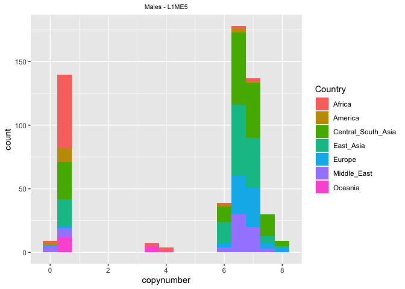

Analyzing the TEs with the highest relative difference between their
minimum and maximum abundance estimate
================

This is the second script written by me, Riccardo. This script works
with the version of the HGDP dataset created in Script 2 by Florian. We
perform all analyses separately for males and females, as we established
that there are significant differences between the sexes in Script 5
from Florian.

``` r
library(tidyverse)
```

    ## ── Attaching packages ─────────────────────────────────────── tidyverse 1.3.2 ──
    ## ✔ ggplot2 3.3.6      ✔ purrr   0.3.4 
    ## ✔ tibble  3.1.8      ✔ dplyr   1.0.10
    ## ✔ tidyr   1.2.1      ✔ stringr 1.4.1 
    ## ✔ readr   2.1.2      ✔ forcats 0.5.2 
    ## ── Conflicts ────────────────────────────────────────── tidyverse_conflicts() ──
    ## ✖ dplyr::filter() masks stats::filter()
    ## ✖ dplyr::lag()    masks stats::lag()

``` r
library("ggpubr")
#setwd(~/human-data)
HGDPcutoff<-read_delim("/Users/rpianezza/TE/summary-HGDP/USEME_HGDP_complete_reflib6.2_mq10_batchinfo_cutoff0.01.txt",comment="#")
```

    ## Rows: 1394352 Columns: 10
    ## ── Column specification ────────────────────────────────────────────────────────
    ## Delimiter: ","
    ## chr (7): ID, Pop, sex, Country, type, familyname, batch
    ## dbl (3): length, reads, copynumber
    ## 
    ## ℹ Use `spec()` to retrieve the full column specification for this data.
    ## ℹ Specify the column types or set `show_col_types = FALSE` to quiet this message.

``` r
names(HGDPcutoff)<-c("ID","Pop","sex","Country","type","familyname","length","reads","copynumber","batch")

fTE<-subset(HGDPcutoff, sex=="female" & type=="te")
mTE<-subset(HGDPcutoff, sex=="male" & type=="te")
```

The idea of the first part of the code is to plot the **general
distribution of TE abundance** estimates in a boxplot. First I will
perform the analysis on the female subset, later on the male subset
using the same settings.

Looking at this plot for all 965 TEs seems excessive (and not
informative), so I created a subset. First, I identify the **minimum**,
**mean** and **maximum** value for each TE sequence. This code chunk
creates a data frame containing respectively the name of the TE and its
minimum, mean and maximum value in the female subset of the data set.
Everything containing minimum, mean and maximum value for each TE is
named from now `MMM`.

``` r
TEnames <- unique(fTE$familyname)
f_MMM<-c()
for (i in TEnames){
  f_MMM<-c(f_MMM,min(fTE$copynumber[fTE$familyname==i]), mean(fTE$copynumber[fTE$familyname==i]), max(fTE$copynumber[fTE$familyname==i]))}
f_MMM_matrix<-matrix(f_MMM,ncol=3,byrow=T)
f_MMM_frame<-data.frame(TEnames,f_MMM_matrix)
names(f_MMM_frame)<-c('tenames','min','mean','max')
```

## Females

From the whole dataset, I want to create a subset containing only the
TEs with the highest relative differences between minimum and maximum
value. I only kept TEs which satisfy these conditions:

- The **Fold difference** between the minimum and the maximum copy
  number value should be greater than a chosen values (2, in this case)
- The **Fold difference** must be lower than `Infinite` as otherwise
  this caused some issues
- The **maximum** should be greater than a specific value (1.5, in this
  case). This condition has been added to avoid TEs with high
  fold-difference but very low copynumber. For example, a TE with `max`
  copynumber of 0.4 and `min` copynumber of 0.1 met the condition of
  “fold difference \> 2”, but it’s not informative at all.

``` r
outlierTEnames<-f_MMM_frame$tenames[f_MMM_frame$max/f_MMM_frame$min>2 & f_MMM_frame$max/f_MMM_frame$min<Inf & f_MMM_frame$max>1.5]
```

For the production of the plot we do want all values of the respective
TE, and not just its minimum and maxmimum value. Thus, we need to create
a subset of the full dataset containing only the TEs with the **highest
fold difference** between minimum and maximum value. As we already have
a vector containing the names of the TEs we want for the female dataset,
we just need to subset the dataset. Then we order the dataset and make
sure that the order is correctly displayed in the follwoing plot.

``` r
fTEoutlier<-fTE[fTE$familyname %in% outlierTEnames,]
fTEoutlier_order<-fTEoutlier[order(fTEoutlier$copynumber,decreasing=T),]
fTEoutlier_order$familyname<-factor(fTEoutlier_order$familyname,levels=unique(fTEoutlier_order$familyname))
```

Now we have a dataset containing only the TEs with the highest
differences in abundance between minimum and maximum value.

``` r
ggplot(fTEoutlier_order,aes(x=familyname,y=log(copynumber)))+geom_boxplot(notch=F)+
  theme(axis.text.x = element_text(angle = 90, hjust = 1)) 
```

<!-- -->

## Males

``` r
m_MMM<-c()
for (i in TEnames){
  m_MMM<-c(m_MMM, min(mTE$copynumber[mTE$familyname==i]), mean(mTE$copynumber[mTE$familyname==i]),max(mTE$copynumber[mTE$familyname==i]))}
m_MMM_matrix<-matrix(m_MMM,ncol=3,byrow=T)
m_MMM_frame<-data.frame(TEnames,m_MMM_matrix)
names(m_MMM_frame)<-c('tenames','min','mean','max')
```

``` r
outlierTEnames<-m_MMM_frame$tenames[m_MMM_frame$max/m_MMM_frame$min>2 & m_MMM_frame$max/m_MMM_frame$min<Inf & m_MMM_frame$max>1.5]
mTEoutlier<-mTE[mTE$familyname %in% outlierTEnames,]
mTEoutlier_order<-mTEoutlier[order(mTEoutlier$copynumber,decreasing=T),]
mTEoutlier_order$familyname<-factor(mTEoutlier_order$familyname,levels=unique(mTEoutlier_order$familyname))

ggplot(mTEoutlier_order,aes(x=familyname,y=log(copynumber)))+geom_boxplot(notch=F)+
  theme(axis.text.x = element_text(angle = 90, hjust = 1)) 
```

<!-- -->

## Details for each relevant TE

In this section I go in details analyzing the **copynumber geographical
distribution** for the TE families previously selected in the subsets. I
decided to perform the analysis only for the sequences not previously
found in script 1.

First, I analysed the difference between the two sex-related subsets. I
found that the **females** dataset (`fTEoutlier_order`) has 19 different
`familyname`, while the **males** has 20. There are 3 sequence families
present in the females and not in the males:

- `LSAU`
- `GSATII`
- `Eutr8`

And 4 sequence families present in the males and not in the females:

- `EUTREP13`
- `AmnSINE1_HS`
- `EuthAT-N1`
- `KER`

``` r
f_familynames <- fTEoutlier_order$familyname
m_familynames <- mTEoutlier_order$familyname

# TEs present in the female subset and not in the males
length(unique(f_familynames))
```

    ## [1] 19

``` r
setdiff(f_familynames,m_familynames)
```

    ## [1] "LSAU"   "GSATII" "Eutr8"

``` r
# TEs present in the male subset and not in the females
length(unique(m_familynames))
```

    ## [1] 20

``` r
setdiff(m_familynames,f_familynames)
```

    ## [1] "EUTREP13"    "AmnSINE1_HS" "EuthAT-N1"   "KER"

### Non-LTR retrotransposons

#### LINE-1

The LINE1 variant **L1ME5** appears in both female and male plots as one
of the TEs with the highest variance. I here I look in details at its
distribution in the two datasets.

``` r
fL1ME5<-fTEoutlier_order[fTEoutlier_order$familyname=='L1ME5',]
mL1ME5<-mTEoutlier_order[mTEoutlier_order$familyname=='L1ME5',]
```

``` r
ggplot(data = mL1ME5, mapping = aes(x = copynumber, fill = Country)) +
  ggtitle("L1ME5 - Male") + theme(plot.title = element_text(hjust = 0.5)) +
  geom_histogram(binwidth = 0.3)
```

<!-- -->

``` r
ggplot(data = fL1ME5, mapping = aes(x = copynumber, fill = Country)) +
  ggtitle("L1ME5 - Female") + theme(plot.title = element_text(hjust = 0.5)) +
  geom_histogram(binwidth = 0.3)
```

<!-- -->

**Sex distribution**: we notice a clear separation in both sexes between
low copynumber and high copynumber individuals. Relatively to the
females, there are much more male with low copy number.

In script 5, Florian shows that females has higher copynumber relative
to males for this TE.

**Geographic distribution**: we can see a very interesting pattern.
Almost every **african** individual has very low copy number, while the
high copynumber individuals are almost all **out of Africa** (OOA).

I think this is consistent with a model in which there was a strong
bottleneck due to a migration OOU by a small population around 60.000
years ago. It is known that TEs are usually spreading faster in
bottlenecked populations. Thus, we can speculate that at least one big
L1ME5 invasion was triggered after the OOU.

In some way, it seems that this invasion ignored some Y chromosomes but
hit almost every X chromosomes. This would explain the “mixed”
geographic distribution that we see in males with low copynumber. In
other words, we still have many males with few insertions because the Y
chromosome is almost “free”, while only the african females has low
copynumber, and all the OOU females have high copynumber due to the
invasion. An alternative explanation would be that the number of females
we have in our dataset is not significant enough to define this pattern
with certainty.

#### AmnSINE_Hs

``` r
fAmnSINE_Hs<-fTE[fTE$familyname=='AmnSINE1_HS',]
mAmnSINE_Hs<-mTEoutlier_order[mTEoutlier_order$familyname=='AmnSINE1_HS',]
```

``` r
ggplot(data = mAmnSINE_Hs, mapping = aes(x = copynumber, fill = Country)) +
  ggtitle("AmnSINE_Hs - Male") + theme(plot.title = element_text(hjust = 0.5)) +
  geom_histogram(binwidth = 0.3)
```

<!-- -->

``` r
ggplot(data = fAmnSINE_Hs, mapping = aes(x = copynumber, fill = Country)) +
  ggtitle("AmnSINE_Hs - Female") + theme(plot.title = element_text(hjust = 0.5)) +
  geom_histogram(binwidth = 0.3)
```

<!-- -->
This sequence entered the dataset only for 1 outliers, seen in the male
plot from `Central South Asia`. I think this is not interesting.

### Endogenous retroviruses

`EUTREP13` and `HERVI`.

``` r
# EUTREP13
fEUTREP13<-fTE[fTE$familyname=='EUTREP13',]
mEUTREP13<-mTEoutlier_order[mTEoutlier_order$familyname=='EUTREP13',]

fEUTREP13_plot<-ggplot(data = fEUTREP13, mapping = aes(x = copynumber, fill = Country)) +
  ggtitle("EUTREP13") + theme(plot.title = element_text(hjust = 0.5)) +
  geom_histogram(binwidth = 0.3)

mEUTREP13_plot<-ggplot(data = mEUTREP13, mapping = aes(x = copynumber, fill = Country)) +
  ggtitle("EUTREP13") + theme(plot.title = element_text(hjust = 0.5)) +
  geom_histogram(binwidth = 0.3)

# HERV1
fHERVI<-fTEoutlier_order[fTEoutlier_order$familyname=='HERVI',]
mHERVI<-mTEoutlier_order[mTEoutlier_order$familyname=='HERVI',]

fHERVI_plot<-ggplot(data = fHERVI, mapping = aes(x = copynumber, fill = Country)) +
  ggtitle("HERVI") + theme(plot.title = element_text(hjust = 0.5)) +
  geom_histogram(binwidth = 0.3)

mHERVI_plot<-ggplot(data = mHERVI, mapping = aes(x = copynumber, fill = Country)) +
  ggtitle("HERVI") + theme(plot.title = element_text(hjust = 0.5)) +
  geom_histogram(binwidth = 0.3)
```

``` r
m_ERV_figure <- ggarrange(mHERVI_plot, mEUTREP13_plot, ncol = 1, nrow = 2, common.legend = TRUE, legend = "right", align = "hv", font.label = list(size = 10, color = "black", face = "bold", family = NULL, position = "top"))

m_ERV_final <- annotate_figure(m_ERV_figure, left = text_grob("Count", color = "black", rot = 90), bottom = text_grob("Copynumber", color = "black"), top = text_grob("Males", color = "black", size = 20), fig.lab = "")


f_ERV_figure <- ggarrange(fHERVI_plot, fEUTREP13_plot, ncol = 1, nrow = 2, common.legend = TRUE, legend = "right", align = "hv", font.label = list(size = 10, color = "black", face = "bold", family = NULL, position = "top"))

f_ERV_final <- annotate_figure(f_ERV_figure, left = text_grob("Count", color = "black", rot = 90), bottom = text_grob("Copynumber", color = "black"), top = text_grob("Females", color = "black", size = 20), fig.lab = "")

f_ERV_final
```

<!-- -->

``` r
m_ERV_final
```

<!-- -->

For **HERVI**, we see something against the tide. The african
individuals are not in the lower-copynumber part of the distribution,
but more in the middle, in both sexes. We also see possible invasion(s)
in african as well as middle-east populations, since there are
individuals with high copynumber in these groups for both sexes.

It could be interesting to identify the exact origin of these
individuals with high copynumber (maybe they are part of small or
bottlenecked populations as well?). HERV-K are considered the most
active human endogenous retroviruses.

I don’t think that for `EUTREP13` we can deduce somthing interesting
from this plot.

### DNA transposons

`Eutr8`, `EuthAT-N1` and `MER69A`.

``` r
# Eutr8
fEutr8<-fTEoutlier_order[fTEoutlier_order$familyname=='Eutr8',]
mEutr8<-mTE[mTE$familyname=='Eutr8',]

fEutr8_plot<-ggplot(data = fEutr8, mapping = aes(x = copynumber, fill = Country)) +
  ggtitle("Eutr8") + theme(plot.title = element_text(hjust = 0.5)) +
  geom_histogram(binwidth = 0.3) + theme(axis.title.x=element_blank(), axis.title.y=element_blank())

mEutr8_plot<-ggplot(data = mEutr8, mapping = aes(x = copynumber, fill = Country)) +
  ggtitle("Eutr8") + theme(plot.title = element_text(hjust = 0.5)) +
  geom_histogram(binwidth = 0.3) + theme(axis.title.x=element_blank(), axis.title.y=element_blank())

# EuthAT-N1
fEuthAT_N1<-fTE[fTE$familyname=='EuthAT-N1',]
mEuthAT_N1<-mTEoutlier_order[mTEoutlier_order$familyname=='EuthAT-N1',]

fEuthAT_N1_plot<-ggplot(data = fEuthAT_N1, mapping = aes(x = copynumber, fill = Country)) +
  ggtitle("EuthAT-N1") + theme(plot.title = element_text(hjust = 0.5)) +
  geom_histogram(binwidth = 0.3) + theme(axis.title.x=element_blank(), axis.title.y=element_blank())

mEuthAT_N1_plot<-ggplot(data = mEuthAT_N1, mapping = aes(x = copynumber, fill = Country)) +
  ggtitle("EuthAT-N1") + theme(plot.title = element_text(hjust = 0.5)) +
  geom_histogram(binwidth = 0.3) + theme(axis.title.x=element_blank(), axis.title.y=element_blank())

# MER69A
fMER69A<-fTEoutlier_order[fTEoutlier_order$familyname=='MER69A',]
mMER69A<-mTEoutlier_order[mTEoutlier_order$familyname=='MER69A',]

fMER69A_plot<-ggplot(data = fMER69A, mapping = aes(x = copynumber, fill = Country)) +
  ggtitle("MER69A") + theme(plot.title = element_text(hjust = 0.5)) +
  geom_histogram(binwidth = 0.3) + theme(axis.title.x=element_blank(), axis.title.y=element_blank())

mMER69A_plot<-ggplot(data = mMER69A, mapping = aes(x = copynumber, fill = Country)) +
  ggtitle("MER69A") + theme(plot.title = element_text(hjust = 0.5)) +
  geom_histogram(binwidth = 0.3) + theme(axis.title.x=element_blank(), axis.title.y=element_blank())
```

``` r
m_DNA_figure <- ggarrange(mEutr8_plot, mEuthAT_N1_plot, mMER69A_plot, ncol = 1, nrow = 3, common.legend = TRUE, legend = "right", align = "hv", font.label = list(size = 10, color = "black", face = "bold", family = NULL, position = "top"))

m_DNA_final <- annotate_figure(m_DNA_figure, left = text_grob("Count", color = "black", rot = 90), bottom = text_grob("Copynumber", color = "black"), top = text_grob("Males", color = "black", size = 20), fig.lab = "")


f_DNA_figure <- ggarrange(fEutr8_plot, fEuthAT_N1_plot, fMER69A_plot, ncol = 1, nrow = 3, common.legend = TRUE, legend = "right", align = "hv", font.label = list(size = 10, color = "black", face = "bold", family = NULL, position = "top"))

f_DNA_final <- annotate_figure(f_DNA_figure, left = text_grob("Count", color = "black", rot = 90), bottom = text_grob("Copynumber", color = "black"), top = text_grob("Females", color = "black", size = 20), fig.lab = "")

f_DNA_final
```

<!-- -->

``` r
m_DNA_final
```

<!-- -->

The copynumber for these 3 DNA transposons is not changing that much. I
can only note that the **africans** are always less abundant in the
right part of the plots. In other words, they have lower copynumber in
general.

### Not classified repseq

There are some sequences which are included in RepBase but that are not
characterized yet. In our subset we have: `Eutr11`, `UCON75`, `UCON54`,
`MARE8`. See <https://www.ncbi.nlm.nih.gov/pmc/articles/PMC5753468/> for
more information.

``` r
# Eutr11
fEutr11<-fTEoutlier_order[fTEoutlier_order$familyname=='Eutr11',]
mEutr11<-mTEoutlier_order[mTEoutlier_order$familyname=='Eutr11',]

fEutr11_plot<-ggplot(data = fEutr11, mapping = aes(x = copynumber, fill = Country)) +
  ggtitle("Eutr11") + theme(plot.title = element_text(hjust = 0.5)) +
  geom_histogram(binwidth = 0.3) + theme(axis.title.x=element_blank(), axis.title.y=element_blank())

mEutr11_plot<-ggplot(data = mEutr11, mapping = aes(x = copynumber, fill = Country)) +
  ggtitle("Eutr11") + theme(plot.title = element_text(hjust = 0.5)) +
  geom_histogram(binwidth = 0.3) + theme(axis.title.x=element_blank(), axis.title.y=element_blank())

# UCON75
fUCON75<-fTEoutlier_order[fTEoutlier_order$familyname=='UCON75',]
mUCON75<-mTEoutlier_order[mTEoutlier_order$familyname=='UCON75',]

fUCON75_plot<-ggplot(data = fUCON75, mapping = aes(x = copynumber, fill = Country)) +
  ggtitle("UCON75") + theme(plot.title = element_text(hjust = 0.5)) +
  geom_histogram(binwidth = 0.3) + theme(axis.title.x=element_blank(), axis.title.y=element_blank())

mUCON75_plot<-ggplot(data = mUCON75, mapping = aes(x = copynumber, fill = Country)) +
  ggtitle("UCON75") + theme(plot.title = element_text(hjust = 0.5)) +
  geom_histogram(binwidth = 0.3) + theme(axis.title.x=element_blank(), axis.title.y=element_blank())

# UCON54
fUCON54<-fTEoutlier_order[fTEoutlier_order$familyname=='UCON54',]
mUCON54<-mTEoutlier_order[mTEoutlier_order$familyname=='UCON54',]

fUCON54_plot<-ggplot(data = fUCON54, mapping = aes(x = copynumber, fill = Country)) +
  ggtitle("UCON54") + theme(plot.title = element_text(hjust = 0.5)) +
  geom_histogram(binwidth = 0.3) + theme(axis.title.x=element_blank(), axis.title.y=element_blank())

mUCON54_plot<-ggplot(data = mUCON54, mapping = aes(x = copynumber, fill = Country)) +
  ggtitle("UCON54") + theme(plot.title = element_text(hjust = 0.5)) +
  geom_histogram(binwidth = 0.3) + theme(axis.title.x=element_blank(), axis.title.y=element_blank())

# MARE8
fMARE8<-fTEoutlier_order[fTEoutlier_order$familyname=='MARE8',]
mMARE8<-mTEoutlier_order[mTEoutlier_order$familyname=='MARE8',]

fMARE8_plot<-ggplot(data = fMARE8, mapping = aes(x = copynumber, fill = Country)) +
  ggtitle("MARE8") + theme(plot.title = element_text(hjust = 0.5)) +
  geom_histogram(binwidth = 0.3) + theme(axis.title.x=element_blank(), axis.title.y=element_blank())

mMARE8_plot<-ggplot(data = mMARE8, mapping = aes(x = copynumber, fill = Country)) +
  ggtitle("MARE8") + theme(plot.title = element_text(hjust = 0.5)) +
  geom_histogram(binwidth = 0.3) + theme(axis.title.x=element_blank(), axis.title.y=element_blank())
```

``` r
m_NI_figure <- ggarrange(mEutr11_plot, mUCON75_plot, mUCON54_plot, mMARE8_plot, ncol = 2, nrow = 2, common.legend = TRUE, legend = "right", align = "hv", font.label = list(size = 10, color = "black", face = "bold", family = NULL, position = "top"))

m_NI_final <- annotate_figure(m_NI_figure, left = text_grob("Count", color = "black", rot = 90), bottom = text_grob("Copynumber", color = "black"), top = text_grob("Males", color = "black", size = 20), fig.lab = "")


f_NI_figure <- ggarrange(fEutr11_plot, fUCON75_plot, fUCON54_plot, fMARE8_plot, ncol = 2, nrow = 2, common.legend = TRUE, legend = "right", align = "hv", font.label = list(size = 10, color = "black", face = "bold", family = NULL, position = "top"))

f_NI_final <- annotate_figure(f_NI_figure, fUCON75_plot, left = text_grob("Count", color = "black", rot = 90), bottom = text_grob("Copynumber", color = "black"), top = text_grob("Females", color = "black", size = 20), fig.lab = "")

f_NI_final
```

<!-- -->

``` r
m_NI_final
```

<!-- -->
Their copynumber is not changing that much. I don’t think these are
relevant in our analysis.

### Satellites

I also performed the same analysis for the two **satellites** present in
the subdataset, `TAR1`and `GSATII`. Again, I’m not sure if satellites
are relevant in our analyses.

``` r
# TAR1
fTAR1<-fTEoutlier_order[fTEoutlier_order$familyname=='TAR1',]
mTAR1<-mTEoutlier_order[mTEoutlier_order$familyname=='TAR1',]

mTAR1_plot<-ggplot(data = mTAR1, mapping = aes(x = copynumber, fill = Country)) +
  ggtitle("TAR1") + theme(plot.title = element_text(hjust = 0.5)) +
  geom_histogram(binwidth = 1) + theme(axis.title.x=element_blank(), axis.title.y=element_blank())

fTAR1_plot<-ggplot(data = fTAR1, mapping = aes(x = copynumber, fill = Country)) +
  ggtitle("TAR1") + theme(plot.title = element_text(hjust = 0.5)) +
  geom_histogram(binwidth = 1) + theme(axis.title.x=element_blank(), axis.title.y=element_blank())

# GSATII
fGSATII<-fTEoutlier_order[fTEoutlier_order$familyname=='GSATII',]
mGSATII<-mTE[mTE$familyname=='GSATII',]

mGSATII_plot<-ggplot(data = mGSATII, mapping = aes(x = copynumber, fill = Country)) +
  ggtitle("GSATII") + theme(plot.title = element_text(hjust = 0.5)) +
  geom_histogram(binwidth = 10) + theme(axis.title.x=element_blank(), axis.title.y=element_blank())

fGSATII_plot<-ggplot(data = fGSATII, mapping = aes(x = copynumber, fill = Country)) +
  ggtitle("GSATII") + theme(plot.title = element_text(hjust = 0.5)) +
  geom_histogram(binwidth = 10) + theme(axis.title.x=element_blank(), axis.title.y=element_blank())
```

``` r
m_SAT_figure <- ggarrange(mTAR1_plot, mGSATII_plot, ncol = 1, nrow = 2, common.legend = TRUE, legend = "right", align = "hv", font.label = list(size = 10, color = "black", face = "bold", family = NULL, position = "top"))

m_SAT_final <- annotate_figure(m_SAT_figure, left = text_grob("Count", color = "black", rot = 90), bottom = text_grob("Copynumber", color = "black"), top = text_grob("Males", color = "black", size = 20), fig.lab = "")


f_SAT_figure <- ggarrange(fTAR1_plot, fGSATII_plot, ncol = 1, nrow = 2, common.legend = TRUE, legend = "right", align = "hv", font.label = list(size = 10, color = "black", face = "bold", family = NULL, position = "top"))

f_SAT_final <- annotate_figure(f_SAT_figure, fUCON75_plot, left = text_grob("Count", color = "black", rot = 90), bottom = text_grob("Copynumber", color = "black"), top = text_grob("Females", color = "black", size = 20), fig.lab = "")

f_SAT_final
```

<!-- -->

``` r
m_SAT_final
```

<!-- -->

- `TAR1`: **africans** are, as always, in the left part of the plot. We
  can also notice some individuals from `Middle East` with high
  copynumber in both sexes.
- `GSATII`: we see the **bimodal** distribution already noticed for many
  TEs. The geographical distribution pattern is also matched, as well as
  the sex-specific pattern. This is the only analysed satellite showing
  clearly this patterns.
