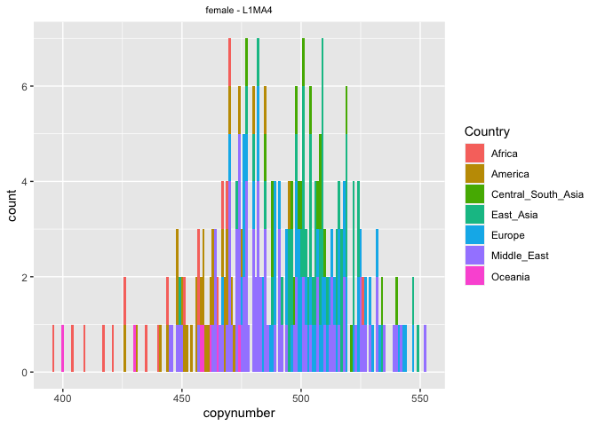
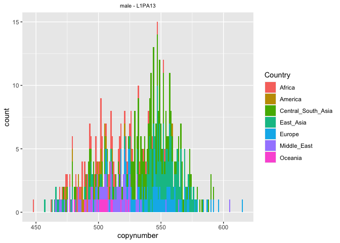
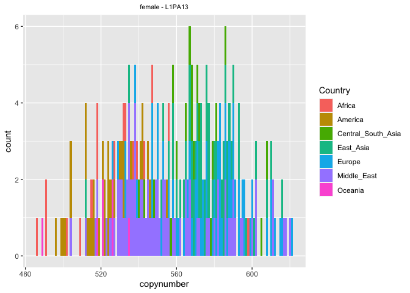
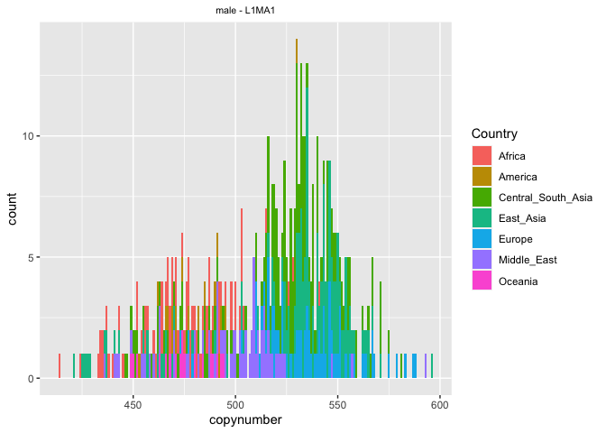
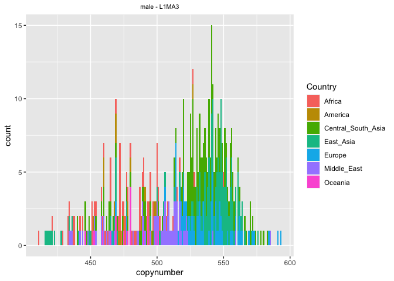
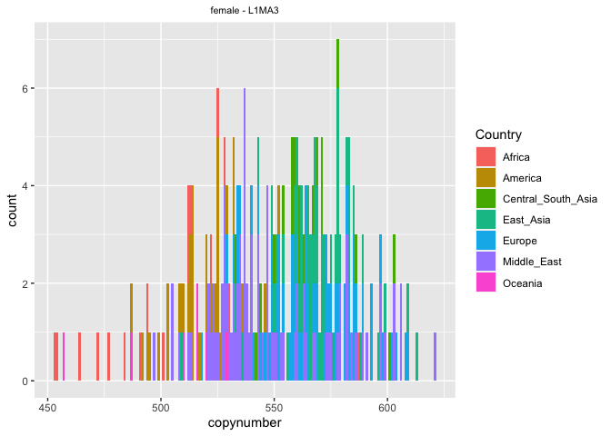

HGDP - Mining for other interesting TEs
================

This is the third script written by me, Riccardo. This script works with
the version of the HGDP dataset created in Script 2 by Florian. We
perform all analyses separately for males and females, as we established
that there are significant differences between the sexes in Script 5
from Florian.

``` r
library(tidyverse)
```

    ## ── Attaching packages ─────────────────────────────────────── tidyverse 1.3.2 ──
    ## ✔ ggplot2 3.3.6      ✔ purrr   0.3.4 
    ## ✔ tibble  3.1.8      ✔ dplyr   1.0.10
    ## ✔ tidyr   1.2.1      ✔ stringr 1.4.1 
    ## ✔ readr   2.1.2      ✔ forcats 0.5.2 
    ## ── Conflicts ────────────────────────────────────────── tidyverse_conflicts() ──
    ## ✖ dplyr::filter() masks stats::filter()
    ## ✖ dplyr::lag()    masks stats::lag()

``` r
library("ggpubr")
library("dplyr")
library("reticulate")

HGDPcutoff<-read_delim("/Users/rpianezza/TE/summary-HGDP/USEME_HGDP_complete_reflib6.2_mq10_batchinfo_cutoff0.01.txt",comment="#")
```

    ## Rows: 1394352 Columns: 10
    ## ── Column specification ────────────────────────────────────────────────────────
    ## Delimiter: ","
    ## chr (7): ID, Pop, sex, Country, type, familyname, batch
    ## dbl (3): length, reads, copynumber
    ## 
    ## ℹ Use `spec()` to retrieve the full column specification for this data.
    ## ℹ Specify the column types or set `show_col_types = FALSE` to quiet this message.

``` r
names(HGDPcutoff)<-c("ID","Pop","sex","Country","type","familyname","length","reads","copynumber","batch")

HGDP_<-read_delim("/Users/rpianezza/TE/summary-HGDP/nocutoff/HGDP_complete_reflib6.2_mq10_batchinfo.txt",comment="#")
```

    ## Rows: 1410083 Columns: 10
    ## ── Column specification ────────────────────────────────────────────────────────
    ## Delimiter: "\t"
    ## chr (7): HGDP00001, Brahui, male, Central_South_Asia, scg, chr1:916864-92101...
    ## dbl (3): 4152, 1051.8410596026488, 1.01525454783029
    ## 
    ## ℹ Use `spec()` to retrieve the full column specification for this data.
    ## ℹ Specify the column types or set `show_col_types = FALSE` to quiet this message.

``` r
names(HGDP_)<-c("ID","Pop","sex","Country","type","familyname","length","reads","copynumber","batch")
HGDP <- HGDP_ %>% mutate(Country = replace(Country, Country=="Oceania_(SGDP),Oceania", "Oceania"))
```

# Mining the dataset looking for other interesting TEs

The idea of this script is to play a bit with the thresholds used in the
firsts two scripts, looking for other TEs with interesting
distributions.

## List of previosly analysed TEs

First, I create a list containing all the `familyname` of the TEs
previously taken into account in my analyses. In total, I already found
and analyzed `58` TE.

``` r
TE_cutoff <- filter(HGDPcutoff, type=='te') %>% group_by(familyname, sex) %>% mutate(max=max(copynumber), min=min(copynumber)) %>% mutate(diff = max-min, ratio = max/min)

out1_abs <- filter(TE_cutoff, diff>200 & diff<Inf)
out1_rel <- filter(TE_cutoff, ratio>2 & ratio<Inf & max>1.5)

out1_abs_names <- c(unique(out1_abs$familyname))
out1_rel_names <- c(unique(out1_rel$familyname))
(out1_names <- c(out1_abs_names, out1_rel_names[!(out1_rel_names %in% out1_abs_names)]) %>% sort())
```

    ##  [1] "6kbHsap"     "ALR"         "ALR_"        "ALR1"        "ALR2"       
    ##  [6] "ALRa_"       "ALRb"        "ALU"         "AmnSINE1_HS" "CER"        
    ## [11] "EuthAT-N1"   "Eutr11"      "Eutr8"       "EUTREP13"    "GSATII"     
    ## [16] "HERVI"       "HSATI"       "HSATII"      "KER"         "L1"         
    ## [21] "L1HS"        "L1MC1"       "L1ME5"       "L1P_MA2"     "L1PA10"     
    ## [26] "L1PA15"      "L1PA16"      "L1PA3"       "L1PA4"       "L1PA6"      
    ## [31] "L1PA7"       "L1PA7_5"     "L1PA8"       "L1PB1"       "L1PB2"      
    ## [36] "L1PB2c"      "L1PB4"       "L1PREC1"     "L1PREC2"     "LSAU"       
    ## [41] "MARE8"       "MER2"        "MER22"       "MER69A"      "MLT1B"      
    ## [46] "MLT2A1"      "MLT2A2"      "MSTA"        "SVA_A"       "TAR1"       
    ## [51] "THE1_I"      "THE1A"       "THE1B"       "THE1C"       "THE1D"      
    ## [56] "TIGGER1"     "UCON54"      "UCON75"

## Playing with the thresholds

To not miss any possible interesting TE, here I use the file without the
**cutoff** at 0.1 copynumber for TEs, the one we used until now.

``` r
TE <- filter(HGDP, type=='te') %>% group_by(familyname, sex) %>% mutate(max=max(copynumber), min=min(copynumber)) %>% mutate(diff = max-min, ratio = max/min)
```

### Filter 1

``` r
all1 <- filter(TE, diff<200 & diff>150)
new1 <- filter(all1, !(familyname %in% out1_names))
(list1 <- unique(new1$familyname))
```

    ##  [1] "MER4A1" "L1MA4"  "LTR7A"  "L1PA13" "LTR12C" "L1MA1"  "L1MA3"  "ALRa"  
    ##  [9] "MER1B"  "MER9"

``` r
out2_names <- c(out1_names, list1) %>% sort()
```

### Filter 2

``` r
#Work in progress
ordered <- arrange(TE, desc(copynumber))
write.csv(ordered, "/Users/rpianezza/TE/ric-documentation-Rmd/ordered")
```

## Details for each relevant TE

``` r
plotTEfamily <- function(data, Sex, famname, binwidht, x_title, y_title, x_numbers, y_numbers){
filtered <- filter(data, familyname==famname, sex==Sex)
ggplot(data = filtered, mapping = aes(x = copynumber, fill = Country)) +
  geom_histogram(binwidth = binwidht) +
  ggtitle(paste0(Sex,' - ',famname)) + theme(plot.title = element_text(size = 8, hjust = 0.5)) +
  {if(x_title=='n'){
  theme(axis.title.x=element_blank())}} +
  {if(y_title=='n'){
  theme(axis.title.y=element_blank())}} +
  {if(x_numbers=='n'){
  theme(axis.text.x=element_blank(), axis.ticks.x=element_blank())}} +
  {if(y_numbers=='n'){
  theme(axis.text.y=element_blank(), axis.ticks.y=element_blank())}}
}
```

### Filter 1

Filtering for `diff<200` & `diff>150`, we exclude the TEs previously
found in script 1 but still with a significant variance. We found
`MER4A1`, `L1MA4`, `LTR7A`, `L1PA13`, `LTR12C`, `L1MA1`, `L1MA3`,
`ALRa`, `MER1B`, `MER9`. The LINEs among this list shows a pattern super
consistent to the one observed in previous scripts. The other sequences
do not look of particular interest.

``` r
plotTEfamily(TE, 'male', "L1MA4", 1, 'y', 'y', 'y', 'y') 
```

<!-- -->

``` r
plotTEfamily(TE, 'female', "L1MA4", 1, 'y', 'y', 'y', 'y')
```

<!-- -->

``` r
plotTEfamily(TE, 'male', "L1PA13", 1, 'y', 'y', 'y', 'y') 
```

<!-- -->

``` r
plotTEfamily(TE, 'female', "L1PA13", 1, 'y', 'y', 'y', 'y')
```

<!-- -->

``` r
plotTEfamily(TE, 'male', "L1MA1", 1, 'y', 'y', 'y', 'y') 
```

<!-- -->

``` r
plotTEfamily(TE, 'female', "L1MA1", 1, 'y', 'y', 'y', 'y')
```

<!-- -->

``` r
plotTEfamily(TE, 'male', "L1MA3", 1, 'y', 'y', 'y', 'y') 
```

<!-- -->

``` r
plotTEfamily(TE, 'female', "L1MA3", 1, 'y', 'y', 'y', 'y')
```

<!-- -->
