Geographic distribution by population for the most interesting TEs
================

This is the fourth script written by me, Riccardo. This script works
with the version of the HGDP dataset created in Script 2 by Florian. We
perform all analyses separately for males and females, as we established
that there are significant differences between the sexes in Script 5
from Florian.

The idea of this script is to analyze in details the distribution of the
more interesting TEs found in the first 2 scripts. In particular, I will
focus on the **geographical** distribution, taking into account not only
the **continent** as before, but also the **population** of the
specimens.

``` r
library(tidyverse)
```

    ## ── Attaching packages ─────────────────────────────────────── tidyverse 1.3.2 ──
    ## ✔ ggplot2 3.3.6      ✔ purrr   0.3.4 
    ## ✔ tibble  3.1.8      ✔ dplyr   1.0.10
    ## ✔ tidyr   1.2.1      ✔ stringr 1.4.1 
    ## ✔ readr   2.1.2      ✔ forcats 0.5.2 
    ## ── Conflicts ────────────────────────────────────────── tidyverse_conflicts() ──
    ## ✖ dplyr::filter() masks stats::filter()
    ## ✖ dplyr::lag()    masks stats::lag()

``` r
library("ggpubr")

HGDPcutoff <- read_delim("/Users/rpianezza/TE/summary-HGDP/USEME_HGDP_complete_reflib6.2_mq10_batchinfo_cutoff0.01.txt",comment="#")
```

    ## Rows: 1394352 Columns: 10
    ## ── Column specification ────────────────────────────────────────────────────────
    ## Delimiter: ","
    ## chr (7): ID, Pop, sex, Country, type, familyname, batch
    ## dbl (3): length, reads, copynumber
    ## 
    ## ℹ Use `spec()` to retrieve the full column specification for this data.
    ## ℹ Specify the column types or set `show_col_types = FALSE` to quiet this message.

``` r
names(HGDPcutoff) <- c("ID","pop","sex","country","type","familyname","length","reads","copynumber","batch")
```

# Geographical distribution of interesting TE by population

## Preparatory work

Here I read a file containing the **geographic coordinates** for each
population in the dataset. I extract only the columns I want to add to
the dataset.

``` r
coordinates <- read_tsv("/Users/rpianezza/TE/summary-HGDP/HGDP_populationcoordinates.txt", col_names = c("pop", "region", "latitude", "longitude"))
```

    ## Rows: 54 Columns: 4
    ## ── Column specification ────────────────────────────────────────────────────────
    ## Delimiter: "\t"
    ## chr (2): pop, region
    ## dbl (2): latitude, longitude
    ## 
    ## ℹ Use `spec()` to retrieve the full column specification for this data.
    ## ℹ Specify the column types or set `show_col_types = FALSE` to quiet this message.

``` r
coord <- select(coordinates, pop, latitude, longitude)

TE <- filter(HGDPcutoff, type=='te')
```

Then, I create the final dataset in which we have every useful
information for the analysis of this script: the mean `copynumber` for
each TE family (`familyname`) in all the different populations, divided
by `sex`. I use the function `inner_join` to add `latitude` and
`longitude` to the initial dataset.

``` r
by_pop <- group_by(TE, pop, familyname, sex) %>% summarise(copynumber = mean(copynumber), count=n())
```

    ## `summarise()` has grouped output by 'pop', 'familyname'. You can override using
    ## the `.groups` argument.

``` r
data <- inner_join(x = coord, y = by_pop, by = "pop")
data
```

    ## # A tibble: 94,570 × 7
    ##    pop    latitude longitude familyname sex    copynumber count
    ##    <chr>     <dbl>     <dbl> <chr>      <chr>       <dbl> <int>
    ##  1 Adygei       44        39 6kbHsap    female    324.        9
    ##  2 Adygei       44        39 6kbHsap    male      325.        6
    ##  3 Adygei       44        39 ALINE      female      0.148     9
    ##  4 Adygei       44        39 ALINE      male        0.117     6
    ##  5 Adygei       44        39 ALR        female  33669.        9
    ##  6 Adygei       44        39 ALR        male    30977.        6
    ##  7 Adygei       44        39 ALR_       female  78781.        9
    ##  8 Adygei       44        39 ALR_       male    75401.        6
    ##  9 Adygei       44        39 ALR1       female  74650.        9
    ## 10 Adygei       44        39 ALR1       male    70058.        6
    ## # … with 94,560 more rows

We are now ready to analyze the geographic distribution of the most
interesting TE. I first create a function which I will use to plot each
TE family.

``` r
plot_map <- function(data, famname){
TE <- filter(data, familyname == famname)
world_map = map_data("world")

ggplot() +
  geom_map(
    data = world_map, map = world_map,
    aes(long, lat, map_id = region),
    color = "white", fill = "lightgray", size = 0) +
  geom_point(
    data = TE, aes(longitude, latitude, color = copynumber, size = count)
  ) + scale_colour_gradient(low = "green", high = "red") + theme(legend.position="top") + theme(plot.title = element_text(hjust = 0.5)) +
  facet_wrap(~sex) + ggtitle(famname)}
```

## Details for every interesting TE

From the first two scripts, I found the following TEs to be of
particular interest.

**LINEs**:

- `L1PB1`
- `L1PA3`
- `L1ME5`
- `L1PA7_5`

**SINEs**:

- `ALU`
- `SVA_A`

**DNA transposons**:

- `MER2`

**Endogenous retroviruses**

- `MLT2A1`
- `HERVI`

Also a **satellite**, `GSATII`, showed an interesting distribution. All
this repetitive sequences showed a distribution with **africans** always
with low copynumber. While african **females** are the only females with
low copynumber, there are also **males** from other continents among the
males with low copynumber (in particular **north americans**).

There is one important exception which shows an opposite pattern, which
is `L1PA7_5`.

### LINEs

I divided the interesting LINEs in two group, the first contains 3/4
LINEs which shows similar patterns in the previous analysis.

#### L1PB1, L1PA3, L1ME5

``` r
plot_map(data, "L1PB1")
```

    ## Warning: Ignoring unknown aesthetics: x, y

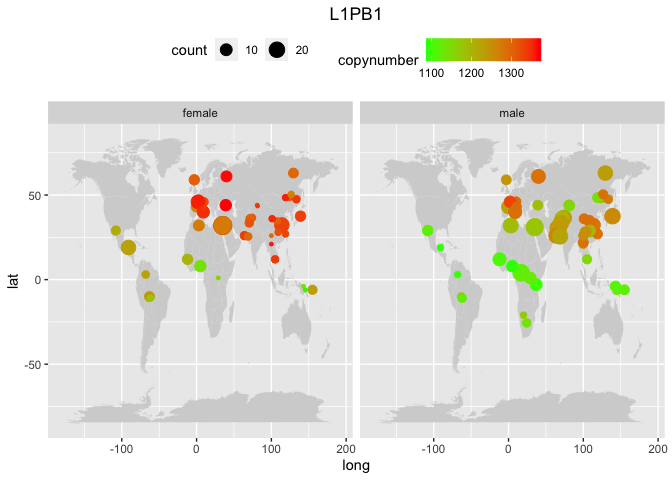<!-- -->

``` r
plot_map(data, "L1PA3")
```

    ## Warning: Ignoring unknown aesthetics: x, y

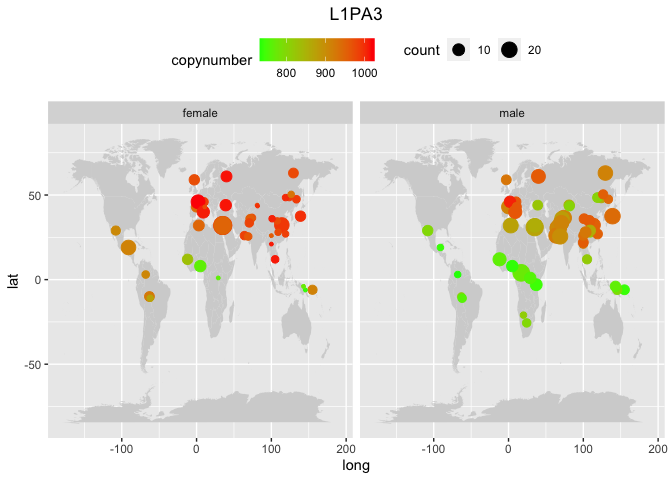<!-- -->

``` r
plot_map(data, "L1ME5")
```

    ## Warning: Ignoring unknown aesthetics: x, y

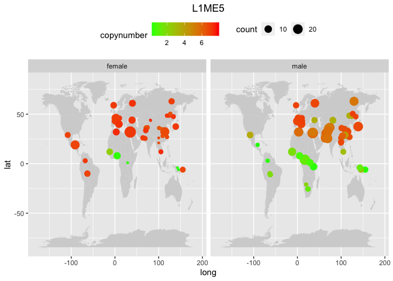<!-- -->

The similarity among these TEs distributions is striking:

- In all the plots we see a lower copynumber in **Africa** and in some
  population from **Oceania**. This distribution is more pronounced in
  **females** than in males.
- It is worth to note that in **America** we have lower copynumber
  compared to **Eurasia**, and in **american males** this pattern is
  even more pronounced, with some populations showing copynumbers very
  close to the africans.
- The **africans outliers** with high copynumber that I found in the
  previous analysis are always the populations from **North Africa**,
  consistent with the fact that these populations are genetically closer
  to eurasion populations than to sub-saharian populations.

I have an idea regarding the **oceanians**. We know that these
populations had the strongest introgression from archaic hominins
(Neandertal and Denisovans), and nowadays they have higher percentage of
their genomes compared to every other population. On the other hand, we
see in this maps that they are, overall, similar to Africans regarding
TE abundance. How do we correlate this two aspects of their genetic
history?

**Archaic humans** had a shared ancestry with **Africans**, long before
the Out of Africa of Homo sapiens. Thus, when they admixed with modern
humans in Eurasia and Oceania, they “gave back” some African variants to
**non-africans**, who had lost these sequences during the **Out of
Africa bottleneck**.

This could explain why Oceanians looks closer to Africans than expected
in terms of TE abundance, since they have the strongest introgression
both from Neandertals and Denisovans among human populations. To confirm
this hypothesis, I have to look into Denisovans and Neandertals genomes
and look for TEs abundance.

Another possible explanation is that **oceanians**, as reported in
different papers, are directly closer to Africans due to an early
migration that followed the South Coast of Middle East and Asia.

#### L1PA7_5

``` r
plot_map(data, "L1PA7_5")
```

    ## Warning: Ignoring unknown aesthetics: x, y

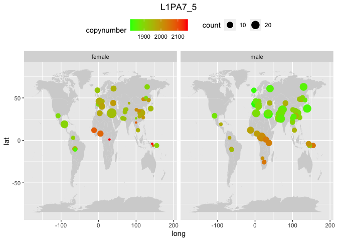<!-- -->

In `L1PA7_5`, the abundance distribution looks reversed to the one
previously observed. We have **subsaharian africans** with high
copynumbers and **eurasians** and **americans** with lower copynumbers.
Again, the **oceanians** looks similar to Africans than to the other
populations. This could be, in my opinion, an example of a loss of TE
during the OOU bottleneck.

To explain the fact that some oceanians has high copynumber for this TE,
we have two hypothesis to test:

- A **re-invasion** occurred.
- The **archaic humans** “gave back” to them the African high copynumber
  parts of the genome.

### SINEs

``` r
plot_map(data, "ALU")
```

    ## Warning: Ignoring unknown aesthetics: x, y

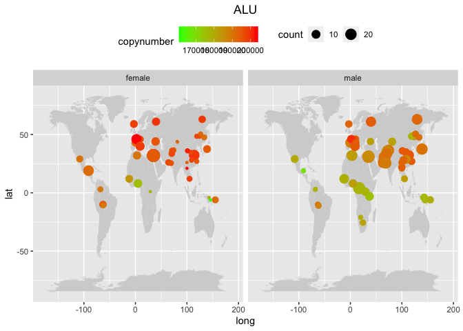<!-- -->

``` r
plot_map(data, "SVA_A")
```

    ## Warning: Ignoring unknown aesthetics: x, y

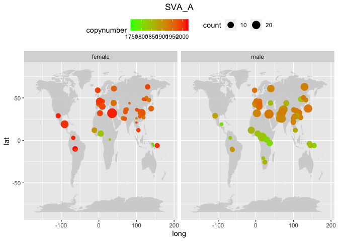<!-- -->

Also for these two SINEs, we have a distribution consistent with the
previous LINEs. Again, we have some interesting **Oceanians**.

For `SVA_A`, I also notice a striking difference between **american
males** and **females**. Interestingly, we have this strong difference
also for 1/3 Oceanian population. Can this be another sign of archaic
admixture, maybe related to the Y chromosome? If this TE was rare in
Neandertal/Denisovans **Y chromosome**, modern human males with strong
admixture would show fewer TE than modern females.

### DNA transposons

``` r
plot_map(data, "MER2")
```

    ## Warning: Ignoring unknown aesthetics: x, y

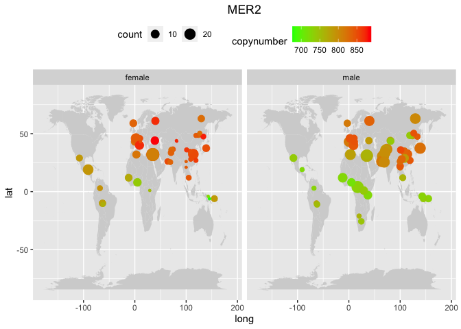<!-- -->

We notice the same pattern also for the only DNA transposon analysed
here, `MER2`.

### Endogenous retroviruses

``` r
plot_map(data, "MLT2A1")
```

    ## Warning: Ignoring unknown aesthetics: x, y

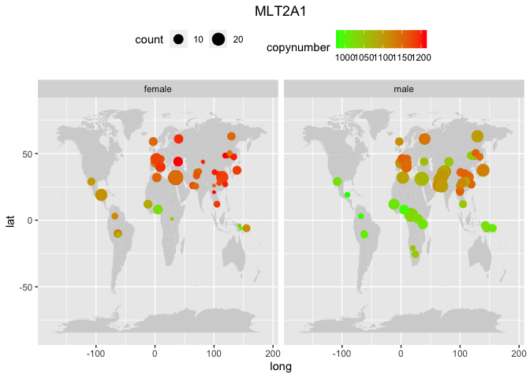<!-- -->

``` r
plot_map(data, "HERVI")
```

    ## Warning: Ignoring unknown aesthetics: x, y

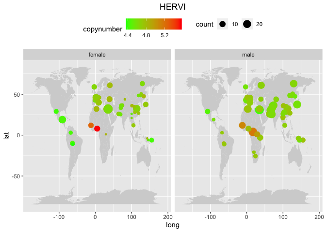<!-- -->

For `MLT2A1`, we have a pattern super consistent with the most common
previously described. Instead, `HERVI` shows something different. Looks
like a lost of TE during the bottleneck (OOA), even though the
copynumber change only from 4.4 to 5.5.

### Satellites

``` r
plot_map(data, "GSATII")
```

    ## Warning: Ignoring unknown aesthetics: x, y

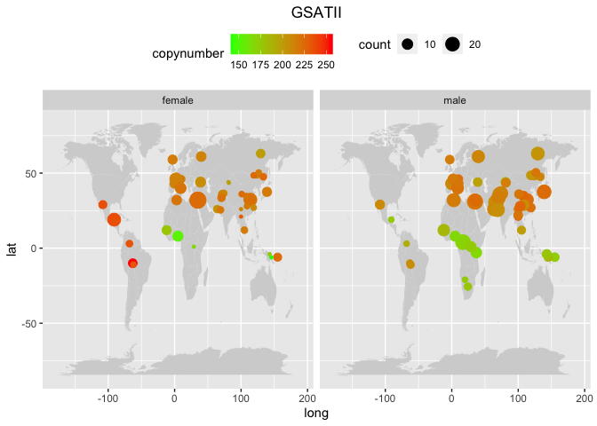<!-- -->

The only idea I have about why we see this distribution also in a
satellite may be the fact that they are known to arise from TEs
insertions as reported in <https://doi.org/10.1038/nrg2640>.

## Final comments

All together, these maps show us:

- **Eurasians** populations always cluster together and separately from
  **africans**.
- **African** populations cluster almost always together with the two
  most western **oceanians** populations, which are the
  `PapuanHighlands` and the `PapuanSepik`, but **never** with the third
  oceanian population, the `Bougainville` (BG).
- The `Bougainville` population **always** cluster together with
  **native american** populations. This is striking, and this is also
  reflected in the two sexes. See for example the `L1ME5` map: **BG
  females** has high copynumber and **BG males** has high. The same
  sex-specific pattern is reflected in **americans**.

How do we interprete these data? There is a genetic relationship between
these oceanians and the native americans? There are some hypothesis
about a gene flow from oceanians into native americans, or even that
native **south americans** were originally from Oceania.

## Ancient transposons as controls

### DNA transposons

To finish this analysis, I also plot the geographical distribution of 2
among the most ancient DNA transposons (`MER63C`, `CHARLIE1A`), as
estimated in <https://doi.org/10.1101/gr.5826307>. We expect to see low
variance and no particularly relevant distribution.

``` r
plot_map(data, 'MER63C')
```

    ## Warning: Ignoring unknown aesthetics: x, y

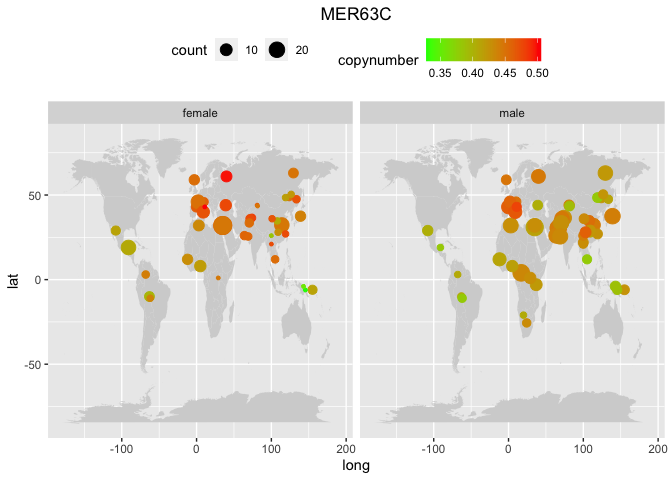<!-- -->

``` r
plot_map(data, "CHARLIE1A")
```

    ## Warning: Ignoring unknown aesthetics: x, y

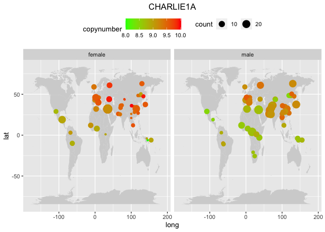<!-- -->

We see **low variance**, as expected. On the other hand, we still see
specific geographic distributions, with **Eurasia** having the
populations with higher copynumber and **Africa** the lowers.
**Oceanians** still look closer to africans than to Eurasians.

The only idea that came into my mind to explain this data is that, even
if this TEs are inactive and are not able to mobilize anymore, they can
still cause **ectopic recombination**. Something similar is explained in
<https://doi.org/10.1186/s13059-018-1577-z>.

### RNA transposons

As reported in <https://doi.org/10.1016/s0959-437x(99)00031-3>, `LINE2`
TEs are considered to be ancient and inactive.

``` r
plot_map(data, "L2")
```

    ## Warning: Ignoring unknown aesthetics: x, y

<!-- -->

``` r
plot_map(data, 'L2B')
```

    ## Warning: Ignoring unknown aesthetics: x, y

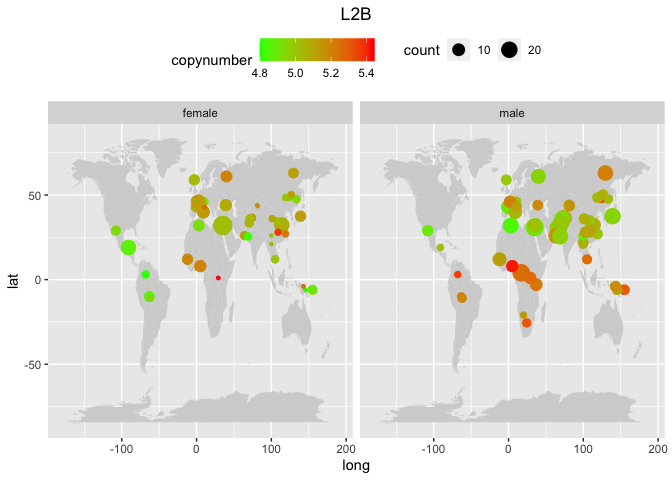<!-- -->

Here we see both **low variance** and no particular distribution, as
expected.
