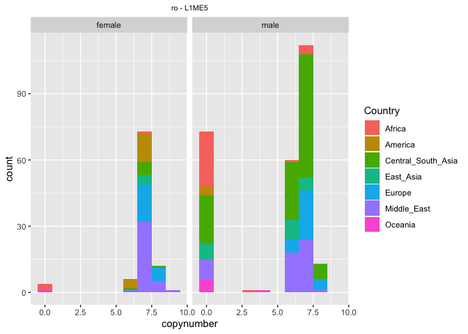
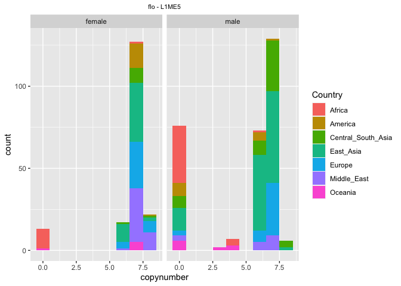
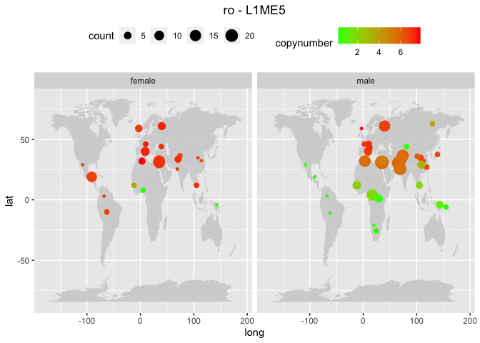
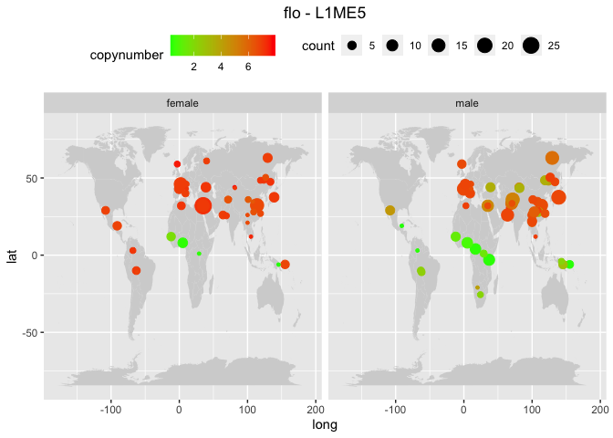
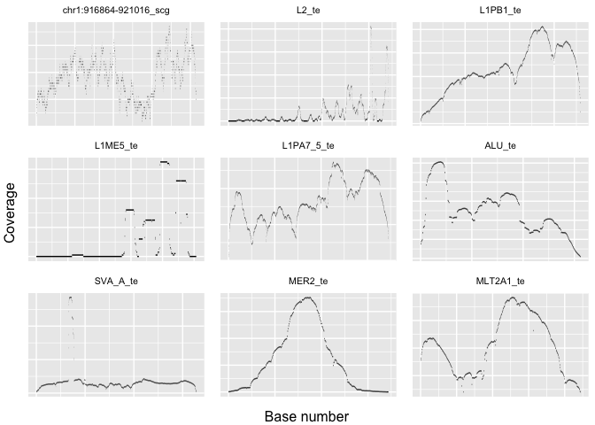
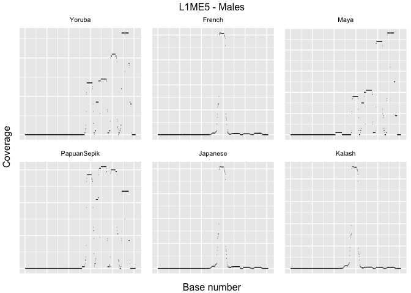
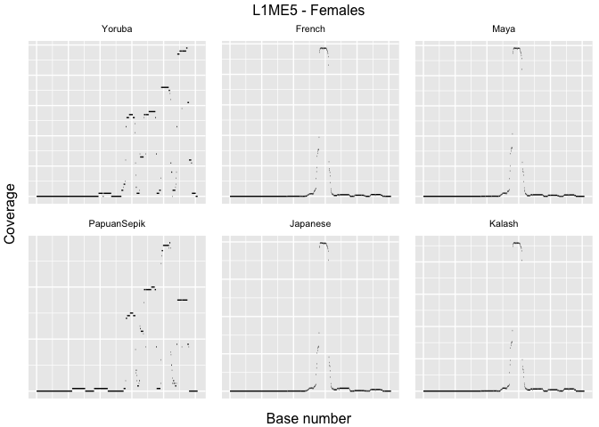
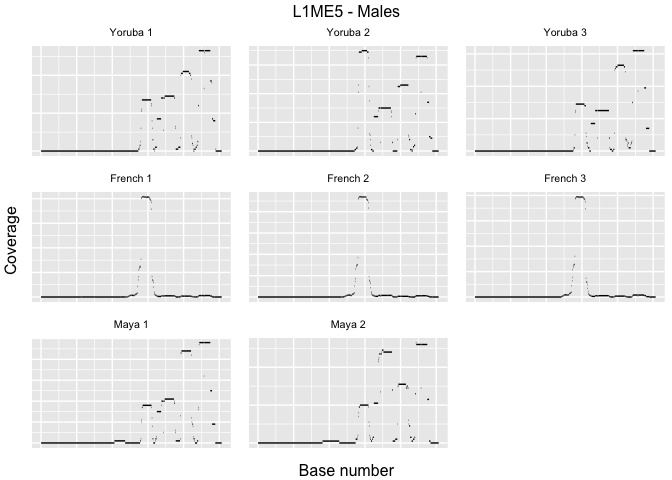
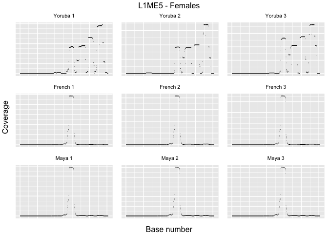

HGDP - Controls
================

Script 5. This scripts contains some controls on the data quality, such
as checking for **batch effects** and **reads length**.

``` r
library(tidyverse)
```

    ## ── Attaching packages ─────────────────────────────────────── tidyverse 1.3.2 ──
    ## ✔ ggplot2 3.3.6      ✔ purrr   0.3.4 
    ## ✔ tibble  3.1.8      ✔ dplyr   1.0.10
    ## ✔ tidyr   1.2.1      ✔ stringr 1.4.1 
    ## ✔ readr   2.1.2      ✔ forcats 0.5.2 
    ## ── Conflicts ────────────────────────────────────────── tidyverse_conflicts() ──
    ## ✖ dplyr::filter() masks stats::filter()
    ## ✖ dplyr::lag()    masks stats::lag()

``` r
library(ggpubr)

(HGDPcutoff<-read_delim("/Users/rpianezza/TE/summary-HGDP/USEME_HGDP_complete_reflib6.2_mq10_batchinfo_cutoff0.01.txt",comment="#"))
```

    ## Rows: 1394352 Columns: 10
    ## ── Column specification ────────────────────────────────────────────────────────
    ## Delimiter: ","
    ## chr (7): ID, Pop, sex, Country, type, familyname, batch
    ## dbl (3): length, reads, copynumber
    ## 
    ## ℹ Use `spec()` to retrieve the full column specification for this data.
    ## ℹ Specify the column types or set `show_col_types = FALSE` to quiet this message.

    ## # A tibble: 1,394,352 × 10
    ##    ID        Pop    sex   Country       type  famil…¹ length reads copyn…² batch
    ##    <chr>     <chr>  <chr> <chr>         <chr> <chr>    <dbl> <dbl>   <dbl> <chr>
    ##  1 HGDP00001 Brahui male  Central_Sout… scg   chr1:9…   4152 1052.   1.02  ro   
    ##  2 HGDP00001 Brahui male  Central_Sout… scg   chr1:9…   5136 1092.   0.852 ro   
    ##  3 HGDP00001 Brahui male  Central_Sout… scg   chr1:1…   3064  832.   1.09  ro   
    ##  4 HGDP00001 Brahui male  Central_Sout… scg   chr1:1…   3239  901.   1.11  ro   
    ##  5 HGDP00001 Brahui male  Central_Sout… scg   chr1:1…   4035 1102.   1.09  ro   
    ##  6 HGDP00001 Brahui male  Central_Sout… scg   chr1:1…   2500  733.   1.18  ro   
    ##  7 HGDP00001 Brahui male  Central_Sout… scg   chr1:1…   2599  580.   0.895 ro   
    ##  8 HGDP00001 Brahui male  Central_Sout… scg   chr1:1…   2124  477.   0.900 ro   
    ##  9 HGDP00001 Brahui male  Central_Sout… scg   chr1:2…   6284 1527.   0.974 ro   
    ## 10 HGDP00001 Brahui male  Central_Sout… scg   chr1:2…   3222  884.   1.10  ro   
    ## # … with 1,394,342 more rows, and abbreviated variable names ¹​familyname,
    ## #   ²​copynumber

``` r
names(HGDPcutoff)<-c("ID","Pop","sex","Country","type","familyname","length","reads","copynumber","batch")
```

The two following functions have been previously described in scripts 1
and 4. The first plot the distribution of the **copynumbers** of a TE
divided by **continent**. The second plot the **mean copynumber** of
every **population** for a particular TE on the **world map**.

These functions are slightly modified in order to add `batch` among the
arguments and check for batch effect.

``` r
plotTEfamily <- function(data, famname, bat, binwidht, x_title, y_title, x_numbers, y_numbers){
filtered <- filter(data, familyname==famname, batch==bat)
ggplot(data = filtered, mapping = aes(x = copynumber, fill = Country)) +
  geom_histogram(binwidth = binwidht) +
  facet_wrap(~sex)+
  ggtitle(paste0(filtered$batch, ' - ',famname)) + theme(plot.title = element_text(size = 8, hjust = 0.5)) +
  {if(x_title=='n'){
  theme(axis.title.x=element_blank())}} +
  {if(y_title=='n'){
  theme(axis.title.y=element_blank())}} +
  {if(x_numbers=='n'){
  theme(axis.text.x=element_blank(), axis.ticks.x=element_blank())}} +
{if(y_numbers=='n'){
  theme(axis.text.y=element_blank(), axis.ticks.y=element_blank())}}
}
```

``` r
plot_map <- function(data, famname, batch){
TE <- filter(data, familyname == famname)
world_map = map_data("world")

ggplot() +
  geom_map(
    data = world_map, map = world_map,
    aes(long, lat, map_id = region),
    color = "white", fill = "lightgray", size = 0) +
  geom_point(
    data = TE, aes(longitude, latitude, color = copynumber, size = count)
  ) + scale_colour_gradient(low = "green", high = "red") + theme(legend.position="top") + theme(plot.title = element_text(hjust = 0.5)) +
  facet_wrap(~sex) + ggtitle(paste0(batch, ' - ',famname))}
```

## Batch effect

In our dataset, the `batch` column refers to the computer on which the
pipeline was ran for each sample, thus `flo` for Florian’s PC and `ro`
for Robert’s PC. This could introduce some biases, even though the
pipeline are the same, with the exact same version for each of the used
programs. To check if this is the case and if the bias is significant, I
did the same plots previously described in scripts 1-2-4 but dividing
the dataset for the two **batches**. I choose the TE `L1ME5` which was
the most interesting.

``` r
(ro_L1ME5_plot<-plotTEfamily(HGDPcutoff, 'L1ME5', 'ro', 1, 'y', 'y', 'y', 'y'))
```

<!-- -->

``` r
(flo_L1ME5_plot<-plotTEfamily(HGDPcutoff, 'L1ME5', 'flo', 1, 'y', 'y', 'y', 'y'))
```

<!-- -->

``` r
coordinates <- read_tsv("/Users/rpianezza/TE/summary-HGDP/HGDP_populationcoordinates.txt", col_names = c("Pop", "region", "latitude", "longitude"))
```

    ## Rows: 54 Columns: 4
    ## ── Column specification ────────────────────────────────────────────────────────
    ## Delimiter: "\t"
    ## chr (2): Pop, region
    ## dbl (2): latitude, longitude
    ## 
    ## ℹ Use `spec()` to retrieve the full column specification for this data.
    ## ℹ Specify the column types or set `show_col_types = FALSE` to quiet this message.

``` r
coord <- select(coordinates, Pop, latitude, longitude)

ro_TE <- filter(HGDPcutoff, type=='te', batch=='ro')
flo_TE <- filter(HGDPcutoff, type=='te', batch=='flo')

ro_by_pop <- group_by(ro_TE, Pop, familyname, sex) %>% summarise(copynumber = mean(copynumber), count=n())
```

    ## `summarise()` has grouped output by 'Pop', 'familyname'. You can override using
    ## the `.groups` argument.

``` r
ro_data <- inner_join(x = coord, y = ro_by_pop, by = "Pop")

flo_by_pop <- group_by(flo_TE, Pop, familyname, sex) %>% summarise(copynumber = mean(copynumber), count=n())
```

    ## `summarise()` has grouped output by 'Pop', 'familyname'. You can override using
    ## the `.groups` argument.

``` r
flo_data <- inner_join(x = coord, y = flo_by_pop, by = "Pop")

(ro_L1ME5_map<-plot_map(ro_data, 'L1ME5', 'ro'))
```

    ## Warning: Ignoring unknown aesthetics: x, y

<!-- -->

``` r
(flo_L1ME5_map<-plot_map(flo_data, 'L1ME5', 'flo'))
```

    ## Warning: Ignoring unknown aesthetics: x, y

<!-- -->

I do not notice significant differences among the two batches, in
neither of the two figures.

## Read length

Another possible bias could be introduced by different **read lengths**
of the samples. To check this, I found the original dataset here
<https://www.ebi.ac.uk/ena/browser/view/PRJEB6463> on the ENA website.
Then I selected the columns containing the number of reads for each
sample (`read_count`) and the total base number sequenced in each sample
(`base_count`), and finally I downloaded the report in TSV format. Here
I import the report in R as `HGDP_report` and I add the column
`read_lenght`, calculated as the ratio between `base_count` and
`read_count`.

``` r
HGDP_report <- read_tsv('/Users/rpianezza/TE/ric-documentation-Rmd/other-files/filereport_read_run_PRJEB6463_tsv.txt') %>% mutate(read_length = base_count/read_count)
```

    ## Rows: 7942 Columns: 7
    ## ── Column specification ────────────────────────────────────────────────────────
    ## Delimiter: "\t"
    ## chr (5): study_accession, sample_accession, experiment_accession, run_access...
    ## dbl (2): read_count, base_count
    ## 
    ## ℹ Use `spec()` to retrieve the full column specification for this data.
    ## ℹ Specify the column types or set `show_col_types = FALSE` to quiet this message.

First I wanted to check if the dataset used for my data analysis was
still complete respect to the original one, so I compared the number of
individuals in the two datasets. It’s `828` in both, confirming the
completness of the used dataset.

``` r
length(unique(HGDP_report$sample_accession)) == length(unique(HGDPcutoff$ID))
```

    ## [1] TRUE

Then I checked for the mean of read lenghts among all the samples.
Surprisingly it is not `151`, as I was expecting looking at the dataset,
but a bit lower.

``` r
(mean_rl = mean(HGDP_report$read_length))
```

    ## [1] 150.9875

Thus, I checked for the samples with `read_lenght` different from the
expected `151`.

``` r
(not151 <- filter(HGDP_report, !(read_length==151)))
```

    ## # A tibble: 14 × 8
    ##    study_accession sample_acce…¹ exper…² run_a…³ read_…⁴ base_…⁵ sampl…⁶ read_…⁷
    ##    <chr>           <chr>         <chr>   <chr>     <dbl>   <dbl> <chr>     <dbl>
    ##  1 PRJEB6463       SAMEA2580910  ERX136… ERR128…  7.15e7 1.03e10 HGDP00…    144.
    ##  2 PRJEB6463       SAMEA2580945  ERX136… ERR128…  8.97e7 1.30e10 HGDP01…    144.
    ##  3 PRJEB6463       SAMEA2581005  ERX136… ERR128…  7.81e7 1.13e10 HGDP01…    144.
    ##  4 PRJEB6463       SAMEA2580922  ERX136… ERR128…  7.10e7 1.02e10 HGDP00…    144.
    ##  5 PRJEB6463       SAMEA2580930  ERX136… ERR128…  1.38e8 1.95e10 HGDP00…    141.
    ##  6 PRJEB6463       SAMEA2580960  ERX136… ERR128…  9.43e7 1.35e10 HGDP01…    143.
    ##  7 PRJEB6463       SAMEA2580972  ERX136… ERR128…  6.93e7 9.97e 9 HGDP01…    144.
    ##  8 PRJEB6463       SAMEA2580948  ERX136… ERR128…  7.94e7 1.14e10 HGDP01…    144.
    ##  9 PRJEB6463       SAMEA2580985  ERX136… ERR128…  8.24e7 1.19e10 HGDP01…    144.
    ## 10 PRJEB6463       SAMEA2580965  ERX136… ERR128…  8.05e7 1.15e10 HGDP01…    143.
    ## 11 PRJEB6463       SAMEA2580927  ERX136… ERR128…  8.08e7 1.17e10 HGDP00…    144.
    ## 12 PRJEB6463       SAMEA2581017  ERX136… ERR128…  8.17e7 1.18e10 HGDP01…    144.
    ## 13 PRJEB6463       SAMEA2581004  ERX136… ERR128…  7.50e7 1.09e10 HGDP01…    145.
    ## 14 PRJEB6463       SAMEA2581018  ERX136… ERR128…  7.25e7 1.05e10 HGDP01…    145.
    ## # … with abbreviated variable names ¹​sample_accession, ²​experiment_accession,
    ## #   ³​run_accession, ⁴​read_count, ⁵​base_count, ⁶​sample_alias, ⁷​read_length

We found 14/828 samples for which read length is not `151`, but in a
range between `141` and `146`. I think that these outliers are not
introducing a significant bias, since the read length is very similar to
the other samples. To further investigate this, I also checked from
which populations these samples come from.

``` r
out_rl_names <- c(not151$sample_alias)
out_rl <- filter(HGDPcutoff, type == "te", ID %in% out_rl_names)
(unique(out_rl$Pop))
```

    ## [1] "Han"         "Tujia"       "Miao"        "NorthernHan" "Dai"        
    ## [6] "Lahu"        "She"         "Naxi"        "Tu"

The samples are distributed among 9 different populations, confirming
the non significance of these outliers on the final results.

## Coverage of the aligned reads by position

Another possible problem that may create some artefacts in the data is
the sequence coverage by position: a TE copynumber may be overestimated
if only a small portion of the consensus sequence has many reads
aligned, while the rest of the sequence being at low coverage. To test
for this, I downloaded 5/828 samples (randomly) to check the coverage
for some of the most interesting TEs. The files has extension *.bed.gz*
and can be downloaded from
<https://sourceforge.net/p/human-te-dynamics/data/HEAD/tree/raw-data/>,
divided among the folders **flo_vetgrid** and **ro_vetgrid**.

``` r
bedfile1 <- read_tsv("/Users/rpianezza/TE/coverage_validation/data/HGDP00001-Brahui.per-base.bed.gz", col_names = c("familyname", "start_pos", "end_pos", "coverage"))
```

    ## Rows: 1585579 Columns: 4
    ## ── Column specification ────────────────────────────────────────────────────────
    ## Delimiter: "\t"
    ## chr (1): familyname
    ## dbl (3): start_pos, end_pos, coverage
    ## 
    ## ℹ Use `spec()` to retrieve the full column specification for this data.
    ## ℹ Specify the column types or set `show_col_types = FALSE` to quiet this message.

``` r
bedfile2 <- read_tsv("/Users/rpianezza/TE/coverage_validation/data/HGDP00052-Balochi.per-base.bed.gz", col_names = c("familyname", "start_pos", "end_pos", "coverage"))
```

    ## Rows: 1523078 Columns: 4
    ## ── Column specification ────────────────────────────────────────────────────────
    ## Delimiter: "\t"
    ## chr (1): familyname
    ## dbl (3): start_pos, end_pos, coverage
    ## 
    ## ℹ Use `spec()` to retrieve the full column specification for this data.
    ## ℹ Specify the column types or set `show_col_types = FALSE` to quiet this message.

``` r
bedfile3 <- read_tsv("/Users/rpianezza/TE/coverage_validation/data/HGDP00099-Hazara.per-base.bed.gz", col_names = c("familyname", "start_pos", "end_pos", "coverage"))
```

    ## Rows: 1623633 Columns: 4
    ## ── Column specification ────────────────────────────────────────────────────────
    ## Delimiter: "\t"
    ## chr (1): familyname
    ## dbl (3): start_pos, end_pos, coverage
    ## 
    ## ℹ Use `spec()` to retrieve the full column specification for this data.
    ## ℹ Specify the column types or set `show_col_types = FALSE` to quiet this message.

``` r
bedfile4 <- read_tsv("/Users/rpianezza/TE/coverage_validation/data/HGDP00130-Makrani.per-base.bed.gz", col_names = c("familyname", "start_pos", "end_pos", "coverage"))
```

    ## Rows: 1546697 Columns: 4
    ## ── Column specification ────────────────────────────────────────────────────────
    ## Delimiter: "\t"
    ## chr (1): familyname
    ## dbl (3): start_pos, end_pos, coverage
    ## 
    ## ℹ Use `spec()` to retrieve the full column specification for this data.
    ## ℹ Specify the column types or set `show_col_types = FALSE` to quiet this message.

``` r
bedfile5 <- read_tsv("/Users/rpianezza/TE/coverage_validation/data/HGDP00163-Sindhi.per-base.bed.gz", col_names = c("familyname", "start_pos", "end_pos", "coverage"))
```

    ## Rows: 1602132 Columns: 4
    ## ── Column specification ────────────────────────────────────────────────────────
    ## Delimiter: "\t"
    ## chr (1): familyname
    ## dbl (3): start_pos, end_pos, coverage
    ## 
    ## ℹ Use `spec()` to retrieve the full column specification for this data.
    ## ℹ Specify the column types or set `show_col_types = FALSE` to quiet this message.

Then I wrote this function to plot the coverage for a set of TEs
(`familynames`) in an individual (`data`). The other arguments are
purely for visualization (to include/exclude title, scale and ticks on
the two axes).

``` r
plot_bed <- function(data, familynames, x_title, y_title, x_numbers, y_numbers){

  bed <- filter(data, familyname %in% familynames)

  ggplot(bed)+
    geom_segment(aes(x=start_pos, xend=end_pos, y=coverage, yend=coverage))+
    ylab("Coverage") + xlab("Base number") +
    ggtitle(paste0(familynames)) + theme(plot.title = element_text(size = 8, hjust = 0.5)) +
    {if(x_title=='n'){
    theme(axis.title.x=element_blank())}} +
    {if(y_title=='n'){
    theme(axis.title.y=element_blank())}} +
    {if(x_numbers=='n'){
    theme(axis.text.x=element_blank(), axis.ticks.x=element_blank())}} +
    {if(y_numbers=='n'){
    theme(axis.text.y=element_blank(), axis.ticks.y=element_blank())}}
}
```

This second function put together the plots created with the first
function in a single figure. To change the TEs investigated, change the
names here in this function.

``` r
create_figure_mix <- function(file){
  
  scg <- plot_bed(file, "chr1:916864-921016_scg", 'n', 'n', 'n', 'n')
  L2 <- plot_bed(file, "L2_te", 'n', 'n', 'n', 'n')
  L1PB1 <- plot_bed(file, "L1PB1_te", 'n', 'n', 'n', 'n')
  L1ME5 <- plot_bed(file, "L1ME5_te", 'n', 'n', 'n', 'n')
  L1PA7_5 <- plot_bed(file, "L1PA7_5_te", 'n', 'n', 'n', 'n')
  ALU <- plot_bed(file, "ALU_te", 'n', 'n', 'n', 'n')
  SVA_A <- plot_bed(file, "SVA_A_te", 'n', 'n', 'n', 'n')
  MER2 <- plot_bed(file, "MER2_te", 'n', 'n', 'n', 'n')
  MLT2A1 <- plot_bed(file, "MLT2A1_te", 'n', 'n', 'n', 'n')
  
  bed_figure <- ggarrange(scg, L2, L1PB1, L1ME5, L1PA7_5, ALU, SVA_A, MER2, MLT2A1, ncol = 3, nrow = 3, common.legend = TRUE, legend = "top", align = "hv", font.label = list(size = 10, color = "black", face = "bold", family = NULL, position = "top"))

  bed_final <- annotate_figure(bed_figure, left = text_grob("Coverage", color = "black", rot = 90), bottom = text_grob("Base number", color = "black"), fig.lab = "")
}
```

Here I use the 2 functions to create 5 figures for 5 individuals
previously downloaded for a set of chosen sequences. I choose to
include:

- A **single copy gene** as a control (`chr1:916864-921016_scg`).
- An **ancient** TE, expected to be inactive in the human genome (`L2`).
- 3 **L1 TEs** previously noticed to show interesting geographical
  distributions (`L1PB1`, `L1ME5`, `L1PA7_5`).
- 2 **SINEs**, `ALU` and `SVA_A` known to be active humans and with
  interesting geographical distributions.
- A **DNA transposon** which showed an interesting geographical
  distribution (`MER2`)
- An **endogenous retrovirus** which showed an interesting geographical
  distribution (`MLT2A1`)

I removed the last 2 figures because they didn’t show other interesting
patterns.

``` r
# File 1: HGDP00001-Brahui.per-base.bed.gz
(create_figure_mix(bedfile1))
```

<!-- -->

``` r
# File 2: HGDP00052-Balochi.per-base.bed.gz
(create_figure_mix(bedfile2))
```

<!-- -->

``` r
# File 3: HGDP00099-Hazara.per-base.bed.gz
(create_figure_mix(bedfile3))
```

<!-- -->

``` r
# File 4: HGDP00130-Makrani.per-base.bed.gz
#(create_figure_mix(bedfile4))

# File 5: HGDP00163-Sindhi.per-base.bed.gz
#(create_figure_mix(bedfile5))
```

Note that each plot has is own scale. What we can say from this plot is
that all the analyzed sequences show similar coverage distributions
between different individuals, with the exception of `L1ME5_te`. This
the shows a “**spiked**” pattern is some individuals (2, 3) and a
“**dashed**” pattern in others (1).

I wonder how we can explain this patterns. To check if it’s related to
**sex** or to **population** or to both, I checked the coverage
distribution for `L1ME5` in 6 different populations, represented by 1
individuals per sex each, for a total of 12 individuals. I choose the 6
populations across the different continents:

- `Yoruba` from **Africa**
- `French` from **Europe**
- `Maya` from **America**
- `PapuanSepik` from **Oceania**
- `Japanese` from **East Asia**
- `Kalash` from **Central Asia**

``` r
# Yoruba
yoruba_m <- read_tsv("/Users/rpianezza/TE/coverage_validation/data/by_pop/HGDP00929-Yoruba.per-base.bed.gz", col_names = c("familyname", "start_pos", "end_pos", "coverage"))
```

    ## Rows: 1598233 Columns: 4
    ## ── Column specification ────────────────────────────────────────────────────────
    ## Delimiter: "\t"
    ## chr (1): familyname
    ## dbl (3): start_pos, end_pos, coverage
    ## 
    ## ℹ Use `spec()` to retrieve the full column specification for this data.
    ## ℹ Specify the column types or set `show_col_types = FALSE` to quiet this message.

``` r
yoruba_f <- read_tsv("/Users/rpianezza/TE/coverage_validation/data/by_pop/HGDP00920-Yoruba.per-base.bed.gz", col_names = c("familyname", "start_pos", "end_pos", "coverage"))
```

    ## Rows: 1578086 Columns: 4
    ## ── Column specification ────────────────────────────────────────────────────────
    ## Delimiter: "\t"
    ## chr (1): familyname
    ## dbl (3): start_pos, end_pos, coverage
    ## 
    ## ℹ Use `spec()` to retrieve the full column specification for this data.
    ## ℹ Specify the column types or set `show_col_types = FALSE` to quiet this message.

``` r
# French
french_m <- read_tsv("/Users/rpianezza/TE/coverage_validation/data/by_pop/HGDP00511-French.per-base.bed.gz", col_names = c("familyname", "start_pos", "end_pos", "coverage"))
```

    ## Rows: 1569668 Columns: 4
    ## ── Column specification ────────────────────────────────────────────────────────
    ## Delimiter: "\t"
    ## chr (1): familyname
    ## dbl (3): start_pos, end_pos, coverage
    ## 
    ## ℹ Use `spec()` to retrieve the full column specification for this data.
    ## ℹ Specify the column types or set `show_col_types = FALSE` to quiet this message.

``` r
french_f <- read_tsv("/Users/rpianezza/TE/coverage_validation/data/by_pop/HGDP00513-French.per-base.bed.gz", col_names = c("familyname", "start_pos", "end_pos", "coverage"))
```

    ## Rows: 1605551 Columns: 4
    ## ── Column specification ────────────────────────────────────────────────────────
    ## Delimiter: "\t"
    ## chr (1): familyname
    ## dbl (3): start_pos, end_pos, coverage
    ## 
    ## ℹ Use `spec()` to retrieve the full column specification for this data.
    ## ℹ Specify the column types or set `show_col_types = FALSE` to quiet this message.

``` r
# Maya
maya_m <- read_tsv("/Users/rpianezza/TE/coverage_validation/data/by_pop/HGDP00856-Maya.per-base.bed.gz", col_names = c("familyname", "start_pos", "end_pos", "coverage"))
```

    ## Rows: 1578810 Columns: 4
    ## ── Column specification ────────────────────────────────────────────────────────
    ## Delimiter: "\t"
    ## chr (1): familyname
    ## dbl (3): start_pos, end_pos, coverage
    ## 
    ## ℹ Use `spec()` to retrieve the full column specification for this data.
    ## ℹ Specify the column types or set `show_col_types = FALSE` to quiet this message.

``` r
maya_f <- read_tsv("/Users/rpianezza/TE/coverage_validation/data/by_pop/HGDP00854-Maya.per-base.bed.gz", col_names = c("familyname", "start_pos", "end_pos", "coverage"))
```

    ## Rows: 1697676 Columns: 4
    ## ── Column specification ────────────────────────────────────────────────────────
    ## Delimiter: "\t"
    ## chr (1): familyname
    ## dbl (3): start_pos, end_pos, coverage
    ## 
    ## ℹ Use `spec()` to retrieve the full column specification for this data.
    ## ℹ Specify the column types or set `show_col_types = FALSE` to quiet this message.

``` r
# PapuanSepik
papuansepik_m <- read_tsv("/Users/rpianezza/TE/coverage_validation/data/by_pop/HGDP00540-PapuanSepik.per-base.bed.gz", col_names = c("familyname", "start_pos", "end_pos", "coverage"))
```

    ## Rows: 1571394 Columns: 4
    ## ── Column specification ────────────────────────────────────────────────────────
    ## Delimiter: "\t"
    ## chr (1): familyname
    ## dbl (3): start_pos, end_pos, coverage
    ## 
    ## ℹ Use `spec()` to retrieve the full column specification for this data.
    ## ℹ Specify the column types or set `show_col_types = FALSE` to quiet this message.

``` r
papuansepik_f <- read_tsv("/Users/rpianezza/TE/coverage_validation/data/by_pop/HGDP00544-PapuanSepik.per-base.bed.gz", col_names = c("familyname", "start_pos", "end_pos", "coverage"))
```

    ## Rows: 1584494 Columns: 4
    ## ── Column specification ────────────────────────────────────────────────────────
    ## Delimiter: "\t"
    ## chr (1): familyname
    ## dbl (3): start_pos, end_pos, coverage
    ## 
    ## ℹ Use `spec()` to retrieve the full column specification for this data.
    ## ℹ Specify the column types or set `show_col_types = FALSE` to quiet this message.

``` r
# Japanese
japanese_m <- read_tsv("/Users/rpianezza/TE/coverage_validation/data/by_pop/HGDP00747-Japanese.per-base.bed.gz", col_names = c("familyname", "start_pos", "end_pos", "coverage"))
```

    ## Rows: 1490655 Columns: 4
    ## ── Column specification ────────────────────────────────────────────────────────
    ## Delimiter: "\t"
    ## chr (1): familyname
    ## dbl (3): start_pos, end_pos, coverage
    ## 
    ## ℹ Use `spec()` to retrieve the full column specification for this data.
    ## ℹ Specify the column types or set `show_col_types = FALSE` to quiet this message.

``` r
japanese_f <- read_tsv("/Users/rpianezza/TE/coverage_validation/data/by_pop/HGDP00754-Japanese.per-base.bed.gz", col_names = c("familyname", "start_pos", "end_pos", "coverage"))
```

    ## Rows: 1513894 Columns: 4
    ## ── Column specification ────────────────────────────────────────────────────────
    ## Delimiter: "\t"
    ## chr (1): familyname
    ## dbl (3): start_pos, end_pos, coverage
    ## 
    ## ℹ Use `spec()` to retrieve the full column specification for this data.
    ## ℹ Specify the column types or set `show_col_types = FALSE` to quiet this message.

``` r
# Kalash
kalash_m <- read_tsv("/Users/rpianezza/TE/coverage_validation/data/by_pop/HGDP00277-Kalash.per-base.bed.gz", col_names = c("familyname", "start_pos", "end_pos", "coverage"))
```

    ## Rows: 1548214 Columns: 4
    ## ── Column specification ────────────────────────────────────────────────────────
    ## Delimiter: "\t"
    ## chr (1): familyname
    ## dbl (3): start_pos, end_pos, coverage
    ## 
    ## ℹ Use `spec()` to retrieve the full column specification for this data.
    ## ℹ Specify the column types or set `show_col_types = FALSE` to quiet this message.

``` r
kalash_f <- read_tsv("/Users/rpianezza/TE/coverage_validation/data/by_pop/HGDP00274-Kalash.per-base.bed.gz", col_names = c("familyname", "start_pos", "end_pos", "coverage"))
```

    ## Rows: 1619198 Columns: 4
    ## ── Column specification ────────────────────────────────────────────────────────
    ## Delimiter: "\t"
    ## chr (1): familyname
    ## dbl (3): start_pos, end_pos, coverage
    ## 
    ## ℹ Use `spec()` to retrieve the full column specification for this data.
    ## ℹ Specify the column types or set `show_col_types = FALSE` to quiet this message.

``` r
m_L1ME5_yoruba <- plot_bed(yoruba_m, "L1ME5_te", 'n', 'n', 'n', 'n') + ggtitle("Yoruba")
m_L1ME5_french <- plot_bed(french_m, "L1ME5_te", 'n', 'n', 'n', 'n') + ggtitle("French")
m_L1ME5_maya <- plot_bed(maya_m, "L1ME5_te", 'n', 'n', 'n', 'n') + ggtitle("Maya")
m_L1ME5_papuan <- plot_bed(papuansepik_m, "L1ME5_te", 'n', 'n', 'n', 'n') + ggtitle("PapuanSepik")
m_L1ME5_japanese <- plot_bed(japanese_m, "L1ME5_te", 'n', 'n', 'n', 'n') + ggtitle("Japanese")
m_L1ME5_kalash <- plot_bed(kalash_m, "L1ME5_te", 'n', 'n', 'n', 'n') + ggtitle("Kalash")

m_pop_figure <- ggarrange(m_L1ME5_yoruba, m_L1ME5_french, m_L1ME5_maya, m_L1ME5_papuan, m_L1ME5_japanese, m_L1ME5_kalash, ncol = 3, nrow = 2, common.legend = TRUE, legend = "bottom", align = "hv", font.label = list(size = 10, color = "black", face = "bold", family = NULL, position = "top"))

(m_pop_final <- annotate_figure(m_pop_figure, left = text_grob("Coverage", color = "black", rot = 90), bottom = text_grob("Base number", color = "black"), top = text_grob("L1ME5 - Males", color = "black"), fig.lab = ""))
```

<!-- -->

``` r
f_L1ME5_yoruba <- plot_bed(yoruba_f, "L1ME5_te", 'n', 'n', 'n', 'n') + ggtitle("Yoruba")
f_L1ME5_french <- plot_bed(french_f, "L1ME5_te", 'n', 'n', 'n', 'n') + ggtitle("French")
f_L1ME5_maya <- plot_bed(maya_f, "L1ME5_te", 'n', 'n', 'n', 'n') + ggtitle("Maya")
f_L1ME5_papuan <- plot_bed(papuansepik_f, "L1ME5_te", 'n', 'n', 'n', 'n') + ggtitle("PapuanSepik")
f_L1ME5_japanese <- plot_bed(japanese_f, "L1ME5_te", 'n', 'n', 'n', 'n') + ggtitle("Japanese")
f_L1ME5_kalash <- plot_bed(kalash_f, "L1ME5_te", 'n', 'n', 'n', 'n') + ggtitle("Kalash")

f_pop_figure <- ggarrange(f_L1ME5_yoruba, f_L1ME5_french, f_L1ME5_maya, f_L1ME5_papuan, f_L1ME5_japanese, f_L1ME5_kalash, ncol = 3, nrow = 2, common.legend = TRUE, legend = "bottom", align = "hv", font.label = list(size = 10, color = "black", face = "bold", family = NULL, position = "top"))

(f_pop_final <- annotate_figure(f_pop_figure, left = text_grob("Coverage", color = "black", rot = 90), bottom = text_grob("Base number", color = "black"), top = text_grob("L1ME5 - Females", color = "black"), fig.lab = ""))
```

<!-- -->

The **dashed** pattern is private to **Africans (m/f)**, **Oceanians
(m/f)** and to **American males**, while **American females** show the
**spiked** pattern, together with all the other samples.

I think it’s interesting: despite that this weird coverage distribution
is probably invalidating some of our results on `L1ME5`, what we see
here further suggest genetic similarities among **Africa** and
**Oceania**. About the **Americans** this plots suggest that they in
some way inherited some variants on the **Y chromosome** private to
**Africans** and **Oceanians**, while their **X chromosome** is more
close to **Eurasians**.

But are this patterns consistent among all the individuals? I checked
this in 3 males and 3 females from these 3 populations: `Yoruba`,
`French` and `Maya` (only 2 males samples for Maya were available).

``` r
# Yoruba: Males (HGDP00929, HGDP00937, HGDP00944) - Females (HGDP00920, HGDP00933, HGDP00939)
# French: Males (HGDP00511, HGDP00528, HGDP00538) - Females (HGDP00513, HGDP00527, HGDP00539)
# Maya: Males (HGDP00856, HGDP00877) - Females (HGDP00854, HGDP00865, HGDP00876)

# Yoruba
yoruba_m1 <- read_tsv("/Users/rpianezza/TE/coverage_validation/data/full_pops/yoruba/HGDP00929-Yoruba.per-base.bed.gz", col_names = c("familyname", "start_pos", "end_pos", "coverage"))
```

    ## Rows: 1598233 Columns: 4
    ## ── Column specification ────────────────────────────────────────────────────────
    ## Delimiter: "\t"
    ## chr (1): familyname
    ## dbl (3): start_pos, end_pos, coverage
    ## 
    ## ℹ Use `spec()` to retrieve the full column specification for this data.
    ## ℹ Specify the column types or set `show_col_types = FALSE` to quiet this message.

``` r
yoruba_m2 <- read_tsv("/Users/rpianezza/TE/coverage_validation/data/full_pops/yoruba/HGDP00937-Yoruba.per-base.bed.gz", col_names = c("familyname", "start_pos", "end_pos", "coverage"))
```

    ## Rows: 1597044 Columns: 4
    ## ── Column specification ────────────────────────────────────────────────────────
    ## Delimiter: "\t"
    ## chr (1): familyname
    ## dbl (3): start_pos, end_pos, coverage
    ## 
    ## ℹ Use `spec()` to retrieve the full column specification for this data.
    ## ℹ Specify the column types or set `show_col_types = FALSE` to quiet this message.

``` r
yoruba_m3 <- read_tsv("/Users/rpianezza/TE/coverage_validation/data/full_pops/yoruba/HGDP00944-Yoruba.per-base.bed.gz", col_names = c("familyname", "start_pos", "end_pos", "coverage"))
```

    ## Rows: 1621390 Columns: 4
    ## ── Column specification ────────────────────────────────────────────────────────
    ## Delimiter: "\t"
    ## chr (1): familyname
    ## dbl (3): start_pos, end_pos, coverage
    ## 
    ## ℹ Use `spec()` to retrieve the full column specification for this data.
    ## ℹ Specify the column types or set `show_col_types = FALSE` to quiet this message.

``` r
yoruba_f1 <- read_tsv("/Users/rpianezza/TE/coverage_validation/data/full_pops/yoruba/HGDP00920-Yoruba.per-base.bed.gz", col_names = c("familyname", "start_pos", "end_pos", "coverage"))
```

    ## Rows: 1578086 Columns: 4
    ## ── Column specification ────────────────────────────────────────────────────────
    ## Delimiter: "\t"
    ## chr (1): familyname
    ## dbl (3): start_pos, end_pos, coverage
    ## 
    ## ℹ Use `spec()` to retrieve the full column specification for this data.
    ## ℹ Specify the column types or set `show_col_types = FALSE` to quiet this message.

``` r
yoruba_f2 <- read_tsv("/Users/rpianezza/TE/coverage_validation/data/full_pops/yoruba/HGDP00933-Yoruba.per-base.bed.gz", col_names = c("familyname", "start_pos", "end_pos", "coverage"))
```

    ## Rows: 1607449 Columns: 4
    ## ── Column specification ────────────────────────────────────────────────────────
    ## Delimiter: "\t"
    ## chr (1): familyname
    ## dbl (3): start_pos, end_pos, coverage
    ## 
    ## ℹ Use `spec()` to retrieve the full column specification for this data.
    ## ℹ Specify the column types or set `show_col_types = FALSE` to quiet this message.

``` r
yoruba_f3 <- read_tsv("/Users/rpianezza/TE/coverage_validation/data/full_pops/yoruba/HGDP00939-Yoruba.per-base.bed.gz", col_names = c("familyname", "start_pos", "end_pos", "coverage"))
```

    ## Rows: 1614735 Columns: 4
    ## ── Column specification ────────────────────────────────────────────────────────
    ## Delimiter: "\t"
    ## chr (1): familyname
    ## dbl (3): start_pos, end_pos, coverage
    ## 
    ## ℹ Use `spec()` to retrieve the full column specification for this data.
    ## ℹ Specify the column types or set `show_col_types = FALSE` to quiet this message.

``` r
# French
french_m1 <- read_tsv("/Users/rpianezza/TE/coverage_validation/data/full_pops/french/HGDP00511-French.per-base.bed.gz", col_names = c("familyname", "start_pos", "end_pos", "coverage"))
```

    ## Rows: 1569668 Columns: 4
    ## ── Column specification ────────────────────────────────────────────────────────
    ## Delimiter: "\t"
    ## chr (1): familyname
    ## dbl (3): start_pos, end_pos, coverage
    ## 
    ## ℹ Use `spec()` to retrieve the full column specification for this data.
    ## ℹ Specify the column types or set `show_col_types = FALSE` to quiet this message.

``` r
french_m2 <- read_tsv("/Users/rpianezza/TE/coverage_validation/data/full_pops/french/HGDP00528-French.per-base.bed.gz", col_names = c("familyname", "start_pos", "end_pos", "coverage"))
```

    ## Rows: 1660335 Columns: 4
    ## ── Column specification ────────────────────────────────────────────────────────
    ## Delimiter: "\t"
    ## chr (1): familyname
    ## dbl (3): start_pos, end_pos, coverage
    ## 
    ## ℹ Use `spec()` to retrieve the full column specification for this data.
    ## ℹ Specify the column types or set `show_col_types = FALSE` to quiet this message.

``` r
french_m3 <- read_tsv("/Users/rpianezza/TE/coverage_validation/data/full_pops/french/HGDP00538-French.per-base.bed.gz", col_names = c("familyname", "start_pos", "end_pos", "coverage"))
```

    ## Rows: 1538839 Columns: 4
    ## ── Column specification ────────────────────────────────────────────────────────
    ## Delimiter: "\t"
    ## chr (1): familyname
    ## dbl (3): start_pos, end_pos, coverage
    ## 
    ## ℹ Use `spec()` to retrieve the full column specification for this data.
    ## ℹ Specify the column types or set `show_col_types = FALSE` to quiet this message.

``` r
french_f1 <- read_tsv("/Users/rpianezza/TE/coverage_validation/data/full_pops/french/HGDP00513-French.per-base.bed.gz", col_names = c("familyname", "start_pos", "end_pos", "coverage"))
```

    ## Rows: 1605551 Columns: 4
    ## ── Column specification ────────────────────────────────────────────────────────
    ## Delimiter: "\t"
    ## chr (1): familyname
    ## dbl (3): start_pos, end_pos, coverage
    ## 
    ## ℹ Use `spec()` to retrieve the full column specification for this data.
    ## ℹ Specify the column types or set `show_col_types = FALSE` to quiet this message.

``` r
french_f2 <- read_tsv("/Users/rpianezza/TE/coverage_validation/data/full_pops/french/HGDP00527-French.per-base.bed.gz", col_names = c("familyname", "start_pos", "end_pos", "coverage"))
```

    ## Rows: 1552357 Columns: 4
    ## ── Column specification ────────────────────────────────────────────────────────
    ## Delimiter: "\t"
    ## chr (1): familyname
    ## dbl (3): start_pos, end_pos, coverage
    ## 
    ## ℹ Use `spec()` to retrieve the full column specification for this data.
    ## ℹ Specify the column types or set `show_col_types = FALSE` to quiet this message.

``` r
french_f3 <- read_tsv("/Users/rpianezza/TE/coverage_validation/data/full_pops/french/HGDP00539-French.per-base.bed.gz", col_names = c("familyname", "start_pos", "end_pos", "coverage"))
```

    ## Rows: 1645414 Columns: 4
    ## ── Column specification ────────────────────────────────────────────────────────
    ## Delimiter: "\t"
    ## chr (1): familyname
    ## dbl (3): start_pos, end_pos, coverage
    ## 
    ## ℹ Use `spec()` to retrieve the full column specification for this data.
    ## ℹ Specify the column types or set `show_col_types = FALSE` to quiet this message.

``` r
# Maya
maya_m1 <- read_tsv("/Users/rpianezza/TE/coverage_validation/data/full_pops/maya/HGDP00856-Maya.per-base.bed.gz", col_names = c("familyname", "start_pos", "end_pos", "coverage"))
```

    ## Rows: 1578810 Columns: 4
    ## ── Column specification ────────────────────────────────────────────────────────
    ## Delimiter: "\t"
    ## chr (1): familyname
    ## dbl (3): start_pos, end_pos, coverage
    ## 
    ## ℹ Use `spec()` to retrieve the full column specification for this data.
    ## ℹ Specify the column types or set `show_col_types = FALSE` to quiet this message.

``` r
maya_m2 <- read_tsv("/Users/rpianezza/TE/coverage_validation/data/full_pops/maya/HGDP00877-Maya.per-base.bed.gz", col_names = c("familyname", "start_pos", "end_pos", "coverage"))
```

    ## Rows: 1623345 Columns: 4
    ## ── Column specification ────────────────────────────────────────────────────────
    ## Delimiter: "\t"
    ## chr (1): familyname
    ## dbl (3): start_pos, end_pos, coverage
    ## 
    ## ℹ Use `spec()` to retrieve the full column specification for this data.
    ## ℹ Specify the column types or set `show_col_types = FALSE` to quiet this message.

``` r
maya_f1 <- read_tsv("/Users/rpianezza/TE/coverage_validation/data/full_pops/maya/HGDP00854-Maya.per-base.bed.gz", col_names = c("familyname", "start_pos", "end_pos", "coverage"))
```

    ## Rows: 1697676 Columns: 4
    ## ── Column specification ────────────────────────────────────────────────────────
    ## Delimiter: "\t"
    ## chr (1): familyname
    ## dbl (3): start_pos, end_pos, coverage
    ## 
    ## ℹ Use `spec()` to retrieve the full column specification for this data.
    ## ℹ Specify the column types or set `show_col_types = FALSE` to quiet this message.

``` r
maya_f2 <- read_tsv("/Users/rpianezza/TE/coverage_validation/data/full_pops/maya/HGDP00865-Maya.per-base.bed.gz", col_names = c("familyname", "start_pos", "end_pos", "coverage"))
```

    ## Rows: 1690256 Columns: 4
    ## ── Column specification ────────────────────────────────────────────────────────
    ## Delimiter: "\t"
    ## chr (1): familyname
    ## dbl (3): start_pos, end_pos, coverage
    ## 
    ## ℹ Use `spec()` to retrieve the full column specification for this data.
    ## ℹ Specify the column types or set `show_col_types = FALSE` to quiet this message.

``` r
maya_f3 <- read_tsv("/Users/rpianezza/TE/coverage_validation/data/full_pops/maya/HGDP00876-Maya.per-base.bed.gz", col_names = c("familyname", "start_pos", "end_pos", "coverage"))
```

    ## Rows: 1677014 Columns: 4
    ## ── Column specification ────────────────────────────────────────────────────────
    ## Delimiter: "\t"
    ## chr (1): familyname
    ## dbl (3): start_pos, end_pos, coverage
    ## 
    ## ℹ Use `spec()` to retrieve the full column specification for this data.
    ## ℹ Specify the column types or set `show_col_types = FALSE` to quiet this message.

``` r
m1_L1ME5_yoruba <- plot_bed(yoruba_m1, "L1ME5_te", 'n', 'n', 'n', 'n') + ggtitle("Yoruba 1")
m2_L1ME5_yoruba <- plot_bed(yoruba_m2, "L1ME5_te", 'n', 'n', 'n', 'n') + ggtitle("Yoruba 2")
m3_L1ME5_yoruba <- plot_bed(yoruba_m3, "L1ME5_te", 'n', 'n', 'n', 'n') + ggtitle("Yoruba 3")
m1_L1ME5_french <- plot_bed(french_m1, "L1ME5_te", 'n', 'n', 'n', 'n') + ggtitle("French 1")
m2_L1ME5_french <- plot_bed(french_m2, "L1ME5_te", 'n', 'n', 'n', 'n') + ggtitle("French 2")
m3_L1ME5_french <- plot_bed(french_m3, "L1ME5_te", 'n', 'n', 'n', 'n') + ggtitle("French 3")
m1_L1ME5_maya <- plot_bed(maya_m1, "L1ME5_te", 'n', 'n', 'n', 'n') + ggtitle("Maya 1")
m2_L1ME5_maya <- plot_bed(maya_m2, "L1ME5_te", 'n', 'n', 'n', 'n') + ggtitle("Maya 2")

m_pop3_figure <- ggarrange(m1_L1ME5_yoruba, m2_L1ME5_yoruba, m3_L1ME5_yoruba, m1_L1ME5_french, m2_L1ME5_french, m3_L1ME5_french, m1_L1ME5_maya,  m2_L1ME5_maya, ncol = 3, nrow = 3, common.legend = TRUE, legend = "bottom", align = "hv", font.label = list(size = 10, color = "black", face = "bold", family = NULL, position = "top"))

(m_pop3_final <- annotate_figure(m_pop3_figure, left = text_grob("Coverage", color = "black", rot = 90), bottom = text_grob("Base number", color = "black"), top = text_grob("L1ME5 - Males", color = "black"), fig.lab = ""))
```

<!-- -->

``` r
f1_L1ME5_yoruba <- plot_bed(yoruba_f1, "L1ME5_te", 'n', 'n', 'n', 'n') + ggtitle("Yoruba 1")
f2_L1ME5_yoruba <- plot_bed(yoruba_f2, "L1ME5_te", 'n', 'n', 'n', 'n') + ggtitle("Yoruba 2")
f3_L1ME5_yoruba <- plot_bed(yoruba_f3, "L1ME5_te", 'n', 'n', 'n', 'n') + ggtitle("Yoruba 3")
f1_L1ME5_french <- plot_bed(french_f1, "L1ME5_te", 'n', 'n', 'n', 'n') + ggtitle("French 1")
f2_L1ME5_french <- plot_bed(french_f2, "L1ME5_te", 'n', 'n', 'n', 'n') + ggtitle("French 2")
f3_L1ME5_french <- plot_bed(french_f3, "L1ME5_te", 'n', 'n', 'n', 'n') + ggtitle("French 3")
f1_L1ME5_maya <- plot_bed(maya_f1, "L1ME5_te", 'n', 'n', 'n', 'n') + ggtitle("Maya 1")
f2_L1ME5_maya <- plot_bed(maya_f2, "L1ME5_te", 'n', 'n', 'n', 'n') + ggtitle("Maya 2")
f3_L1ME5_maya <- plot_bed(maya_f2, "L1ME5_te", 'n', 'n', 'n', 'n') + ggtitle("Maya 3")

f_pop3_figure <- ggarrange(f1_L1ME5_yoruba, f2_L1ME5_yoruba, f3_L1ME5_yoruba, f1_L1ME5_french, f2_L1ME5_french, f3_L1ME5_french, f1_L1ME5_maya,  f2_L1ME5_maya, f3_L1ME5_maya, ncol = 3, nrow = 3, common.legend = TRUE, legend = "bottom", align = "hv", font.label = list(size = 10, color = "black", face = "bold", family = NULL, position = "top"))

(f_pop3_final <- annotate_figure(f_pop3_figure, left = text_grob("Coverage", color = "black", rot = 90), bottom = text_grob("Base number", color = "black"), top = text_grob("L1ME5 - Females", color = "black"), fig.lab = ""))
```

<!-- -->

I conclude that the pattern previously observed are consistent among the
different individuals composing the populations.
