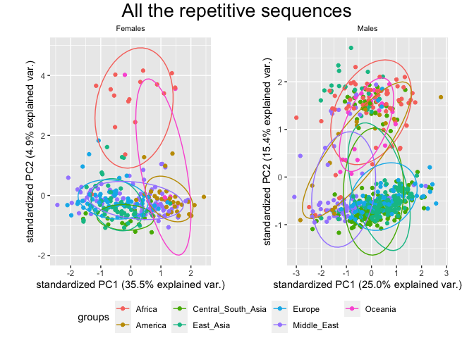
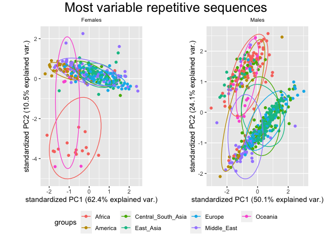
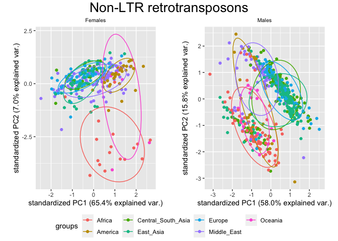
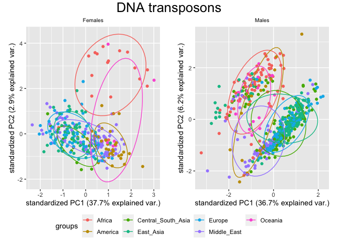
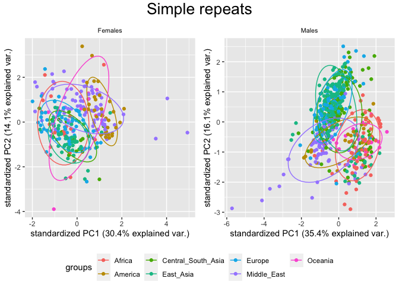
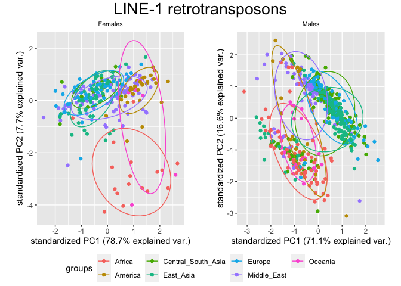
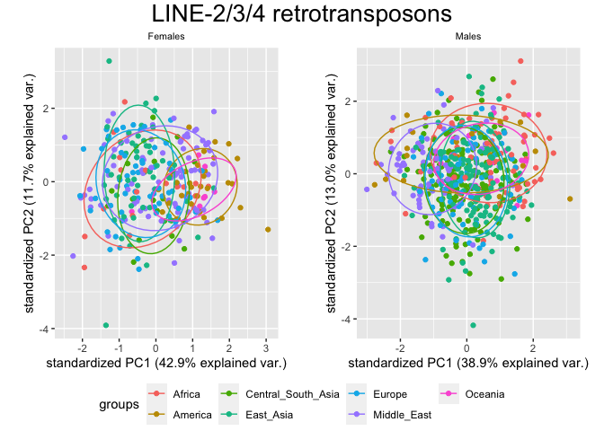
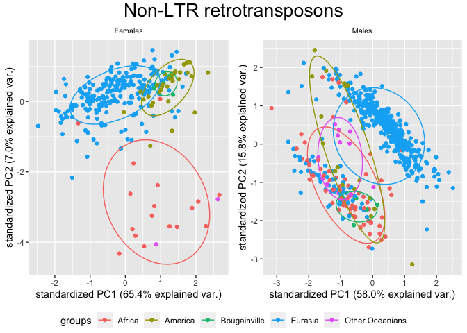

PCA for different subsets of the dataset
================

In this script I create different PCAs for different subsets of the HGDP
summary dataset. The focus is the `copynumber` of every transposon for
each individual.

``` r
library(tidyverse)
```

    ## ── Attaching packages ─────────────────────────────────────── tidyverse 1.3.2 ──
    ## ✔ ggplot2 3.3.6      ✔ purrr   0.3.4 
    ## ✔ tibble  3.1.8      ✔ dplyr   1.0.10
    ## ✔ tidyr   1.2.1      ✔ stringr 1.4.1 
    ## ✔ readr   2.1.2      ✔ forcats 0.5.2 
    ## ── Conflicts ────────────────────────────────────────── tidyverse_conflicts() ──
    ## ✖ dplyr::filter() masks stats::filter()
    ## ✖ dplyr::lag()    masks stats::lag()

``` r
library("ggpubr")
HGDPcutoff<-read_delim("/Users/rpianezza/TE/summary-HGDP/USEME_HGDP_complete_reflib6.2_mq10_batchinfo_cutoff0.01.txt",comment="#")
```

    ## Rows: 1394352 Columns: 10
    ## ── Column specification ────────────────────────────────────────────────────────
    ## Delimiter: ","
    ## chr (7): ID, Pop, sex, Country, type, familyname, batch
    ## dbl (3): length, reads, copynumber
    ## 
    ## ℹ Use `spec()` to retrieve the full column specification for this data.
    ## ℹ Specify the column types or set `show_col_types = FALSE` to quiet this message.

``` r
names(HGDPcutoff)<-c("ID","Pop","sex","Country","type","familyname","length","reads","copynumber","batch")
```

# Function for PCA plotting

First, I create a function that takes a subset of the dataset (`data`)
and a string as `title` for the plot title and gives back the complete
PCA plot. Note that `ellipses` are shown in all the plots, to remove
them you should modify the function here.

``` r
PCA <- function(data, title){
  m <- filter(data, sex=='male')
  f <- filter(data, sex=='female')
  len <- length(unique(data$familyname))
  males <- length(unique(m$ID))
  females <- length(unique(f$ID))

  f_matrix<-matrix(as.vector(f$copynumber),nrow=females,ncol=len,byrow=T)
  f_fram<-data.frame(f_matrix)

  names(f_fram)<-unique(f$familyname)
  f_matrixcont<-matrix(as.vector(f$Country),nrow=females,ncol=len,byrow=T)
  f_framcont<-data.frame(f_matrixcont)
  f_contcol<-c(f_framcont$X1)

  fHGDP.pca <- prcomp(f_fram, center = TRUE, scale = TRUE)
  
  m_matrix<-matrix(as.vector(m$copynumber),nrow=males,ncol=len,byrow=T)
  m_fram<-data.frame(m_matrix)

  names(m_fram)<-unique(m$familyname)
  m_matrixcont<-matrix(as.vector(m$Country),nrow=males,ncol=len,byrow=T)
  m_framcont<-data.frame(m_matrixcont)
  m_contcol<-c(m_framcont$X1)

  mHGDP.pca <- prcomp(m_fram, center = TRUE, scale = TRUE)
  
  
  library(ggbiplot)
  f_PCA <- ggbiplot(fHGDP.pca, var.axes=FALSE, groups = f_contcol, ellipse = TRUE)+ ggtitle("Females")+ theme(plot.title = element_text(size = 8, hjust = 0.5)) 
  m_PCA <- ggbiplot(mHGDP.pca, var.axes=FALSE, groups = m_contcol, ellipse = TRUE)+ ggtitle("Males")+ theme(plot.title = element_text(size = 8, hjust = 0.5)) 
  
figure <- ggarrange(f_PCA, m_PCA, ncol = 2, nrow = 1, common.legend = TRUE, legend = "bottom", align = "hv", font.label = list(size = 10, color = "black", face = "bold", family = NULL, position = "top"))

annotate_figure(figure, top = text_grob(title, color = "black", size = 20), fig.lab = "")
}
```

# PCA for the most variable TEs

My first idea is to compare the PCA for the `copynumber` of all the
**repetitive sequences** (RepSeq) in the dataset with a more specific
PCA, the one considering only the most **variable** RepSeq. To create
this subset I used the same **filters** applied in scripts 1 and 2.

``` r
TE_cutoff <- filter(HGDPcutoff, type=='te') %>% group_by(familyname, sex) %>% mutate(max=max(copynumber), min=min(copynumber)) %>% mutate(diff = max-min, ratio = max/min)

out_abs <- filter(TE_cutoff, diff>200 & diff<Inf)
out_rel <- filter(TE_cutoff, ratio>5 & ratio<Inf & max>1.5)
out_abs_names <- c(unique(out_abs$familyname))
out_rel_names <- c(unique(out_rel$familyname))
out_names <- c(out_abs_names, out_rel_names[!(out_rel_names %in% out_abs_names)]) %>% sort()

most_variable<-subset(HGDPcutoff, type=="te") %>% filter(familyname %in% out_names)

PCA(HGDPcutoff, "All the repetitive sequences")
```

    ## Loading required package: plyr

    ## ------------------------------------------------------------------------------

    ## You have loaded plyr after dplyr - this is likely to cause problems.
    ## If you need functions from both plyr and dplyr, please load plyr first, then dplyr:
    ## library(plyr); library(dplyr)

    ## ------------------------------------------------------------------------------

    ## 
    ## Attaching package: 'plyr'

    ## The following object is masked from 'package:ggpubr':
    ## 
    ##     mutate

    ## The following objects are masked from 'package:dplyr':
    ## 
    ##     arrange, count, desc, failwith, id, mutate, rename, summarise,
    ##     summarize

    ## The following object is masked from 'package:purrr':
    ## 
    ##     compact

    ## Loading required package: scales

    ## 
    ## Attaching package: 'scales'

    ## The following object is masked from 'package:purrr':
    ## 
    ##     discard

    ## The following object is masked from 'package:readr':
    ## 
    ##     col_factor

    ## Loading required package: grid

<!-- -->

- **Africans** are clearly separated from the others.
- **Eurasians**, which comprehend `Europe`, `Middle_East`,
  `Central_South_Asia` and `East_Asia`, are always clustered together.
  This makes sense because there is no strong geographic barrier among
  these populations, thus there was a strong gene flow across thousands
  of years which led to a more homogeneous genetic background.
- **Oceanians** are also a separated group, with some individuals closer
  to Africans and others to Eurasians.
- **Americans** are clustered together, slightly separated from
  Eurasians.

All the described patterns are more evident in **females**. In the
males, there are some individuals from America and Eurasia that are
clustered together with the africans. This was previously noted in
Scripts 1-2.

``` r
PCA(most_variable, "Most variable repetitive sequences")
```

<!-- -->

Filtering for the most variable sequences does not change the figure so
much. I only notice that the percentage of **explained variability** has
increased for both the plots and both axes.

# PCA for different RepSeq families

This part of the code is work in progress. My idea was to give a bit of
context to each RepSeq in the dataset, adding a column with the family
of the sequence. Anyway, I did not find a way to do that apart from
manually annotate the family of each TE, using the info available in
RepBase. I know that this approach is not only super slow but also error
prone, so I will work on that to improve its reliability.

``` r
list_DNA <- c('BLACKJACK', 'CHARLIE1', 'CHARLIE10', 'Charlie11', 'Charlie12', 'Charlie13a', 'Charlie13b', 'Charlie15a', 'Charlie16a', 'Charlie17a', 'Charlie18a', 'Charlie19a', 'CHARLIE1A', 'CHARLIE1B', 'CHARLIE2', 'Charlie21a', 'Charlie22a', 'Charlie24', 'Charlie25', 'Charlie26a', 'Charlie27', 'Charlie28', 'CHARLIE2A', 'CHARLIE2B', 'CHARLIE3', 'CHARLIE4', 'CHARLIE5', 'CHARLIE6', 'CHARLIE7', 'CHARLIE8', 'CHARLIE9', 'CHESHIRE', 'CHESHIRE_A', 'DNA1_Mam', 'EuthAT-1', 'EuthAT-2', 'EuthAT-2B', 'EuthAT-N1', 'Eutr17', 'Eutr7', 'Eutr8', 'EUTREP1', 'EUTREP3', 'EutTc1-N1', 'FORDPREFECT', 'FORDPREFECT_A', 'GOLEM', 'GOLEM_A', 'GOLEM_B', 'GOLEM_C', 'Helitron1Nb_Mam', 'Helitron3Na_Mam', 'HSMAR1', 'HSMAR2', 'HSTC2', 'Kanga1', 'Kanga11a', 'Kanga1d', 'KANGA2_A', 'LOOPER', 'MamRep137', 'MamRep1879', 'MamRep38', 'MamRep4096', 'MamRep434', 'MamRep488', 'MamTip2', 'MARE1', 'MARE10', 'MER103', 'MER103C', 'MER104', 'MER105', 'MER106', 'MER106B', 'MER107', 'MER112', 'MER113', 'MER113B', 'MER115', 'MER117', 'MER119', 'MER121', 'MER1A', 'MER1B', 'MER2', 'MER20', 'MER20B', 'MER28', 'MER2B', 'MER3', 'MER30', 'MER30B', 'MER33', 'MER44A', 'MER44B', 'MER44C', 'MER44D', 'MER45', 'MER45B', 'MER45C', 'MER45R', 'MER46C', 'MER47B', 'MER53', 'MER58A', 'MER58B', 'MER58C', 'MER58D', 'MER5A', 'MER5A1', 'MER5B', 'MER5C', 'MER5C1', 'MER6', 'MER63A', 'MER63B', 'MER63C', 'MER63D', 'MER69A', 'MER69B', 'MER69C', 'MER6A', 'MER6B', 'MER6C', 'MER75', 'MER75B', 'MER8', 'MER80', 'MER80B', 'MER82', 'MER91A', 'MER91B', 'MER96', 'MER96B', 'MER97A', 'MER97B', 'MER97C', 'MER99', 'Merlin1_HS', 'MERX', 'ORSL', 'ORSL-2a', 'ORSL-2b', 'RICKSHA', 'RICKSHA_0', 'Ricksha_a', 'TIGGER1', 'Tigger10', 'Tigger12', 'Tigger12A', 'Tigger13a', 'Tigger14a', 'Tigger15a', 'Tigger16a', 'Tigger16b', 'TIGGER2', 'Tigger2b_Pri', 'Tigger3b', 'Tigger3c', 'Tigger3d', 'Tigger4a', 'TIGGER5', 'TIGGER5_A', 'TIGGER5_B', 'TIGGER5A', 'TIGGER6A', 'TIGGER6B', 'TIGGER7', 'TIGGER8', 'TIGGER9', 'Tigger9b', 'UCON104', 'UCON107', 'UCON132a', 'UCON42', 'UCON74', 'UCON79', 'X1_DNA', 'X10b_DNA', 'X11_DNA', 'X12_DNA', 'X13_DNA', 'X15_DNA', 'X18_DNA', 'X20_DNA', 'X21_DNA', 'X23_DNA', 'X24_DNA', 'X25_DNA', 'X26_DNA', 'X27_DNA', 'X28_DNA', 'X29a_DNA', 'X29b_DNA', 'X2a_DNA', 'X2b_DNA', 'X30_DNA', 'X31_DNA', 'X32_DNA', 'X33a_DNA', 'X34_DNA', 'X4a_DNA', 'X4b_DNA', 'X5b_DNA', 'X6a_DNA', 'X6b_DNA', 'X7_DNA', 'X9a_DNA', 'X9b_DNA', 'X9c_DNA', 'ZAPHOD', 'ZOMBI', 'ZOMBI_A', 'ZOMBI_B', 'ZOMBI_C')

list_LTR <- c('LTR104_Mam', 'LTR11', 'LTR85a', 'LTR85b', 'LTR85c', 'LTR90A', 'LTR90B', 'X1_LR', 'X2_LR', 'X3_LR', 'X4_LR')

list_nonLTR <- c("ALINE", "ALU", "CR1_Mam", "HAL1", "HAL1B", "HAL1M8", "IN25", "L1", "L1HS", "L1M1_5", "L1M1B_5","L1M2A_5","L1M2A1_5","L1M2B_5","L1M2C_5","L1M3A_5","L1M3B_5","L1M3C_5","L1M3D_5","L1M3DE_5","L1M4B","L1M6_5end","L1M6B_5end","L1M7_5end","L1MA1","L1MA10","L1MA2","L1MA3","L1MA4","L1MA4A","L1MA5","L1MA5A","L1MA6","L1MA7","L1MA8","L1MA9","L1MA9_5","L1MB1","L1MB2","L1MB3","L1MB3_5","L1MB4","L1MB4_5","L1MB5","L1MB6_5","L1MB7","L1MB8","L1MC1","L1MC2","L1MC3","L1MC4","L1MC4_5end","L1MC4B","L1MC5","L1MCA_5","L1MCB_5","L1MCC_5","L1MD1","L1MD1_5","L1MD2","L1MD3","L1MDA_5","L1MDB_5","L1ME1","L1ME2","L1ME3","L1ME3A","L1ME3C_3end","L1ME3D_3end","L1ME3E_3end","L1ME3F_3end","L1ME4","L1ME4A","L1ME5","L1ME5_3end","L1MEA_5","L1MEB_5","L1MEC_5","L1MED_5","L1MEE_5","L1MEe_5end","L1MEf_5end","L1MEg_5end","L1P_MA2","L1P4a_5end","L1P4b_5end","L1P4c_5end","L1P4c_5end","L1P4e_5end","L1PA10","L1PA11","L1PA12","L1PA12_5","L1PA13","L1PA13_5","L1PA14","L1PA14_5","L1PA15","L1PA16","L1PA16_5","L1PA17_5","L1PA2","L1PA3","L1PA4","L1PA6","L1PA7","L1PA7_5","L1PA8","L1PB1","L1PB2","L1PB2c","L1PB3","L1PB4","L1PBA_5","L1PBA1_5","L1PBB_5","L1PREC1","L1PREC2","L2","L2B","L2C","L2D","L3","L3b_3end\t","L4","L5","MamSINE1","MARE3","MARE6","MIR","MIR3","MIRb","MIRc","SVA_A","THER1","THER1","UCON55","UCON86","X12_LINE","X13_LINE","X15_LINE","X17_LINE","X18_LINE","X19_LINE","X20_LINE","X21_LINE","X24_LINE","X3_LINE","L1M2_5","L1ME_ORF2","L1P4d_5end" )

list_simple_repeats <- c('ALR', 'ALR_', 'ALR1', 'ALR2', 'ALRa', 'ALRa_', 'ALRb', 'BSRf', 'CER', 'GSAT', 'GSATII', 'GSATX', 'HSATI', 'HSATII', 'LSAU', 'MSR1', 'REP522', 'SATR1', 'SATR2', 'SN5', 'SVA2', 'TAR1')

#list_ERV <- c('ERV24_Prim', 'ERV24B_Prim', 'ERV3-16A3_I', 'ERV3-16A3_LTR', 'ERVL', 'ERVL-B4', 'ERVL-E', 'ERVL47', 'EUTREP10', 'EUTREP13', 'HARLEQUIN', 'HARLEQUINLTR', 'HERV-K14CI', 'HERV-K14I', 'HERV1_LTR', 'HERV15I', 'HERV16', 'HERV17', 'HERV18', 'HERV19I', 'HERV23', 'HERV3', 'HERV30I', 'HERV35I', 'HERV38I', 'HERV39', 'HERV4_I', 'HERV4_LTR', 'HERV46I', 'HERV49I', 'HERV52I', 'HERV57I', 'HERV9', 'HERVE', 'HERVFH19I', 'HERVFH21I', 'HERVG25', 'HERVH', 'HERVH48I', 'HERVI', 'HERVIP10F', 'HERVIP10FH', 'HERVK', 'HERVK11DI', 'HERVK11I', 'HERVK13I', 'HERVK22I', 'HERVK3I', 'HERVK9I', 'HERVK9I', 'HERVKC4', 'HERVL', 'HERVL_40', 'HERVL66I', 'HERVL68', 'HERVL74', 'HERVP71A_I', 'HERVS71', 'HUERS-P1', 'HUERS-P2', 'HUERS-P3', 'HUERS-P3B', 'LOR1', 'LOR1a_LTR', 'LOR1b_LTR', 'LOR1I', 'LTR06', 'LTR1', 'LTR108d_Mam', 'LTR108e_Mam', 'LTR10A', 'LTR10B', 'LTR10B1', 'LTR10B2', 'LTR10C', 'LTR10D', 'LTR10E', 'LTR10F', 'LTR10G', 'LTR12', 'LTR12B', 'LTR12C', 'LTR12D', 'LTR12E', 'LTR12F', 'LTR13', 'LTR13A', 'LTR14', 'LTR14A', 'LTR14B', 'LTR14C', 'LTR15', 'LTR16', 'LTR16A', 'LTR16A1', 'LTR16A2', 'LTR16B', 'LTR16B1', 'LTR16B2', 'LTR16C', 'LTR16D', 'LTR16D1', 'LTR16D2', 'LTR16E', 'LTR16E1', 'LTR16E2', 'LTR17', 'LTR18A', 'LTR18B', 'LTR18C', 'LTR19A', 'LTR19B', 'LTR19C', 'LTR1A1', 'LTR1A2', 'LTR1B', 'LTR1B0', 'LTR1B1', 'LTR1C', 'LTR1C2', 'LTR1C3', 'LTR1D', 'LTR1D1', 'LTR1E', 'LTR1F', 'LTR1F1', 'LTR1F2', 'LTR2', 'LTR21A', 'LTR21B', 'LTR21C', 'LTR22', 'LTR22A', 'LTR22B', 'LTR22B1', 'LTR22B2', 'LTR22C', 'LTR22C2', 'LTR22E', 'LTR23', 'LTR24', 'LTR24B', 'LTR24C', 'LTR25', 'LTR25-int', 'LTR26', 'LTR26B', 'LTR26C', 'LTR26D', 'LTR26E', 'LTR27', 'LTR2752', 'LTR27B', 'LTR27C', 'LTR27D', 'LTR27E', 'LTR28', 'LTR28B', 'LTR28C', 'LTR29', 'LTR2B', 'LTR2C', 'LTR3', 'LTR30', 'LTR31', 'LTR32', 'LTR33', 'LTR33A', 'LTR33B', 'LTR33C', 'LTR34', 'LTR35', 'LTR35A', 'LTR35B', 'LTR36', 'LTR37-int', 'LTR37A', 'LTR37B', 'LTR38', 'LTR38A1', 'LTR38B', 'LTR38C', 'LTR39', 'LTR3A', 'LTR3B', 'LTR4', 'LTR40A', 'LTR40A1', 'LTR40B', 'LTR40C', 'LTR41', 'LTR41B', 'LTR41C', 'LTR42', 'LTR43', 'LTR43_I', 'LTR43B', 'LTR44', 'LTR45', 'LTR45B', 'LTR45C', 'LTR46', 'LTR47A', 'LTR47A2', 'LTR47B', 'LTR47B2', 'LTR47B3', 'LTR47B4', 'LTR48', 'LTR48B', 'LTR49', 'LTR5', 'LTR5_Hs', 'LTR50', 'LTR51', 'LTR52', 'LTR53', 'LTR53-int', 'LTR53B', 'LTR54', 'LTR54B', 'LTR55', 'LTR56', 'LTR57', 'LTR58', 'LTR59', 'LTR5A', 'LTR5B', 'LTR60', 'LTR60B', 'LTR61', 'LTR62', 'LTR64', 'LTR65', 'LTR66', 'LTR67B', 'LTR68', 'LTR69', 'LTR6A', 'LTR6B', 'LTR70', 'LTR71A', 'LTR71B', 'LTR72', 'LTR72B', 'LTR73', 'LTR75', 'LTR75_1', 'LTR75B', 'LTR76', 'LTR77', 'LTR77B', 'LTR78', 'LTR78B', 'LTR79', 'LTR7A', 'LTR7B', 'LTR7C', 'LTR7Y', 'LTR8', 'LTR80A', 'LTR80B', 'LTR81A', 'LTR81AB', 'LTR82A', 'LTR82B', 'LTR83', 'LTR84a', 'LTR84b', 'LTR86A1', 'LTR86A2', 'LTR86B2', 'LTR87', 'LTR8A', 'LTR8B', 'LTR9', 'LTR9A1', 'LTR9B', 'LTR9C', 'LTR9D', 'LTR1C1', 'MER101', 'MER101_I', 'MER101B', 'MER110', 'MER110A', 'MER110I', 'MER11A', 'MER11B', 'MER11C', 'MER11D', 'MER21', 'MER21A', 'MER21B', 'MER21C', 'MER21C_BT', 'MER21I', 'MER31', 'MER31_I', 'MER31A', 'MER31B', 'MER34', 'MER34-int', 'MER34A', 'MER34A1', 'MER34B', 'MER34B_I', 'MER34C', 'MER34C2', 'MER34D', 'MER39', 'MER39B', 'MER41A', 'MER41B', 'MER41C', 'MER41D', 'MER41E', 'MER41F', 'MER41G', 'MER41I', 'MER48', 'MER4BI', 'MER4C', 'MER4CL34', 'MER4D', 'MER4D_LTR', 'MER4D1', 'MER4E', 'MER4E1', 'MER4I', 'MER50', 'MER50B', 'MER50C', 'MER50I', 'MER51A', 'MER51B', 'MER51C', 'MER51D', 'MER51E', 'MER51I', 'MER52A', 'MER52AI', 'MER52B', 'MER52C', 'MER52D', 'MER54A', 'MER54B', 'MER57A_I', 'MER57A1', 'MER57B1', 'MER57B2', 'MER57C1', 'MER57C2', 'MER57D', 'MER57E1', 'MER57E2', 'MER57E3', 'MER57F', 'MER57I', 'MER61A', 'MER61B', 'MER61C', 'MER61D', 'MER61E', 'MER61F', 'MER61I', 'MER65A', 'MER65B', 'MER65C', 'MER65D', 'MER65I', 'MER66_I', 'MER66A', 'MER66B', 'MER66C', 'MER66D', 'MER67A', 'MER67B', 'MER67C', 'MER67D', 'MER68_I', 'MER68A', 'MER68B', 'MER68C', 'MER70_I', 'MER70A', 'MER70B', 'MER70C', 'MER72', 'MER72B', 'MER73', 'MER74', 'MER74A', 'MER74B', 'MER74C', 'MER76', 'MER76-int', 'MER77', 'MER83', 'MER83AI', 'MER83B', 'MER83BI', 'MER83C', 'MER84', 'MER84I', 'MER87', 'MER87B', 'MER88', 'MER89', 'MER89I', 'MER9', 'MER90', 'MER90a_LTR', 'MER92A', 'MER92B', 'MER92C', 'MER93', 'MER95', 'MER9B', 'MLT-int', 'MLT1_I', 'MLT1A0', 'MLT1A1', 'MLT1B', 'MLT1C', 'MLT1C1', 'MLT1C2', 'MLT1D', 'MLT1E', 'MLT1E1', 'MLT1E1A', 'MLT1E2', 'MLT1F', 'MLT1F_I', 'MLT1F1', 'MLT1F2', 'MLT1G', 'MLT1G1', 'MLT1G2', 'MLT1G3', 'MLT1H', 'MLT1H_I', 'MLT1H1', 'MLT1H2', 'MLT1I', 'MLT1J', 'MLT1J-int', 'MLT1J1', 'MLT1J2', 'MLT1K', 'MLT1L', 'MLT1M', 'MLT1N2', 'MLT1O', 'MLT2A1', 'MLT2A2', 'MLT2B2', 'MLT2B3', 'MLT2B4', 'MLT2C2', 'MLT2D', 'MLT2E', 'MLT2F', 'MST_I')

list_non_classified <- c('Eutr1', 'Eutr10', 'Eutr11', 'Eutr12', 'Eutr13', 'Eutr14', 'Eutr15', 'Eutr16', 'Eutr18', 'Eutr2', 'Eutr4', 'Eutr5', 'Eutr6', 'EUTREP11', 'EUTREP12', 'EUTREP14', 'EUTREP15', 'EUTREP2', 'EUTREP5', 'EUTREP6', 'EUTREP7', 'EUTREP8', 'MamRep564', 'MamRep605', 'MER35', 'MER122', 'MER124', 'UCON103', 'UCON105', 'UCON106', 'UCON32', 'UCON33', 'UCON38', 'UCON40', 'UCON43', 'UCON44', 'UCON45', 'UCON46', 'UCON47', 'UCON48', 'UCON53', 'UCON54', 'UCON63', 'UCON64', 'UCON65', 'UCON72', 'UCON75', 'UCON76', 'UCON84', 'UCON89', 'UCON93', 'UCON96')

#(TE_list <- filter(HGDPcutoff, type=='te', !(familyname %in% list_ERV), !(familyname %in% list_DNA), !(familyname %in% list_LTR), !(familyname %in% list_nonLTR), !(familyname %in% list_simple_repeats), !(familyname %in% list_non_classified)) %>% distinct(familyname) %>% arrange(familyname))
```

``` r
nonLTR <- subset(HGDPcutoff, type=="te") %>% filter(familyname %in% list_nonLTR)
PCA(nonLTR, "Non-LTR retrotransposons")
```

<!-- -->

``` r
DNA <- subset(HGDPcutoff, type=="te") %>% filter(familyname %in% list_DNA)
PCA(DNA, "DNA transposons")
```

<!-- -->

``` r
simple_repeats <- subset(HGDPcutoff, type=="te") %>% filter(familyname %in% list_simple_repeats)
PCA(simple_repeats, "Simple repeats")
```

<!-- -->

I notice that the pattern previously described is evident in **non-LTR
retrotransposons** as well as in **DNA transposons**, but not in
**simple repeats**. We do not expect simple repeats to rapidly spread
into different populations as TEs, so this is an expected result, but
still nice to see.

``` r
L1 <- subset(HGDPcutoff, type=="te") %>% filter(grepl("L1", familyname))
PCA(L1, "LINE-1 retrotransposons")
```

<!-- -->

``` r
L2 <- subset(HGDPcutoff, type=="te") %>% filter(grepl("L2|L3|L4",familyname))
PCA(L2, "LINE-2/3/4 retrotransposons")
```

<!-- -->

``` r
#SINEs <- subset(HGDPcutoff, type=="te") %>% filter(grepl("ALU|SVA_A", familyname))
#PCA(SINEs, "SINEs")
```

The same pattern is well shown in **LINE-1** retrotransposons, known to
be the most active TE family in humans, but is totally absent in
**LINE-2/3-4** retrotransposons, which are expected to be extint in
humans.

### Testing a cool hypothesis - Bougainville and Native Americans

Looking back at script 4 (Geographical details), I noticed that in most
of the interesting TE investigated there was an interesting similarity
between the copynumber in **Americans** populations and in the Oceanian
population **Bougainville** (the most eastern population in Oceania on
the map).

To clarify this relationship in a PCA, I modified the `Country` column
in the dataset as follows:

- Individuals from `Europe`, `Middle_East`, `Central_South_Asia` and
  `East_Asia` have been grouped under the label `Eurasia`.
- **Oceanians** have been divided into `Bougainville` and
  `Other Oceanians`.

``` r
HGDP_mod <- HGDPcutoff %>% mutate(Country = replace(Country, Country == 'Central_South_Asia', 'Eurasia')) %>% mutate(Country = replace(Country, Country == 'East_Asia', 'Eurasia')) %>% mutate(Country = replace(Country, Country == 'Middle_East', 'Eurasia')) %>% mutate(Country = replace(Country, Country == 'Europe', 'Eurasia')) %>% mutate(Country = replace(Country, Pop == 'PapuanSepik', 'Other Oceanians')) %>% mutate(Country = replace(Country, Pop == 'PapuanHighlands', 'Other Oceanians')) %>% mutate(Country = replace(Country, Pop == 'Bougainville', 'Bougainville'))

PCA(HGDP_mod, "All the repetitive sequences")
```

<!-- -->

``` r
L1_mod <- subset(HGDP_mod, type=="te") %>% filter(grepl("L1", familyname))
PCA(L1_mod, "LINE-1 retrotransposons")
```

<!-- -->

``` r
nonLTR_mod <- subset(HGDP_mod, type=="te") %>% filter(familyname %in% list_nonLTR)
PCA(nonLTR_mod, "Non-LTR retrotransposons")
```

<!-- -->

I notice that the `Bougainville` **females** always fall inside the
ellipse of the **americans** and are far away in the plot to the
`Other Oceanians`.

This is true also for the **males** even if not that clearly, but I
think that this is caused by the American males outliers that cluster
with the Africans and that alter the ellipse shape of the Americans.
Also, there is no a single `Bouganville` **male** that is clustered far
from the Africans, in any of the showed plots.
