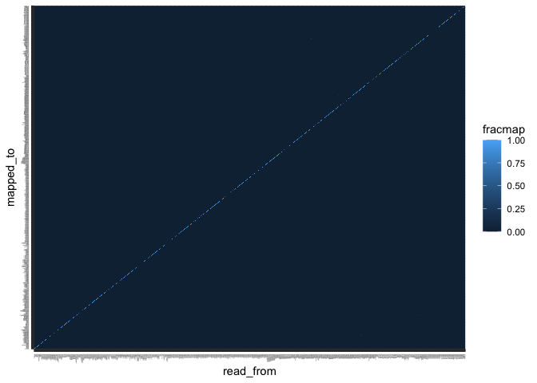

HGDP - Cross mapping
================

In this script I checked the data reliability in terms of mapping. Do
all the reads map to the right consensus sequence?

To do so, I used the **Python2** script **“create-reads-for-human.py”**
(which can be found in the folder *human-te-dynamics-svn/scripts/*)
which creates artificial reads from the reference library, and
subsequently align those reads again on the reference library to
estimate cross-mapping.

The python script takes as arguments:

- A **reference library** (`--fasta`). Here, the reference library from
  **RepBase**.
- The requested **coverage** of the generated reads (–`coverage`). Here,
  `150` (equal to the read length).
- The desired **read length** (`--read_length`). Here, `150` as the read
  length of the real data from the HGDP.
- An **output** (`--output`) file.
- The chosen **method** (`--method`), between `uniform` and `random`
  coverage.
- Optionally, the **error rate** (`--error-rate`). Here set as `0` (not
  specified).

<!-- -->

    python /Users/rpianezza/TE/human-te-dynamics-svn/scripts/create-reads-for-human.py --fasta /Users/rpianezza/TE/human-te-dynamics-svn/refg/reflibrary_humans_v6.2.fasta --coverage 150 --read-length 150 --output /Users/rpianezza/TE/cross-mapping/reads.fastq.gz --method uniform

After creating the reads, I aligned them on the reference library using
`bwa mem`. Subsequently, I split the output file (`cross.sam`) into
`metadata` (the first lines) and `data`.

    bwa mem /Users/rpianezza/TE/human-te-dynamics-svn/refg/reflibrary_humans_v6.2.fasta /Users/rpianezza/TE/cross-mapping/reads.fastq.gz > /Users/rpianezza/TE/cross-mapping/cross.sam

    less /Users/rpianezza/TE/cross-mapping/cross.sam | grep '@' | >/Users/rpianezza/TE/cross-mapping/cross.metadata.sam
    less /Users/rpianezza/TE/cross-mapping/cross.sam | grep -v '@' | >/Users/rpianezza/TE/cross-mapping/cross.data.sam

I then read the output file from bwa-mem containing the data. I split it
into `mapped` and `unmapped`, with the unmapped reads which are probably
useless.

``` r
library(tidyverse)
```

    ## ── Attaching packages ─────────────────────────────────────── tidyverse 1.3.2 ──
    ## ✔ ggplot2 3.3.6      ✔ purrr   0.3.4 
    ## ✔ tibble  3.1.8      ✔ dplyr   1.0.10
    ## ✔ tidyr   1.2.1      ✔ stringr 1.4.1 
    ## ✔ readr   2.1.2      ✔ forcats 0.5.2 
    ## ── Conflicts ────────────────────────────────────────── tidyverse_conflicts() ──
    ## ✖ dplyr::filter() masks stats::filter()
    ## ✖ dplyr::lag()    masks stats::lag()

``` r
library(ggpubr)

aligned <- read_tsv("/Users/rpianezza/TE/cross-mapping/cross.data.sam", col_names=c("qname", "flag", "rname", "pos", "mapq", "cigar", "mrnm", "mpos", "isize", "seq"))
```

    ## Warning: One or more parsing issues, see `problems()` for details

    ## Rows: 3076071 Columns: 15
    ## ── Column specification ────────────────────────────────────────────────────────
    ## Delimiter: "\t"
    ## chr (10): qname, rname, cigar, mrnm, seq, X11, X12, X13, X14, X15
    ## dbl  (5): flag, pos, mapq, mpos, isize
    ## 
    ## ℹ Use `spec()` to retrieve the full column specification for this data.
    ## ℹ Specify the column types or set `show_col_types = FALSE` to quiet this message.

``` r
aligned_mapped <- aligned  %>% filter(!(rname == "*"))
aligned_unmapped <- aligned %>% filter(rname == "*")
```

I further divide the file into **transposable elements** (`te`),
**single copy genes** (`scg`) and **KRAB-ZNF proteins** (`krab`). I also
separe the `qname` from the `qnumber` in two different columns.

``` r
(aligned_te <- filter(aligned_mapped, str_detect(qname, ".te.")) %>% separate(qname, c("qname", "qnumber"), sep = ":"))
```

    ## # A tibble: 1,157,723 × 16
    ##    qname    qnumber  flag rname    pos  mapq cigar mrnm   mpos isize seq   X11  
    ##    <chr>    <chr>   <dbl> <chr>  <dbl> <dbl> <chr> <chr> <dbl> <dbl> <chr> <chr>
    ##  1 LTR65_te 0           0 LTR65…     1    60 150M  *         0     0 TGAG… IIII…
    ##  2 LTR65_te 1           0 LTR65…     2    60 150M  *         0     0 GAGA… IIII…
    ##  3 LTR65_te 2           0 LTR65…     3    60 150M  *         0     0 AGAA… IIII…
    ##  4 LTR65_te 3           0 LTR65…     4    60 150M  *         0     0 GAAA… IIII…
    ##  5 LTR65_te 4           0 LTR65…     5    60 150M  *         0     0 AAAG… IIII…
    ##  6 LTR65_te 5           0 LTR65…     6    60 150M  *         0     0 AAGT… IIII…
    ##  7 LTR65_te 6           0 LTR65…     7    60 150M  *         0     0 AGTA… IIII…
    ##  8 LTR65_te 7           0 LTR65…     8    60 150M  *         0     0 GTAA… IIII…
    ##  9 LTR65_te 8           0 LTR65…     9    60 150M  *         0     0 TAAA… IIII…
    ## 10 LTR65_te 9/10        0 LTR65…    10    60 150M  *         0     0 AAAA… IIII…
    ## # … with 1,157,713 more rows, and 4 more variables: X12 <chr>, X13 <chr>,
    ## #   X14 <chr>, X15 <chr>

``` r
aligned_scg <- filter(aligned_mapped, str_detect(qname, "^chr")) %>% separate(qname, c("qchr", "qpos", "qnumber"), sep = ":") %>% unite("qname", qchr:qpos, sep = ":")
aligned_krab <- filter(aligned_mapped, str_detect(qname, ".krab.")) %>% separate(qname, c("qname", "qnumber"), sep = ":")
```

I select only the crossmapped reads, by removing all the entries in
which the sequence from which the read was generated (`qname`) is equal
to the sequence to which the sequence were mapped (`rname`).

``` r
(crossed_te <- filter(aligned_te, !(rname == qname)))
```

    ## # A tibble: 10,598 × 16
    ##    qname    qnumber   flag rname   pos  mapq cigar mrnm   mpos isize seq   X11  
    ##    <chr>    <chr>    <dbl> <chr> <dbl> <dbl> <chr> <chr> <dbl> <dbl> <chr> <chr>
    ##  1 L1MA2_te 218/295…     0 L1MA…   219     0 150M  *         0     0 TATC… IIII…
    ##  2 L1MA2_te 220/295…     0 L1MA…   221     0 150M  *         0     0 TCCA… IIII…
    ##  3 L1MA2_te 223/295…     0 L1MA…   224     0 150M  *         0     0 AAAA… IIII…
    ##  4 L1MA2_te 227/295…     0 L1MA…   228     0 150M  *         0     0 GACA… IIII…
    ##  5 L1MA2_te 228/295…     0 L1MA…   229     0 150M  *         0     0 ACAG… IIII…
    ##  6 L1MA2_te 229/295…     0 L1MA…   230     0 150M  *         0     0 CAGG… IIII…
    ##  7 L1MA2_te 232/295…     0 L1MA…   233     0 150M  *         0     0 GCAA… IIII…
    ##  8 L1MA2_te 235/295…     0 L1MA…   236     0 150M  *         0     0 ATAA… IIII…
    ##  9 L1MA2_te 449/297…     0 L1MA…   450     0 150M  *         0     0 TGCA… IIII…
    ## 10 L1MA2_te 450/297…     0 L1MA…   451     0 150M  *         0     0 GCAG… IIII…
    ## # … with 10,588 more rows, and 4 more variables: X12 <chr>, X13 <chr>,
    ## #   X14 <chr>, X15 <chr>

``` r
crossed_krab <- filter(aligned_krab, !(rname == qname))
crossed_scg <- filter(aligned_scg, !(rname == qname))
```

Here I calculate the percentage of crossmapped reads for each consensus
sequence.

``` r
(total_read_count <- count(aligned_te, qname))
```

    ## # A tibble: 984 × 2
    ##    qname          n
    ##    <chr>      <int>
    ##  1 6kbHsap_te  5868
    ##  2 ALINE_te     467
    ##  3 ALR__te       21
    ##  4 ALR_te        21
    ##  5 ALR1_te       21
    ##  6 ALR2_te       29
    ##  7 ALRa__te      22
    ##  8 ALRa_te       22
    ##  9 ALRb_te       21
    ## 10 ALU_te       162
    ## # … with 974 more rows

``` r
reads_crossed <- group_by(crossed_te, qname) %>% count
cross_matrix <- left_join(total_read_count, reads_crossed, by="qname") %>% mutate(ratio=(n.y/n.x)*100)
colnames(cross_matrix) <- c("qname", "total_reads", "crossmapped_reads", "percentage")
cross_matrix %>% arrange(desc(percentage))
```

    ## # A tibble: 984 × 4
    ##    qname            total_reads crossmapped_reads percentage
    ##    <chr>                  <int>             <int>      <dbl>
    ##  1 MER97A_te                744               420       56.5
    ##  2 Tigger3c_te              452               210       46.5
    ##  3 MER97B_te                903               415       46.0
    ##  4 MER97C_te                940               393       41.8
    ##  5 MER44D_te                555               229       41.3
    ##  6 MER70A_te                322               128       39.8
    ##  7 Tigger3b_te             1081               428       39.6
    ##  8 TIGGER5_A_te             201                79       39.3
    ##  9 FORDPREFECT_A_te         358               132       36.9
    ## 10 GOLEM_A_te               185                63       34.1
    ## # … with 974 more rows

For 107/984 sequences, at least 1 reads was cross-mapped to another
sequence. 43/984 have more than **10%** of cross-mapped reads. 24/984
have more than **25%**, and only `MER97A` has more than **50%**.

But to which consensus sequence are these reads mapping to?

``` r
reads_crossed_byTE <- group_by(crossed_te, qname, rname) %>% count
cross_matrix_byTE <- left_join(total_read_count, reads_crossed_byTE, by="qname") %>% mutate(ratio=(n.y/n.x)*100)
colnames(cross_matrix_byTE) <- c("qname", "total_reads", "crossmapped_to", "crossmapped_reads", "percentage")
cross_matrix_byTE %>% arrange(desc(percentage)) %>% relocate(crossmapped_to, .after = crossmapped_reads)
```

    ## # A tibble: 1,048 × 5
    ##    qname            total_reads crossmapped_reads crossmapped_to percentage
    ##    <chr>                  <int>             <int> <chr>               <dbl>
    ##  1 MER70A_te                322               128 MER70B_te            39.8
    ##  2 FORDPREFECT_A_te         358               132 FORDPREFECT_te       36.9
    ##  3 MER44D_te                555               165 TIGGER7_te           29.7
    ##  4 MER70B_te                428               122 MER70A_te            28.5
    ##  5 MER80_te                 358               102 CHARLIE4_te          28.5
    ##  6 Tigger3b_te             1081               305 GOLEM_te             28.2
    ##  7 MER1A_te                 377               106 CHARLIE3_te          28.1
    ##  8 MER63C_te                780               215 MER63D_te            27.6
    ##  9 MER97A_te                744               202 MER97C_te            27.2
    ## 10 MER69B_te               1076               290 MER69C_te            27.0
    ## # … with 1,038 more rows

In most of the cases, the cross-mapping occurs between TEs within the
same subfamily, such as `MER` or `TIGGER`. Usually, they are
cross-mapping to each other. If some of these TEs results interesting in
our previous or future analysis, I would suggest to consider them
together.

To create a matrix showing where the reads are mapping to, I used the
Python2 script **cross_mapping.py** (can be found in the “other_files”
subfolder in this folder). It takes as input the `sam` file derived from
**bwa mem**.

    python /Users/rpianezza/TE/cross-mapping/cross_mapping.py --sam /Users/rpianezza/TE/cross-mapping/cross.sam

I subsequently remove the “\_te” subfix present in the second column
using `grep` and `awk`. Only the entries containing `te` were retained.

    less /Users/rpianezza/TE/cross-mapping/cross_matrix | grep 'te' | awk '{sub("_te", "", $2); print}' > /Users/rpianezza/TE/cross-mapping/cross_matrix_mod

Here I import the modified output file from the Python script, name the
columns and remove the remaining entries containing **single copy
genes** and **KRAB-ZNF**, not interesting in this analysis.

``` r
(output_py <- read_delim("/Users/rpianezza/TE/cross-mapping/cross_matrix_mod", delim= " ", col_names = c("read_from", "mapped_to", "sizem", "fracmap", "fracomap", "crossmap", "originreads")) %>% filter(!(str_detect(read_from, "^chr"))) %>% filter(!(str_detect(read_from, "^a_"))))
```

    ## Warning: One or more parsing issues, see `problems()` for details

    ## Rows: 1675752 Columns: 7
    ## ── Column specification ────────────────────────────────────────────────────────
    ## Delimiter: " "
    ## chr (2): read_from, mapped_to
    ## dbl (5): sizem, fracmap, fracomap, crossmap, originreads
    ## 
    ## ℹ Use `spec()` to retrieve the full column specification for this data.
    ## ℹ Specify the column types or set `show_col_types = FALSE` to quiet this message.

    ## # A tibble: 968,256 × 7
    ##    read_from mapped_to sizem fracmap fracomap crossmap originreads
    ##    <chr>     <chr>     <dbl>   <dbl>    <dbl>    <dbl>       <dbl>
    ##  1 6kbHsap   6kbHsap    6018       1        1     5868        5868
    ##  2 6kbHsap   ALINE       617       0        0        0        5868
    ##  3 6kbHsap   ALR1        171       0        0        0        5868
    ##  4 6kbHsap   ALR2        179       0        0        0        5868
    ##  5 6kbHsap   ALR_        171       0        0        0        5868
    ##  6 6kbHsap   ALR         171       0        0        0        5868
    ##  7 6kbHsap   ALRa_       172       0        0        0        5868
    ##  8 6kbHsap   ALRa        172       0        0        0        5868
    ##  9 6kbHsap   ALRb        171       0        0        0        5868
    ## 10 6kbHsap   ALU         312       0        0        0        5868
    ## # … with 968,246 more rows

``` r
ggplot(data = output_py, aes(read_from, mapped_to, fill=fracmap)) +
  geom_tile() + theme(axis.text=element_text(size=1)) + theme(axis.text.x = element_text(angle = 90, vjust = 0.5, hjust=1))
```

<!-- -->

Lastly, I create a list containing all the TEs that showed problems with
cross-mapping. I put the threshold at `25`, but the sensibility can be
increased or decreased. I also wrote the list of this TE manually in
order to be able to use it in other scripts without problems.

``` r
crossmapped_te_names <- filter(cross_matrix, percentage > 25) %>% select(qname)

crossmapped_te <- c("CHARLIE2A","CHARLIE2B","CHARLIE8A","FORDPREFECT_A","GOLEM_A","L1PA3","MER1A","MER44A","MER44C","MER44D", "MER63C", "MER69B", "MER6A", "MER70A", "MER70B", "MER80", "MER97A", "MER97B", "MER97C", "Tigger2b_Pri", "Tigger3b", "Tigger3c", "TIGGER5_A", "TIGGER5_B")
```

## Cross-mapping of ALU reads

One possible source of contamination could be cross-mapping of `ALU`.
This is the most numerous TE in humans, with copynumbers in the order of
magnitude of 10^5. To check this, I created reads from the ALU consensus
sequence and mapped them to the whole reference library. I increased the
coverage from 150 to 150000, a number of ALU which is in line with the
one observed in one genome.

    less /Users/rpianezza/TE/human-te-dynamics-svn/refg/reflibrary_humans_v6.2.fasta | grep -A 1 'ALU' > /Users/rpianezza/TE/cross-mapping/alu.fasta

    python /Users/rpianezza/TE/human-te-dynamics-svn/scripts/create-reads-for-human.py --fasta /Users/rpianezza/TE/cross-mapping/alu.fasta  --coverage 150000 --read-length 150 --output /Users/rpianezza/TE/cross-mapping/alu_reads.fastq.gz --method uniform

    bwa mem /Users/rpianezza/TE/human-te-dynamics-svn/refg/reflibrary_humans_v6.2.fasta /Users/rpianezza/TE/cross-mapping/alu_reads.fastq.gz > /Users/rpianezza/TE/cross-mapping/alu_cross.sam

    less /Users/rpianezza/TE/cross-mapping/alu_cross.sam | grep '@' | >/Users/rpianezza/TE/cross-mapping/alu_cross.metadata.sam

    less /Users/rpianezza/TE/cross-mapping/alu_cross.sam | grep -v '@' | >/Users/rpianezza/TE/cross-mapping/alu_cross.data.sam

Despite the very high number of reads generated, none is mapping to the
wrong TE. We can thus exclude ALU contamination to be one of the source
of contamination in our dataset.

``` r
ALU <- read_tsv("/Users/rpianezza/TE/cross-mapping/alu_cross.data.sam", col_names=c("qname", "flag", "rname", "pos", "mapq", "cigar", "mrnm", "mpos", "isize", "seq"))
```

    ## Rows: 162000 Columns: 15
    ## ── Column specification ────────────────────────────────────────────────────────
    ## Delimiter: "\t"
    ## chr (10): qname, rname, cigar, mrnm, seq, X11, X12, X13, X14, X15
    ## dbl  (5): flag, pos, mapq, mpos, isize
    ## 
    ## ℹ Use `spec()` to retrieve the full column specification for this data.
    ## ℹ Specify the column types or set `show_col_types = FALSE` to quiet this message.

``` r
(ALU_mapped <- ALU  %>% filter(!(rname == "*")) %>% separate(qname, c("qname", "qnumber"), sep = ":"))
```

    ## # A tibble: 162,000 × 16
    ##    qname  qnumber  flag rname    pos  mapq cigar mrnm   mpos isize seq     X11  
    ##    <chr>  <chr>   <dbl> <chr>  <dbl> <dbl> <chr> <chr> <dbl> <dbl> <chr>   <chr>
    ##  1 ALU_te 0           0 ALU_te     1    60 150M  *         0     0 GGCCGG… IIII…
    ##  2 ALU_te 0           0 ALU_te     1    60 150M  *         0     0 GGCCGG… IIII…
    ##  3 ALU_te 0           0 ALU_te     1    60 150M  *         0     0 GGCCGG… IIII…
    ##  4 ALU_te 0           0 ALU_te     1    60 150M  *         0     0 GGCCGG… IIII…
    ##  5 ALU_te 0           0 ALU_te     1    60 150M  *         0     0 GGCCGG… IIII…
    ##  6 ALU_te 0           0 ALU_te     1    60 150M  *         0     0 GGCCGG… IIII…
    ##  7 ALU_te 0           0 ALU_te     1    60 150M  *         0     0 GGCCGG… IIII…
    ##  8 ALU_te 0           0 ALU_te     1    60 150M  *         0     0 GGCCGG… IIII…
    ##  9 ALU_te 0           0 ALU_te     1    60 150M  *         0     0 GGCCGG… IIII…
    ## 10 ALU_te 0/10        0 ALU_te     1    60 150M  *         0     0 GGCCGG… IIII…
    ## # … with 161,990 more rows, and 4 more variables: X12 <chr>, X13 <chr>,
    ## #   X14 <chr>, X15 <chr>

``` r
ALU_unmapped <- ALU %>% filter(rname == "*")

(crossed_ALU <- filter(ALU_mapped, !(rname == qname)))
```

    ## # A tibble: 0 × 16
    ## # … with 16 variables: qname <chr>, qnumber <chr>, flag <dbl>, rname <chr>,
    ## #   pos <dbl>, mapq <dbl>, cigar <chr>, mrnm <chr>, mpos <dbl>, isize <dbl>,
    ## #   seq <chr>, X11 <chr>, X12 <chr>, X13 <chr>, X14 <chr>, X15 <chr>

Even if adding 1% error rate does not change our output. There are only
more unmapped reads, but no cross-mapping.

``` r
ALU_err01 <- read_tsv("/Users/rpianezza/TE/cross-mapping/alu_err01_cross.data.sam", col_names=c("qname", "flag", "rname", "pos", "mapq", "cigar", "mrnm", "mpos", "isize", "seq"))
```

    ## Warning: One or more parsing issues, see `problems()` for details

    ## Rows: 162004 Columns: 15
    ## ── Column specification ────────────────────────────────────────────────────────
    ## Delimiter: "\t"
    ## chr (10): qname, rname, cigar, mrnm, seq, X11, X12, X13, X14, X15
    ## dbl  (5): flag, pos, mapq, mpos, isize
    ## 
    ## ℹ Use `spec()` to retrieve the full column specification for this data.
    ## ℹ Specify the column types or set `show_col_types = FALSE` to quiet this message.

``` r
(ALU_err01_mapped <- ALU_err01  %>% filter(!(rname == "*")) %>% separate(qname, c("qname", "qnumber"), sep = ":"))
```

    ## # A tibble: 150,631 × 16
    ##    qname  qnumber  flag rname    pos  mapq cigar mrnm   mpos isize seq     X11  
    ##    <chr>  <chr>   <dbl> <chr>  <dbl> <dbl> <chr> <chr> <dbl> <dbl> <chr>   <chr>
    ##  1 ALU_te 0           0 ALU_te     1    60 150M  *         0     0 GGCCGG… IIII…
    ##  2 ALU_te 0           0 ALU_te     1    50 150M  *         0     0 GGCAGG… IIII…
    ##  3 ALU_te 0           0 ALU_te     1    60 150M  *         0     0 GGCCGG… IIII…
    ##  4 ALU_te 0           0 ALU_te     1    60 150M  *         0     0 GGCCGG… IIII…
    ##  5 ALU_te 0           0 ALU_te     1    60 150M  *         0     0 GGCCGG… IIII…
    ##  6 ALU_te 0           0 ALU_te     1    60 150M  *         0     0 GGCCGG… IIII…
    ##  7 ALU_te 0           0 ALU_te     1    60 150M  *         0     0 CGCCGG… IIII…
    ##  8 ALU_te 0           0 ALU_te     1    60 150M  *         0     0 GGCCGG… IIII…
    ##  9 ALU_te 0/11        0 ALU_te     1    60 150M  *         0     0 GGCCGG… IIII…
    ## 10 ALU_te 0/12        0 ALU_te     1    49 150M  *         0     0 GGCCGG… IIII…
    ## # … with 150,621 more rows, and 4 more variables: X12 <chr>, X13 <chr>,
    ## #   X14 <chr>, X15 <chr>

``` r
ALU_err01unmapped <- ALU_err01 %>% filter(rname == "*")

(crossed_ALU_err01 <- filter(ALU_err01_mapped, !(rname == qname)))
```

    ## # A tibble: 0 × 16
    ## # … with 16 variables: qname <chr>, qnumber <chr>, flag <dbl>, rname <chr>,
    ## #   pos <dbl>, mapq <dbl>, cigar <chr>, mrnm <chr>, mpos <dbl>, isize <dbl>,
    ## #   seq <chr>, X11 <chr>, X12 <chr>, X13 <chr>, X14 <chr>, X15 <chr>

## Crossed KRABs

``` r
(total_read_count <- count(aligned_krab, qname))
```

    ## # A tibble: 212 × 2
    ##    qname                   n
    ##    <chr>               <int>
    ##  1 a_AC067968.1_2_krab  1059
    ##  2 a_AC092835.1_5_krab  1114
    ##  3 a_CDK8_20_krab       1072
    ##  4 a_CHD3_3_krab         940
    ##  5 a_CLTC_6_krab        1234
    ##  6 a_DCT_12_krab        2337
    ##  7 a_DNAJA2_11_krab     1444
    ##  8 a_E2F1_2_krab        1352
    ##  9 a_EGR1_4_krab        1171
    ## 10 a_ESR1_10_krab       4392
    ## # … with 202 more rows

``` r
reads_crossed <- group_by(crossed_krab, qname) %>% count
cross_matrix <- left_join(total_read_count, reads_crossed, by="qname") %>% mutate(ratio=(n.y/n.x)*100)
colnames(cross_matrix) <- c("qname", "total_reads", "crossmapped_reads", "percentage")
cross_matrix %>% arrange(desc(percentage))
```

    ## # A tibble: 212 × 4
    ##    qname               total_reads crossmapped_reads percentage
    ##    <chr>                     <int>             <int>      <dbl>
    ##  1 a_ZNF552_1_krab             910                88       9.67
    ##  2 a_ZNF814_1_krab            2251                97       4.31
    ##  3 a_ZNF587B_1_krab           1585                49       3.09
    ##  4 a_AC067968.1_2_krab        1059                NA      NA   
    ##  5 a_AC092835.1_5_krab        1114                NA      NA   
    ##  6 a_CDK8_20_krab             1072                NA      NA   
    ##  7 a_CHD3_3_krab               940                NA      NA   
    ##  8 a_CLTC_6_krab              1234                NA      NA   
    ##  9 a_DCT_12_krab              2337                NA      NA   
    ## 10 a_DNAJA2_11_krab           1444                NA      NA   
    ## # … with 202 more rows
