HGDP - General analysis about TEs geographic distribution
================

In all the previous analysis, we just focused on the most variable TE,
selected in the scripts 1-2-3. Here I want to give a more comprehensive
overview of the geographic distributions of TE abundance.

## Creating a customized global classification of TE

First, I read the file
*/Volumes/Temp1/rpianezza/TE/summary-HGDP/HGDP_cutoff_classified.tsv*,
which is a file which combine the previously used *HGDP_cutoff* with
*repbase_classification.txt*, a file containing the classification of
each TE present in our reference library, directly from RepBase.

``` r
library(tidyverse)
```

    ## ── Attaching packages ─────────────────────────────────────── tidyverse 1.3.2 ──
    ## ✔ ggplot2 3.4.0      ✔ purrr   0.3.4 
    ## ✔ tibble  3.1.8      ✔ dplyr   1.0.10
    ## ✔ tidyr   1.2.1      ✔ stringr 1.4.1 
    ## ✔ readr   2.1.2      ✔ forcats 0.5.2 
    ## ── Conflicts ────────────────────────────────────────── tidyverse_conflicts() ──
    ## ✖ dplyr::filter() masks stats::filter()
    ## ✖ dplyr::lag()    masks stats::lag()

``` r
library(ggpubr)

HGDP <- read_tsv("/Volumes/Temp1/rpianezza/TE/summary-HGDP/HGDP_cutoff_classified.tsv", col_names = c( "ID","pop","sex","country","type","familyname","length","reads","copynumber","batch", "superfamily", "shared_with"), skip=1)
```

    ## Rows: 799020 Columns: 12
    ## ── Column specification ────────────────────────────────────────────────────────
    ## Delimiter: "\t"
    ## chr (9): ID, pop, sex, country, type, familyname, batch, superfamily, shared...
    ## dbl (3): length, reads, copynumber
    ## 
    ## ℹ Use `spec()` to retrieve the full column specification for this data.
    ## ℹ Specify the column types or set `show_col_types = FALSE` to quiet this message.

Then I add the coordinates for each population and create the dataframe
`data` which can be plotted using the funcion `plot_map` created in
script 4. This function can be used to check the results of the
following analysis in details.

``` r
coordinates <- read_tsv("/Users/rpianezza/TE/summary-HGDP/HGDP_populationcoordinates.txt", col_names = c("pop", "region", "latitude", "longitude"))
```

    ## Rows: 54 Columns: 4
    ## ── Column specification ────────────────────────────────────────────────────────
    ## Delimiter: "\t"
    ## chr (2): pop, region
    ## dbl (2): latitude, longitude
    ## 
    ## ℹ Use `spec()` to retrieve the full column specification for this data.
    ## ℹ Specify the column types or set `show_col_types = FALSE` to quiet this message.

``` r
coord <- select(coordinates, pop, latitude, longitude)

by_pop <- group_by(HGDP, pop, country, familyname, sex) %>% dplyr::summarise(sd=sd(copynumber), copynumber = mean(copynumber), count=n())
```

    ## `summarise()` has grouped output by 'pop', 'country', 'familyname'. You can
    ## override using the `.groups` argument.

``` r
data <- inner_join(coord, by_pop, by = "pop")
```

The classification available in RepBase give us the `superfamily` of
each `familyname`. This helps us to create a further larger
classification which divides the repetitive sequences in the library
into 5 main classes:

- DNA transposons (`DNA`)
- LINE (`LINE`)
- SINE (`SINE`, comprehends SVA_A)
- LTR transposons (`LTR`, all the endogenous retroviruses)
- Satellites (`satellite`)

Note that some families are not included in this classification. As
reported in
<https://mobilednajournal.biomedcentral.com/articles/10.1186/s13100-017-0107-y#Tab2>,
some TE are still `non classified` (`NA`).

``` r
DNA_names <- c("Crypton", "hAT", "Helitron", "Kolobok", "Mariner/Tc1", "Merlin", "MuDR", "piggyBac", "DNA transposon")
LINE_names <- c("L1", "CR1", "L2", "Crack", "RTE", "RTEX", "R4", "Vingi", "Tx1", "Penelope")
SINE_names <- c("SINE1/7SL", "SINE2/tRNA", "SINE3/5S", "SINE")
LTR_names <- c("ERV1", "ERV2", "ERV3", "Gypsy", "Endogenous Retrovirus", "LTR Retrotransposon", "Long terminal repeat", "Non-LTR Retrotransposon")
satellites_names <- c("Satellite", "satellite", "SAT")

(classification <- select(HGDP, familyname, superfamily) %>% mutate(class = case_when(superfamily %in% DNA_names ~ "DNA", superfamily %in% LINE_names ~ "LINE", superfamily %in% SINE_names ~ "SINE", superfamily %in% LTR_names ~ "LTR", superfamily %in% satellites_names ~ "satellite")))
```

    ## # A tibble: 799,020 × 3
    ##    familyname superfamily class
    ##    <chr>      <chr>       <chr>
    ##  1 LTR65      ERV1        LTR  
    ##  2 HERVK3I    ERV2        LTR  
    ##  3 HERV9      ERV1        LTR  
    ##  4 L1PA12_5   L1          LINE 
    ##  5 LTR27C     ERV1        LTR  
    ##  6 LTR16A1    ERV3        LTR  
    ##  7 Tigger16a  Mariner/Tc1 DNA  
    ##  8 LTR23      ERV1        LTR  
    ##  9 X32_DNA    Mariner/Tc1 DNA  
    ## 10 LTR53      ERV3        LTR  
    ## # … with 799,010 more rows

## Geographic classification and mean abundance by continent

After creating the sequence classification, I create also a simplified
**geographic classification**. All the populations from
`Central South Asia`, `East Asia`, `Middle East`, and `Europe` are
grouped under the label `Eurasia`, since from the PCA and from all the
other analysis these populations always clustered together in terms of
TE abundance.

Then, I calculate the **mean copynumber** of each TE for every continent
(`country`).

``` r
(continents <- by_pop %>% group_by(country, familyname, sex) %>% mutate(country = replace(country, country == 'Central_South_Asia', 'Eurasia')) %>% mutate(country = replace(country, country == 'East_Asia', 'Eurasia')) %>% mutate(country = replace(country, country == 'Middle_East', 'Eurasia')) %>% mutate(country = replace(country, country == 'Europe', 'Eurasia')) %>% dplyr::summarise(country_mean=mean(copynumber)) %>% arrange(familyname) %>% pivot_wider(names_from = country, values_from = country_mean) %>% inner_join(classification, by="familyname") %>% distinct())
```

    ## `summarise()` has grouped output by 'country', 'familyname'. You can override
    ## using the `.groups` argument.

    ## # A tibble: 1,930 × 8
    ## # Groups:   familyname [965]
    ##    familyname sex       Africa   America   Eurasia   Oceania superfamily class  
    ##    <chr>      <chr>      <dbl>     <dbl>     <dbl>     <dbl> <chr>       <chr>  
    ##  1 6kbHsap    female   324.      296.      299.      308.    satellite   satell…
    ##  2 6kbHsap    male     344.      316.      304.      290.    satellite   satell…
    ##  3 ALINE      female     0.122     0.128     0.134     0.135 RTEX        LINE   
    ##  4 ALINE      male       0.145     0.128     0.134     0.126 RTEX        LINE   
    ##  5 ALR        female 32412.    29301.    31567.    38618.    SAT         satell…
    ##  6 ALR        male   34003.    31119.    31994.    36701.    SAT         satell…
    ##  7 ALR_       female 78584.    75727.    78694.    83390.    SAT         satell…
    ##  8 ALR_       male   80091.    79914.    78435.    84444.    SAT         satell…
    ##  9 ALR1       female 70164.    66492.    71563.    81753.    SAT         satell…
    ## 10 ALR1       male   75555.    72189.    72538.    81859.    SAT         satell…
    ## # … with 1,920 more rows

## Functions

This code chunk contains a function `pie_chart_more_in` which creates
two pie charts that shows the percentage of TE families that are more
abundant in each continent, one for the females and one for the males.

The two arguments are:

- `class_or_superfamily`: used to subset the dataset and select only a
  class or a superfamily to show in the pie charts. If “class”, it will
  subset looking for TE which are in a class, if “superfamily” it will
  do the same but just in one superfamily
- `which_TE`: the specific `class` or `superfamily` name is specified in
  this argument (es. “LINE”).

``` r
pie_chart_more_in <- function(data, class_or_superfamily, which_TE){

if (class_or_superfamily=="class"){subset <- filter(data, class==which_TE)}
if (class_or_superfamily=="superfamily"){subset <- filter(data, superfamily==which_TE)}
  
f_eurasia <- filter(subset, Eurasia-Africa>0, Eurasia-America>0, Eurasia-Oceania>0, sex=="female") %>% ungroup %>% summarise(eurasia = n()) %>% pull
f_africa <- filter(subset, Africa-Eurasia>0, Africa-America>0, Africa-Oceania>0, sex=="female") %>% ungroup %>% summarise(africa = n()) %>% pull
f_america <- filter(subset, America-Eurasia>0, America-Africa>0, America-Oceania>0, sex=="female") %>% ungroup %>% summarise(america = n()) %>% pull
f_oceania <- filter(subset, Oceania-Eurasia>0, Oceania-Africa>0, Oceania-America>0, sex=="female") %>% ungroup %>% summarise(oceania = n()) %>% pull

continents_names <- c("Eurasia", "Africa", "America", "Oceania")
f_morein <- c(f_eurasia, f_africa, f_america, f_oceania)

tot=f_eurasia+f_africa+f_america+f_oceania

f_morein_tibble <- tibble(continents_names, f_morein) %>% mutate(f_perc=round((f_morein/tot), 2))

f_bp <- ggplot(f_morein_tibble, aes("More abundant in", y=f_morein, fill=continents_names)) +
  geom_bar(width = 1, stat = "identity") + labs(fill='') 

f_pie <- f_bp + coord_polar("y", start=0) +
  ggtitle("Females") + theme(plot.title = element_text(hjust = 0.5, size=8)) +
  theme(axis.text.x=element_blank()) + theme(axis.title.x=element_blank()) +
  theme(axis.text.y=element_blank()) + theme(axis.title.y=element_blank()) + theme(axis.ticks.y=element_blank()) +
  geom_label(aes(label = f_morein), position = position_stack(vjust = 0.5), show.legend = FALSE)


m_eurasia <- filter(subset, Eurasia-Africa>0, Eurasia-America>0, Eurasia-Oceania>0, sex=="male") %>% ungroup %>% summarise(eurasia = n()) %>% pull
m_africa <- filter(subset, Africa-Eurasia>0, Africa-America>0, Africa-Oceania>0, sex=="male") %>% ungroup %>% summarise(africa = n()) %>% pull
m_america <- filter(subset, America-Eurasia>0, America-Africa>0, America-Oceania>0, sex=="male") %>% ungroup %>% summarise(america = n()) %>% pull
m_oceania <- filter(subset, Oceania-Eurasia>0, Oceania-Africa>0, Oceania-America>0, sex=="male") %>% ungroup %>% summarise(oceania = n()) %>% pull

m_morein <- c(m_eurasia, m_africa, m_america, m_oceania)

m_morein_tibble <- tibble(continents_names, m_morein) %>% mutate(m_perc=round((m_morein/tot), 2))

m_bp <- ggplot(m_morein_tibble, aes("More abundant in", y=m_morein, fill=continents_names)) +
  geom_bar(width = 1, stat = "identity") + labs(fill='') 

m_pie <- m_bp + coord_polar("y", start=0) +
  ggtitle("Males") + theme(plot.title = element_text(hjust = 0.5, size=8)) +
  theme(axis.text.x=element_blank()) + theme(axis.title.x=element_blank()) +
  theme(axis.text.y=element_blank()) + theme(axis.title.y=element_blank()) + theme(axis.ticks.y=element_blank()) +
  geom_label(aes(label = m_morein), position = position_stack(vjust = 0.5), show.legend = FALSE)

figure <- ggarrange(f_pie, m_pie, ncol = 2, nrow = 1, common.legend = TRUE, legend = "right", align = "hv", font.label = list(size = 10, color = "black", face = "bold", family = NULL, position = "top"))

text <- paste(which_TE, "- How many families are most abundant in each continent?")

(figure_final <- annotate_figure(figure, top = text_grob(text, color = "black", size = 15, hjust = 0.55, vjust = 2), fig.lab = ""))

}
```

This second function `pie_chart_less_in` does the same thing as the one
above, but it will check for the `less abundant` TE in each continent
instead.

``` r
pie_chart_less_in <- function(data, class_or_superfamily, which_TE){

if (class_or_superfamily=="class"){subset <- filter(data, class==which_TE)}
if (class_or_superfamily=="superfamily"){subset <- filter(data, superfamily==which_TE)}

less_f_eurasia <- filter(subset, Eurasia-Africa<0, Eurasia-America<0, Eurasia-Oceania<0, sex=="female") %>% ungroup %>% summarise(eurasia = n()) %>% pull
less_f_africa <- filter(subset, Africa-Eurasia<0, Africa-America<0, Africa-Oceania<0, sex=="female") %>% ungroup %>% summarise(africa = n()) %>% pull
less_f_america <- filter(subset, America-Eurasia<0, America-Africa<0, America-Oceania<0, sex=="female") %>% ungroup %>% summarise(america = n()) %>% pull
less_f_oceania <- filter(subset, Oceania-Eurasia<0, Oceania-Africa<0, Oceania-America<0, sex=="female") %>% ungroup %>% summarise(oceania = n()) %>% pull

f_lessin <- c(less_f_eurasia, less_f_africa, less_f_america, less_f_oceania)
continents_names <- c("Eurasia", "Africa", "America", "Oceania")
tot=less_f_eurasia+less_f_africa+less_f_america+less_f_oceania

f_lessin_tibble <- tibble(continents_names, f_lessin) %>% mutate(less_f_perc=round((f_lessin/tot), 2))

less_f_bp <- ggplot(f_lessin_tibble, aes("Less abundant in", y=f_lessin, fill=continents_names)) +
  geom_bar(width = 1, stat = "identity") + labs(fill='') 

less_f_pie <- less_f_bp + coord_polar("y", start=0) +
  ggtitle("Females") + theme(plot.title = element_text(hjust = 0.5, size=8)) +
  theme(axis.text.x=element_blank()) + theme(axis.title.x=element_blank()) +
  theme(axis.text.y=element_blank()) + theme(axis.title.y=element_blank()) + theme(axis.ticks.y=element_blank()) +
  geom_label(aes(label = f_lessin), position = position_stack(vjust = 0.5), show.legend = FALSE)


less_m_eurasia <- filter(subset, Eurasia-Africa<0, Eurasia-America<0, Eurasia-Oceania<0, sex=="male") %>% ungroup %>% summarise(eurasia = n()) %>% pull
less_m_africa <- filter(subset, Africa-Eurasia<0, Africa-America<0, Africa-Oceania<0, sex=="male") %>% ungroup %>% summarise(africa = n()) %>% pull
less_m_america <- filter(subset, America-Eurasia<0, America-Africa<0, America-Oceania<0, sex=="male") %>% ungroup %>% summarise(america = n()) %>% pull
less_m_oceania <- filter(subset, Oceania-Eurasia<0, Oceania-Africa<0, Oceania-America<0, sex=="male") %>% ungroup %>% summarise(oceania = n()) %>% pull

m_lessin <- c(less_m_eurasia, less_m_africa, less_m_america, less_m_oceania)

m_lessin_tibble <- tibble(continents_names, m_lessin) %>% mutate(less_m_perc=round((m_lessin/tot), 2))

less_m_bp <- ggplot(m_lessin_tibble, aes("Less abundant in", y=m_lessin, fill=continents_names)) +
  geom_bar(width = 1, stat = "identity") + labs(fill='') 

less_m_pie <- less_m_bp + coord_polar("y", start=0) +
  ggtitle("Males") + theme(plot.title = element_text(hjust = 0.5, size=8)) +
  theme(axis.text.x=element_blank()) + theme(axis.title.x=element_blank()) +
  theme(axis.text.y=element_blank()) + theme(axis.title.y=element_blank()) + theme(axis.ticks.y=element_blank()) +
  geom_label(aes(label = m_lessin), position = position_stack(vjust = 0.5), show.legend = FALSE)

figure <- ggarrange(less_f_pie, less_m_pie, ncol = 2, nrow = 1, common.legend = TRUE, legend = "right", align = "hv", font.label = list(size = 10, color = "black", face = "bold", family = NULL, position = "top"))

text <- paste(which_TE, "- How many families are least abundant in each continent?")

(figure_final <- annotate_figure(figure, top = text_grob(text, color = "black", size = 15, hjust = 0.55, vjust = 2), fig.lab = ""))
}
```

``` r
chi_most <- function(data, class_or_superfamily, which_TE){
  
if (class_or_superfamily=="class"){subset <- filter(data, class==which_TE)}
if (class_or_superfamily=="superfamily"){subset <- filter(data, superfamily==which_TE)}

chi_m <- ungroup(subset) %>% mutate(most = case_when((Eurasia-Africa>0 & Eurasia-America>0 & Eurasia-Oceania>0) ~ "Eurasia", (Africa-Eurasia>0 & Africa-America>0 & Africa-Oceania>0) ~ "Africa", (America-Africa>0 & America-Eurasia>0 & America-Oceania>0) ~ "America", (Oceania-Africa>0 & Oceania-America>0 & Oceania-Eurasia>0) ~ "Oceania")) %>% group_by(most) %>% summarise(n = n()) %>% select(n) %>% pull

while (length(chi_m)!=4) {
  chi_m <- append(chi_m, 0)
  }
  
chisq.test(chi_m)
}
```

``` r
chi_least <- function(data, class_or_superfamily, which_TE){
  
if (class_or_superfamily=="class"){subset <- filter(data, class==which_TE)}
if (class_or_superfamily=="superfamily"){subset <- filter(data, superfamily==which_TE)}

chi_l <- ungroup(subset) %>% mutate(least = case_when((Eurasia-Africa<0 & Eurasia-America<0 & Eurasia-Oceania<0) ~ "Eurasia", (Africa-Eurasia<0 & Africa-America<0 & Africa-Oceania<0) ~ "Africa", (America-Africa<0 & America-Eurasia<0 & America-Oceania<0) ~ "America", (Oceania-Africa<0 & Oceania-America<0 & Oceania-Eurasia<0) ~ "Oceania")) %>% group_by(least) %>% summarise(n = n()) %>% select(n) %>% pull

while (length(chi_l)!=4) {
  chi_l <- append(chi_l, 0)
  }
  
chi_l
}
```

After creating the functions, we can explore the dataset using them.

## By class

``` r
pie_chart_more_in(continents, "class", "LINE")
```

<!-- -->

``` r
chi_most(continents, "class", "LINE")
```

    ## 
    ##  Chi-squared test for given probabilities
    ## 
    ## data:  chi_m
    ## X-squared = 365.85, df = 3, p-value < 2.2e-16

``` r
pie_chart_less_in(continents, "class", "LINE")
```

<!-- -->

``` r
#chi_least(continents, "class", "LINE")
```

- **More abundant**: we have a clear bias towards **Eurasia**.
  **Africa** follows, while very few TEs are more abundant in the other
  two continents.

- **Less abundant**: as expected, mainly in **Oceania** and **America**.
  **Males** from **Eurasia** also shows some low abundance TEs, which
  may be interesting.

``` r
pie_chart_more_in(continents, "class", "SINE")
```

<!-- -->

``` r
chi_most(continents, "class", "SINE")
```

    ## 
    ##  Chi-squared test for given probabilities
    ## 
    ## data:  chi_m
    ## X-squared = 5, df = 3, p-value = 0.1718

``` r
pie_chart_less_in(continents, "class", "SINE")
```

<!-- -->

``` r
#chi_least(continents, "class", "SINE")
```

The number of **SINE** families is very low, so I do not expect these
charts to be relevant.

- **More abundant**: **Eurasia** and **Africa**. In the **males** also
  **America**.
- **Less abundant**: **Oceania**, followed by \`**Africa**.

``` r
pie_chart_more_in(continents, "class", "DNA")
```

<!-- -->

``` r
chi_most(continents, "class", "DNA")
```

    ## 
    ##  Chi-squared test for given probabilities
    ## 
    ## data:  chi_m
    ## X-squared = 494.64, df = 3, p-value < 2.2e-16

``` r
pie_chart_less_in(continents, "class", "DNA")
```

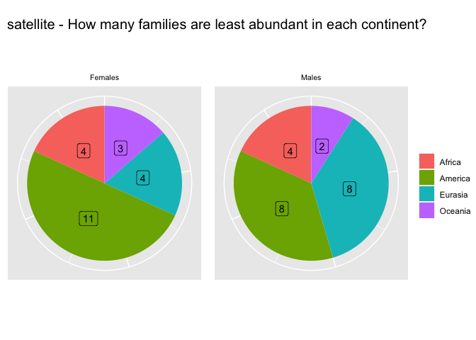<!-- -->

``` r
#chi_least(continents, "class", "DNA")
```

**DNA transposons** shows surpisingly similar plots to **LINEs**!

``` r
pie_chart_more_in(continents, "class", "LTR")
```

<!-- -->

``` r
chi_most(continents, "class", "LTR")
```

    ## 
    ##  Chi-squared test for given probabilities
    ## 
    ## data:  chi_m
    ## X-squared = 1013.3, df = 3, p-value < 2.2e-16

``` r
pie_chart_less_in(continents, "class", "LTR")
```

<!-- -->

``` r
#chi_least(continents, "class", "LTR")
```

**LTR transposons** are more abundant in **Africa**! **Eurasia**
follows. Less abundant, as expected, in **America** and a bit in
**Oceania**. Again, it is interesting to notice how **eurasian males**
are very present in the **less abundant** chart.

``` r
pie_chart_more_in(continents, "class", "satellite")
```

<!-- -->

``` r
chi_most(continents, "class", "satellite")
```

    ## 
    ##  Chi-squared test for given probabilities
    ## 
    ## data:  chi_m
    ## X-squared = 7.8182, df = 3, p-value = 0.04992

``` r
pie_chart_less_in(continents, "class", "satellite")
```

<!-- -->

``` r
#chi_least(continents, "class", "satellite")
```

The number of **satellite** families is very low, so I do not expect
these charts to be relevant.

- **More abundant**: Evenly distributed apart from **Eurasia** in
  **females** and **America** in males, which are poorly represented.
- **Less abundant**: Mostly evenly distributed apart from a positive
  bias towards **America** in females.

## By superfamily

``` r
pie_chart_more_in(continents, "superfamily", "L1")
```

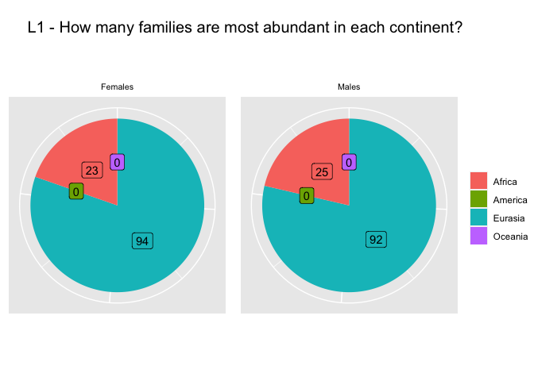<!-- -->

``` r
chi_most(continents, "superfamily", "L1")
```

    ## 
    ##  Chi-squared test for given probabilities
    ## 
    ## data:  chi_m
    ## X-squared = 396.77, df = 3, p-value < 2.2e-16

``` r
pie_chart_less_in(continents, "superfamily", "L1")
```

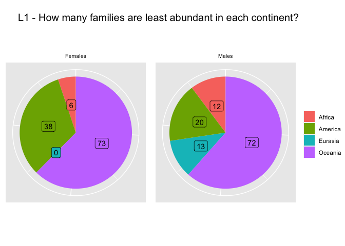<!-- -->

``` r
#chi_least(continents, "superfamily", "L1")
```

LINE-1 (`L1`) are expected to be the most active TEs in humans, thus we
expect these charts to be an extremization of the `LINE` plots,
containing both L1s and other LINEs (less active). This is exactly what
we find here.

## What do we expect with random values?

Here I substitute the TEs `copynumbers` with random values between 0 and
1.

``` r
set.seed(42)

random_by_pop <- group_by(HGDP, pop, country, familyname, sex) %>% select(!(copynumber)) %>% add_column(copynumber = runif(nrow(.))) %>% dplyr::summarise(sd=sd(copynumber), copynumber = mean(copynumber), count=n())
```

    ## `summarise()` has grouped output by 'pop', 'country', 'familyname'. You can
    ## override using the `.groups` argument.

``` r
random_data <- inner_join(coord, random_by_pop, by = "pop")

(random_continents <- random_by_pop %>% group_by(country, familyname, sex) %>% mutate(country = replace(country, country == 'Central_South_Asia', 'Eurasia')) %>% mutate(country = replace(country, country == 'East_Asia', 'Eurasia')) %>% mutate(country = replace(country, country == 'Middle_East', 'Eurasia')) %>% mutate(country = replace(country, country == 'Europe', 'Eurasia')) %>% dplyr::summarise(country_mean=mean(copynumber)) %>% arrange(familyname) %>% pivot_wider(names_from = country, values_from = country_mean) %>% inner_join(classification, by="familyname") %>% distinct())
```

    ## `summarise()` has grouped output by 'country', 'familyname'. You can override
    ## using the `.groups` argument.

    ## # A tibble: 1,930 × 8
    ## # Groups:   familyname [965]
    ##    familyname sex    Africa America Eurasia Oceania superfamily class    
    ##    <chr>      <chr>   <dbl>   <dbl>   <dbl>   <dbl> <chr>       <chr>    
    ##  1 6kbHsap    female  0.568   0.518   0.510   0.417 satellite   satellite
    ##  2 6kbHsap    male    0.530   0.424   0.479   0.530 satellite   satellite
    ##  3 ALINE      female  0.617   0.385   0.464   0.487 RTEX        LINE     
    ##  4 ALINE      male    0.505   0.500   0.512   0.533 RTEX        LINE     
    ##  5 ALR        female  0.580   0.557   0.527   0.501 SAT         satellite
    ##  6 ALR        male    0.506   0.441   0.502   0.495 SAT         satellite
    ##  7 ALR_       female  0.591   0.479   0.532   0.299 SAT         satellite
    ##  8 ALR_       male    0.469   0.607   0.516   0.508 SAT         satellite
    ##  9 ALR1       female  0.635   0.490   0.515   0.421 SAT         satellite
    ## 10 ALR1       male    0.477   0.623   0.512   0.553 SAT         satellite
    ## # … with 1,920 more rows

``` r
pie_chart_more_in(random_continents, "class", "LINE")
```

<!-- -->

``` r
pie_chart_less_in(random_continents, "class", "LINE")
```

<!-- -->

``` r
pie_chart_more_in(random_continents, "class", "SINE")
```

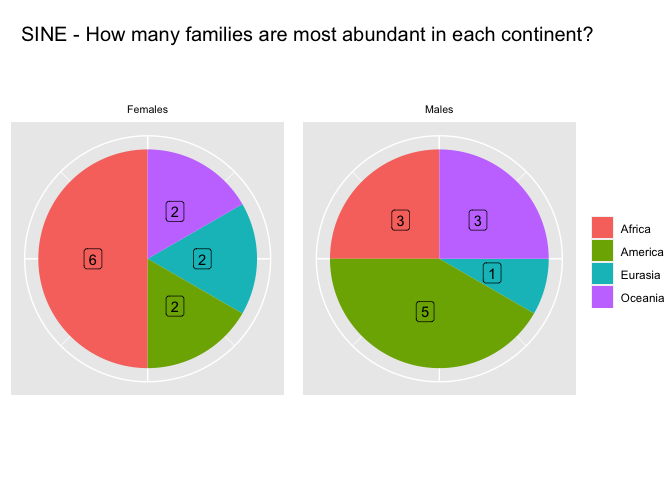<!-- -->

``` r
pie_chart_less_in(random_continents, "class", "SINE")
```

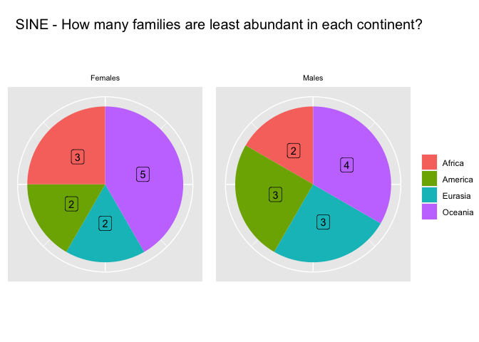<!-- -->

``` r
pie_chart_more_in(random_continents, "class", "LTR")
```

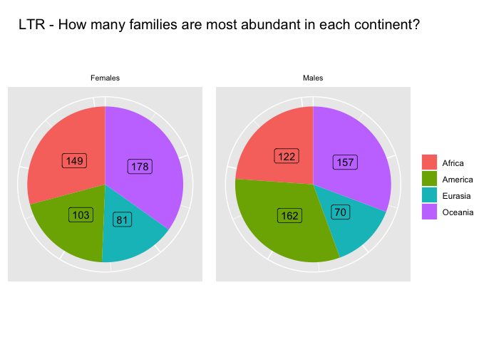<!-- -->

``` r
pie_chart_less_in(random_continents, "class", "LTR")
```

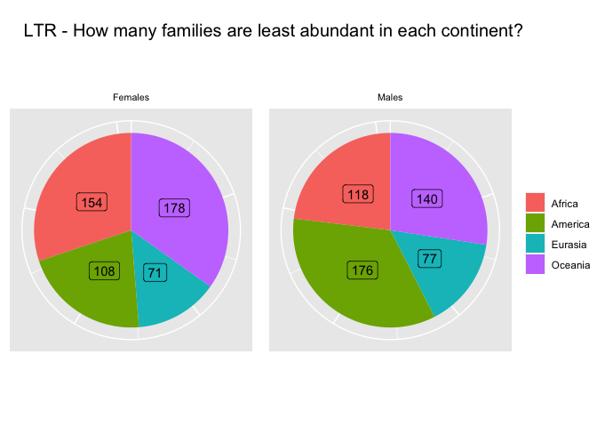<!-- -->

``` r
pie_chart_more_in(random_continents, "class", "DNA")
```

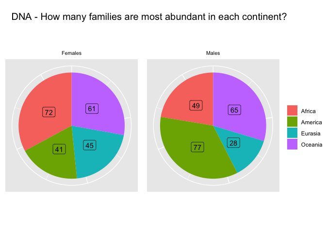<!-- -->

``` r
pie_chart_less_in(random_continents, "class", "DNA")
```

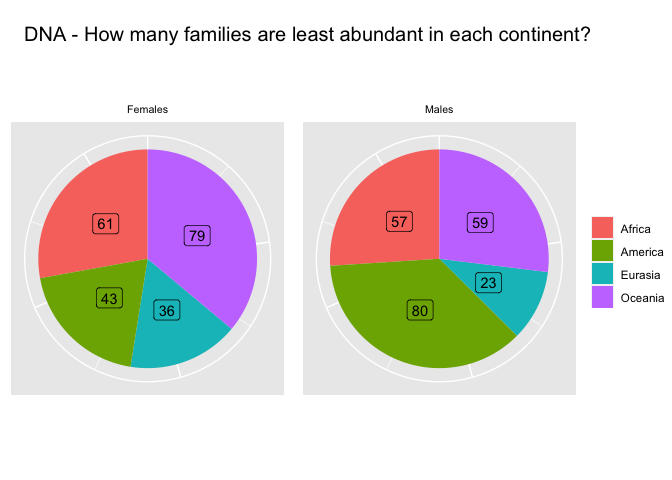<!-- -->

``` r
pie_chart_more_in(random_continents, "class", "satellite")
```

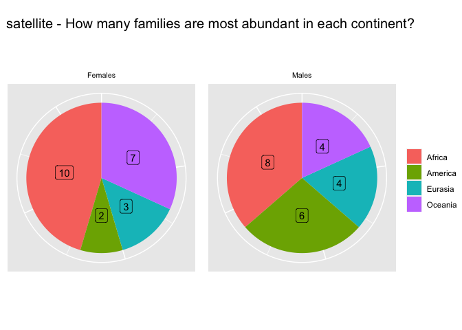<!-- -->

``` r
pie_chart_less_in(random_continents, "class", "satellite")
```

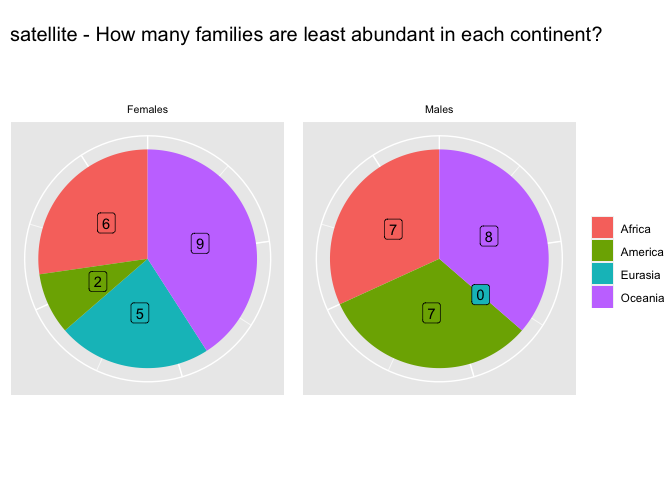<!-- -->
