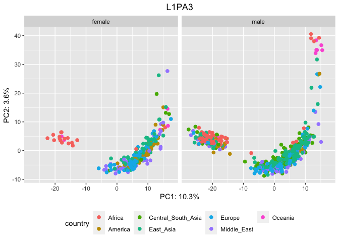
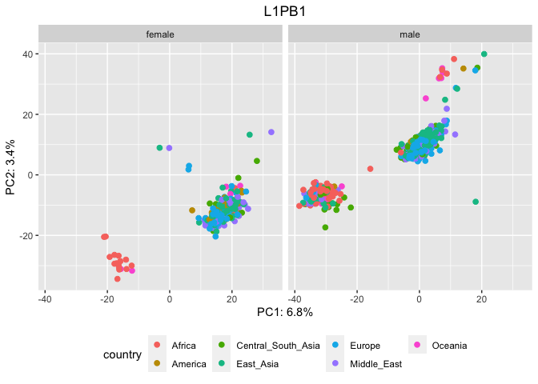
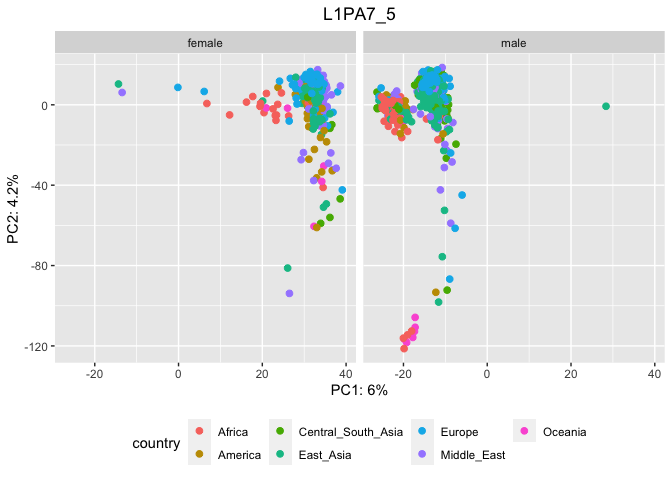
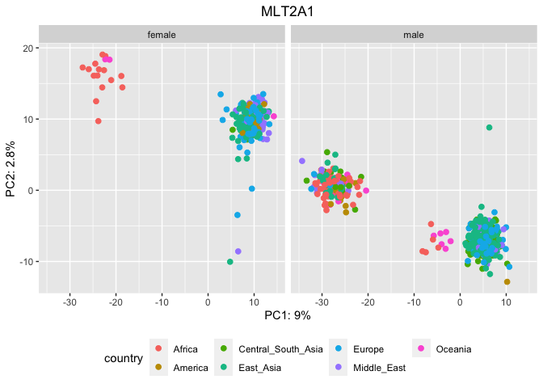
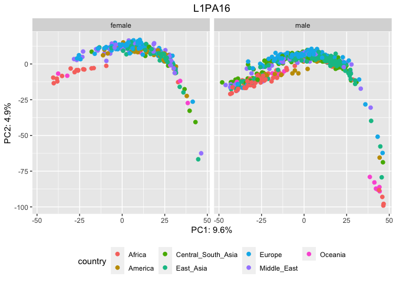
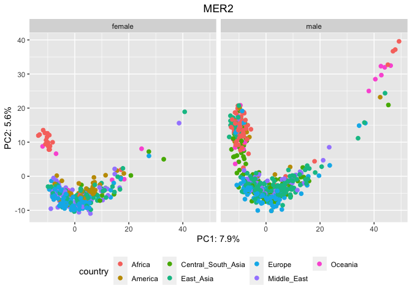

HGDP - SNPs analysis
================

All the files are present in the folders
<https://sourceforge.net/p/human-te-dynamics/data/HEAD/tree/raw-data/>.

`HGDP01382-Adygei.mq10.sync.gz` was NOT present in the folders and was
manually added from the computer **vetgrid27**.

``` r
library(tidyverse)
```

    ## ── Attaching packages ─────────────────────────────────────── tidyverse 1.3.2 ──
    ## ✔ ggplot2 3.4.0      ✔ purrr   0.3.4 
    ## ✔ tibble  3.1.8      ✔ dplyr   1.0.10
    ## ✔ tidyr   1.2.1      ✔ stringr 1.4.1 
    ## ✔ readr   2.1.2      ✔ forcats 0.5.2 
    ## ── Conflicts ────────────────────────────────────────── tidyverse_conflicts() ──
    ## ✖ dplyr::filter() masks stats::filter()
    ## ✖ dplyr::lag()    masks stats::lag()

``` r
HGDP <- read_tsv("/Volumes/Temp1/rpianezza/TE/summary-HGDP/HGDP_cutoff_classified.tsv", col_names = c( "ID","pop","sex","country","type","familyname","length","reads","copynumber","batch", "superfamily", "shared_with"), skip=1)
```

    ## Rows: 1394352 Columns: 12
    ## ── Column specification ────────────────────────────────────────────────────────
    ## Delimiter: "\t"
    ## chr (9): ID, pop, sex, country, type, familyname, batch, superfamily, shared...
    ## dbl (3): length, reads, copynumber
    ## 
    ## ℹ Use `spec()` to retrieve the full column specification for this data.
    ## ℹ Specify the column types or set `show_col_types = FALSE` to quiet this message.

``` r
sync_files <- read_tsv("/Volumes/Temp1/rpianezza/TE/SNP/file_list", col_names = "ID") %>% separate(ID, into = c("ID", "desc"), sep="-") %>% select(ID) %>% distinct(ID)
```

    ## Rows: 828 Columns: 1
    ## ── Column specification ────────────────────────────────────────────────────────
    ## Delimiter: "\t"
    ## chr (1): ID
    ## 
    ## ℹ Use `spec()` to retrieve the full column specification for this data.
    ## ℹ Specify the column types or set `show_col_types = FALSE` to quiet this message.

``` r
ID <- distinct(HGDP, ID)
identical(ID, sync_files)
```

    ## [1] TRUE

    cd /Volumes/Temp1/rpianezza/TE/SNP/HGDP_data
    gunzip *gz

`HGDP00902-Russian.mq10.sync.gz` and `HGDP01202-Mandenka.mq10.sync` were
corrupted, so I changed them with their version from the folder
*OLD_flo_vetlinux*.

Here I modify the files by adding a 5th column containing the sample
name, to differentiate file between each other prior to merging.

    mkdir modified_files &&
    for i in *.sync; do
      awk 'NR==1{ sub(/\.mq10.sync$/, "", FILENAME) } { $5=FILENAME }1' "$i" |
        column -t > "./modified_files/$i"
    done

Merge files. After creating the file I realized that the columns are
divided by multiple spaces. To remove the multiple spaces leaving only
one space between them, I ran the second commmand. These commands are
ideally merged together with a pipe.

    cat /path/to/files/*.sync >> sync_summary.sync

    less /Volumes/Temp1/rpianezza/TE/SNP/HGDP_data/sync_summary.sync | sed 's/  */ /g' | cut -c2- | > /Volumes/Temp1/rpianezza/TE/SNP/HGDP_data/sync_summary2.0.sync 

After using `gzip` on the summary file, I sent all the zipped files to
Robert’s server with:

    # The summary file:
    rsync -v -e ssh /Volumes/Temp1/rpianezza/TE/SNP/HGDP_data/sync_summary2.0.sync.gz student@roco.local:/home/student/sync_summary2.0.sync.gz

    # The single files:
    rsync -v -e ssh /Volumes/Temp1/rpianezza/TE/SNP/HGDP_data/modified_files/*.gz student@roco.local:/mnt/curana/riccardo/all-files/

Robert processed the files and created a matrix using a custom script
“sync2matrix.py”.

    python3 /home/robert/dev/human-te-dynamics-svn/scripts/sync2matrix.py --fai /home/robert/dev/human-te-dynamics-svn/refg/reflibrary_humans_v6.2.fasta.fai --sync summary.sync.gz |gzip -c > allte.matrix.gz

I take the file and slice exctract the data for the TEs of interest,
creating a single file for each TE.

    scp student@roco.local:/mnt/curana/riccardo/allte.matrix.gz /Volumes/Temp1/rpianezza/TE/SNP

    head -1 /Volumes/Temp1/rpianezza/TE/SNP/allte.matrix > /Volumes/Temp1/rpianezza/TE/SNP/header.matrix
    # Manually added: "familyname" and "position" at the beginning of "header.matrix" using vi.

    # For all the investigated TEs (L1PB1, L1PA16, L1PA3, MER2, MLT2A1, L1PA7_5):
    less /Volumes/Temp1/rpianezza/TE/SNP/allte.matrix| grep 'MER2_te' > /Volumes/Temp1/rpianezza/TE/SNP/MER2.matrix

    cat /Volumes/Temp1/rpianezza/TE/SNP/header.matrix /Volumes/Temp1/rpianezza/TE/SNP/MER2.matrix >> /Volumes/Temp1/rpianezza/TE/SNP/matrixes/MER2.matrix

The single TE matrix is further processed with another custom script
“frequency_matrix.ipynb” which does:

- 1)  Remove all the bases of the TE for which we don’t have at least
      1000 reads covering that position in each sample. In other words,
      we remove all the bases with **coverage \< 1000**.

- 2)  Remove all the **non-polymorphic** positions. I filtered out the
      positions for which the major allele was \> 99%.

- 3)  Convert the raw counts for each base into **frequencies**.

This function creates the PCA, taking as inputs:

- **TE**: the name of the TE (es. “L1PB1”).
- **freq_matrix**: the path of the frequency matrix created with the
  Python script.
- **metadata**: the R object containing “ID”, “sex” and “country” of the
  analysed data.

``` r
SNP_PCA <- function(TE, freq_matrix, metadata){
  matrix <- read_delim(freq_matrix) %>% select(!("...1")) 
  
  positions <- select(matrix, position) %>% pull
  bases <- paste(positions, "_", sep="")
  
  reverted <- as.data.frame(t(matrix)) %>% as_tibble() %>% filter(!row_number()==1) %>% filter(!row_number()==1)
  colnames(reverted) <- bases
  
  separated=reverted
  for (pos in bases){
  separated <- separated %>% separate(pos, into = c(paste0(pos,"A"), paste0(pos,"T"), paste0(pos,"C"), paste0(pos,"_G"), paste0(pos,"N"), paste0(pos,"D")), sep=":")
  }
  
  separated <- separated %>% type_convert()
  all_col <- colnames(separated)
  
  name <- separated %>% dplyr::summarise(across(c(all_col), sd, na.rm = TRUE)) %>% select_if(~ any(. > 0))
  names <- colnames(name)
  
  (pca_data <- select(separated, c(names)))
  pca_result <- prcomp(pca_data, center = TRUE, scale = TRUE)
  ID_cont_sex <- select(metadata, ID, sex, country) %>% distinct()
  var_explained <- pca_result$sdev^2/sum(pca_result$sdev^2)
    
  pca_result$x %>% as_tibble() %>% add_column(.before = 1, ID=ID_cont_sex$ID, sex=ID_cont_sex$sex, country=ID_cont_sex$country) %>% as.data.frame() %>%
  ggplot(aes(x=PC1,y=PC2, color=country)) + geom_point(size=2) + 
  labs(x=paste0("PC1: ",round(var_explained[1]*100,1),"%"),
       y=paste0("PC2: ",round(var_explained[2]*100,1),"%")) +
  facet_grid(~ sex) +
  theme(legend.position="bottom") + ggtitle(TE) +
  theme(plot.title = element_text(hjust = 0.5))
}
```

``` r
SNP_PCA("L1PA3", "/Volumes/Temp1/rpianezza/TE/SNP/frequency_matrixes/L1PA3.matrix", HGDP)
```

    ## New names:
    ## Rows: 253 Columns: 831
    ## ── Column specification
    ## ──────────────────────────────────────────────────────── Delimiter: " " chr
    ## (829): familyname, HGDP00001-Brahui, HGDP00003-Brahui, HGDP00005-Brahui,... dbl
    ## (2): ...1, position
    ## ℹ Use `spec()` to retrieve the full column specification for this data. ℹ
    ## Specify the column types or set `show_col_types = FALSE` to quiet this message.
    ## ── Column specification
    ## ──────────────────────────────────────────────────────── cols( .default =
    ## col_double() ) ℹ Use `spec()` for the full column specifications.
    ## Note: Using an external vector in selections is ambiguous. ℹ Use
    ## `all_of(all_col)` instead of `all_col` to silence this message. ℹ See
    ## <https://tidyselect.r-lib.org/reference/faq-external-vector.html>. This message
    ## is displayed once per session.
    ## Note: Using an external vector in selections is ambiguous. ℹ Use
    ## `all_of(names)` instead of `names` to silence this message. ℹ See
    ## <https://tidyselect.r-lib.org/reference/faq-external-vector.html>. This message
    ## is displayed once per session.
    ## • `` -> `...1`

<!-- -->

``` r
SNP_PCA("L1PB1", "/Volumes/Temp1/rpianezza/TE/SNP/frequency_matrixes/L1PB1.matrix", HGDP)
```

    ## New names:
    ## Rows: 870 Columns: 831
    ## ── Column specification
    ## ──────────────────────────────────────────────────────── Delimiter: " " chr
    ## (829): familyname, HGDP00001-Brahui, HGDP00003-Brahui, HGDP00005-Brahui,... dbl
    ## (2): ...1, position
    ## ℹ Use `spec()` to retrieve the full column specification for this data. ℹ
    ## Specify the column types or set `show_col_types = FALSE` to quiet this message.
    ## ── Column specification
    ## ──────────────────────────────────────────────────────── cols( .default =
    ## col_double() ) ℹ Use `spec()` for the full column specifications.
    ## • `` -> `...1`

<!-- -->

``` r
SNP_PCA("L1PA7_5", "/Volumes/Temp1/rpianezza/TE/SNP/frequency_matrixes/L1PA7_5.matrix", HGDP)
```

    ## New names:
    ## Rows: 1708 Columns: 831
    ## ── Column specification
    ## ──────────────────────────────────────────────────────── Delimiter: " " chr
    ## (829): familyname, HGDP00001-Brahui, HGDP00003-Brahui, HGDP00005-Brahui,... dbl
    ## (2): ...1, position
    ## ℹ Use `spec()` to retrieve the full column specification for this data. ℹ
    ## Specify the column types or set `show_col_types = FALSE` to quiet this message.
    ## ── Column specification
    ## ──────────────────────────────────────────────────────── cols( .default =
    ## col_double() ) ℹ Use `spec()` for the full column specifications.
    ## • `` -> `...1`

<!-- -->

``` r
SNP_PCA("MLT2A1", "/Volumes/Temp1/rpianezza/TE/SNP/frequency_matrixes/MLT2A1.matrix", HGDP)
```

    ## New names:
    ## Rows: 432 Columns: 831
    ## ── Column specification
    ## ──────────────────────────────────────────────────────── Delimiter: " " chr
    ## (829): familyname, HGDP00001-Brahui, HGDP00003-Brahui, HGDP00005-Brahui,... dbl
    ## (2): ...1, position
    ## ℹ Use `spec()` to retrieve the full column specification for this data. ℹ
    ## Specify the column types or set `show_col_types = FALSE` to quiet this message.
    ## ── Column specification
    ## ──────────────────────────────────────────────────────── cols( .default =
    ## col_double() ) ℹ Use `spec()` for the full column specifications.
    ## • `` -> `...1`

<!-- -->

``` r
SNP_PCA("L1PA16", "/Volumes/Temp1/rpianezza/TE/SNP/frequency_matrixes/L1PA16.matrix", HGDP)
```

    ## New names:
    ## Rows: 901 Columns: 831
    ## ── Column specification
    ## ──────────────────────────────────────────────────────── Delimiter: " " chr
    ## (829): familyname, HGDP00001-Brahui, HGDP00003-Brahui, HGDP00005-Brahui,... dbl
    ## (2): ...1, position
    ## ℹ Use `spec()` to retrieve the full column specification for this data. ℹ
    ## Specify the column types or set `show_col_types = FALSE` to quiet this message.
    ## ── Column specification
    ## ──────────────────────────────────────────────────────── cols( .default =
    ## col_double() ) ℹ Use `spec()` for the full column specifications.
    ## • `` -> `...1`

<!-- -->

``` r
SNP_PCA("MER2", "/Volumes/Temp1/rpianezza/TE/SNP/frequency_matrixes/MER2.matrix", HGDP)
```

    ## New names:
    ## Rows: 260 Columns: 831
    ## ── Column specification
    ## ──────────────────────────────────────────────────────── Delimiter: " " chr
    ## (829): familyname, HGDP00001-Brahui, HGDP00003-Brahui, HGDP00005-Brahui,... dbl
    ## (2): ...1, position
    ## ℹ Use `spec()` to retrieve the full column specification for this data. ℹ
    ## Specify the column types or set `show_col_types = FALSE` to quiet this message.
    ## ── Column specification
    ## ──────────────────────────────────────────────────────── cols( .default =
    ## col_double() ) ℹ Use `spec()` for the full column specifications.
    ## • `` -> `...1`

<!-- -->

``` r
SNP_PCA("ALU", "/Volumes/Temp1/rpianezza/TE/SNP/frequency_matrixes/ALU.matrix", HGDP)
```

    ## New names:
    ## Rows: 279 Columns: 831
    ## ── Column specification
    ## ──────────────────────────────────────────────────────── Delimiter: " " chr
    ## (829): familyname, HGDP00001-Brahui, HGDP00003-Brahui, HGDP00005-Brahui,... dbl
    ## (2): ...1, position
    ## ℹ Use `spec()` to retrieve the full column specification for this data. ℹ
    ## Specify the column types or set `show_col_types = FALSE` to quiet this message.
    ## ── Column specification
    ## ──────────────────────────────────────────────────────── cols( .default =
    ## col_double() ) ℹ Use `spec()` for the full column specifications.
    ## • `` -> `...1`

<!-- -->

``` r
#SNP_PCA("L2", "/Volumes/Temp1/rpianezza/TE/SNP/frequency_matrixes/L2.matrix", HGDP)
#SNP_PCA("L1ME5", "/Volumes/Temp1/rpianezza/TE/SNP/frequency_matrixes/L1ME5.matrix", HGDP)
#SNP_PCA("L1PA4", "/Volumes/Temp1/rpianezza/TE/SNP/frequency_matrixes/L1PA4.matrix", HGDP)
#SNP_PCA("L1PA6", "/Volumes/Temp1/rpianezza/TE/SNP/frequency_matrixes/L1PA4.matrix", HGDP)
```
